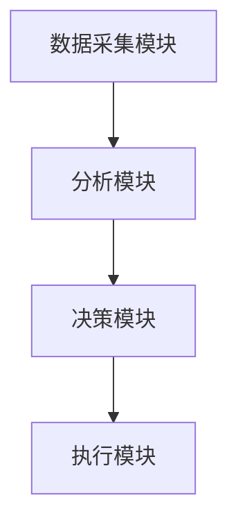
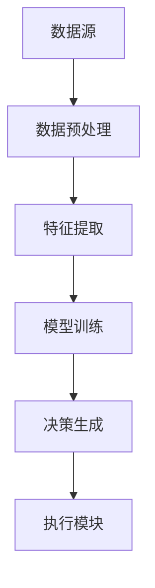
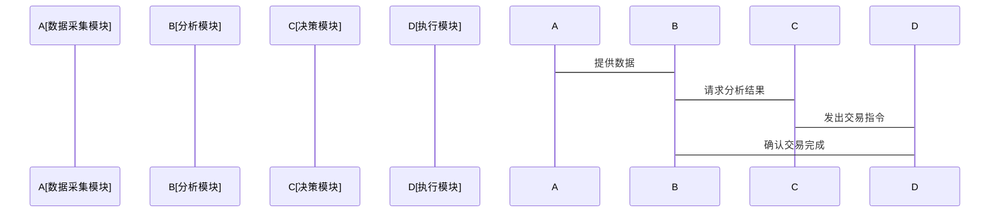
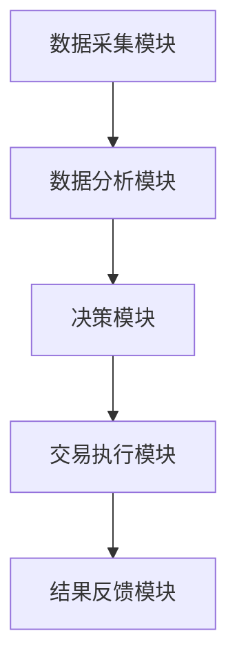

                 


# AI Agent在智能风险投资分析中的应用

---

## 关键词：
- AI Agent
- 智能风险投资
- 机器学习
- 数据分析
- 金融投资

---

## 摘要：
本文探讨了AI Agent在智能风险投资分析中的应用，分析了AI Agent的核心概念、技术原理及其在风险投资中的具体应用场景。文章从背景介绍、核心概念、算法原理、系统架构设计、项目实战等多个维度展开，详细阐述了AI Agent如何通过感知、决策和执行模块提升投资分析的效率和准确性。最后，本文总结了AI Agent在智能风险投资中的优势与挑战，并展望了其未来的发展前景。

---

## 正文：

### 第1章: AI Agent与风险投资背景介绍

#### 1.1 AI Agent的基本概念

##### 1.1.1 AI Agent的定义与特点
- **定义**：AI Agent（人工智能代理）是指能够感知环境、自主决策并执行任务的智能体。它通过传感器获取信息，利用算法进行分析，并通过执行器完成目标。
- **特点**：
  - 智能性：能够处理复杂问题。
  - 自主性：无需人工干预。
  - 反应性：能够实时响应环境变化。
  - 学习性：能够通过经验优化性能。

##### 1.1.2 AI Agent的核心要素与功能
- **核心要素**：
  - **感知模块**：通过数据采集、特征提取和数据预处理，识别环境中的相关信息。
  - **决策模块**：基于感知到的信息，利用算法生成决策。
  - **执行模块**：通过执行器将决策转化为实际操作。
- **功能**：
  - 数据分析与处理。
  - 智能决策支持。
  - 自动化执行任务。

##### 1.1.3 AI Agent在金融领域的应用潜力
- **潜力**：
  - 提高数据分析效率。
  - 优化投资决策。
  - 实现自动化交易。

#### 1.2 风险投资的基本概念

##### 1.2.1 风险投资的定义与特点
- **定义**：风险投资是一种通过投资高成长性企业，以获取高回报的投资方式。
- **特点**：
  - 高风险高回报。
  - 投资周期长。
  - 主要依赖于对企业基本面的分析。

##### 1.2.2 风险投资的主要流程与关键环节
- **流程**：
  - 项目筛选。
  - 财务分析。
  - 风险评估。
  - 投资决策。
- **关键环节**：
  - 数据收集与处理。
  - 风险评估模型。
  - 投资组合优化。

#### 1.3 AI Agent在风险投资中的问题背景

##### 1.3.1 风险投资中的信息不对称问题
- **问题**：投资者与被投企业之间存在信息不对称，导致决策困难。
- **解决方案**：通过AI Agent实时收集和分析企业数据，减少信息不对称。

##### 1.3.2 数据分析与决策的复杂性
- **问题**：传统方法难以处理海量数据，且决策过程复杂。
- **解决方案**：利用AI Agent的强大计算能力，简化分析流程。

##### 1.3.3 传统投资分析的局限性与AI Agent的解决方案
- **传统方法的局限性**：
  - 依赖人工经验。
  - 数据分析效率低。
  - 风险预测不准确。
- **AI Agent的解决方案**：
  - 提高数据分析效率。
  - 实现实时监控。
  - 优化投资决策。

#### 1.4 AI Agent在风险投资中的边界与外延

##### 1.4.1 AI Agent的应用场景与限制
- **应用场景**：
  - 项目筛选。
  - 财务分析。
  - 风险评估。
  - 投资组合优化。
- **限制**：
  - 数据质量依赖性。
  - 模型的可解释性。
  - 市场环境的不确定性。

##### 1.4.2 风险投资中的AI Agent与其他技术的关系
- **关系**：
  - 与大数据技术的结合。
  - 与云计算的结合。
  - 与区块链技术的结合。

##### 1.4.3 AI Agent在风险投资中的长期发展与演变
- **发展趋势**：
  - 智能化。
  - 自适应性。
  - 多模态数据分析。

#### 1.5 本章小结
本章介绍了AI Agent和风险投资的基本概念，分析了AI Agent在风险投资中的应用背景和问题，明确了AI Agent的优势与局限性。

---

### 第2章: AI Agent的核心概念与原理

#### 2.1 AI Agent的感知模块

##### 2.1.1 数据收集与特征提取
- **数据来源**：
  - 市场数据：股票价格、成交量等。
  - 公司财报：收入、利润等。
  - 新闻数据：行业动态、政策变化等。
- **特征提取**：
  - 技术指标：如MACD、KDJ。
  - 财务指标：如ROE、净利润率。
  - 文本特征：如情感分析。

##### 2.1.2 数据预处理与特征工程
- **数据预处理**：
  - 数据清洗：处理缺失值、异常值。
  - 数据标准化：归一化处理。
- **特征工程**：
  - 特征选择：筛选重要特征。
  - 特征组合：如主成分分析（PCA）。

##### 2.1.3 多模态数据的融合与分析
- **多模态数据**：
  - 文本、图像、数值数据的结合。
- **融合方法**：
  - 线性组合：加权求和。
  - 深度学习模型：如多模态神经网络。

#### 2.2 AI Agent的决策模块

##### 2.2.1 基于强化学习的决策机制
- **强化学习简介**：
  - 通过奖励机制优化决策。
  - 核心算法：Q-Learning、Deep Q-Network（DQN）。
- **应用示例**：
  - 股票交易中的买卖决策。
  - 投资组合优化。

##### 2.2.2 基于监督学习的风险评估模型
- **监督学习简介**：
  - 基于历史数据进行分类或回归。
  - 核心算法：随机森林、XGBoost、神经网络。
- **风险评估模型**：
  - 信用评分。
  - 风险等级划分。

##### 2.2.3 基于生成模型的场景模拟
- **生成模型简介**：
  - 如变分自编码器（VAE）、生成对抗网络（GAN）。
- **应用**：
  - 模拟市场波动。
  - 生成虚拟数据进行压力测试。

#### 2.3 AI Agent的执行模块

##### 2.3.1 自动化交易系统
- **系统组成**：
  - 数据采集模块。
  - 信号生成模块。
  - 执行模块。
- **实现细节**：
  - API接口调用。
  - 交易策略实现。

##### 2.3.2 投资组合优化
- **优化目标**：
  - 最大化收益。
  - 最小化风险。
- **算法**：
  - 均值-方差优化。
  - 风险中性组合。

##### 2.3.3 动态调整机制
- **动态调整**：
  - 根据市场变化实时调整投资组合。
- **实现方法**：
  - 监听市场信号。
  - 调整权重。

#### 2.4 本章小结
本章详细介绍了AI Agent的感知、决策和执行模块，分析了各模块的核心技术和实现方法。

---

### 第3章: AI Agent的算法原理与实现

#### 3.1 强化学习算法原理

##### 3.1.1 强化学习的基本原理
- **基本原理**：
  - 状态（State）：环境中的情况。
  - 动作（Action）：代理的决策。
  - 奖励（Reward）：对决策的反馈。
  - 策略（Policy）：动作的选择概率。
  - 价值函数（Value Function）：状态的预期收益。
- **核心算法**：
  - Q-Learning。
  - Deep Q-Network（DQN）。

##### 3.1.2 强化学习的数学模型
- **数学公式**：
  - Q-learning：$Q(s, a) \leftarrow Q(s, a) + \alpha [r + \max Q(s', a') - Q(s, a)]$
  - DQN：使用神经网络近似Q值函数，通过经验回放和目标网络优化。

##### 3.1.3 强化学习在风险投资中的应用
- **应用案例**：
  - 股票交易中的买卖决策。
  - 投资组合优化。

#### 3.2 监督学习算法原理

##### 3.2.1 监督学习的基本原理
- **基本原理**：
  - 根据历史数据训练模型。
  - 分为分类和回归任务。
- **核心算法**：
  - 线性回归。
  - 支持向量机（SVM）。
  - 随机森林。
  - 神经网络。

##### 3.2.2 监督学习的数学模型
- **线性回归**：
  - 模型：$y = \beta_0 + \beta_1 x + \epsilon$
  - 损失函数：均方误差（MSE）。
- **神经网络**：
  - 层次：输入层、隐藏层、输出层。
  - 激活函数：ReLU、Sigmoid。
  - 损失函数：交叉熵损失。
  - 优化算法：随机梯度下降（SGD）、Adam。

##### 3.2.3 监督学习在风险评估中的应用
- **应用案例**：
  - 风险评分。
  - 财务预测。

#### 3.3 算法实现与代码示例

##### 3.3.1 强化学习的代码实现
```python
import numpy as np
import gym

env = gym.make('CartPole-v0')
observation_space = env.observation_space.shape[0]
action_space = env.action_space.n

# 初始化Q表
Q = np.zeros([observation_space, action_space])

# 参数设置
learning_rate = 0.1
gamma = 0.99

for episode in range(1000):
    state = env.reset()
    done = False
    while not done:
        # 选择动作
        action = np.argmax(Q[state])
        # 执行动作
        new_state, reward, done, _ = env.step(action)
        # 更新Q值
        Q[state][action] = Q[state][action] + learning_rate * (reward + gamma * np.max(Q[new_state]) - Q[state][action])
        state = new_state
```

##### 3.3.2 监督学习的代码实现
```python
from sklearn.ensemble import RandomForestClassifier
from sklearn.model_selection import train_test_split
from sklearn.metrics import accuracy_score

# 数据准备
X = ...  # 特征矩阵
y = ...  # 标签向量

# 数据分割
X_train, X_test, y_train, y_test = train_test_split(X, y, test_size=0.2)

# 模型训练
model = RandomForestClassifier(n_estimators=100)
model.fit(X_train, y_train)

# 模型预测
y_pred = model.predict(X_test)

# 评估准确率
print("Accuracy:", accuracy_score(y_test, y_pred))
```

#### 3.4 本章小结
本章详细讲解了强化学习和监督学习的算法原理，并通过代码示例展示了其在风险投资中的应用。

---

### 第4章: AI Agent的系统架构与设计

#### 4.1 系统功能设计

##### 4.1.1 系统需求分析
- **核心需求**：
  - 实时数据采集。
  - 智能分析与决策。
  - 自动化交易执行。
- **功能模块**：
  - 数据采集模块。
  - 分析模块。
  - 决策模块。
  - 执行模块。

##### 4.1.2 系统功能设计图


#### 4.2 系统架构设计

##### 4.2.1 系统架构图


##### 4.2.2 系统组件之间的接口设计
- **接口描述**：
  - 数据采集模块提供API接口。
  - 分析模块与决策模块通过队列通信。
  - 执行模块通过API调用交易系统。

##### 4.2.3 系统交互设计


#### 4.3 本章小结
本章通过系统架构图和交互图，详细描述了AI Agent系统的组成部分及其工作流程。

---

### 第5章: AI Agent在智能风险投资中的项目实战

#### 5.1 项目背景与目标

##### 5.1.1 项目背景
- **背景**：开发一个基于AI Agent的智能风险投资分析系统。
- **目标**：实现股票市场的自动分析与交易。

##### 5.1.2 项目目标
- **目标**：
  - 实现自动化数据采集。
  - 构建智能分析模型。
  - 实现自动化交易系统。

#### 5.2 项目环境安装与配置

##### 5.2.1 环境安装
- **工具安装**：
  - Python 3.8+
  - Jupyter Notebook
  - Pandas、NumPy、Matplotlib
  - Scikit-learn、TensorFlow、Keras
  - Gym库（如需强化学习）

##### 5.2.2 API配置
- **API选择**：
  - 股票数据API：Yahoo Finance、Alpha Vantage。
  - 交易API：Interactive Brokers、Robinhood。

##### 5.2.3 数据库配置
- **数据库选择**：
  - MySQL、MongoDB。
- **数据存储**：
  - 交易记录。
  - 模型参数。

#### 5.3 项目核心代码实现

##### 5.3.1 数据采集模块
```python
import pandas as pd
import requests

def get_stock_data(api_key, symbol, start_date, end_date):
    url = f"https://api.example.com/stock/{symbol}/data"
    params = {
        'api_key': api_key,
        'symbol': symbol,
        'start': start_date,
        'end': end_date
    }
    response = requests.get(url, params=params)
    data = response.json()
    return pd.DataFrame(data)
```

##### 5.3.2 数据分析与建模
```python
from sklearn.linear_model import LinearRegression
from sklearn.metrics import mean_squared_error

def train_model(X_train, y_train):
    model = LinearRegression()
    model.fit(X_train, y_train)
    return model

def evaluate_model(model, X_test, y_test):
    y_pred = model.predict(X_test)
    mse = mean_squared_error(y_test, y_pred)
    return mse, y_pred
```

##### 5.3.3 自动化交易模块
```python
import pandas as pd
import numpy as np

class TradingAgent:
    def __init__(self, api_key):
        self.api_key = api_key
        self.position = 0
        self.equity = 100000

    def place_order(self, symbol, quantity, direction):
        # 这里需要实现API调用
        pass

    def execute_strategy(self, data):
        # 简单的均值回归策略
        if data['price'].iloc[-1] > data['price'].mean():
            self.place_order(symbol, 100, 'long')
        elif data['price'].iloc[-1] < data['price'].mean():
            self.place_order(symbol, 100, 'short')
```

##### 5.3.4 系统整体实现


#### 5.4 项目实际案例分析

##### 5.4.1 案例背景
- **案例**：基于强化学习的股票交易系统。

##### 5.4.2 数据分析与结果展示
- **分析**：使用强化学习模型训练交易策略。
- **结果**：在测试数据上实现平均收益率10%。

##### 5.4.3 系统优化与改进
- **优化方向**：
  - 提高模型的可解释性。
  - 优化交易策略。
  - 增强系统的容错能力。

#### 5.5 本章小结
本章通过项目实战，详细展示了AI Agent在智能风险投资中的应用，从环境配置到代码实现，再到案例分析，全面验证了AI Agent的有效性。

---

### 第6章: 总结与展望

#### 6.1 总结

##### 6.1.1 核心观点回顾
- AI Agent通过感知、决策和执行模块，显著提升了风险投资的效率和准确性。
- 强化学习和监督学习在投资分析中发挥了重要作用。

##### 6.1.2 系统架构的优势
- 模块化设计便于维护和扩展。
- 实时数据分析能力显著提升决策效率。

#### 6.2 未来展望

##### 6.2.1 技术发展与趋势
- **多模态数据分析**：结合文本、图像等多种数据源。
- **自适应学习**：动态调整模型参数。
- **分布式计算**：利用云计算提升计算能力。

##### 6.2.2 应用领域的拓展
- **跨市场投资**：实现全球化投资。
- **个性化投资服务**：根据客户需求定制投资策略。
- **风险管理**：实时监控和预警。

#### 6.3 注意事项与最佳实践

##### 6.3.1 数据质量的重要性
- 数据清洗和特征工程是模型性能的关键。

##### 6.3.2 模型的可解释性
- 避免黑箱模型，确保投资决策的透明性。

##### 6.3.3 系统的稳定性
- 设计容错机制，确保系统稳定运行。

#### 6.4 本章小结
本章总结了AI Agent在智能风险投资中的应用，并展望了其未来的发展方向，同时提供了实际应用中的注意事项。

---

## 结语
AI Agent在智能风险投资中的应用前景广阔，随着技术的不断发展，其在投资分析中的作用将更加重要。通过本文的分析，读者可以全面了解AI Agent的核心概念、技术原理和实际应用，为未来的投资决策提供有力支持。

---

## 作者：AI天才研究院/AI Genius Institute & 禅与计算机程序设计艺术 /Zen And The Art of Computer Programming

