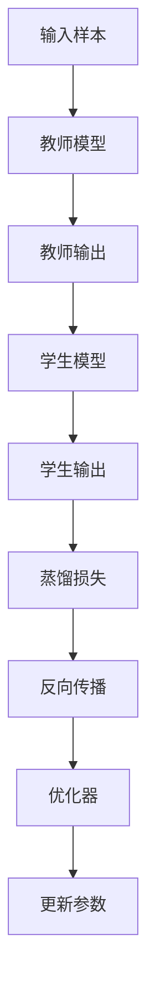
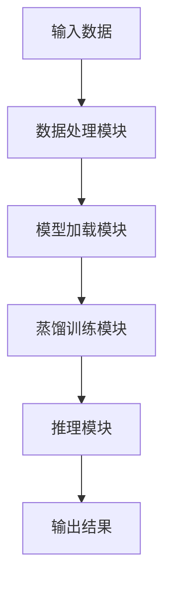
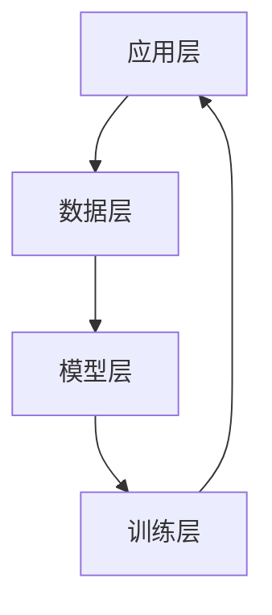
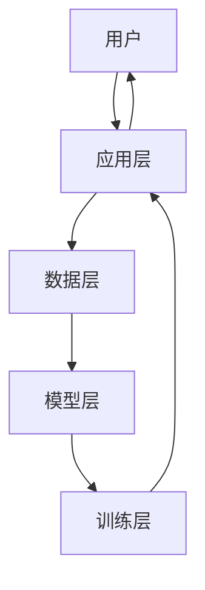

                 


# AI Agent的知识蒸馏在移动设备上的应用

> **关键词**: 知识蒸馏、AI Agent、移动设备、模型压缩、深度学习

> **摘要**: 知识蒸馏是一种将大型AI模型的知识压缩到更小、更高效的模型中的技术。本文详细探讨了知识蒸馏在移动设备上的应用，从核心概念、算法原理、系统架构到项目实战，全面解析了如何在移动设备上实现高效的知识蒸馏，以满足移动设备上AI应用的性能和资源限制要求。

---

# 第一部分: 知识蒸馏的基本概念与背景

## 第1章: 知识蒸馏的定义与核心概念

### 1.1 知识蒸馏的定义与核心概念

- **知识蒸馏的定义**  
  知识蒸馏是一种通过教师模型（Teacher）将知识传递给学生模型（Student）的技术，旨在将大型模型的知识压缩到更小、更高效的模型中。

- **AI Agent的核心要素**  
  AI Agent是具有感知环境、自主决策能力的智能体，知识蒸馏是其实现高效推理和决策的关键技术之一。

- **知识蒸馏在AI Agent中的作用**  
  知识蒸馏通过压缩模型大小，降低计算复杂度，提升AI Agent在移动设备上的实时推理能力。

### 1.2 移动设备上的AI应用挑战

- **移动设备的计算资源限制**  
  移动设备的计算能力有限，无法直接运行大型AI模型，因此需要通过知识蒸馏等技术将模型压缩到适合移动设备的规模。

- **AI模型在移动设备上的部署难点**  
  移动设备的存储和计算资源有限，如何高效地将大型AI模型部署到移动设备上是一个关键挑战。

- **知识蒸馏在移动设备中的应用价值**  
  知识蒸馏可以帮助AI Agent在移动设备上实现高效的推理和决策，同时保持模型的性能和准确性。

## 1.3 本章小结

本章介绍了知识蒸馏的基本概念和核心思想，并分析了移动设备上AI应用的挑战及其解决路径。通过知识蒸馏技术，AI Agent可以在资源受限的移动设备上实现高效的推理和决策。

---

# 第二部分: 知识蒸馏的核心原理与技术

## 第2章: 知识蒸馏的原理与方法

### 2.1 知识蒸馏的基本原理

- **知识蒸馏的核心思想**  
  通过教师模型生成的概率分布，指导学生模型学习教师模型的知识，从而实现知识的传递。

- **知识蒸馏的数学模型**  
  知识蒸馏的核心是通过最小化学生模型输出与教师模型输出之间的KL散度来实现知识传递。

  $$ D_{\text{KL}}(P_{\text{teacher}} \parallel P_{\text{student}}) = \sum_{i} P_{\text{teacher}}(i) \log \frac{P_{\text{teacher}}(i)}{P_{\text{student}}(i)} $$

- **知识蒸馏的实现步骤**  
  1. 训练教师模型。  
  2. 使用教师模型的输出作为软标签，指导学生模型的训练。  
  3. 调整蒸馏温度，优化学生模型的性能。

### 2.2 知识蒸馏的关键技术

- **教师模型与学生模型的构建**  
  教师模型通常是一个大模型（如BERT、ResNet等），而学生模型是一个小模型（如MobileNet、TinyBERT等）。

- **蒸馏损失函数的设计**  
  蒸馏损失函数通常由两部分组成：  
  - 知识蒸馏损失：$L_{\text{distill}}$  
  - 分类损失：$L_{\text{cls}}$  

  总损失为：  
  $$ L = \alpha L_{\text{distill}} + (1-\alpha) L_{\text{cls}} $$  

  其中，$\alpha$ 是蒸馏损失的权重。

- **知识蒸馏的优化策略**  
  1. 调整蒸馏温度：通常在5到20之间，温度越高，软标签越平滑。  
  2. 结合模型剪枝和量化技术，进一步压缩模型大小。  
  3. 在线蒸馏：动态更新教师模型，提升学生模型的适应性。

### 2.3 知识蒸馏与其他模型压缩技术的对比

- **知识蒸馏与模型剪枝的对比**  
  | 技术       | 知识蒸馏                     | 模型剪枝                     |
  |------------|------------------------------|------------------------------|
  | 核心思想   | 通过软标签传递知识           | 删除冗余神经元               |
  | 优缺点     | 保持模型全局性能，但计算开销较大 | 计算开销低，但可能影响模型性能 |

- **知识蒸馏与模型量化的对比**  
  | 技术       | 知识蒸馏                     | 模型量化                     |
  |------------|------------------------------|------------------------------|
  | 核心思想   | 通过软标签传递知识           | 降低模型参数精度             |
  | 优缺点     | 计算开销较高，但性能提升显著 | 计算开销低，但性能提升有限 |

- **知识蒸馏与知识迁移的对比**  
  | 技术       | 知识蒸馏                     | 知识迁移                     |
  |------------|------------------------------|------------------------------|
  | 核心思想   | 通过软标签传递知识           | 通过特征提取传递知识         |
  | 优缺点     | 适合小样本数据               | 适合大样本数据               |

### 2.4 本章小结

本章详细介绍了知识蒸馏的基本原理、数学模型及其实现步骤，并对比了知识蒸馏与其他模型压缩技术的优缺点。通过这些对比，我们可以更好地理解知识蒸馏在移动设备上的应用价值。

---

# 第三部分: AI Agent的知识蒸馏算法原理

## 第3章: 知识蒸馏的数学模型与算法实现

### 3.1 知识蒸馏的数学模型

- **教师模型的输出概率分布**  
  教师模型在输入样本上的输出概率分布为：  
  $$ P_{\text{teacher}}(i) = \text{softmax}(\frac{f_{\text{teacher}}(x_i)}{T}) $$  

  其中，$T$ 是蒸馏温度。

- **学生模型的输出概率分布**  
  学生模型在输入样本上的输出概率分布为：  
  $$ P_{\text{student}}(i) = \text{softmax}(g_{\text{student}}(x_i)) $$  

- **蒸馏损失函数**  
  蒸馏损失函数为：  
  $$ L_{\text{distill}} = -\sum_{i} P_{\text{teacher}}(i) \log P_{\text{student}}(i) $$  

### 3.2 知识蒸馏的算法实现

```python
import torch
import torch.nn as nn
import torch.optim as optim

# 定义教师模型和学生模型
class TeacherModel(nn.Module):
    def __init__(self):
        super(TeacherModel, self).__init__()
        self.fc = nn.Linear(10, 5)

    def forward(self, x):
        return self.fc(x)

class StudentModel(nn.Module):
    def __init__(self):
        super(StudentModel, self).__init__()
        self.fc = nn.Linear(10, 5)

    def forward(self, x):
        return self.fc(x)

# 初始化模型和优化器
teacher = TeacherModel()
student = StudentModel()
optimizer = optim.Adam(student.parameters(), lr=0.001)

# 训练教师模型
teacher.train()
for epoch in range(10):
    for batch in dataloader:
        optimizer_t.zero_grad()
        outputs_t = teacher(batch)
        loss_t = criterion(outputs_t, labels)
        loss_t.backward()
        optimizer_t.step()

# 知识蒸馏训练
for epoch in range(50):
    for batch in dataloader:
        optimizer_s.zero_grad()
        outputs_t = teacher(batch)
        outputs_s = student(batch)
        loss_distill = -torch.sum(outputs_t * torch.log(outputs_s))
        loss_distill.backward()
        optimizer_s.step()
```

### 3.3 算法流程图



### 3.4 本章小结

本章通过数学模型和代码示例，详细讲解了知识蒸馏的实现过程，包括教师模型和学生模型的构建、蒸馏损失函数的设计以及优化器的使用。通过这些内容，我们可以更好地理解知识蒸馏在算法层面的实现细节。

---

# 第四部分: 系统分析与架构设计

## 第4章: 知识蒸馏在移动设备上的系统架构

### 4.1 系统应用场景分析

- **移动设备上的AI应用场景**  
  移动设备上的AI应用包括图像识别、语音识别、自然语言处理等。

- **知识蒸馏在移动设备中的具体应用**  
  通过知识蒸馏，可以在移动设备上运行高效的小模型，实现与大模型相当的性能。

### 4.2 系统功能设计

- **系统功能模块划分**  
  1. 模型加载模块：加载教师模型和学生模型。  
  2. 数据处理模块：处理输入数据，生成软标签。  
  3. 蒸馏训练模块：实现知识蒸馏的训练过程。  
  4. 推理模块：在移动设备上进行实时推理。

- **系统功能流程图**



### 4.3 系统架构设计

- **分层架构设计**  
  1. 应用层：处理用户输入，显示输出结果。  
  2. 数据层：存储和管理输入数据。  
  3. 模型层：实现教师模型和学生模型的定义。  
  4. 训练层：实现蒸馏训练过程。

- **模块之间的交互关系**



### 4.4 系统接口设计和交互流程图

- **系统接口设计**  
  1. 模型加载接口：加载教师模型和学生模型的参数。  
  2. 数据处理接口：处理输入数据，生成软标签。  
  3. 蒸馏训练接口：实现知识蒸馏的训练过程。  
  4. 推理接口：在移动设备上进行实时推理。

- **系统交互流程图**



### 4.5 本章小结

本章通过系统应用场景分析、功能设计和架构设计，详细讲解了知识蒸馏在移动设备上的实现过程。通过分层架构设计和模块之间的交互关系，我们可以更好地理解知识蒸馏在实际系统中的应用。

---

# 第五部分: 项目实战

## 第5章: 知识蒸馏在移动设备上的项目实现

### 5.1 环境安装与配置

- **安装依赖**  
  1. 安装PyTorch：`pip install torch`  
  2. 安装TensorFlow Lite：`pip install tensorflowlite`  
  3. 安装Keras：`pip install keras`

- **配置开发环境**  
  1. 安装Jupyter Notebook。  
  2. 配置虚拟环境。

### 5.2 项目核心实现

- **教师模型和学生模型的定义**

```python
import torch
import torch.nn as nn
import torch.optim as optim

class TeacherModel(nn.Module):
    def __init__(self):
        super(TeacherModel, self).__init__()
        self.fc = nn.Linear(10, 5)

    def forward(self, x):
        return self.fc(x)

class StudentModel(nn.Module):
    def __init__(self):
        super(StudentModel, self).__init__()
        self.fc = nn.Linear(10, 5)

    def forward(self, x):
        return self.fc(x)
```

- **蒸馏训练过程**

```python
# 初始化模型和优化器
teacher = TeacherModel()
student = StudentModel()
optimizer = optim.Adam(student.parameters(), lr=0.001)

# 训练教师模型
teacher.train()
for epoch in range(10):
    for batch in dataloader:
        optimizer_t.zero_grad()
        outputs_t = teacher(batch)
        loss_t = criterion(outputs_t, labels)
        loss_t.backward()
        optimizer_t.step()

# 知识蒸馏训练
for epoch in range(50):
    for batch in dataloader:
        optimizer_s.zero_grad()
        outputs_t = teacher(batch)
        outputs_s = student(batch)
        loss_distill = -torch.sum(outputs_t * torch.log(outputs_s))
        loss_distill.backward()
        optimizer_s.step()
```

### 5.3 项目实战小结

本章通过具体的项目实现，详细讲解了知识蒸馏在移动设备上的应用。通过环境安装、模型定义和蒸馏训练过程的代码示例，我们可以更好地理解知识蒸馏在实际项目中的实现细节。

---

# 第六部分: 最佳实践与总结

## 第6章: 知识蒸馏的最佳实践

### 6.1 性能优化建议

- **模型选择**  
  根据具体应用场景选择合适的教师模型和学生模型。

- **蒸馏温度调整**  
  通过调整蒸馏温度，找到最优的性能和计算效率。

- **模型量化**  
  在蒸馏过程中结合模型量化技术，进一步压缩模型大小。

### 6.2 案例分析与经验总结

- **案例分析**  
  通过具体案例分析，总结知识蒸馏在移动设备上的应用经验。

- **经验总结**  
  知识蒸馏是一种高效的知识传递技术，但在实际应用中需要结合具体场景进行优化。

### 6.3 注意事项

- **计算资源限制**  
  移动设备的计算资源有限，需要优化模型大小和计算复杂度。

- **数据隐私问题**  
  在实际应用中，需要注意数据隐私问题，避免数据泄露。

### 6.4 拓展阅读

- **相关书籍**  
  1. 《Deep Learning》  
  2. 《Neural Networks and Deep Learning》  

- **相关论文**  
  1. "Distilling the Knowledge in a Neural Network"  
  2. "Model Compression via Distillation and Quantization"

### 6.5 本章小结

本章总结了知识蒸馏的最佳实践，包括性能优化建议、案例分析和经验总结。通过这些内容，我们可以更好地理解知识蒸馏在实际应用中的注意事项和拓展方向。

---

# 作者：AI天才研究院/AI Genius Institute & 禅与计算机程序设计艺术 /Zen And The Art of Computer Programming

