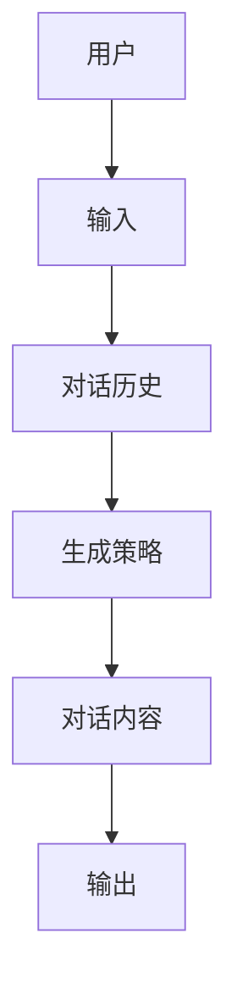
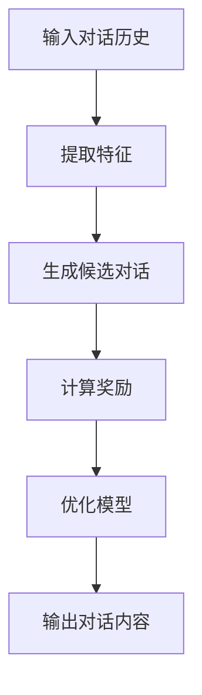
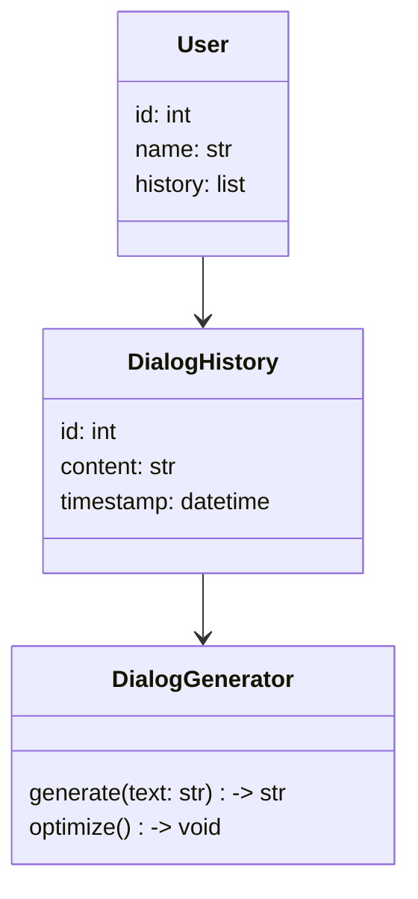
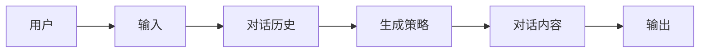
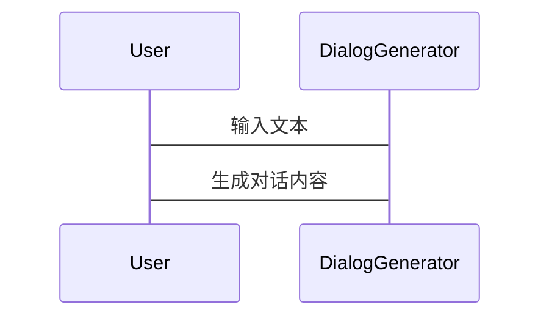

                 


# AI Agent的自适应对话生成系统

> 关键词：AI Agent、自适应对话生成、多模态交互、强化学习、对话生成算法

> 摘要：本文深入探讨了AI Agent在自适应对话生成系统中的应用，从核心概念、算法原理、数学模型、系统架构到项目实战，全面解析了自适应对话生成系统的实现与优化方法，结合实际案例分析，为读者提供了一套完整的解决方案。

---

# 第1章: AI Agent与自适应对话生成系统概述

## 1.1 问题背景与描述

### 1.1.1 对话生成系统的现状与挑战
对话生成系统是人机交互的核心技术之一，目前广泛应用于智能客服、虚拟助手、智能音箱等领域。然而，现有的对话生成系统存在以下问题：
- 对话内容缺乏灵活性，难以适应用户的个性化需求。
- 对话生成的准确性和自然性有待提升。
- 系统难以实时调整对话策略以应对动态变化的对话场景。

### 1.1.2 自适应对话生成的核心问题
自适应对话生成的核心问题在于如何根据对话上下文、用户意图和对话历史动态调整生成策略，从而实现更自然、更高效的对话交互。具体包括以下三个关键问题：
1. 如何实时感知用户意图并调整对话策略？
2. 如何在多模态输入中提取有用信息并生成高质量的对话内容？
3. 如何通过反馈机制优化对话生成模型？

### 1.1.3 AI Agent在对话生成中的角色
AI Agent（智能代理）是实现自适应对话生成的核心，其角色包括：
- **感知器**：通过多模态输入（如文本、语音、情感）感知用户需求。
- **决策器**：根据感知结果生成对话策略。
- **执行器**：通过对话生成模块生成自然的对话内容并输出。

---

## 1.2 问题解决与边界

### 1.2.1 自适应对话生成的目标与方法
自适应对话生成的目标是实现高度个性化、自然流畅的对话交互。其实现方法包括：
1. 基于强化学习的对话生成。
2. 基于Transformer的自适应对话模型。
3. 多模态输入的融合与处理。

### 1.2.2 系统的边界与外延
自适应对话生成系统的边界包括：
- **输入边界**：支持的输入类型（如文本、语音、情感）。
- **输出边界**：生成的对话内容格式（如文本、语音）。
- **场景边界**：适用的场景（如客服、教育、医疗）。

系统的外延包括：
- 对话历史的存储与管理。
- 多模态数据的融合与处理。
- 对话生成模型的持续优化。

### 1.2.3 核心要素与组成结构
自适应对话生成系统的核心要素包括：
1. 对话历史记录模块。
2. 多模态输入处理模块。
3. 对话生成模块。
4. 反馈优化模块。

---

## 1.3 本章小结

本章从问题背景、核心概念和系统边界三个方面介绍了自适应对话生成系统，明确了AI Agent在对话生成中的角色，并界定了系统的输入输出边界。这些内容为后续章节的深入分析奠定了基础。

---

# 第2章: AI Agent的核心概念与原理

## 2.1 核心概念原理

### 2.1.1 AI Agent的基本定义
AI Agent是一种能够感知环境并采取行动以实现目标的智能实体。在对话生成系统中，AI Agent通过感知用户的输入（如文本、语音、情感）生成自然的对话内容。

### 2.1.2 自适应对话生成的机制
自适应对话生成的机制包括：
1. **实时感知**：通过多模态输入感知用户需求。
2. **动态调整**：根据对话上下文动态调整生成策略。
3. **反馈优化**：通过用户反馈优化对话生成模型。

### 2.1.3 多模态交互的特点
多模态交互的特点包括：
- **多样性**：支持多种输入形式（如文本、语音、图像）。
- **实时性**：能够快速响应用户的输入。
- **个性化**：根据用户特征生成个性化对话内容。

---

## 2.2 核心概念属性对比

### 2.2.1 对比表格（使用Markdown表格形式）

| 属性         | 对话生成系统       | 自适应对话生成系统   |
|--------------|------------------|---------------------|
| 输入类型      | 文本             | 文本、语音、情感     |
| 输出类型      | 文本             | 文本、语音           |
| 灵活性        | 低              | 高                 |
| 自然性        | 差              | 好                 |
| 个性化程度    | 低              | 高                 |

---

## 2.3 ER实体关系图

### 2.3.1 Mermaid流程图（使用Mermaid语法）



---

## 2.4 本章小结

本章详细介绍了AI Agent的核心概念与原理，包括自适应对话生成的机制和多模态交互的特点。通过对比表格和ER实体关系图，明确了自适应对话生成系统的核心要素及其之间的关系。

---

# 第3章: 自适应对话生成算法原理

## 3.1 算法原理概述

### 3.1.1 基于强化学习的对话生成
强化学习是一种通过奖励机制优化对话生成模型的方法。其核心步骤包括：
1. **状态定义**：对话历史、用户意图。
2. **动作选择**：生成对话内容。
3. **奖励函数**：根据对话质量生成奖励信号。

### 3.1.2 基于Transformer的自适应模型
基于Transformer的自适应对话生成模型通过多头注意力机制捕捉对话上下文中的关键信息，从而生成更自然的对话内容。

---

## 3.2 算法实现流程

### 3.2.1 Mermaid流程图（使用Mermaid语法）



---

## 3.3 核心算法代码实现

### 3.3.1 Python源代码示例

```python
import torch
import torch.nn as nn

class AdaptiveDialogGenerator(nn.Module):
    def __init__(self, input_size, hidden_size):
        super(AdaptiveDialogGenerator, self).__init__()
        self.lstm = nn.LSTM(input_size, hidden_size, batch_first=True)
        self.fc = nn.Linear(hidden_size, output_size)
        
    def forward(self, input, hidden):
        output, hidden = self.lstm(input, hidden)
        output = self.fc(output)
        return output, hidden

# 示例用法
input_size = 100
hidden_size = 50
output_size = 50

model = AdaptiveDialogGenerator(input_size, hidden_size)
input_seq = torch.randn(1, 10, input_size)
hidden = torch.randn(1, hidden_size)

output, hidden = model(input_seq, hidden)
print(output.size())
```

---

## 3.4 本章小结

本章详细介绍了自适应对话生成的算法原理，包括基于强化学习的对话生成和基于Transformer的自适应模型，并通过流程图和代码示例展示了算法的实现过程。

---

# 第4章: 数学模型与公式解析

## 4.1 对话生成的数学模型

### 4.1.1 基于概率论的生成模型
生成模型的目标是最小化生成对话内容与用户期望的差距。其概率模型可以表示为：
$$ P(y|x) = \prod_{i=1}^{n} P(y_i|x_{1:i-1}, y_{1:i-1}) $$

### 4.1.2 基于优化的数学公式
优化目标是最小化生成对话内容的损失函数：
$$ \mathcal{L} = -\sum_{i=1}^{n} \log P(y_i|x_{1:i-1}, y_{1:i-1}) $$

---

## 4.2 具体公式解析

### 4.2.1 生成模型的损失函数
生成模型的损失函数可以表示为：
$$ \mathcal{L} = \mathbb{E}_{x,y}[ -\log P(y|x) ] $$

### 4.2.2 强化学习的奖励函数
强化学习的奖励函数可以表示为：
$$ R(y|x) = r(y|x) $$

其中，$r(y|x)$是根据生成对话内容的质量计算的奖励值。

---

## 4.3 本章小结

本章从数学模型的角度分析了自适应对话生成的原理，包括概率模型和优化目标，并通过具体公式展示了生成模型的损失函数和强化学习的奖励函数。

---

# 第5章: 系统分析与架构设计

## 5.1 系统分析

### 5.1.1 问题场景介绍
自适应对话生成系统的应用场景包括智能客服、虚拟助手、教育机器人等。以智能客服为例，系统需要处理大量的用户咨询，并根据用户的问题生成个性化的回复。

### 5.1.2 需求分析与系统功能设计
系统需求包括：
1. 实时感知用户意图。
2. 动态调整对话策略。
3. 生成高质量的对话内容。

系统功能设计包括：
1. 对话历史记录模块。
2. 多模态输入处理模块。
3. 对话生成模块。
4. 反馈优化模块。

---

## 5.2 系统架构设计

### 5.2.1 领域模型设计（Mermaid类图）



### 5.2.2 系统架构设计（Mermaid架构图）



---

## 5.3 接口与交互设计

### 5.3.1 系统接口设计
系统接口包括：
1. `get_dialog_history()`：获取对话历史。
2. `generate_dialog(text: str) -> str`：生成对话内容。
3. `optimize_model()`：优化对话生成模型。

### 5.3.2 系统交互流程（Mermaid序列图）



---

## 5.4 本章小结

本章从系统分析与架构设计的角度，详细介绍了自适应对话生成系统的实现方案，包括领域模型设计、系统架构设计和接口设计。

---

# 第6章: 项目实战与案例分析

## 6.1 环境安装与配置

### 6.1.1 开发环境搭建
开发环境包括：
- Python 3.8+
- PyTorch 1.9+
- transformers库
- Mermaid工具

### 6.1.2 依赖库安装
```bash
pip install torch transformers mermaid
```

---

## 6.2 核心代码实现

### 6.2.1 对话生成模块实现
```python
from transformers import AutoTokenizer, AutoModelForSeq2Seq

tokenizer = AutoTokenizer.from_pretrained('t5-base')
model = AutoModelForSeq2Seq.from_pretrained('t5-base')

def generate_dialog(input_text):
    inputs = tokenizer(input_text, return_tensors='pt')
    outputs = model.generate(**inputs, max_length=50)
    return tokenizer.decode(outputs[0], skip_special_tokens=True)
```

### 6.2.2 自适应调整模块实现
```python
import torch
import torch.nn as nn

class DialogOptimizer(nn.Module):
    def __init__(self, input_size, hidden_size):
        super(DialogOptimizer, self).__init__()
        self.lstm = nn.LSTM(input_size, hidden_size, batch_first=True)
        self.fc = nn.Linear(hidden_size, output_size)
        
    def forward(self, input, hidden):
        output, hidden = self.lstm(input, hidden)
        output = self.fc(output)
        return output, hidden

# 示例用法
input_size = 100
hidden_size = 50
output_size = 50

model = DialogOptimizer(input_size, hidden_size)
input_seq = torch.randn(1, 10, input_size)
hidden = torch.randn(1, hidden_size)

output, hidden = model(input_seq, hidden)
print(output.size())
```

---

## 6.3 案例分析与解读

### 6.3.1 实际案例分析
以智能客服为例，系统需要处理用户的问题并生成个性化的回复。例如，用户询问“如何更改密码？”，系统生成回复“您可以前往设置菜单更改密码。”

### 6.3.2 代码应用解读与分析
通过代码实现，我们可以看到对话生成模块和自适应调整模块是如何协同工作的。对话生成模块负责生成初步的对话内容，而自适应调整模块则根据反馈优化生成策略。

---

## 6.4 项目小结

本章通过项目实战和案例分析，展示了自适应对话生成系统的实现过程，包括环境搭建、代码实现和案例分析。通过这些内容，读者可以更好地理解系统的实际应用和优化方法。

---

# 第7章: 应用与挑战

## 7.1 应用场景分析

### 7.1.1 人机交互
自适应对话生成系统在人机交互中的应用前景广阔，未来将更加注重多模态输入的处理和生成对话内容的个性化。

### 7.1.2 技术挑战
当前自适应对话生成系统面临以下技术挑战：
1. 如何提高生成对话内容的准确性和自然性。
2. 如何优化多模态数据的融合与处理。
3. 如何实现对话生成模型的实时优化。

---

## 7.2 未来研究方向

### 7.2.1 多模态对话生成
未来的研究方向包括多模态对话生成、实时对话优化和个性化对话生成。

---

## 7.3 本章小结

本章从应用场景和技术挑战两个方面分析了自适应对话生成系统的未来发展方向，并指出了当前技术中的不足和未来的研究方向。

---

# 作者：AI天才研究院/AI Genius Institute & 禅与计算机程序设计艺术 /Zen And The Art of Computer Programming

---

通过以上章节的详细阐述，本文为读者提供了一个全面的自适应对话生成系统的解决方案，涵盖了从理论到实践的各个方面。

