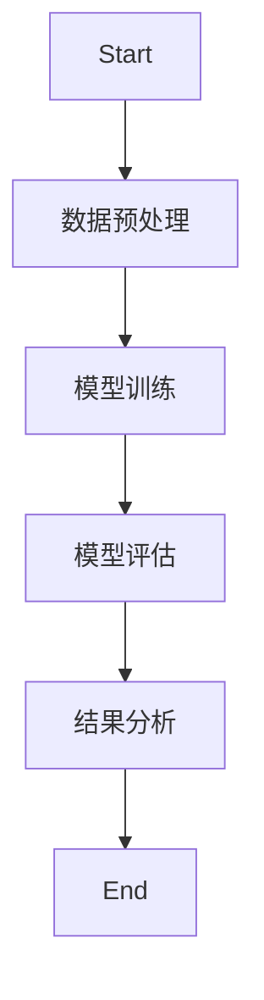
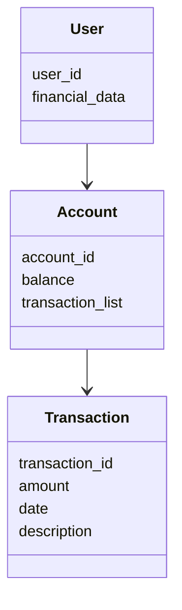
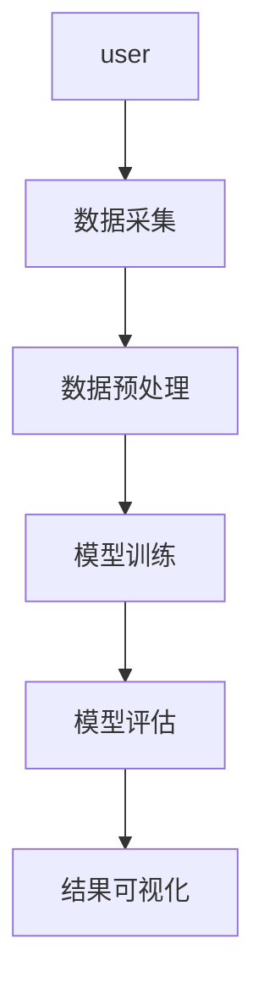
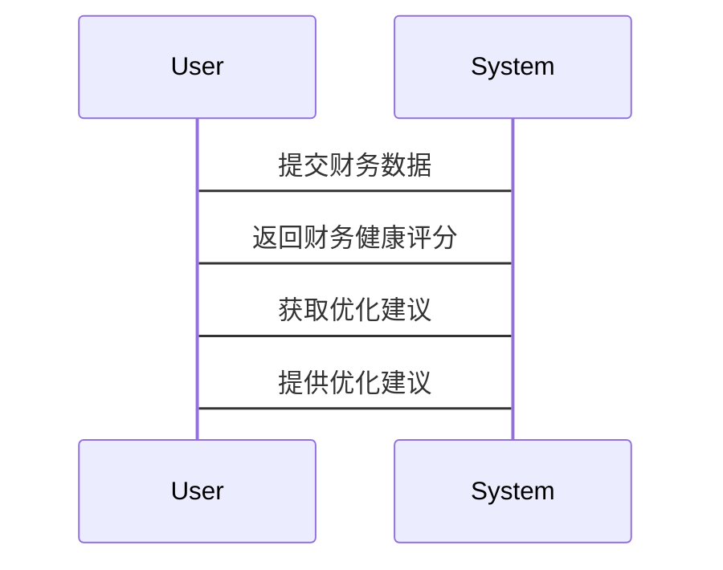

                 


# AI驱动的个人财务健康评估系统设计

**关键词**: AI, 个人财务健康, 评估系统, 机器学习, 大数据分析

**摘要**: 本文将详细介绍基于AI的个人财务健康评估系统的设计与实现。通过结合大数据分析和机器学习技术，我们能够构建一个智能化的财务健康评估工具，帮助个人用户实时监控和优化其财务状况。文章将从系统背景、核心概念、算法原理、系统架构、项目实战等多个维度展开，深入剖析AI在个人财务管理中的应用，为读者提供一个全面的技术视角。

---

# 第一部分: AI驱动的个人财务健康评估系统背景与核心概念

## 第1章: 个人财务健康评估的背景与需求

### 1.1 个人财务健康评估的重要性

#### 1.1.1 财务健康评估的定义与意义
个人财务健康评估是指通过分析个人的收入、支出、资产和负债等财务数据，评估其财务状况的健康程度。健康的财务状况意味着个人具备足够的应急储备、合理的消费习惯和可持续的财务规划。

#### 1.1.2 当前个人财务管理的痛点
- 数据分散：用户的财务数据可能分布在多个平台（如银行账户、支付宝、微信支付等），难以统一管理和分析。
- 知识不足：许多用户缺乏财务管理知识，无法有效分析自己的财务状况。
- 时间成本：手动整理和分析财务数据耗时耗力，且容易出错。

#### 1.1.3 AI技术在财务管理中的潜力
AI技术可以通过自动化数据处理、智能分析和预测，帮助用户快速了解自己的财务状况，并提供个性化的优化建议。

---

### 1.2 AI技术在个人财务健康评估中的应用背景

#### 1.2.1 AI技术的发展与应用现状
近年来，AI技术在金融领域的应用越来越广泛，包括智能投顾、风险管理、信用评估等。个人财务管理作为金融领域的重要组成部分，也逐渐迎来了AI技术的深度介入。

#### 1.2.2 个人财务管理领域的数字化转型
随着移动互联网和智能设备的普及，个人财务管理工具（如支付宝、银行APP）逐渐从传统的线下模式向线上化、智能化方向发展。

#### 1.2.3 传统财务评估方法的局限性
传统财务评估方法通常依赖人工分析，存在效率低、成本高、结果主观性强等问题。AI技术的应用可以显著提升财务评估的效率和准确性。

---

## 第2章: AI驱动的个人财务健康评估系统的核心概念

### 2.1 系统架构设计

#### 2.1.1 系统功能模块划分
- 数据采集模块：从银行账户、支付宝、微信支付等渠道获取财务数据。
- 数据处理模块：对采集到的数据进行清洗、转换和特征提取。
- 模型训练模块：基于机器学习算法训练财务健康评估模型。
- 结果展示模块：将评估结果以可视化的方式呈现给用户。

#### 2.1.2 系统输入与输出定义
- 输入：用户提供的财务数据，包括收入、支出、资产和负债等。
- 输出：财务健康评估结果，包括健康评分、财务状况分析和优化建议。

#### 2.1.3 系统架构的可扩展性
系统架构设计应具有良好的扩展性，能够支持新功能的接入和新数据源的整合。

---

### 2.2 数据处理与特征提取

#### 2.2.1 数据来源与数据类型
- 数据来源：银行账户、信用卡交易记录、支付宝/微信支付记录等。
- 数据类型：结构化数据（如金额、时间）和非结构化数据（如交易描述）。

#### 2.2.2 数据清洗与预处理
- 数据清洗：去除重复数据、异常值和缺失值。
- 数据转换：将非结构化数据转化为结构化数据，便于模型训练。

#### 2.2.3 特征工程与特征选择
- 特征工程：提取关键特征，如收入与支出比例、月均消费金额、负债与资产比例等。
- 特征选择：使用特征重要性评估方法，筛选对评估结果影响较大的特征。

---

### 2.3 模型训练与优化

#### 2.3.1 机器学习模型选择
- 常见模型：线性回归、随机森林、支持向量机（SVM）、XGBoost等。
- 模型选择：根据数据特性和评估目标选择合适的模型。

#### 2.3.2 模型训练流程
1. 数据预处理：清洗、转换、特征提取。
2. 模型训练：使用训练数据训练模型。
3. 模型评估：通过测试数据评估模型性能。
4. 模型优化：调整超参数，提升模型性能。

#### 2.3.3 模型评估与优化
- 评估指标：准确率、召回率、F1分数、ROC-AUC等。
- 优化方法：交叉验证、网格搜索、超参数调优。

---

### 2.4 结果分析与可视化

#### 2.4.1 评估结果的展示方式
- 财务健康评分：将用户的财务状况量化为一个评分（如1-10分）。
- 财务状况分析：包括收入与支出的平衡性、资产与负债的合理性等。

#### 2.4.2 可视化工具的选择与应用
- 可视化工具：Matplotlib、Seaborn、Tableau等。
- 可视化方式：柱状图、折线图、饼图等。

#### 2.4.3 结果解读与用户反馈
- 根据评估结果，为用户提供个性化的优化建议，如减少非必要开支、增加应急储备金等。

---

# 第二部分: AI驱动的个人财务健康评估系统算法原理

## 第3章: 算法原理与数学模型

### 3.1 算法原理

#### 3.1.1 机器学习算法选择与比较
- 线性回归：适用于线性关系的预测。
- 随机森林：适用于非线性关系的预测，且具有较强的抗过拟合能力。
- XGBoost：在 Kaggle 竞赛中表现出色，适合处理分类和回归问题。

#### 3.1.2 算法流程图



---

### 3.2 数学模型与公式

#### 3.2.1 线性回归模型
线性回归是一种常用的回归分析方法，其数学模型如下：

$$ y = \beta_0 + \beta_1 x + \epsilon $$

其中，$y$ 是目标变量，$x$ 是自变量，$\beta_0$ 是截距，$\beta_1$ 是回归系数，$\epsilon$ 是误差项。

#### 3.2.2 随机森林模型
随机森林是一种基于决策树的集成学习方法。其数学模型如下：

$$ y = \text{sign} \left( \sum_{i=1}^n \text{Tree}(x) \right) $$

其中，$Tree(x)$ 是单棵决策树的预测结果，$n$ 是决策树的数量。

#### 3.2.3 XGBoost模型
XGBoost 是一种基于树的优化算法，其数学模型如下：

$$ \text{目标函数} = \text{损失函数} + \text{正则化项} $$

其中，损失函数用于衡量模型预测值与真实值的差异，正则化项用于惩罚复杂度高的模型。

---

### 3.3 算法实现与代码示例

#### 3.3.1 数据处理代码

```python
import pandas as pd
import numpy as np

# 加载数据
data = pd.read_csv('financial_data.csv')

# 数据清洗
data.dropna()
data = data[~data.duplicated()]

# 特征提取
features = data[['income', 'expenses', 'assets', ' liabilities']]
target = data['financial_health']
```

#### 3.3.2 模型训练代码

```python
from sklearn.ensemble import RandomForestClassifier
from sklearn.model_selection import train_test_split
from sklearn.metrics import accuracy_score

# 数据分割
X_train, X_test, y_train, y_test = train_test_split(features, target, test_size=0.2, random_state=42)

# 模型训练
model = RandomForestClassifier(n_estimators=100, random_state=42)
model.fit(X_train, y_train)

# 模型评估
y_pred = model.predict(X_test)
print("准确率:", accuracy_score(y_test, y_pred))
```

---

### 3.4 算法优缺点分析

#### 3.4.1 线性回归
- 优点：简单易懂，计算速度快。
- 缺点：只能处理线性关系，对非线性关系表现不佳。

#### 3.4.2 随机森林
- 优点：能够处理非线性关系，具有较强的抗过拟合能力。
- 缺点：计算复杂度较高，需要较多的计算资源。

#### 3.4.3 XGBoost
- 优点：在 Kaggle 竞赛中表现出色，适合处理分类和回归问题。
- 缺点：需要较多的超参数调优，容易过拟合。

---

# 第三部分: AI驱动的个人财务健康评估系统设计与实现

## 第4章: 系统分析与架构设计

### 4.1 问题场景介绍

#### 4.1.1 系统功能需求
- 数据采集：从多个数据源采集用户的财务数据。
- 数据处理：对数据进行清洗、转换和特征提取。
- 模型训练：训练财务健康评估模型。
- 结果展示：将评估结果以可视化的方式呈现给用户。

#### 4.1.2 项目介绍
本项目旨在构建一个基于AI的个人财务健康评估系统，帮助用户实时了解自己的财务状况，并提供个性化的优化建议。

---

### 4.2 系统功能设计

#### 4.2.1 领域模型



#### 4.2.2 系统架构设计



#### 4.2.3 系统接口设计
- 数据采集接口：从银行账户、支付宝、微信支付等平台获取数据。
- 模型训练接口：接收预处理后的数据，训练财务健康评估模型。
- 结果展示接口：将评估结果以可视化的方式呈现给用户。

---

### 4.3 系统交互设计

#### 4.3.1 系统交互流程图



---

## 第5章: 项目实战

### 5.1 环境安装与配置

```bash
pip install pandas numpy scikit-learn
```

### 5.2 系统核心实现

#### 5.2.1 数据采集代码

```python
import requests
import json

# 从银行账户获取数据
def get_bank_data(account_id):
    url = f"https://bank-api.example.com/accounts/{account_id}/transactions"
    response = requests.get(url)
    return json.loads(response.text)

# 从支付宝获取数据
def get_alipay_data(account_id):
    url = f"https://alipay-api.example.com/transactions?accountId={account_id}"
    response = requests.get(url)
    return json.loads(response.text)
```

#### 5.2.2 模型训练代码

```python
from sklearn.ensemble import RandomForestClassifier
from sklearn.model_selection import train_test_split
from sklearn.metrics import accuracy_score

# 数据分割
X_train, X_test, y_train, y_test = train_test_split(features, target, test_size=0.2, random_state=42)

# 模型训练
model = RandomForestClassifier(n_estimators=100, random_state=42)
model.fit(X_train, y_train)

# 模型评估
y_pred = model.predict(X_test)
print("准确率:", accuracy_score(y_test, y_pred))
```

#### 5.2.3 结果展示代码

```python
import matplotlib.pyplot as plt

# 绘制财务健康评分分布图
plt.hist(y_pred, bins=10, edgecolor='black')
plt.title('财务健康评分分布')
plt.xlabel('评分')
plt.ylabel('数量')
plt.show()
```

---

### 5.3 项目小结

#### 5.3.1 项目成果
通过本项目，我们成功构建了一个基于AI的个人财务健康评估系统，能够帮助用户快速了解自己的财务状况，并提供个性化的优化建议。

#### 5.3.2 经验总结
- 数据预处理是关键：数据的质量直接影响模型的性能。
- 模型选择要根据数据特性：不同的模型适用于不同的场景。
- 系统设计要注重可扩展性：方便后续功能的接入和优化。

---

# 第四部分: 最佳实践与总结

## 第6章: 最佳实践与注意事项

### 6.1 数据隐私与安全

#### 6.1.1 数据加密
- 在传输和存储过程中对用户的财务数据进行加密。

#### 6.1.2 权限控制
- 仅允许授权用户访问自己的财务数据。

#### 6.1.3 合规性
- 遵守相关法律法规，确保数据处理的合法性。

---

### 6.2 模型优化与调优

#### 6.2.1 超参数调优
- 使用网格搜索（Grid Search）和随机搜索（Random Search）优化模型的超参数。

#### 6.2.2 模型解释性
- 使用 SHAP（SHapley Additive exPlanations）等工具解释模型的预测结果。

#### 6.2.3 模型部署与监控
- 将模型部署到生产环境，并实时监控模型的性能。

---

## 第7章: 总结与展望

### 7.1 总结

通过本文的介绍，我们详细探讨了基于AI的个人财务健康评估系统的设计与实现。从系统背景到核心概念，从算法原理到系统架构，从项目实战到最佳实践，我们为读者提供了一个全面的技术视角。

### 7.2 展望

未来，随着AI技术的不断发展，个人财务健康评估系统将更加智能化和个性化。我们期待看到更多创新性的技术应用，为用户带来更高效、更便捷的财务管理体验。

---

# 作者

**作者：AI天才研究院/AI Genius Institute & 禅与计算机程序设计艺术 /Zen And The Art of Computer Programming**

---

以上是《AI驱动的个人财务健康评估系统设计》的技术博客文章大纲，涵盖了从背景到实现的全过程，结合了理论与实践，适合技术人员和非技术人员阅读。

