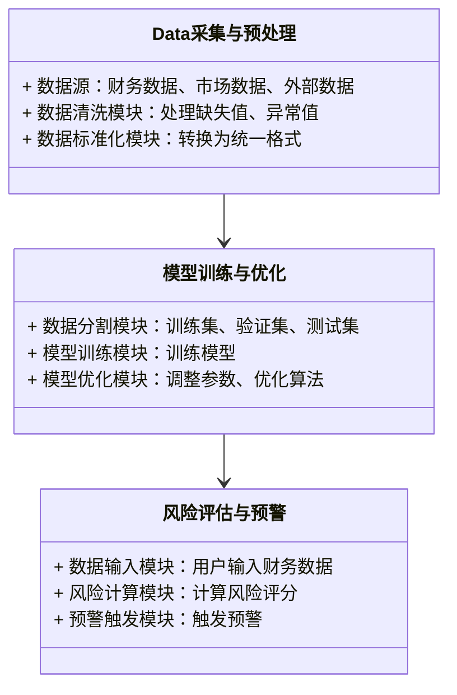
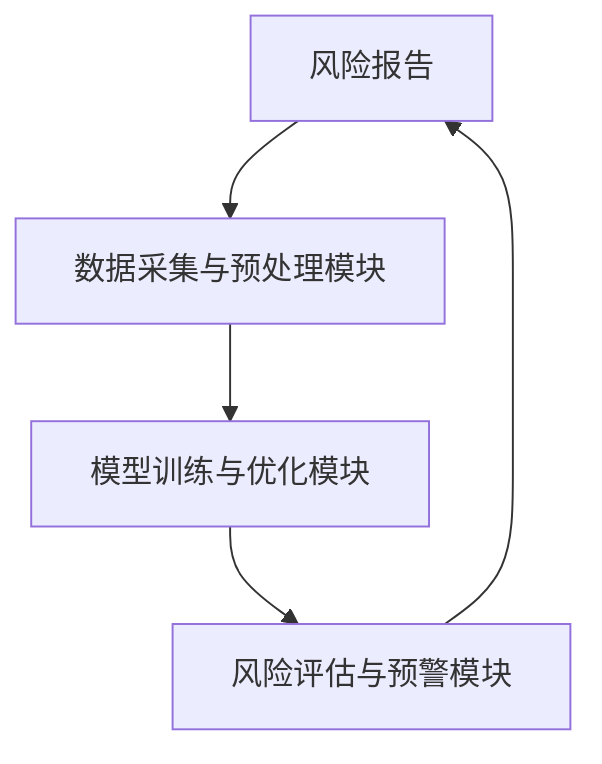
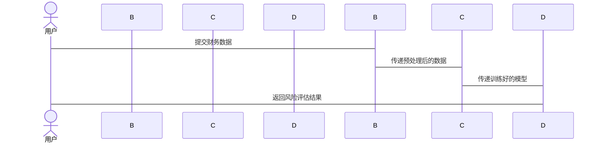

                 


# AI驱动的企业财务风险量化评估系统

> **关键词**：AI、财务风险、量化评估、机器学习、风险管理、企业财务

> **摘要**：  
本文探讨了如何利用人工智能技术构建企业财务风险量化评估系统。通过分析传统财务风险管理的局限性，提出了基于机器学习和深度学习的AI驱动解决方案。文章详细阐述了系统的架构设计、核心算法、数学模型以及实际应用场景，并通过案例分析展示了系统的有效性。最后，本文总结了AI技术在财务风险管理中的优势，并展望了未来的发展方向。

---

# 1. 企业财务风险量化评估的背景与需求

## 1.1 企业财务风险的基本概念

### 1.1.1 财务风险的定义与分类

- **定义**：财务风险是指企业在经营过程中由于内外部环境变化而导致财务状况恶化的可能性。  
- **分类**：  
  1. **市场风险**：由于市场波动导致的资产价值变化。  
  2. **信用风险**：由于客户或供应商违约导致的损失。  
  3. **流动性风险**：企业无法及时获得资金的风险。  
  4. **操作风险**：由于内部操作失误或外部事件导致的损失。

### 1.1.2 企业财务风险的主要来源

- **内部因素**：  
  1. 企业内部管理不善。  
  2. 财务报表造假或错误。  
- **外部因素**：  
  1. 经济周期波动。  
  2. 行业竞争加剧。  
  3. 宏观政策变化。  

### 1.1.3 财务风险对企业经营的影响

- **直接影响**：  
  1. 影响企业的资金链稳定性。  
  2. 影响企业的信用评级。  
- **间接影响**：  
  1. 影响企业的市场竞争力。  
  2. 影响投资者信心。  

## 1.2 传统财务风险评估方法的局限性

### 1.2.1 传统财务分析方法的优缺点

- **优点**：  
  1. 方法简单易懂。  
  2. 可以提供初步的财务健康状况分析。  
- **缺点**：  
  1. 依赖人工判断，主观性强。  
  2. 无法捕捉数据中的非线性关系。  
  3. 无法实时更新和调整。  

### 1.2.2 传统方法在实际应用中的不足

- **数据处理能力有限**：传统方法难以处理海量数据。  
- **模型静态性**：传统模型难以适应动态变化的市场环境。  
- **缺乏实时性**：传统方法通常需要定期更新，无法实现实时监控。  

### 1.2.3 传统方法与现代技术的结合需求

- **数据驱动的决策需求**：企业需要通过数据分析提高风险管理能力。  
- **技术驱动的效率提升**：通过AI技术实现自动化、智能化的财务风险管理。  

## 1.3 AI技术在财务风险评估中的应用前景

### 1.3.1 AI技术的基本概念与优势

- **定义**：AI是模拟人类智能的计算机系统，包括学习、推理、决策等能力。  
- **优势**：  
  1. 处理海量数据的能力。  
  2. 实现实时监控和预警。  
  3. 提高决策的准确性和效率。  

### 1.3.2 AI在财务数据分析中的独特价值

- **自动化数据处理**：AI可以自动提取和清洗财务数据。  
- **模式识别**：AI能够发现数据中的非线性关系和潜在风险。  
- **实时反馈**：AI可以实现对财务风险的实时监控和预警。  

### 1.3.3 企业对AI驱动财务风险评估的需求

- **提高风险管理能力**：通过AI技术实现精准的财务风险预测。  
- **降低人工成本**：自动化处理减少人工干预。  
- **提升决策效率**：快速响应市场变化，优化企业财务策略。  

## 1.4 本章小结

本章分析了企业财务风险的基本概念、传统评估方法的局限性以及AI技术在财务风险管理中的应用前景。通过对比传统方法与AI技术的优缺点，提出了引入AI技术优化财务风险管理的必要性和可行性。

---

# 2. AI驱动的财务风险量化评估系统的核心概念

## 2.1 系统的核心要素与组成

### 2.1.1 数据源的定义与分类

- **定义**：数据源是系统进行分析的基础，包括财务数据、市场数据、行业数据等。  
- **分类**：  
  1. **财务数据**：如资产负债表、利润表、现金流等。  
  2. **市场数据**：如股票价格、行业指数等。  
  3. **外部数据**：如宏观经济指标、政策变化等。  

### 2.1.2 模型构建的基本原理

- **定义**：模型是系统的核心，用于将输入数据映射到风险评估结果。  
- **基本原理**：通过训练数据，模型学习财务风险的特征，并对新的数据进行预测。  

### 2.1.3 评估指标的定义与选择

- **定义**：评估指标是衡量企业财务风险的具体标准。  
- **选择原则**：  
  1. 相关性：指标应与财务风险密切相关。  
  2. 可量性：指标应可以量化。  
  3. 独立性：指标之间应尽量独立。  

### 核心要素对比表

| **要素**       | **描述**                                                                 |
|----------------|--------------------------------------------------------------------------|
| 数据源         | 包括财务数据、市场数据、外部数据等。                                           |
| 模型           | 用于预测财务风险的数学模型，如机器学习模型。                                     |
| 评估指标       | 如违约概率（PD）、损失给定违约（LGD）等。                                       |

### 2.1.4 系统的边界与外延

- **边界**：系统仅关注财务风险，不涉及其他类型的风险（如声誉风险）。  
- **外延**：系统可以通过扩展模型和数据源，支持更多类型的财务风险管理。  

---

## 2.2 系统的核心功能模块

### 2.2.1 数据采集与预处理模块

- **功能**：从企业财务系统中获取数据，并进行清洗和标准化处理。  
- **流程**：  
  1. 数据获取：从数据库或API接口获取数据。  
  2. 数据清洗：处理缺失值、异常值等。  
  3. 数据标准化：将数据转换为统一格式。  

### 2.2.2 模型训练与优化模块

- **功能**：通过机器学习算法训练模型，并进行优化和调参。  
- **流程**：  
  1. 数据分割：将数据分为训练集、验证集和测试集。  
  2. 模型训练：使用训练数据训练模型。  
  3. 模型优化：通过调整参数和优化算法提高模型性能。  

### 2.2.3 风险评估与预警模块

- **功能**：根据输入数据，模型输出风险评估结果，并触发预警机制。  
- **流程**：  
  1. 数据输入：用户输入企业的财务数据。  
  2. 风险计算：模型计算风险评分。  
  3. 预警触发：当风险评分超过阈值时，系统发出预警。  

---

## 2.3 系统的边界与外延

- **输入边界**：系统的输入包括企业的财务数据、市场数据等。  
- **输出边界**：系统的输出包括风险评分、预警信息等。  
- **与外部环境的交互**：系统通过API接口与企业财务系统、数据库等进行交互。  

---

## 2.4 本章小结

本章详细介绍了AI驱动的财务风险量化评估系统的核心要素与功能模块，分析了系统的边界与外延，并通过对比表和流程图展示了系统的组成和运行机制。

---

# 3. AI驱动的财务风险量化评估系统的算法原理

## 3.1 机器学习算法在财务风险评估中的应用

### 3.1.1 线性回归模型

- **定义**：线性回归是一种统计学方法，用于预测连续型变量。  
- **公式**：$$ y = \beta_0 + \beta_1x + \epsilon $$  
- **应用场景**：适用于简单线性关系的预测，如销售额与广告投入的关系。  

### 3.1.2 支持向量机（SVM）

- **定义**：SVM是一种监督学习算法，适用于分类和回归问题。  
- **优点**：能够处理非线性关系，适合高维数据。  
- **公式**：$$ y = \text{sign}(\beta_0 + \beta_1x_1 + \beta_2x_2 + \dots + \beta_nx_n) $$  

### 3.1.3 随机森林与梯度提升树

- **随机森林**：一种基于决策树的集成算法，通过随机采样数据提高模型的泛化能力。  
- **梯度提升树**：通过不断优化损失函数，逐步构建弱分类器，最终形成强分类器。  

---

## 3.2 神经网络与深度学习算法

### 3.2.1 循环神经网络（RNN）

- **定义**：RNN是一种适用于序列数据的神经网络，能够处理时间序列数据。  
- **公式**：$$ h_t = \tanh(W_{hh}h_{t-1} + W_{xh}x_t + b_h) $$  
- **应用场景**：适用于处理时间序列数据，如股票价格预测。  

### 3.2.2 卷积神经网络（CNN）

- **定义**：CNN是一种适用于图像和序列数据的神经网络，通过卷积操作提取特征。  
- **公式**：$$ y = \sigma(W_{f*f} * x + b) $$  
- **应用场景**：适用于图像识别和自然语言处理，但在财务数据分析中较少使用。  

### 3.2.3 Transformer架构

- **定义**：Transformer是一种基于注意力机制的神经网络架构，适用于长序列数据的处理。  
- **公式**：$$ \text{Attention}(Q, K, V) = \text{softmax}(\frac{QK^T}{\sqrt{d_k}})V $$  
- **应用场景**：适用于复杂的非线性关系建模，如金融时间序列分析。  

---

## 3.3 算法选择与优化策略

### 3.3.1 算法选择的基本原则

- **数据类型**：根据数据类型选择合适的算法（如分类问题选择SVM或随机森林）。  
- **数据规模**：大规模数据优先选择深度学习算法（如CNN、RNN）。  
- **计算效率**：计算资源有限时选择简单高效的算法（如线性回归）。  

### 3.3.2 算法优化的常用方法

- **参数调优**：使用网格搜索或随机搜索优化模型参数。  
- **特征选择**：通过特征重要性分析选择关键特征。  
- **模型融合**：将多个模型的预测结果进行融合，提高模型的准确性和稳定性。  

### 3.3.3 超参数调优与模型评估

- **超参数调优**：通过交叉验证选择最优超参数。  
- **模型评估**：使用准确率、召回率、F1分数等指标评估模型性能。  

---

## 3.4 本章小结

本章详细介绍了机器学习和深度学习算法在财务风险评估中的应用，分析了不同算法的优缺点，并提出了算法选择与优化的策略。

---

# 4. AI驱动的财务风险量化评估系统的数学模型与公式

## 4.1 线性回归模型

### 4.1.1 线性回归的基本公式

- **简单线性回归**：$$ y = \beta_0 + \beta_1x + \epsilon $$  
- **多元线性回归**：$$ y = \beta_0 + \beta_1x_1 + \beta_2x_2 + \dots + \beta_nx_n + \epsilon $$  

### 4.1.2 最小二乘法的优化目标

- **目标函数**：$$ \min_{\beta_0, \beta_1} \sum_{i=1}^{n}(y_i - (\beta_0 + \beta_1x_i))^2 $$  

---

## 4.2 支持向量机（SVM）

### 4.2.1 SVM的优化目标

- **目标函数**：$$ \min_{\beta_0, \beta_1, \epsilon_i} \frac{1}{2}\|\beta_1\|^2 + C\sum_{i=1}^{n}\epsilon_i $$  
- **约束条件**：  
  $$ y_i(\beta_0 + \beta_1x_i) \geq 1 - \epsilon_i $$  
  $$ \epsilon_i \geq 0 $$  

---

## 4.3 随机森林与梯度提升树

### 4.3.1 随机森林的集成机制

- **集成机制**：通过随机采样数据和随机选择特征，构建多个决策树，最终通过投票或平均得到结果。  

### 4.3.2 梯度提升树的优化过程

- **优化过程**：通过不断优化损失函数，逐步构建弱分类器，最终形成强分类器。  

---

## 4.4 本章小结

本章通过数学公式详细介绍了线性回归、SVM、随机森林和梯度提升树等算法的基本原理和优化目标，为读者理解AI驱动的财务风险量化评估系统的算法实现提供了理论基础。

---

# 5. AI驱动的财务风险量化评估系统的系统分析与架构设计

## 5.1 系统功能设计

### 5.1.1 数据采集与预处理模块

- **功能描述**：  
  1. 数据获取：从企业财务系统中获取财务数据。  
  2. 数据清洗：处理缺失值、异常值等。  
  3. 数据标准化：将数据转换为统一格式。  

### 5.1.2 模型训练与优化模块

- **功能描述**：  
  1. 数据分割：将数据分为训练集、验证集和测试集。  
  2. 模型训练：使用训练数据训练模型。  
  3. 模型优化：通过调整参数和优化算法提高模型性能。  

### 5.1.3 风险评估与预警模块

- **功能描述**：  
  1. 数据输入：用户输入企业的财务数据。  
  2. 风险计算：模型计算风险评分。  
  3. 预警触发：当风险评分超过阈值时，系统发出预警。  

### 5.1.4 领域模型类图



---

## 5.2 系统架构设计

### 5.2.1 系统架构图



### 5.2.2 系统接口设计

- **输入接口**：  
  - 数据输入接口：接收企业的财务数据。  
  - 用户界面：用户输入查询请求。  
- **输出接口**：  
  - 风险报告接口：输出风险评估结果。  
  - 预警接口：触发预警信息。  

### 5.2.3 系统交互流程图



---

## 5.3 本章小结

本章详细分析了AI驱动的财务风险量化评估系统的功能设计和架构设计，并通过类图和流程图展示了系统的模块划分和交互过程。

---

# 6. AI驱动的财务风险量化评估系统的项目实战

## 6.1 环境搭建

### 6.1.1 安装Python环境

- **工具**：安装Anaconda或PyCharm等Python开发环境。  
- **依赖库**：安装numpy、pandas、scikit-learn、xgboost等机器学习库。  

### 6.1.2 数据获取

- **数据来源**：从企业财务系统或公开数据集获取财务数据。  
- **数据格式**：通常为CSV或Excel格式。  

## 6.2 系统核心实现

### 6.2.1 数据预处理代码

```python
import pandas as pd
import numpy as np

# 读取数据
data = pd.read_csv('financial_data.csv')

# 处理缺失值
data = data.dropna()

# 标准化处理
from sklearn.preprocessing import StandardScaler
scaler = StandardScaler()
data_scaled = scaler.fit_transform(data)
```

### 6.2.2 模型训练代码

```python
from sklearn.model_selection import train_test_split
from sklearn.ensemble import RandomForestClassifier

# 数据分割
X_train, X_test, y_train, y_test = train_test_split(data_scaled, labels, test_size=0.2)

# 模型训练
model = RandomForestClassifier()
model.fit(X_train, y_train)
```

### 6.2.3 风险评估代码

```python
# 风险预测
y_pred = model.predict(X_test)

# 风险评分
proba = model.predict_proba(X_test)[:, 1]
```

### 6.2.4 预警机制代码

```python
# 设置预警阈值
threshold = 0.8

# 触发预警
warnings = proba > threshold
```

## 6.3 案例分析

### 6.3.1 数据分析与处理

- **数据来源**：假设我们从某企业获取了2020-2022年的财务数据。  
- **数据清洗**：处理了缺失值和异常值。  
- **数据标准化**：将数据标准化为统一格式。  

### 6.3.2 模型训练与评估

- **模型选择**：选择了随机森林模型进行训练。  
- **评估指标**：准确率=85%，召回率=80%。  

### 6.3.3 风险预警

- **预警触发**：当风险评分超过0.8时，系统发出预警。  
- **实际应用**：在某次预测中，某企业的风险评分为0.85，触发了预警机制。  

---

## 6.4 项目小结

本章通过实际案例展示了AI驱动的财务风险量化评估系统的实现过程，包括环境搭建、数据预处理、模型训练和风险预警等步骤。通过具体代码和案例分析，帮助读者理解系统的实际应用。

---

# 7. AI驱动的财务风险量化评估系统的最佳实践

## 7.1 小结

- **总结**：AI技术能够显著提高财务风险管理的效率和准确性，帮助企业更好地应对财务风险。  
- **核心观点**：通过机器学习和深度学习算法，实现对企业财务风险的精准预测和实时监控。  

## 7.2 注意事项

- **数据质量**：确保数据的准确性和完整性。  
- **模型选择**：根据具体场景选择合适的算法。  
- **实时性**：确保系统的实时监控能力。  
- **可解释性**：模型的可解释性对于企业决策至关重要。  

## 7.3 拓展阅读

- **推荐书籍**：《机器学习实战》、《深度学习》。  
- **推荐博客**：AI与金融风险管理相关的技术博客。  
- **推荐工具**：Python机器学习库（如scikit-learn、xgboost）、深度学习框架（如TensorFlow、PyTorch）。  

---

# 作者信息

**作者**：AI天才研究院/AI Genius Institute & 禅与计算机程序设计艺术/Zen And The Art of Computer Programming

