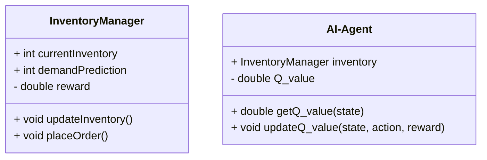
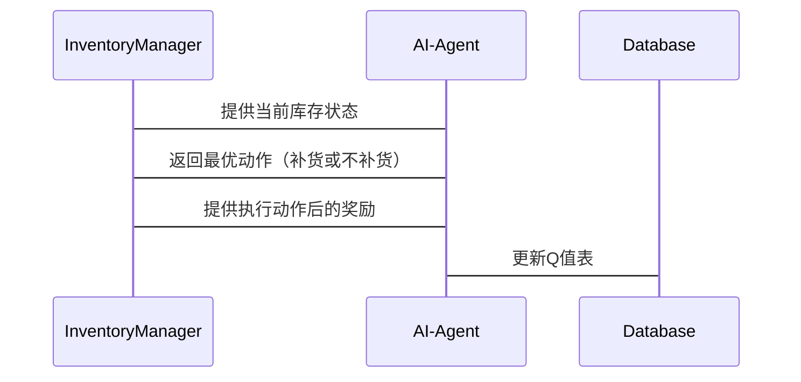

                 


# 企业AI Agent的强化学习在库存管理中的应用

**关键词**：企业AI Agent，强化学习，库存管理，数学模型，库存优化

**摘要**：  
本文探讨了企业AI Agent在库存管理中的应用，重点分析了强化学习如何通过优化库存策略提升企业运营效率。文章从强化学习的基本原理、AI Agent的特性、库存管理的复杂性入手，详细讲解了强化学习算法（如Q-learning和Deep Q-Network）的实现及其在库存管理中的应用。通过构建系统架构设计、提供项目实战案例和代码实现，本文为读者展示了如何将强化学习应用于库存管理的现实场景中。最后，本文总结了当前的研究进展和未来的发展方向，为企业的智能化库存管理提供了有益的参考。

---

## 第1章: 强化学习与AI Agent概述

### 1.1 强化学习的基本概念

#### 1.1.1 强化学习的定义与特点
强化学习是一种机器学习方法，通过智能体在环境中采取动作，以最大化累积奖励的方式进行学习。其特点包括：
- **试错性**：通过与环境互动，智能体逐步学习最优策略。
- **延迟奖励**：奖励可能在动作之后才出现，需要智能体具备记忆能力。
- **策略优化**：强化学习的目标是找到最优策略，使累积奖励最大化。

#### 1.1.2 AI Agent的定义与分类
AI Agent是能够感知环境并采取行动以实现目标的智能体。根据智能体的智能水平，可分为：
- **反应式Agent**：基于当前感知做出反应，适用于简单的任务。
- **认知式Agent**：具备复杂推理和规划能力，适用于复杂任务。

#### 1.1.3 强化学习在AI Agent中的作用
强化学习为AI Agent提供了自我优化的能力，使其能够在动态环境中调整行为，以实现目标函数的最优。

### 1.2 库存管理中的问题与挑战

#### 1.2.1 库存管理的基本概念
库存管理是企业管理中的重要环节，涉及订单处理、库存补货、库存监控等任务。

#### 1.2.2 库存管理中的常见问题
- **库存积压**：资金占用过多，增加成本。
- **库存短缺**：可能导致客户流失，影响企业声誉。
- **预测不准确**：市场需求波动大，难以准确预测。

#### 1.2.3 强化学习在库存管理中的应用前景
强化学习能够通过动态调整库存策略，优化库存成本和客户满意度。

### 1.3 本章小结
本章介绍了强化学习的基本概念和AI Agent的分类，分析了库存管理中的问题与挑战，并探讨了强化学习在库存管理中的应用前景。

---

## 第2章: 强化学习的核心概念与数学模型

### 2.1 强化学习的基本原理

#### 2.1.1 状态、动作与奖励的定义
- **状态（State）**：环境中的当前情况，如库存量、需求预测等。
- **动作（Action）**：智能体在特定状态下采取的行为，如补货或不补货。
- **奖励（Reward）**：智能体采取动作后获得的反馈，通常以数值形式表示。

#### 2.1.2 策略与价值函数的定义
- **策略（Policy）**：智能体在某一状态下选择动作的概率分布。
- **价值函数（Value Function）**：衡量某状态下采取特定动作的长期收益。

#### 2.1.3 马尔可夫决策过程（MDP）的定义
MDP是一种数学模型，描述了智能体在环境中的决策过程，包括状态、动作、转移概率和奖励函数。

### 2.2 强化学习的数学模型

#### 2.2.1 状态转移概率矩阵
状态转移概率矩阵描述了智能体在某一状态下采取某一动作后转移到其他状态的概率。

$$ P(s' | s, a) $$
其中，$s$ 是当前状态，$a$ 是动作，$s'$ 是下一个状态。

#### 2.2.2 Q-learning算法的数学公式
Q-learning算法的目标是找到最优Q值，公式如下：
$$ Q(s, a) = r + \gamma \max_{a'} Q(s', a') $$
其中，$\gamma$ 是折扣因子，$r$ 是奖励。

#### 2.2.3 Deep Q-Network的数学模型
Deep Q-Network（DQN）通过深度神经网络近似Q值函数，公式如下：
$$ Q(s, a; \theta) = \theta_1 s + \theta_2 a + \theta_3 $$
其中，$\theta$ 是网络参数。

### 2.3 强化学习的核心算法

#### 2.3.1 Q-learning算法的实现
```python
def q_learning(env, alpha=0.1, gamma=0.99):
    q_table = np.zeros((env.observation_space, env.action_space))
    for episode in range(max_episodes):
        state = env.reset()
        for _ in range(max_steps):
            action = policy(state)
            next_state, reward, done = env.step(action)
            q_table[state, action] += alpha * (reward + gamma * np.max(q_table[next_state]) - q_table[state, action])
            state = next_state
            if done:
                break
```

#### 2.3.2 Deep Q-Network的实现
```python
import torch
class DQN(nn.Module):
    def __init__(self, input_dim, output_dim):
        super(DQN, self).__init__()
        self.fc1 = nn.Linear(input_dim, 64)
        self.fc2 = nn.Linear(64, output_dim)
    
    def forward(self, x):
        x = torch.relu(self.fc1(x))
        x = self.fc2(x)
        return x
```

### 2.4 本章小结
本章详细讲解了强化学习的核心概念和数学模型，重点介绍了Q-learning和Deep Q-Network算法的实现。

---

## 第3章: AI Agent在库存管理中的应用

### 3.1 AI Agent在库存管理中的角色

#### 3.1.1 AI Agent的决策机制
AI Agent能够根据当前库存状态和需求预测，自主决策是否需要补货。

#### 3.1.2 AI Agent的自主学习能力
AI Agent通过强化学习不断优化库存策略，提升库存管理效率。

#### 3.1.3 AI Agent的实时响应能力
AI Agent能够实时感知库存变化，快速调整策略。

### 3.2 强化学习在库存管理中的具体应用

#### 3.2.1 库存补货策略的优化
通过强化学习，AI Agent能够找到最优的补货时机和数量。

#### 3.2.2 库存成本的最小化
强化学习帮助企业在满足客户需求的同时，最小化库存持有成本。

#### 3.2.3 库存预测的准确性提升
AI Agent通过强化学习不断优化预测模型，提高库存预测的准确性。

### 3.3 本章小结
本章探讨了AI Agent在库存管理中的具体应用，重点分析了强化学习在库存补货、成本控制和预测准确性方面的优势。

---

## 第4章: 强化学习算法的实现与优化

### 4.1 强化学习算法的实现步骤

#### 4.1.1 状态空间的定义
库存管理中的状态可以包括当前库存量、需求预测等。

#### 4.1.2 动作空间的定义
动作可以是“补货”或“不补货”。

#### 4.1.3 奖励函数的设计
奖励函数可以根据库存成本、订单满足率等指标设计。

### 4.2 强化学习算法的优化方法

#### 4.2.1 策略梯度方法
策略梯度方法通过优化策略参数，直接最大化期望奖励。

#### 4.2.2 值函数方法
值函数方法通过优化价值函数，间接优化策略。

### 4.3 本章小结
本章介绍了强化学习算法的实现步骤和优化方法，重点分析了策略梯度和值函数方法。

---

## 第5章: 系统分析与架构设计

### 5.1 库存管理系统的场景介绍

#### 5.1.1 系统目标
系统旨在通过AI Agent优化库存管理，降低库存成本，提高订单满足率。

#### 5.1.2 系统输入
系统输入包括历史销售数据、供应商信息、客户需求等。

#### 5.1.3 系统输出
系统输出包括补货建议、库存预警、优化报告等。

### 5.2 系统功能设计

#### 5.2.1 领域模型的类图


#### 5.2.2 系统架构设计


### 5.3 系统接口设计

#### 5.3.1 系统交互流程


### 5.4 本章小结
本章详细分析了库存管理系统的场景、功能和架构设计，重点展示了AI Agent与库存管理系统的交互流程。

---

## 第6章: 项目实战与案例分析

### 6.1 环境安装与配置

#### 6.1.1 Python环境安装
使用Anaconda安装Python 3.8及以上版本。

#### 6.1.2 依赖库安装
安装TensorFlow、Keras、OpenAI Gym等库。

### 6.2 核心代码实现

#### 6.2.1 Q-learning算法实现
```python
import numpy as np

class QLearning:
    def __init__(self, state_space, action_space, alpha=0.1, gamma=0.99):
        self.q_table = np.zeros((state_space, action_space))
        self.alpha = alpha
        self.gamma = gamma

    def get_action(self, state):
        return np.argmax(self.q_table[state])

    def update_q_table(self, state, action, reward, next_state):
        self.q_table[state, action] += self.alpha * (reward + self.gamma * np.max(self.q_table[next_state]) - self.q_table[state, action])
```

#### 6.2.2 DQN算法实现
```python
import torch
import torch.nn as nn

class DQN(nn.Module):
    def __init__(self, input_dim, output_dim):
        super(DQN, self).__init__()
        self.fc1 = nn.Linear(input_dim, 64)
        self.fc2 = nn.Linear(64, output_dim)
    
    def forward(self, x):
        x = torch.relu(self.fc1(x))
        x = self.fc2(x)
        return x
```

### 6.3 案例分析与结果解读

#### 6.3.1 案例分析
通过模拟库存管理场景，展示AI Agent如何优化库存策略。

#### 6.3.2 结果解读
分析AI Agent在不同场景下的表现，验证算法的有效性。

### 6.4 本章小结
本章通过项目实战和案例分析，展示了强化学习算法在库存管理中的具体应用，并对结果进行了详细解读。

---

## 第7章: 总结与展望

### 7.1 本章总结
本文详细探讨了企业AI Agent的强化学习在库存管理中的应用，分析了强化学习的核心概念和算法实现，并通过案例展示了其在库存管理中的实际应用。

### 7.2 研究前沿
当前研究主要集中在多智能体协同、模型解释性等方面，未来有望在更复杂的库存管理场景中发挥作用。

### 7.3 最佳实践 tips
- 在实际应用中，建议结合具体业务需求，选择合适的强化学习算法。
- 注重数据质量和实时性，确保系统的高效运行。
- 定期更新模型，以适应市场变化。

### 7.4 本章小结
本章总结了文章的主要内容，并展望了未来的研究方向和实践建议。

---

## 作者：AI天才研究院/AI Genius Institute & 禅与计算机程序设计艺术 /Zen And The Art of Computer Programming

---

以上是文章的完整内容，涵盖了从理论到实践的各个方面，详细分析了强化学习在库存管理中的应用，并通过代码实现和案例分析展示了其实际价值。

