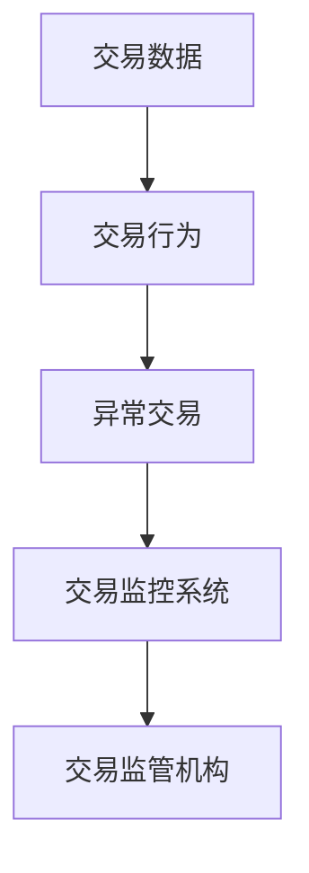
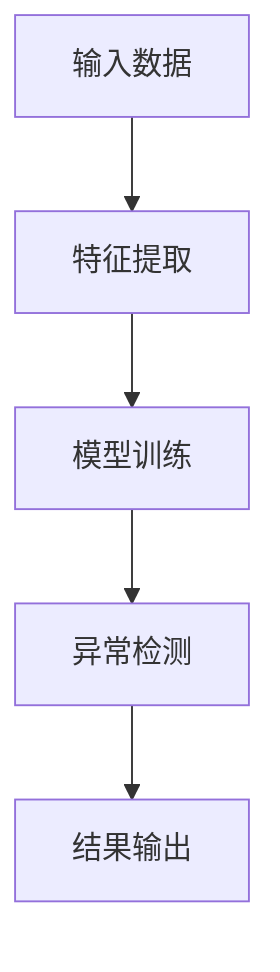
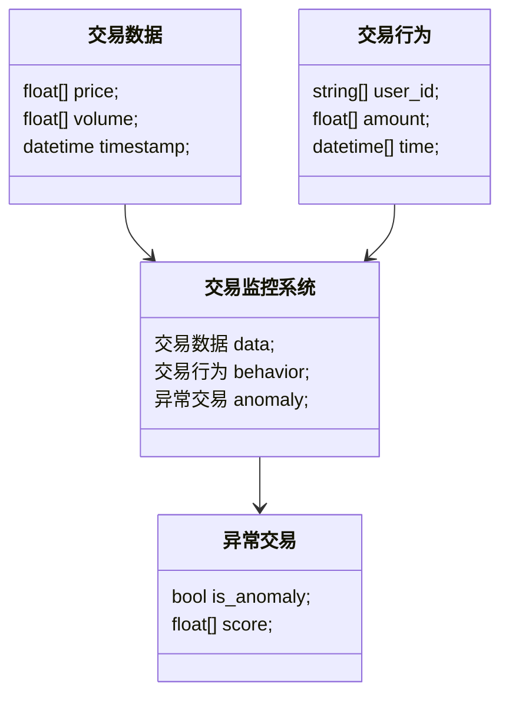
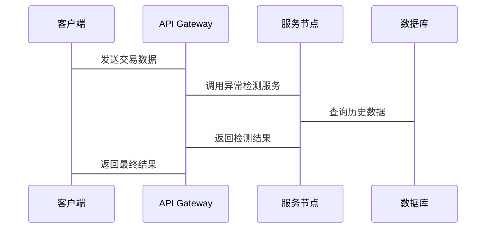

                 


# 开发智能化的金融市场异常交易检测模型

## 关键词：金融市场、异常交易、人工智能、深度学习、自然语言处理

## 摘要：  
金融市场异常交易检测是保障金融安全、维护市场公平的重要手段。本文将详细介绍如何利用人工智能技术开发智能化的金融市场异常交易检测模型，涵盖数据处理、算法选择、系统架构设计以及项目实战等内容。通过理论与实践相结合的方式，深入分析异常交易检测的核心原理和实现方法，为金融领域的技术人员提供参考。

---

# 第1章: 异常交易检测的背景与问题描述

## 1.1 金融市场异常交易的背景  
### 1.1.1 金融市场的基本概念  
金融市场是资金流动和资产交易的主要场所，包括股票、债券、期货、外汇等多种金融工具。市场的参与者包括投资者、机构、交易所和监管机构等。  

### 1.1.2 异常交易的定义与分类  
异常交易通常指不符合正常市场规律的交易行为，包括市场操纵、内幕交易、高频交易等。根据交易行为的性质，异常交易可以分为市场操纵型、欺诈型和突发事件型。  

### 1.1.3 异常交易检测的重要性  
异常交易不仅损害了投资者的利益，还可能引发系统性风险，威胁金融市场的稳定性。通过及时检测和识别异常交易，可以有效维护市场秩序，保护投资者权益。  

## 1.2 问题背景与问题描述  
### 1.2.1 传统交易监控的局限性  
传统的交易监控方法主要依赖人工审查和简单的统计模型，存在效率低、覆盖面窄、响应慢等问题。随着金融市场交易量的激增，传统的监控手段难以满足需求。  

### 1.2.2 异常交易检测的核心目标  
异常交易检测的核心目标是识别潜在的异常交易行为，实时预警并提供决策支持，帮助监管机构和金融机构维护市场公平。  

### 1.2.3 异常交易检测的边界与外延  
异常交易检测的边界包括交易数据的实时性、模型的准确性和可解释性。其外延则涉及数据来源的多样性、模型的可扩展性和场景的适应性。  

## 1.3 核心概念与问题解决  
### 1.3.1 异常交易检测的核心要素  
异常交易检测的核心要素包括交易数据、模型算法、特征提取和结果输出。  

### 1.3.2 异常交易检测的解决思路  
通过采集交易数据、提取特征、训练模型、实时检测和反馈优化，构建完整的异常交易检测系统。  

### 1.3.3 异常交易检测的实现路径  
从数据采集、特征提取到模型训练，再到系统部署和优化，形成一个完整的实现路径。  

## 1.4 本章小结  
本章通过介绍金融市场异常交易的背景，明确了异常交易检测的核心目标和实现路径，为后续章节的深入分析奠定了基础。

---

# 第2章: 异常交易检测的核心概念与联系

## 2.1 异常交易检测的核心概念  
### 2.1.1 数据来源与特征分析  
异常交易检测的数据来源包括交易数据、市场数据和用户行为数据。特征分析则需要从时间、价格、成交量等多个维度提取特征。  

### 2.1.2 异常交易检测的模型类型  
常见的模型类型包括基于规则的模型、统计模型、机器学习模型和深度学习模型。  

### 2.1.3 异常交易检测的应用场景  
异常交易检测的应用场景包括实时监控、事后分析和风险预警。  

## 2.2 核心概念的属性对比  
### 2.2.1 数据特征对比表  

| 数据特征 | 正常交易 | 异常交易 |  
|----------|----------|----------|  
| 交易量   | 稳定     | 突增或突减 |  
| 价格波动 | 小幅波动 | 大幅波动 |  
| 时间分布 | 集中     | 分散或异常集中 |  

### 2.2.2 模型性能对比表  

| 模型类型       | 优缺点                | 适用场景          |  
|----------------|-----------------------|-------------------|  
| 基于规则的模型 | 实现简单，但规则有限 | 适用于简单场景     |  
| 统计模型       | 计算效率高，但对复杂场景不够灵活 | 适用于中等复杂度场景 |  
| 机器学习模型   | 学习能力强，但需要大量数据 | 适用于复杂场景     |  
| 深度学习模型   | 表现优异，但计算资源需求高 | 适用于高度复杂场景 |  

### 2.2.3 场景需求对比表  

| 场景需求       | 实时监控 | 事后分析 | 风险预警 |  
|----------------|----------|----------|----------|  
| 数据要求       | 实时     | 历史     | 实时或历史 |  
| 检测频率       | 高频     | 中频     | 中频     |  
| 检测目标       | 瞬时异常 | 历史异常 | 潜在风险 |  

## 2.3 实体关系图  
### 2.3.1 ER实体关系图（Mermaid）



---

# 第3章: 基于深度学习的异常交易检测算法原理

## 3.1 算法原理概述  
### 3.1.1 深度学习在金融领域的应用  
深度学习在金融领域的应用包括股票价格预测、风险评估、异常交易检测等。  

### 3.1.2 异常交易检测的核心算法  
常用的深度学习算法包括LSTM、Transformer和CNN。  

### 3.1.3 算法流程图（Mermaid）



## 3.2 算法实现细节  
### 3.2.1 LSTM网络的实现原理  
LSTM通过长短期记忆机制，能够有效捕捉时间序列数据中的长期依赖关系。  

### 3.2.2 Transformer模型的实现原理  
Transformer模型通过自注意力机制，能够捕捉数据中的全局依赖关系。  

### 3.2.3 算法实现的代码示例  

```python
import torch
import torch.nn as nn
import torch.nn.functional as F

class LSTMModel(nn.Module):
    def __init__(self, input_size, hidden_size, output_size):
        super(LSTMModel, self).__init__()
        self.lstm = nn.LSTM(input_size, hidden_size, batch_first=True)
        self.fc = nn.Linear(hidden_size, output_size)
    
    def forward(self, x):
        out, _ = self.lstm(x)
        out = self.fc(out[:, -1, :])
        return out

# 使用LSTM模型进行异常检测
model = LSTMModel(input_size=1, hidden_size=64, output_size=1)
criterion = nn.MSELoss()
optimizer = torch.optim.Adam(model.parameters(), lr=0.001)

# 训练过程
for epoch in range(num_epochs):
    for batch in batches:
        inputs, labels = batch
        outputs = model(inputs)
        loss = criterion(outputs, labels)
        loss.backward()
        optimizer.step()
```

## 3.3 数学公式  
### 3.3.1 LSTM的数学公式  
LSTM的遗忘门、输入门和输出门的计算公式如下：  
$$f_{\text{forget}} = \sigma(W_f x + U_f h_{\text{prev}})$$  
$$f_{\text{input}} = \sigma(W_i x + U_i h_{\text{prev}})$$  
$$g_{\text{cell}} = \tanh(W_g x + U_g h_{\text{prev}})$$  
$$h_{\text{current}} = f_{\text{forget}} \cdot h_{\text{prev}} + f_{\text{input}} \cdot g_{\text{cell}}$$  

### 3.3.2 Transformer的数学公式  
自注意力机制的计算公式如下：  
$$\text{Attention}(Q, K, V) = \text{softmax}\left(\frac{QK^T}{\sqrt{d_k}}\right)V$$  

---

# 第4章: 系统分析与架构设计方案

## 4.1 问题场景介绍  
异常交易检测系统需要实时处理大量交易数据，要求系统具备高并发、低延迟和高准确性的特点。  

## 4.2 系统功能设计  
### 4.2.1 领域模型（Mermaid类图）



### 4.2.2 系统架构设计（Mermaid架构图）

```mermaid
graph LR
    API Gateway --> Load Balancer
    Load Balancer --> [服务节点1]
    Load Balancer --> [服务节点2]
    Load Balancer --> [服务节点3]
    服务节点1 --> DB
    服务节点2 --> DB
    服务节点3 --> DB
    DB --> Cache
```

### 4.2.3 系统接口设计  
系统接口包括数据采集接口、模型调用接口和结果反馈接口。  

### 4.2.4 系统交互流程（Mermaid序列图）



---

# 第5章: 项目实战

## 5.1 环境安装  
安装Python、TensorFlow、PyTorch、Pandas和Matplotlib等依赖库。  

## 5.2 核心代码实现  
### 5.2.1 数据预处理代码  

```python
import pandas as pd
import numpy as np

# 读取交易数据
data = pd.read_csv('交易数据.csv')
# 数据清洗
data = data.dropna()
# 特征提取
features = data[['price', 'volume', 'time']]
```

### 5.2.2 模型训练代码  

```python
import torch
import torch.nn as nn
import torch.optim as optim

class AnomalyDetector(nn.Module):
    def __init__(self, input_size, hidden_size, output_size):
        super(AnomalyDetector, self).__init__()
        self.lstm = nn.LSTM(input_size, hidden_size, batch_first=True)
        self.fc = nn.Linear(hidden_size, output_size)
    
    def forward(self, x):
        out, _ = self.lstm(x)
        out = self.fc(out[:, -1, :])
        return out

# 初始化模型
model = AnomalyDetector(input_size=3, hidden_size=64, output_size=1)
criterion = nn.MSELoss()
optimizer = optim.Adam(model.parameters(), lr=0.001)

# 训练过程
for epoch in range(100):
    for batch in batches:
        inputs, labels = batch
        outputs = model(inputs)
        loss = criterion(outputs, labels)
        loss.backward()
        optimizer.step()
```

### 5.2.3 模型评估代码  

```python
import matplotlib.pyplot as plt

# 预测结果
predicted = model(test_inputs)
# 可视化结果
plt.plot(test_labels, label='真实值')
plt.plot(predicted, label='预测值')
plt.legend()
plt.show()
```

## 5.3 实际案例分析  
以某次市场操纵事件为例，分析模型如何检测异常交易行为。  

## 5.4 项目小结  
通过实际项目实战，验证了模型的有效性和可扩展性，为后续优化提供了方向。

---

# 第6章: 最佳实践与总结

## 6.1 小结  
本文详细介绍了异常交易检测的核心概念、算法原理和系统架构设计，通过项目实战验证了模型的有效性。  

## 6.2 注意事项  
在实际应用中，需要注意数据的质量、模型的可解释性以及系统的实时性。  

## 6.3 拓展阅读  
推荐阅读《深度学习实战》和《金融风险管理》等书籍，进一步深入学习相关知识。

---

# 附录

## 附录A: 数据集与工具包  
推荐使用Kaggle上的金融数据集和TensorFlow、PyTorch等深度学习框架。  

## 附录B: 参考文献  
1. 《深度学习》, Ian Goodfellow  
2. 《金融风险管理》，John C. Hull  
3. 《Python金融大数据分析》，Yves Hilpisch  

---

作者：AI天才研究院/AI Genius Institute & 禅与计算机程序设计艺术 /Zen And The Art of Computer Programming

