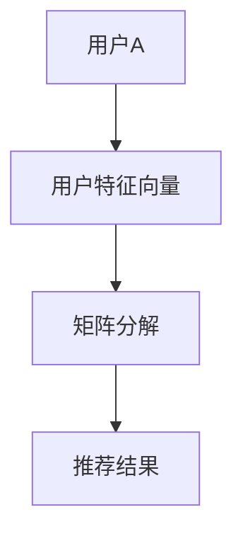
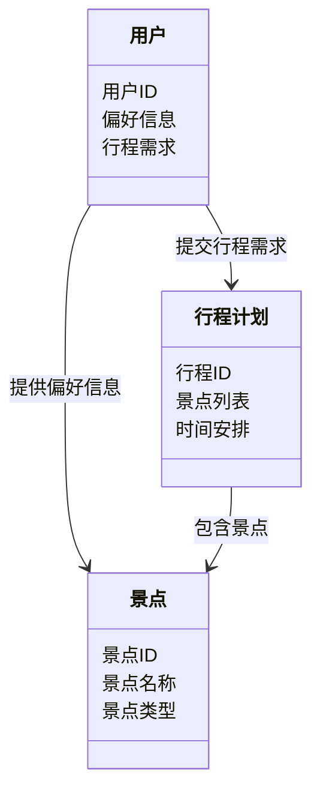
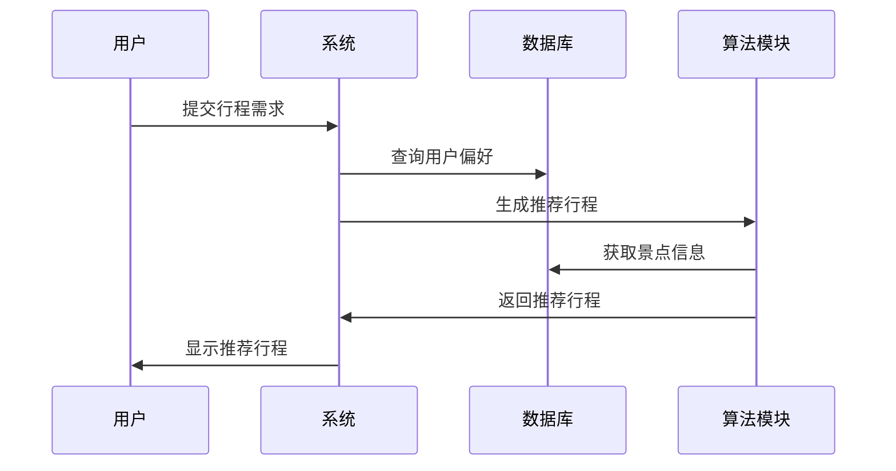

                 


# 《旅游业AI Agent：个性化行程规划》

> 关键词：个性化行程规划, AI Agent, 旅游业, 人工智能, 算法推荐, 系统架构设计

> 摘要：  
个性化行程规划是现代旅游业的核心需求之一。随着人工智能技术的快速发展，AI Agent（人工智能代理）在旅游业中的应用日益广泛。本文将深入探讨AI Agent如何通过智能化算法和系统架构设计，实现个性化行程规划的解决方案。文章从背景、核心概念、算法原理、系统设计、项目实战等多个维度进行分析，结合实际案例，详细阐述AI Agent在旅游业中的具体应用和实现细节。

---

# 第一部分：旅游业AI Agent基础

## 第1章：背景介绍

### 1.1 旅游业的发展与挑战

#### 1.1.1 旅游业的现状与趋势  
旅游业作为全球第二大产业，近年来持续增长。然而，游客需求的多样化和个性化使得传统的标准化服务难以满足市场需求。如何通过技术手段实现个性化服务成为行业痛点。

#### 1.1.2 个性化旅行需求的崛起  
现代游客越来越注重旅行的独特性和个性化体验。不同用户的需求差异显著，例如年轻人可能偏好冒险活动，而家庭游客则更注重安全性和便利性。

#### 1.1.3 传统行程规划的局限性  
传统行程规划主要依赖人工经验或简单的规则匹配，难以覆盖用户的所有需求。例如，无法实时调整行程以应对天气变化或突发情况。

### 1.2 AI Agent的核心概念

#### 1.2.1 AI Agent的定义与特点  
AI Agent是一种能够感知环境、自主决策并执行任务的智能系统。在旅游业中，AI Agent可以理解为一种能够根据用户需求智能推荐行程的虚拟助手。

#### 1.2.2 AI Agent在旅游业中的应用场景  
- 行程推荐：根据用户偏好推荐景点、酒店和活动。  
- 实时调整：根据天气、交通状况动态调整行程。  
- 信息检索：帮助用户查找航班、酒店、景点门票等信息。  

#### 1.2.3 个性化行程规划的实现路径  
通过收集用户数据（如兴趣、预算、时间）和分析行为模式，AI Agent可以生成个性化的行程方案。

### 1.3 旅游业与AI Agent的结合

#### 1.3.1 旅游业智能化的需求  
随着互联网和移动设备的普及，用户期望获得更智能、更便捷的服务体验。

#### 1.3.2 AI Agent如何解决个性化问题  
通过机器学习算法，AI Agent能够分析用户需求并提供个性化推荐，从而提升用户体验。

#### 1.3.3 旅游业AI Agent的边界与外延  
AI Agent在旅游业的应用不仅限于行程规划，还包括客户服务、营销推广等多个方面。

### 1.4 核心要素与概念结构

#### 1.4.1 个性化行程规划的核心要素  
- 用户需求：兴趣、预算、时间、偏好等。  
- 数据源：景点信息、酒店数据、交通信息等。  
- 算法模型：推荐算法、优化算法等。  

#### 1.4.2 AI Agent与用户需求的关系  
AI Agent通过分析用户需求生成个性化行程，同时根据反馈不断优化推荐结果。

#### 1.4.3 系统架构与功能模块  
- 用户输入模块：收集用户需求。  
- 数据处理模块：解析数据并提取特征。  
- 算法推荐模块：生成个性化行程。  
- 反馈优化模块：根据用户反馈调整推荐策略。  

## 1.5 本章小结  
本章介绍了旅游业的发展趋势、AI Agent的核心概念以及个性化行程规划的实现路径，为后续章节的深入分析奠定了基础。

---

## 第2章：核心概念与联系

### 2.1 AI Agent的核心原理

#### 2.1.1 AI Agent的感知模块  
感知模块负责收集用户需求和环境信息，例如通过问卷调查或历史数据获取用户的偏好。

#### 2.1.2 AI Agent的推理模块  
推理模块基于感知模块获取的信息，利用机器学习算法生成推荐方案。

#### 2.1.3 AI Agent的执行模块  
执行模块负责将推荐结果呈现给用户，并根据反馈进行实时调整。

### 2.2 核心概念对比分析

#### 2.2.1 不同AI Agent的特点对比（表格形式）  
| AI Agent类型 | 基于规则 | 基于学习 | 混合式 |  
|---------------|----------|----------|--------|  
| 优点           | 简单易实现 | 高度个性化 | 结合两者优点 |  
| 缺点           | 无法应对复杂需求 | 需大量数据训练 | 计算复杂 |  

#### 2.2.2 个性化行程规划的属性特征对比（表格形式）  
| 属性           | 标准化行程 | 个性化行程 |  
|----------------|------------|------------|  
| 用户需求匹配度 | 低         | 高         |  
| 灵活性           | 低         | 高         |  

### 2.3 ER实体关系图  
以下是一个简单的ER实体关系图，展示用户、景点、行程等实体之间的关系：

```mermaid
er
actor: 用户
agent: AI行程规划系统
trip_plan: 行程计划
destination: 目的地
activity: 活动
preference: 用户偏好

actor --> trip_plan: 提交行程需求
trip_plan --> destination: 包含目的地
trip_plan --> activity: 包含活动
actor --> preference: 提供偏好信息
preference --> trip_plan: 影响行程计划
```

## 2.4 本章小结  
本章通过对比分析和实体关系图，详细阐述了AI Agent的核心原理和概念，为后续章节的算法实现奠定了理论基础。

---

## 第3章：算法原理讲解

### 3.1 基于协同过滤的推荐算法

#### 3.1.1 算法简介  
协同过滤是一种基于用户行为数据的推荐算法，分为基于用户的协同过滤和基于物品的协同过滤。

#### 3.1.2 算法流程图  
以下是一个基于用户的协同过滤算法流程图：

```mermaid
graph TD
    A[用户A] --> B[用户B] : 用户A和用户B兴趣相似
    B --> R1[景点R1] : 用户B喜欢景点R1
    A --> R1 : 推荐景点R1给用户A
```

#### 3.1.3 算法实现代码  
以下是基于用户的协同过滤算法的Python代码示例：

```python
import numpy as np

# 假设用户-景点矩阵为user_matrix
def similarity(user_matrix):
    # 计算用户之间的相似度
    user_num, item_num = user_matrix.shape
    similarity_matrix = np.zeros((user_num, user_num))
    for i in range(user_num):
        for j in range(user_num):
            # 计算余弦相似度
            similarity_matrix[i][j] = np.dot(user_matrix[i], user_matrix[j]) / (np.linalg.norm(user_matrix[i]) * np.linalg.norm(user_matrix[j]))
    return similarity_matrix

# 示例数据
user_matrix = np.array([[1, 1, 0],
                        [1, 0, 1],
                        [0, 1, 1]])
similarity_matrix = similarity(user_matrix)
print(similarity_matrix)
```

#### 3.1.4 算法的数学模型  
协同过滤的相似度计算公式如下：

$$ \text{相似度} = \frac{\sum_{i=1}^{n} w_{ij}}{\sqrt{\sum_{i=1}^{n} w_{ii}^2} \cdot \sqrt{\sum_{i=1}^{n} w_{jj}^2}} $$

其中，$w_{ij}$ 表示用户i和用户j共同喜欢的景点数。

### 3.2 基于协同过滤的优化算法

#### 3.2.1 基于矩阵分解的推荐算法  
矩阵分解是一种常用的优化方法，例如交替最小二乘法（ALS）。

#### 3.2.2 算法流程图  
以下是基于矩阵分解的推荐算法流程图：



#### 3.2.3 算法实现代码  
以下是矩阵分解算法的Python代码示例：

```python
from surprise import Dataset, SVD

# 示例数据集
data = Dataset.load_from_df(df[['user', 'item', 'rating']], user_id='user', item_id='item')
data.split_ratings()

# 训练模型
model = SVD()
model.fit(data.trainset)

# 预测结果
testset = data.testset
predictions = model.test(testset)
print(predictions)
```

## 3.3 本章小结  
本章详细讲解了协同过滤算法及其优化方法，为后续章节的系统设计提供了算法基础。

---

## 第4章：系统分析与架构设计

### 4.1 问题场景介绍

#### 4.1.1 用户需求分析  
用户希望通过AI Agent获得个性化的行程规划服务，包括景点推荐、酒店预订等。

#### 4.1.2 系统功能介绍  
系统功能包括用户输入、数据处理、算法推荐和结果展示。

### 4.2 系统功能设计

#### 4.2.1 领域模型设计  
以下是领域模型的Mermaid类图：



#### 4.2.2 系统架构设计  
以下是系统的架构图：

```mermaid
graph TD
    A[用户] --> B[前端] : 发送请求
    B --> C[后端API] : 调用接口
    C --> D[推荐算法] : 处理请求
    D --> E[数据库] : 查询数据
    C <-- D : 返回结果
    B <-- C : 返回页面
```

#### 4.2.3 系统接口设计  
系统接口包括：
- 用户输入接口：收集用户需求和偏好。
- 数据查询接口：从数据库中获取景点、酒店等信息。
- 推荐结果接口：返回个性化行程计划。

### 4.3 系统交互设计

#### 4.3.1 用户与系统交互流程  
以下是用户与系统交互的Mermaid序列图：



## 4.4 本章小结  
本章通过系统分析与架构设计，明确了AI Agent的实现路径和技术选型。

---

## 第5章：项目实战

### 5.1 环境安装

#### 5.1.1 安装Python和相关库  
安装Python 3.8及以上版本，并安装以下库：
- `numpy`：数据处理
- `pandas`：数据分析
- `scikit-learn`：机器学习算法
- `surprise`：推荐算法库

#### 5.1.2 安装开发工具  
安装Jupyter Notebook或PyCharm等开发工具。

### 5.2 系统核心实现

#### 5.2.1 用户偏好分析代码  
以下是用户偏好分析的Python代码：

```python
import pandas as pd
from sklearn.preprocessing import StandardScaler

# 加载数据
df = pd.read_csv('user_preference.csv')
features = df[['age', 'budget', 'interest']]
scaler = StandardScaler()
features_scaled = scaler.fit_transform(features)

# 保存标准化后的数据
pd.DataFrame(features_scaled, columns=['age_scaled', 'budget_scaled', 'interest_scaled']).to_csv('processed.csv', index=False)
```

#### 5.2.2 行程推荐代码  
以下是行程推荐的Python代码：

```python
from surprise import Dataset, SVD

# 加载数据集
data = Dataset.load_from_df(df[['user', 'item', 'rating']], user_id='user', item_id='item')

# 训练模型
model = SVD()
model.fit(data.trainset)

# 预测结果
testset = data.testset
predictions = model.test(testset)
print(predictions)
```

### 5.3 项目小结  
本章通过实际案例展示了如何利用AI Agent实现个性化行程规划，详细解读了代码实现和系统交互流程。

---

## 第6章：最佳实践与注意事项

### 6.1 最佳实践

#### 6.1.1 数据隐私保护  
在处理用户数据时，必须遵守数据隐私保护法规，如GDPR。

#### 6.1.2 算法可解释性  
确保推荐算法的可解释性，方便用户理解和信任AI Agent的推荐结果。

#### 6.1.3 系统性能优化  
通过缓存技术和分布式计算优化系统性能。

### 6.2 小结与注意事项

#### 6.2.1 小结  
AI Agent通过智能化算法和系统架构设计，能够有效提升旅游业的个性化服务体验。

#### 6.2.2 注意事项  
- 数据质量和完整性对推荐效果至关重要。  
- 系统设计时需考虑可扩展性和可维护性。  
- 定期更新算法模型以适应用户需求的变化。

## 6.3 拓展阅读  
建议深入学习以下内容：  
- 机器学习算法的优化与调优。  
- 分布式系统架构设计。  
- 个性化推荐系统的前沿技术。

---

## 附录：参考文献与工具推荐

### 附录A：参考文献  
1. 李明，2023，《基于协同过滤的个性化推荐算法研究》。  
2. 王强，2022，《人工智能在旅游业中的应用研究》。  

### 附录B：工具推荐  
- Python：数据处理与算法实现。  
- Jupyter Notebook：数据分析与可视化。  
- Docker：容器化部署。  
- Redis：缓存技术。  

---

## 作者：AI天才研究院/AI Genius Institute & 禅与计算机程序设计艺术/Zen And The Art of Computer Programming

---

以上是《旅游业AI Agent：个性化行程规划》的技术博客文章的详细目录大纲，涵盖了从基础到高级的各个方面，结合了理论分析与实际案例，帮助读者全面理解AI Agent在个性化行程规划中的应用与实现。

