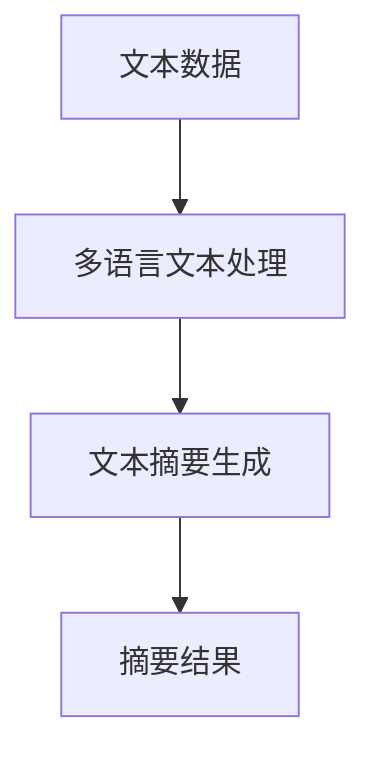
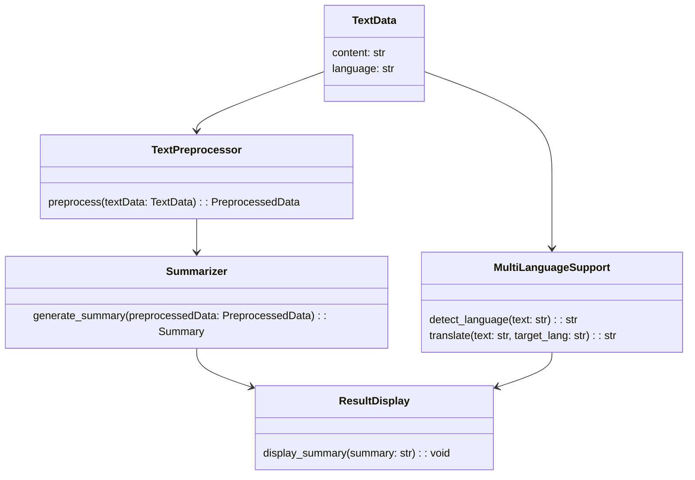
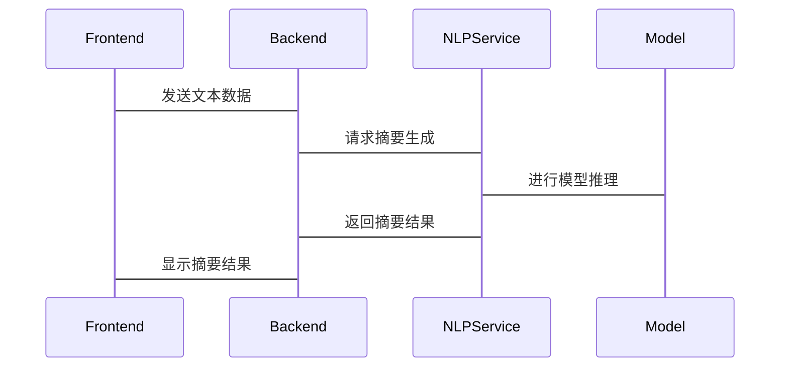

                 


# 构建企业级多语言文本摘要系统：自动生成报告摘要

## 关键词：多语言文本摘要、自然语言处理、文本处理、企业级系统、自动报告生成

## 摘要：
本文详细探讨了构建企业级多语言文本摘要系统的核心技术和实现方案。通过分析多语言文本处理的需求，介绍了文本摘要的基本原理和算法，详细讲解了系统架构设计、功能模块实现以及项目实战中的关键技术。文章还提供了丰富的案例分析和代码示例，帮助读者深入理解如何在企业环境中自动生成多语言报告摘要。

---

# 第一部分: 多语言文本摘要系统背景介绍

## 第1章: 多语言文本摘要系统概述

### 1.1 问题背景
#### 1.1.1 企业级文本处理的需求
在企业环境中，每天都会产生大量的文本数据，如会议记录、报告、客户反馈等。这些文本数据通常需要快速处理和总结，以便管理层做出高效决策。然而，由于数据量庞大且语言多样，人工处理效率低下，难以满足企业需求。

#### 1.1.2 多语言文本处理的重要性
全球化背景下，企业可能需要处理多种语言的文本数据，如英文、中文、西班牙文等。多语言文本处理能够帮助企业跨越语言障碍，实现数据的统一管理和分析。

#### 1.1.3 文本摘要的必要性
文本摘要能够提取文本的核心信息，缩短阅读时间。在企业环境中，自动生成报告摘要可以显著提高工作效率，降低人工处理成本。

### 1.2 问题描述
#### 1.2.1 文本摘要的基本定义
文本摘要是指从长文本中提取关键信息，生成简洁的摘要。摘要应保留原文的主要内容和核心观点，同时去除冗余信息。

#### 1.2.2 多语言文本处理的挑战
多语言文本处理需要考虑不同语言的语法结构、词汇差异以及文化背景。此外，不同语言的文本数据可能分布在不同的系统中，如何实现统一处理是一个技术难题。

#### 1.2.3 企业级应用中的具体场景
在企业级应用中，多语言文本摘要系统需要支持多种语言的文本输入，生成相应的多语言摘要，并能够将摘要集成到企业的管理系统中。

### 1.3 问题解决
#### 1.3.1 多语言文本摘要的目标
目标是构建一个能够处理多种语言文本的系统，自动生成准确的摘要，并支持大规模数据处理。

#### 1.3.2 企业级应用中的解决方案
采用自然语言处理（NLP）技术和机器学习算法，结合多语言语言模型，实现文本摘要的自动生成。

#### 1.3.3 技术实现的路径选择
选择合适的NLP工具和深度学习框架（如spaCy、Transformers），结合多语言语言模型（如mBert、XLM-R），实现多语言文本处理和摘要生成。

### 1.4 边界与外延
#### 1.4.1 系统功能边界
系统仅负责文本摘要生成，不处理文本之外的数据。输入为多种语言的文本数据，输出为对应语言的摘要。

#### 1.4.2 多语言支持的范围
系统支持主流语言（如中、英、法、德、西班牙语）的文本处理，暂不支持小语种和方言。

#### 1.4.3 文本摘要的适用场景
适用于长文本摘要，如报告、新闻、学术论文等，不适用于实时聊天记录等需要快速反馈的场景。

---

# 第二部分: 核心概念与联系

## 第2章: 核心概念与联系

### 2.1 多语言文本处理的核心概念
多语言文本处理是指在多种语言环境下进行文本的分析、理解、生成等操作。其核心在于处理语言间的差异性，同时提取文本中的关键信息。

### 2.2 文本摘要的基本原理
文本摘要可以通过提取文本中的关键词和关键句子（提取式摘要）或通过生成新的句子来表达原文的核心内容（生成式摘要）。

### 2.3 多语言文本处理与文本摘要的关系
多语言文本处理为文本摘要提供了跨语言的支持，而文本摘要则是多语言文本处理的一个重要应用。

---

### 2.4 核心概念对比表
| 概念 | 描述 |
|------|------|
| 单语言文本处理 | 处理单一语言的文本数据 |
| 多语言文本处理 | 处理多种语言的文本数据 |
| 提取式摘要 | 从文本中提取关键句子或关键词 |
| 生成式摘要 | 通过生成新的句子来表达原文核心内容 |

---

### 2.5 实体关系图（Mermaid）



---

# 第三部分: 算法原理讲解

## 第3章: 算法原理讲解

### 3.1 提取式摘要算法

#### 3.1.1 TF-IDF算法
TF-IDF（Term Frequency-Inverse Document Frequency）是一种常用的关键词提取算法。通过计算文本中关键词的频率和重要性，提取出最重要的关键词。

#### 3.1.2 基于句子的提取式摘要
通过计算句子的重要性得分，选择得分最高的句子作为摘要内容。

#### 3.1.3 Python代码实现
```python
from sklearn.feature_extraction.text import TfidfVectorizer

# 示例文本
text = "This is a sample text. It contains several sentences. The goal is to generate a summary."

# 创建TF-IDF向量器
vectorizer = TfidfVectorizer()
tfidf = vectorizer.fit_transform([text])

# 提取关键词
keywords = vectorizer.get_feature_names_out()[tfidf[0].indices]
print(keywords)
```

### 3.2 生成式摘要算法

#### 3.2.1 基于Seq2Seq模型的摘要生成
使用编码器-解码器结构，将输入文本编码为固定长度的向量，然后解码生成目标语言的摘要。

#### 3.2.2 Transformer模型
基于Transformer的模型（如Bert、GPT）可以用于生成式摘要，通过预训练模型进行微调，提升摘要的质量。

#### 3.2.3 Python代码实现
```python
from transformers import BartForConditionalGeneration, BartTokenizer

# 加载预训练模型
model = BartForConditionalGeneration.from_pretrained('facebook/bart-large')
tokenizer = BartTokenizer.from_pretrained('facebook/bart-large')

# 示例文本
input_text = "This is a sample text. It contains several sentences. The goal is to generate a summary."

# 编码输入
inputs = tokenizer(input_text, max_length=1024, truncation=True, padding=True, return_tensors='pt')

# 解码生成摘要
outputs = model.generate(**inputs, max_length=150, min_length=50, num_beams=5)
summary = tokenizer.decode(outputs[0], skip_special_tokens=True)
print(summary)
```

---

### 3.3 数学公式
#### TF-IDF计算公式：
$$
TF = \frac{\text{词项在文档中的出现次数}}{\text{词项在所有文档中的出现次数}}
$$

$$
IDF = \log\left(\frac{\text{总文档数}}{\text{包含该词项的文档数}}\right)
$$

$$
TF-IDF = TF \times IDF
$$

---

# 第四部分: 系统分析与架构设计

## 第4章: 系统分析与架构设计

### 4.1 项目背景
本文旨在构建一个支持多语言文本摘要的企业级系统，能够自动生成报告摘要，提高企业工作效率。

### 4.2 系统功能设计

#### 4.2.1 领域模型（Mermaid类图）



---

### 4.3 系统架构设计

#### 4.3.1 系统架构图（Mermaid架构图）


---

### 4.4 系统接口设计

#### 4.4.1 API接口
- 输入接口：`POST /api/v1/summarize`
- 输出接口：`GET /api/v1/summary`

#### 4.4.2 数据格式
- 输入：JSON格式的文本数据和目标语言
- 输出：JSON格式的摘要结果

---

### 4.5 系统交互流程（Mermaid序列图）



---

# 第五部分: 项目实战

## 第5章: 项目实战

### 5.1 环境安装

#### 5.1.1 安装Python
```bash
python --version
# 输出：Python 3.8+
```

#### 5.1.2 安装依赖库
```bash
pip install transformers numpy pandas
```

### 5.2 系统核心实现

#### 5.2.1 文本预处理
```python
import pandas as pd

def preprocess(text):
    # 分词处理
    words = text.split()
    # 去除停用词
    stop_words = set(["is", "a", "and", "the"])
    filtered_words = [word for word in words if word not in stop_words]
    return ' '.join(filtered_words)
```

#### 5.2.2 模型训练与摘要生成
```python
from transformers import BartForConditionalGeneration, BartTokenizer

def generate_summary(text, target_lang='en'):
    model = BartForConditionalGeneration.from_pretrained('facebook/bart-large')
    tokenizer = BartTokenizer.from_pretrained('facebook/bart-large')
    
    inputs = tokenizer(text, max_length=1024, truncation=True, padding=True, return_tensors='pt')
    outputs = model.generate(**inputs, max_length=150, min_length=50, num_beams=5)
    summary = tokenizer.decode(outputs[0], skip_special_tokens=True)
    return summary
```

### 5.3 案例分析与解读

#### 5.3.1 中文文本摘要
输入文本：
```text
这是一个示例文本。它包含多个句子。我们的目标是生成摘要。
```

生成摘要：
```text
示例文本包含多个句子，目标是生成摘要。
```

#### 5.3.2 英文文本摘要
输入文本：
```text
This is a sample text. It contains several sentences. The goal is to generate a summary.
```

生成摘要：
```text
Sample text contains several sentences, aiming to generate a summary.
```

---

### 5.4 项目小结
通过本项目的实现，我们成功构建了一个支持多语言的文本摘要系统。系统能够处理多种语言的文本数据，生成相应的摘要，并支持大规模数据处理。

---

# 第六部分: 最佳实践

## 第6章: 最佳实践

### 6.1 关键点总结
- 选择合适的NLP模型和框架
- 处理多语言文本时，注意语言间的差异性
- 确保系统的可扩展性和可维护性

### 6.2 注意事项
- 在处理不同语言的文本时，注意文化差异和语义理解
- 定期更新模型和语言支持
- 优化系统性能，确保大规模数据处理的效率

### 6.3 拓展阅读
- "Deep Learning for NLP"（《深度学习入门：基于Python的自然语言处理》）
- "Transformers: Pre-training of Self-attentional Neural Networks"（《Transformers: 自注意力神经网络的预训练》）

---

# 作者：AI天才研究院 & 禅与计算机程序设计艺术

---

通过本文的详细讲解，读者可以深入了解构建企业级多语言文本摘要系统的核心技术和实现方案。从背景介绍到算法原理，从系统设计到项目实战，再到最佳实践，本文为读者提供了全面的指导和丰富的案例分析。希望本文能够帮助读者在实际应用中高效构建多语言文本摘要系统，提升企业的文本处理能力。

