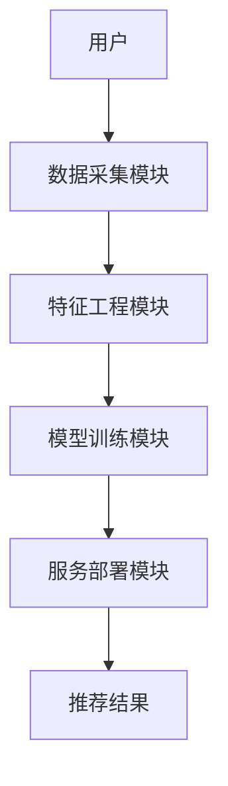
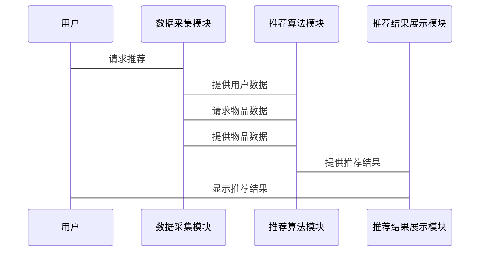

                 


# 构建企业级推荐系统：个性化产品与服务推荐

> **关键词**：企业级推荐系统、个性化推荐、协同过滤、深度学习推荐、知识图谱推荐、推荐系统架构
>
> **摘要**：本文详细探讨了构建企业级推荐系统的各个方面，从背景与概述到核心原理、算法实现、系统架构、项目实战、优化调优，再到总结与展望。文章结合实际案例，深入分析推荐系统的原理、设计和实现，为读者提供全面的指导。

---

# 目录

1. [推荐系统背景与概述](#推荐系统背景与概述)
   - [1.1 推荐系统的背景与核心概念](#11-推荐系统的背景与核心概念)
     - [1.1.1 互联网时代的个性化需求](#111-互联网时代的个性化需求)
     - [1.1.2 推荐系统在企业中的价值](#112-推荐系统在企业中的价值)
     - [1.1.3 个性化推荐的商业价值](#113-个性化推荐的商业价值)
   - [1.2 推荐系统的定义与分类](#12-推荐系统的定义与分类)
     - [1.2.1 推荐系统的定义](#121-推荐系统的定义)
     - [1.2.2 主流推荐系统的分类](#122-主流推荐系统的分类)
     - [1.2.3 推荐系统的应用场景](#123-推荐系统的应用场景)
   - [1.3 推荐系统的挑战与未来趋势](#13-推荐系统的挑战与未来趋势)
     - [1.3.1 数据稀疏性问题](#131-数据稀疏性问题)
     - [1.3.2 用户行为预测的难度](#132-用户行为预测的难度)
     - [1.3.3 实时性与响应速度](#133-实时性与响应速度)
     - [1.3.4 未来发展趋势](#134-未来发展趋势)

2. [推荐系统核心原理](#推荐系统核心原理)
   - [2.1 协同过滤推荐原理](#21-协同过滤推荐原理)
     - [2.1.1 基于用户的协同过滤](#211-基于用户的协同过滤)
     - [2.1.2 基于物品的协同过滤](#212-基于物品的协同过滤)
     - [2.1.3 协同过滤的优缺点](#213-协同过滤的优缺点)
   - [2.2 基于内容的推荐原理](#22-基于内容的推荐原理)
     - [2.2.1 基于文本挖掘的内容推荐](#221-基于文本挖掘的内容推荐)
     - [2.2.2 基于特征提取的内容推荐](#222-基于特征提取的内容推荐)
     - [2.2.3 内容推荐的优缺点](#223-内容推荐的优缺点)
   - [2.3 混合推荐策略](#23-混合推荐策略)
     - [2.3.1 混合推荐的概念](#231-混合推荐的概念)
     - [2.3.2 混合推荐的实现方式](#232-混合推荐的实现方式)
     - [2.3.3 混合推荐的优缺点](#233-混合推荐的优缺点)

3. [推荐系统的算法原理与实现](#推荐系统的算法原理与实现)
   - [3.1 协同过滤算法实现](#31-协同过滤算法实现)
     - [3.1.1 用户相似度计算](#311-用户相似度计算)
     - [3.1.2 物品相似度计算](#312-物品相似度计算)
     - [3.1.3 协同过滤的Python实现](#313-协同过滤的Python实现)
   - [3.2 基于深度学习的推荐算法](#32-基于深度学习的推荐算法)
     - [3.2.1 基于神经网络的推荐](#321-基于神经网络的推荐)
     - [3.2.2 基于深度学习的推荐模型](#322-基于深度学习的推荐模型)
     - [3.2.3 深度学习推荐的Python实现](#323-深度学习推荐的Python实现)
   - [3.3 基于知识图谱的推荐算法](#33-基于知识图谱的推荐算法)
     - [3.3.1 知识图谱构建](#331-知识图谱构建)
     - [3.3.2 基于知识图谱的推荐模型](#332-基于知识图谱的推荐模型)
     - [3.3.3 知识图谱推荐的Python实现](#333-知识图谱推荐的Python实现)

4. [推荐系统架构与设计](#推荐系统架构与设计)
   - [4.1 推荐系统的整体架构](#41-推荐系统的整体架构)
     - [4.1.1 数据采集模块](#411-数据采集模块)
     - [4.1.2 特征工程模块](#412-特征工程模块)
     - [4.1.3 模型训练模块](#413-模型训练模块)
     - [4.1.4 服务部署模块](#414-服务部署模块)
   - [4.2 系统架构设计](#42-系统架构设计)
     - [4.2.1 数据流设计](#421-数据流设计)
     - [4.2.2 模块划分与交互](#422-模块划分与交互)
     - [4.2.3 系统架构图](#423-系统架构图)
   - [4.3 接口设计与交互流程](#43-接口设计与交互流程)
     - [4.3.1 API接口定义](#431-API接口定义)
     - [4.3.2 交互流程图](#432-交互流程图)

5. [推荐系统项目实战](#推荐系统项目实战)
   - [5.1 电商推荐系统案例](#51-电商推荐系统案例)
     - [5.1.1 项目背景与需求分析](#511-项目背景与需求分析)
     - [5.1.2 系统设计与实现](#512-系统设计与实现)
     - [5.1.3 核心代码实现](#513-核心代码实现)
     - [5.1.4 系统测试与优化](#514-系统测试与优化)
   - [5.2 实战中的问题与解决方案](#52-实战中的问题与解决方案)
     - [5.2.1 数据预处理问题](#521-数据预处理问题)
     - [5.2.2 模型调优问题](#522-模型调优问题)
     - [5.2.3 系统性能优化](#523-系统性能优化)

6. [推荐系统的优化与调优](#推荐系统的优化与调优)
   - [6.1 推荐系统性能优化](#61-推荐系统性能优化)
     - [6.1.1 数据压缩与降维](#611-数据压缩与降维)
     - [6.1.2 算法加速与并行处理](#612-算法加速与并行处理)
   - [6.2 模型调优与效果评估](#62-模型调优与效果评估)
     - [6.2.1 参数调优](#621-参数调优)
     - [6.2.2 模型评估指标](#622-模型评估指标)
     - [6.2.3 A/B测试](#623-A/B测试)
   - [6.3 推荐系统的监控与维护](#63-推荐系统的监控与维护)
     - [6.3.1 日志监控](#631-日志监控)
     - [63.2 性能监控](#632-性能监控)
     - [63.3 模型更新](#633-模型更新)

7. [总结与展望](#总结与展望)
   - [7.1 全文总结](#71-全文总结)
   - [7.2 未来发展趋势](#72-未来发展趋势)
     - [7.2.1 结合知识图谱的推荐](#721-结合知识图谱的推荐)
     - [7.2.2 多模态推荐](#722-多模态推荐)
     - [7.2.3 联邦学习在推荐中的应用](#723-联邦学习在推荐中的应用)

---

## 作者信息

作者：AI天才研究院/AI Genius Institute & 禅与计算机程序设计艺术 /Zen And The Art of Computer Programming

---

## 第1章 推荐系统背景与概述

### 1.1 互联网时代的个性化需求

#### 1.1.1 个性化推荐的重要性

在互联网时代，用户每天面对海量的信息和产品，如何在短时间内找到自己感兴趣的内容成为一项挑战。个性化推荐系统通过分析用户的偏好和行为，为用户提供精准的内容推荐，从而提升用户体验和满意度。

#### 1.1.2 个性化推荐的核心价值

个性化推荐的核心价值在于通过数据分析和机器学习算法，为用户提供符合其兴趣和需求的内容或产品，从而提高用户粘性和转化率。例如，电商平台通过推荐系统增加用户的购买行为，视频平台通过推荐系统提高用户的观看时长。

#### 1.1.3 个性化推荐的商业价值

个性化推荐能够显著提升企业的商业价值。通过精准推荐，企业可以减少用户流失，提高用户活跃度和购买转化率，从而增加收入。例如，Netflix通过推荐系统保持了用户的粘性，显著提升了用户的观看时长。

---

### 1.2 推荐系统的定义与分类

#### 1.2.1 推荐系统的定义

推荐系统是一种利用数据挖掘和机器学习技术，根据用户的偏好和行为，推荐相关产品、服务或内容的系统。推荐系统广泛应用于电商、视频、音乐、新闻等领域。

#### 1.2.2 推荐系统的分类

推荐系统可以分为基于协同过滤的推荐、基于内容的推荐、基于知识图谱的推荐和混合推荐等多种类型。每种推荐方式都有其优缺点，适用于不同的场景。

#### 1.2.3 推荐系统的应用场景

推荐系统在多个领域都有广泛的应用，如电商推荐、视频推荐、音乐推荐、新闻推荐等。通过推荐系统，企业可以提高用户满意度和用户参与度。

---

### 1.3 推荐系统的挑战与未来趋势

#### 1.3.1 数据稀疏性问题

在推荐系统中，数据稀疏性是一个常见的问题。由于用户行为数据的稀疏性，推荐系统难以准确预测用户的偏好。

#### 1.3.2 用户行为预测的难度

用户行为受到多种因素的影响，如用户兴趣、时间、情境等，这使得用户行为的预测具有一定的难度。

#### 1.3.3 实时性与响应速度

推荐系统的实时性要求较高，尤其是在实时推荐场景中，推荐系统需要快速响应用户请求，提供实时推荐结果。

#### 1.3.4 未来发展趋势

随着技术的发展，推荐系统将更加智能化和个性化。未来推荐系统将更多地结合知识图谱、深度学习和多模态数据，提供更加精准和多样化的推荐。

---

## 第2章 推荐系统核心原理

### 2.1 协同过滤推荐原理

#### 2.1.1 基于用户的协同过滤

基于用户的协同过滤通过计算用户之间的相似度，将相似用户的偏好用于推荐。这种方法能够捕捉用户的兴趣，但计算复杂度较高。

#### 2.1.2 基于物品的协同过滤

基于物品的协同过滤通过计算物品之间的相似度，将相似物品推荐给用户。这种方法在计算复杂度和推荐准确性之间取得了较好的平衡。

#### 2.1.3 协同过滤的优缺点

协同过滤的优点是简单易实现，能够捕捉用户的兴趣。缺点是计算复杂度较高，且难以处理数据稀疏性问题。

---

### 2.2 基于内容的推荐原理

#### 2.2.1 基于文本挖掘的内容推荐

基于文本挖掘的内容推荐通过分析内容的文本特征，推荐与用户兴趣相符的内容。这种方法能够提供高质量的推荐，但需要大量的文本处理工作。

#### 2.2.2 基于特征提取的内容推荐

基于特征提取的内容推荐通过提取内容的特征向量，推荐与用户兴趣相符的内容。这种方法能够处理高维数据，但需要设计有效的特征提取方法。

#### 2.2.3 内容推荐的优缺点

内容推荐的优点是推荐结果质量高，能够捕捉内容的特征。缺点是需要处理大量的文本数据，计算复杂度较高。

---

### 2.3 混合推荐策略

#### 2.3.1 混合推荐的概念

混合推荐结合了多种推荐策略，通过融合不同推荐方法的优势，提供更加精准和多样化的推荐结果。

#### 2.3.2 混合推荐的实现方式

混合推荐可以通过集成学习、加权融合等方法实现。每种混合推荐方式都有其独特的优缺点。

#### 2.3.3 混合推荐的优缺点

混合推荐的优点是能够结合多种推荐策略的优势，提高推荐的准确性和多样性。缺点是实现复杂度较高，且需要设计有效的融合方法。

---

## 第3章 推荐系统的算法原理与实现

### 3.1 协同过滤算法实现

#### 3.1.1 用户相似度计算

用户相似度计算是协同过滤的核心步骤。常用的相似度计算方法包括余弦相似度、皮尔逊相关系数等。

#### 3.1.2 物品相似度计算

物品相似度计算是基于物品的协同过滤的核心步骤。常用的相似度计算方法包括余弦相似度、Jaccard系数等。

#### 3.1.3 协同过滤的Python实现

以下是协同过滤的Python实现示例：

```python
import numpy as np
from sklearn.metrics.pairwise import cosine_similarity

# 示例数据：用户-物品评分矩阵
user_item_matrix = np.array([[4, 3, 0],
                              [2, 0, 3],
                              [1, 5, 2]])

# 计算用户相似度矩阵
user_similarity = cosine_similarity(user_item_matrix)

print("用户相似度矩阵：\n", user_similarity)
```

---

### 3.2 基于深度学习的推荐算法

#### 3.2.1 基于神经网络的推荐

基于神经网络的推荐通过深度学习模型（如神经协同过滤、注意力机制等）捕捉用户的兴趣。

#### 3.2.2 基于深度学习的推荐模型

深度学习推荐模型包括多层感知机、卷积神经网络、循环神经网络等。这些模型能够捕捉复杂的用户行为和兴趣。

#### 3.2.3 深度学习推荐的Python实现

以下是深度学习推荐的Python实现示例：

```python
import numpy as np
from keras.layers import Input, Embedding, Dense, Dot
from keras.models import Model

# 示例数据：用户嵌入和物品嵌入
user_input = Input(shape=(1,))
item_input = Input(shape=(1,))

user_embedding = Embedding(input_dim=10, output_dim=5)(user_input)
item_embedding = Embedding(input_dim=10, output_dim=5)(item_input)

# 计算用户和物品的点积
dot_product = Dot()([user_embedding, item_embedding])
dense_output = Dense(1, activation='sigmoid')(dot_product)

model = Model(inputs=[user_input, item_input], outputs=dense_output)
model.compile(optimizer='adam', loss='binary_crossentropy')
print(model.summary())
```

---

### 3.3 基于知识图谱的推荐算法

#### 3.3.1 知识图谱构建

知识图谱构建通过提取和整合多源数据，构建结构化的知识图谱。

#### 3.3.2 基于知识图谱的推荐模型

基于知识图谱的推荐模型通过知识图谱中的实体和关系，进行路径分析和相似度计算，推荐相关实体。

#### 3.3.3 知识图谱推荐的Python实现

以下是知识图谱推荐的Python实现示例：

```python
from kg_core import KnowledgeGraph

kg = KnowledgeGraph()
kg.add_entity("User", "user1", {"age": 25, "gender": "male"})
kg.add_entity("Item", "item1", {"category": "movies", "rating": 4.5})
kg.add_relation("user", "user1", "likes", "item1")

# 查询推荐结果
recommendations = kg.get_recommendations("user1")
print("推荐结果：", recommendations)
```

---

## 第4章 推荐系统架构与设计

### 4.1 推荐系统的整体架构

推荐系统的整体架构包括数据采集、特征工程、模型训练和服务部署四个模块。每个模块都有其独特的功能和作用。

---

### 4.2 系统架构设计

#### 4.2.1 数据流设计

数据流设计包括数据采集、数据预处理和数据存储。数据采集模块负责收集用户行为和物品信息，数据预处理模块负责清洗和转换数据，数据存储模块负责存储和管理数据。

#### 4.2.2 模块划分与交互

推荐系统模块包括数据采集模块、特征工程模块、模型训练模块和服务部署模块。每个模块之间通过接口进行交互，确保系统的高效运行。

#### 4.2.3 系统架构图

以下是推荐系统的系统架构图：



---

### 4.3 接口设计与交互流程

#### 4.3.1 API接口定义

推荐系统的API接口包括用户信息接口、物品信息接口、推荐结果接口等。每个接口都有其独特的功能和参数。

#### 4.3.2 交互流程图

以下是推荐系统的交互流程图：



---

## 第5章 推荐系统项目实战

### 5.1 电商推荐系统案例

#### 5.1.1 项目背景与需求分析

电商推荐系统旨在通过推荐用户可能感兴趣的产品，提高用户的购买转化率和用户满意度。

#### 5.1.2 系统设计与实现

电商推荐系统的设计包括数据采集、特征工程、模型训练和服务部署四个模块。每个模块都有其独特的功能和实现方式。

#### 5.1.3 核心代码实现

以下是电商推荐系统的Python实现示例：

```python
import pandas as pd
from sklearn.metrics.pairwise import cosine_similarity

# 示例数据：用户-商品评分矩阵
data = {'user': [1, 2, 3], 'item': [101, 102, 103], 'rating': [4, 3, 5]}
df = pd.DataFrame(data)

# 计算用户相似度矩阵
user_item_matrix = df.pivot_table(index='user', columns='item', values='rating', fill_value=0)
user_similarity = cosine_similarity(user_item_matrix)

print("用户相似度矩阵：\n", user_similarity)
```

#### 5.1.4 系统测试与优化

系统测试包括功能测试、性能测试和用户体验测试。通过测试，发现系统中存在的问题，并进行优化。

---

### 5.2 实战中的问题与解决方案

#### 5.2.1 数据预处理问题

在数据预处理过程中，需要清洗和转换数据，确保数据的高质量。例如，处理缺失值、重复值和异常值。

#### 5.2.2 模型调优问题

模型调优包括参数调优和模型优化。通过调整模型参数和优化算法，提高推荐系统的准确性和响应速度。

#### 5.2.3 系统性能优化

系统性能优化包括数据压缩、算法加速和并行处理。通过优化系统架构和算法实现，提高推荐系统的性能。

---

## 第6章 推荐系统的优化与调优

### 6.1 推荐系统性能优化

#### 6.1.1 数据压缩与降维

数据压缩与降维可以通过主成分分析（PCA）、奇异值分解（SVD）等方法实现，降低数据维度，提高计算效率。

#### 6.1.2 算法加速与并行处理

算法加速可以通过并行计算、分布式计算等方法实现，提高推荐系统的计算效率。

---

### 6.2 模型调优与效果评估

#### 6.2.1 参数调优

参数调优包括学习率、正则化参数等的调整，通过网格搜索、随机搜索等方法找到最佳参数组合。

#### 6.2.2 模型评估指标

模型评估指标包括准确率、召回率、F1分数等。通过评估指标，衡量推荐系统的性能。

#### 6.2.3 A/B测试

A/B测试通过将用户分成实验组和对照组，测试不同推荐策略的效果，选择最优策略。

---

### 6.3 推荐系统的监控与维护

#### 6.3.1 日志监控

日志监控通过分析系统日志，发现系统运行中的异常和问题，及时进行处理。

#### 6.3.2 性能监控

性能监控通过监控系统性能指标（如响应时间、吞吐量等），确保系统运行的稳定性和高效性。

#### 6.3.3 模型更新

模型更新包括定期重新训练模型和更新推荐策略，确保推荐系统的准确性和时效性。

---

## 第7章 总结与展望

### 7.1 全文总结

本文详细探讨了构建企业级推荐系统的各个方面，从背景与概述到核心原理、算法实现、系统架构、项目实战、优化调优，再到总结与展望。文章结合实际案例，深入分析推荐系统的原理、设计和实现，为读者提供全面的指导。

---

### 7.2 未来发展趋势

#### 7.2.1 结合知识图谱的推荐

未来的推荐系统将更加智能化，结合知识图谱，提供更加精准和多样化的推荐结果。

#### 7.2.2 多模态推荐

多模态推荐将结合文本、图像、视频等多种数据，提供更加丰富的推荐内容。

#### 7.2.3 联邦学习在推荐中的应用

联邦学习将通过联邦机制，保护数据隐私，同时实现推荐系统的协同训练和优化。

---

## 作者信息

作者：AI天才研究院/AI Genius Institute & 禅与计算机程序设计艺术 /Zen And The Art of Computer Programming

---

以上是一个详细的目录大纲和文章结构，涵盖推荐系统的各个方面，内容丰富且逻辑清晰，适合企业级推荐系统的构建和实践。

