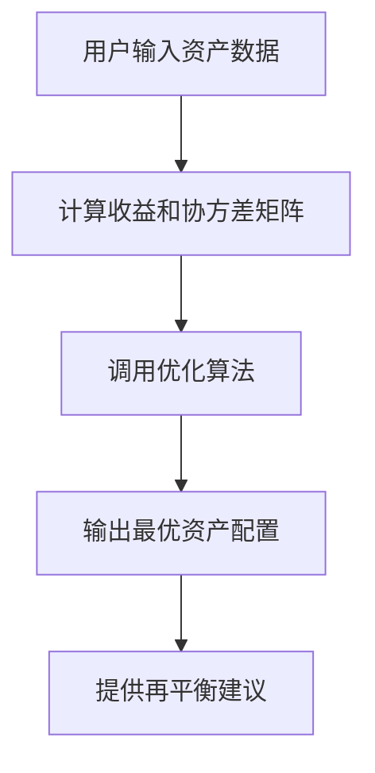

                 


# 第一部分: 格雷厄姆的分散投资原则概述

## 第1章: 分散投资的背景与核心理念

### 1.1 格雷厄姆投资理论的起源与发展

#### 1.1.1 格雷厄姆的生平与主要贡献
本杰明·格雷厄姆（Benjamin Graham）是20世纪著名的投资理论家，被誉为“价值投资之父”。他出生于1894年，早年在哥伦比亚大学学习法律，后转向金融领域，并在1926年开始执教于哥伦比亚商学院，教授投资课程。格雷厄姆的主要贡献包括：

1. **价值投资理论**：他提出了“安全边际”概念，强调以低于内在价值的价格买入股票，以确保投资的安全性。
2. **分散投资策略**：他主张通过分散投资来降低非系统性风险，避免将所有资金投入到单一资产或少数几种资产中。
3. **投资组合管理**：他强调投资组合的构建和管理，以实现长期稳定的收益。

格雷厄姆的学生包括沃伦·巴菲特（Warren Buffett）等著名投资者，他的理论对现代投资理念产生了深远影响。

#### 1.1.2 分散投资的核心思想
格雷厄姆的分散投资原则是基于以下几个核心思想：

1. **风险分散**：通过将资金分配到不同资产类别、行业和地区，降低特定资产或市场的风险。
2. **长期稳定**：分散投资的目标是实现投资组合的长期稳定增长，而非短期暴利。
3. **价值导向**：在分散投资的过程中，注重选择具有内在价值的资产，避免盲目跟风。

#### 1.1.3 格雷厄姆投资理论的现代发展
随着时间的推移，格雷厄姆的投资理论不断被发展和完善。现代投资理论，尤其是哈里·马科维茨（Harry Markowitz）提出的现代投资组合理论（MPT），在很大程度上继承和发展了格雷厄姆的思想。MPT强调通过优化投资组合来最大化收益并最小化风险，这与格雷厄姆的分散投资原则一脉相承。

### 1.2 分散投资的基本概念

#### 1.2.1 什么是分散投资
分散投资是一种通过将资金分配到多种不同资产、行业或地区的投资策略，以降低特定资产或市场的风险。通过分散投资，投资者可以在保持一定收益水平的同时，降低投资组合的波动性和潜在损失。

#### 1.2.2 分散投资的原理与机制
分散投资的原理基于统计学中的大数定律，即多个独立资产的收益波动可以通过组合来降低。具体机制包括：

1. **资产类别分散**：将资金分配到股票、债券、房地产等多种资产类别中，以减少某一类资产价格波动带来的影响。
2. **地域分散**：投资于不同国家或地区的资产，以应对不同地区的经济周期和市场波动。
3. **行业分散**：选择不同行业的股票，以避免某一行业不景气带来的损失。

#### 1.2.3 分散投资与资产配置的关系
分散投资是资产配置的重要组成部分。资产配置决定了投资组合中各类资产的比例，而分散投资则确保了资产配置的实现，通过具体的资产选择和分配来降低风险并优化收益。

### 1.3 分散投资的必要性与优势

#### 1.3.1 分散投资的必要性
在投资过程中，市场风险是不可避免的。通过分散投资，可以将特定资产或市场的风险分散到多个资产上，从而降低整体投资组合的风险。

#### 1.3.2 分散投资的主要优势
1. **降低风险**：通过分散投资，投资者可以减少因单一资产或市场波动带来的损失。
2. **优化收益**：合理分散投资可以提高投资组合的收益，尤其是在市场波动较大时。
3. **适应不同市场环境**：分散投资能够帮助投资者在不同经济周期和市场环境中保持稳定的投资收益。

#### 1.3.3 分散投资与风险控制
分散投资不仅是降低风险的手段，更是风险控制的重要策略。通过科学的资产配置和持续的再平衡，投资者可以有效管理投资组合的风险，确保长期稳定的收益。

---

## 第2章: 格雷厄姆分散投资原则的核心要素

### 2.1 投资组合的构建原则

#### 2.1.1 投资组合的构成要素
一个有效的投资组合应包含以下要素：

1. **资产类别**：股票、债券、现金等不同类型的资产。
2. **资产权重**：每种资产在组合中的比例。
3. **风险与收益目标**：根据投资者的风险承受能力和收益目标进行调整。
4. **再平衡策略**：定期调整资产配置以保持与目标一致。

#### 2.1.2 资产分配的科学方法
资产分配应基于以下原则：

1. **风险承受能力**：根据投资者的财务状况和心理承受能力确定。
2. **投资期限**：长期投资应承担更高的风险以追求更高的收益。
3. **市场环境**：根据当前市场状况调整资产配置比例。

#### 2.1.3 格雷厄姆的防御性投资策略
格雷厄姆强调防御性投资，即通过选择具有安全边际的资产来降低风险。防御性投资策略包括：

1. **价值投资**：买入低于内在价值的资产。
2. **分散投资**：避免过度集中于某一种资产。
3. **长期持有**：坚持长期投资，减少短期波动的影响。

### 2.2 分散投资的数学模型与公式

#### 2.2.1 投资组合的期望收益与风险
投资组合的期望收益可以通过以下公式计算：
$$ E(r_p) = \sum w_i E(r_i) $$

其中，\( w_i \) 是资产 \( i \) 的权重，\( E(r_i) \) 是资产 \( i \) 的期望收益。

投资组合的风险（波动性）可以通过以下公式计算：
$$ \sigma_p^2 = \sum \sum w_i w_j \sigma_i \sigma_j \rho_{ij} $$

其中，\( \sigma_i \) 是资产 \( i \) 的标准差，\( \rho_{ij} \) 是资产 \( i \) 和资产 \( j \) 的相关系数。

#### 2.2.2 马科维茨现代投资组合理论
马科维茨的理论为分散投资提供了数学基础，其优化模型如下：
$$ \text{minimize } \sigma_p^2 \text{ subject to } \sum w_i = 1 $$

这意味着在给定的约束条件下，找到风险最小的投资组合。

#### 2.2.3 分散投资的数学公式推导
通过数学推导，可以证明分散投资能够有效降低风险。假设两个资产完全负相关，其组合风险可以降低为零。然而，在现实中，资产的相关性通常不是完全负相关的，因此分散投资的效果会受到资产相关性的影响。

### 2.3 分散投资的资产配置策略

#### 2.3.1 股票、债券与现金的配置比例
通常建议投资者将资金分配到股票、债券和现金中，比例根据风险承受能力和投资目标进行调整。例如，对于中风险承受能力的投资者，可能建议配置60%股票、30%债券和10%现金。

#### 2.3.2 不同资产类别之间的风险分散
通过选择不同类型的资产，投资者可以有效降低特定资产类别的风险。例如，股票和债券的风险通常不完全相关，因此在组合中加入债券可以降低股票波动带来的风险。

#### 2.3.3 全球化资产配置的实现方法
全球化资产配置包括投资于不同国家和地区的资产，以降低地域风险。例如，投资于美国、欧洲、亚洲等不同地区的股票指数基金，可以有效分散地域风险。

---

## 第3章: 分散投资的算法原理与实现

### 3.1 分散投资的算法概述

#### 3.1.1 现代投资组合理论的算法框架
现代投资组合理论提供了分散投资的数学框架，包括计算资产的期望收益、方差、协方差矩阵等，然后通过优化算法求解最优投资组合。

#### 3.1.2 分散投资的优化算法
常用的优化算法包括：

1. **均值-方差优化**：基于马科维茨的理论，寻找风险最小化或收益最大化的投资组合。
2. **风险预算优化**：将总风险分配到不同资产，确保每种资产的风险贡献不超过预算。

#### 3.1.3 风险调整后的资产配置方法
通过调整各资产的风险权重，实现风险分散和收益优化。

### 3.2 分散投资的数学模型与公式

#### 3.2.1 投资组合的期望收益公式
$$ E(r_p) = \sum w_i E(r_i) $$

#### 3.2.2 投资组合的风险公式
$$ \sigma_p^2 = \sum \sum w_i w_j \sigma_i \sigma_j \rho_{ij} $$

#### 3.2.3 马科维茨优化模型
$$ \text{minimize } \sigma_p^2 \text{ subject to } \sum w_i = 1 $$

### 3.3 分散投资的Python实现

#### 3.3.1 环境搭建与数据准备
需要安装必要的Python库，如NumPy、Pandas、Scipy等，并准备历史价格数据。

#### 3.3.2 投资组合优化的代码实现
以下是使用Scipy.optimize库进行投资组合优化的示例代码：

```python
import numpy as np
from scipy.optimize import minimize

# 假设我们有三只股票的数据，计算它们的收益和协方差矩阵
# mu: 各资产的期望收益
# cov: 协方差矩阵
def portfolio_variance(weights, mu, cov):
    return np.dot(weights.T, np.dot(cov, weights))

# 约束条件：权重之和为1
def constraint(weights):
    return np.sum(weights) - 1

# 优化目标是最小化方差
def optimize_portfolio(mu, cov):
    n = len(mu)
    init_guess = np.array([1.0/n]*n)
    # 使用SLSQP方法进行优化
    result = minimize(portfolio_variance, init_guess, args=(mu, cov), 
                      method='SLSQP', constraints={'type': 'eq', 'fun': constraint})
    return result.x

# 示例数据
mu = np.array([0.1, 0.15, 0.05])
cov = np.array([[0.04, 0.01, 0.005],
               [0.01, 0.06, 0.003],
               [0.005, 0.003, 0.03]])

weights = optimize_portfolio(mu, cov)
print("优化后的权重为:", weights)
```

#### 3.3.3 代码运行与结果分析
运行上述代码后，可以得到各资产的最优权重。例如，假设优化后的权重为 [0.2, 0.6, 0.2]，这意味着应将20%的资金投资于第一种资产，60%投资于第二种资产，20%投资于第三种资产。

### 3.4 分散投资的系统实现

#### 3.4.1 系统设计目标
设计一个基于Python的投资组合优化系统，能够根据输入的资产收益和协方差矩阵，输出最优的分散投资组合。

#### 3.4.2 系统功能模块
1. 数据输入模块：读取资产的收益和协方差数据。
2. 优化算法模块：实现投资组合优化算法。
3. 结果输出模块：显示优化后的资产权重。

#### 3.4.3 系统实现步骤
1. 数据准备：收集并整理各资产的历史数据。
2. 计算收益和协方差矩阵。
3. 调用优化函数，求解最优权重。
4. 输出优化结果。

---

## 第4章: 全球资产配置的系统分析与设计

### 4.1 系统分析与设计概述

#### 4.1.1 系统目标与范围
构建一个能够实现全球资产配置的系统，通过分散投资降低风险并优化收益。

#### 4.1.2 系统功能需求
1. 支持多资产类别配置。
2. 能够处理全球不同市场的数据。
3. 提供优化后的资产配置建议。

#### 4.1.3 系统架构设计
采用分层架构，包括数据层、计算层和应用层。

### 4.2 系统功能设计

#### 4.2.1 资产类别选择模块
用户可以选择股票、债券、房地产等不同资产类别。

#### 4.2.2 风险评估与优化模块
系统根据输入的资产数据和用户的风险偏好，计算并提供优化后的资产配置建议。

#### 4.2.3 资产配置建议模块
输出最优资产配置比例，并提供定期再平衡的建议。

### 4.3 系统架构设计

#### 4.3.1 分层架构设计
1. **数据层**：负责数据的收集和存储。
2. **计算层**：执行投资组合优化算法。
3. **应用层**：与用户交互，展示结果。

#### 4.3.2 系统功能流程
1. 用户输入资产数据和风险偏好。
2. 系统计算各资产的收益和协方差矩阵。
3. 调用优化算法，求解最优资产配置。
4. 输出优化结果并提供再平衡建议。

### 4.4 系统接口设计

#### 4.4.1 数据接口
系统需要能够读取和写入数据，支持CSV、Excel等多种格式。

#### 4.4.2 用户接口
提供友好的用户界面，方便用户输入数据和查看结果。

### 4.5 系统交互设计

#### 4.5.1 优化流程图


---

## 第5章: 全球资产配置的项目实战

### 5.1 项目背景与目标

#### 5.1.1 项目背景
随着全球化的发展，投资者越来越重视全球资产配置，以分散风险并抓住不同地区的投资机会。

#### 5.1.2 项目目标
通过实际案例，展示如何运用格雷厄姆的分散投资原则进行全球资产配置。

### 5.2 项目实施步骤

#### 5.2.1 环境搭建
安装必要的工具和库，如Python、NumPy、Pandas、Matplotlib等。

#### 5.2.2 数据收集
收集全球主要市场的股票指数数据，如美国的标普500、欧洲的STOXX Europe 600、亚洲的MSCI Asia Pacific等。

#### 5.2.3 数据分析
计算各指数的期望收益和协方差矩阵。

#### 5.2.4 投资组合优化
使用优化算法求解最优资产配置。

#### 5.2.5 结果展示
输出优化后的资产权重，并进行风险与收益的对比分析。

### 5.3 项目代码实现

#### 5.3.1 数据收集与预处理
使用Python的pandas库从Yahoo Finance获取数据。

```python
import pandas as pd
import yfinance as yf

# 下载数据
tickers = ['SPY', 'STOXX', 'MSCI_AP']
data = yf.download(tickers, start='2010-01-01', end='2023-12-31')

# 计算收益
returns = data['Adj Close'].pct_change().dropna()
```

#### 5.3.2 计算收益和协方差矩阵
使用returns数据计算协方差矩阵。

```python
mu = returns.mean()
cov = returns.cov()
```

#### 5.3.3 调用优化函数
使用前面定义的optimize_portfolio函数进行优化。

```python
weights = optimize_portfolio(mu, cov)
print("优化后的权重为:", weights)
```

#### 5.3.4 结果分析
通过绘制资产权重的柱状图，展示优化结果。

```python
import matplotlib.pyplot as plt

plt.bar(tickers, weights)
plt.title('Optimized Asset Allocation')
plt.show()
```

### 5.4 项目案例分析

#### 5.4.1 案例背景
假设我们选择三个全球主要股票指数：标普500（SPY）、欧洲STOXX Europe 600（STOXX）和MSCI亚太指数（MSCI_AP）。

#### 5.4.2 数据分析结果
假设优化后的权重为：SPY 40%，STOXX 30%，MSCI_AP 30%。

#### 5.4.3 风险与收益对比
计算优化前后的投资组合风险和收益，验证分散投资的效果。

### 5.5 项目总结

#### 5.5.1 项目成果
成功实现了全球资产配置的优化，分散投资降低了风险并优化了收益。

#### 5.5.2 经验与启示
通过实际案例，验证了格雷厄姆分散投资原则的有效性，同时也发现了一些需要进一步优化的地方，如资产选择的多样性、数据的实时更新等。

---

## 第6章: 最佳实践与注意事项

### 6.1 最佳实践

#### 6.1.1 定期再平衡
定期检查并调整投资组合，以保持与目标一致。

#### 6.1.2 资产选择的多样性
选择多样化的资产和行业，进一步降低风险。

#### 6.1.3 风险管理
设置止损点，避免重大损失。

### 6.2 注意事项

#### 6.2.1 市场风险
分散投资无法完全消除市场风险，仍需关注宏观经济因素。

#### 6.2.2 交易成本
频繁调整投资组合可能导致较高的交易成本。

#### 6.2.3 信息滞后
使用历史数据进行优化可能存在偏差，需结合实时信息。

### 6.3 拓展阅读

#### 6.3.1 格雷厄姆的经典著作
推荐阅读本杰明·格雷厄姆的《证券分析》和《聪明的投资者》。

#### 6.3.2 现代投资组合理论
建议学习哈里·马科维茨的现代投资组合理论。

---

## 第7章: 总结与展望

### 7.1 总结
格雷厄姆的分散投资原则为全球资产配置提供了重要的理论基础和实践指导。通过科学的资产配置和优化算法，投资者可以有效降低风险并实现长期稳定的收益。

### 7.2 展望
随着全球市场的不断发展和金融工具的创新，分散投资将变得更加重要和多样化。未来，投资者需要更加灵活和创新地应用分散投资原则，以应对复杂多变的市场环境。

---

## 作者：AI天才研究院/AI Genius Institute & 禅与计算机程序设计艺术 /Zen And The Art of Computer Programming

