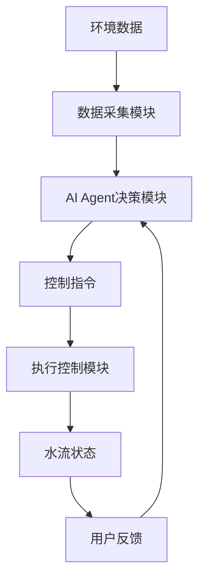
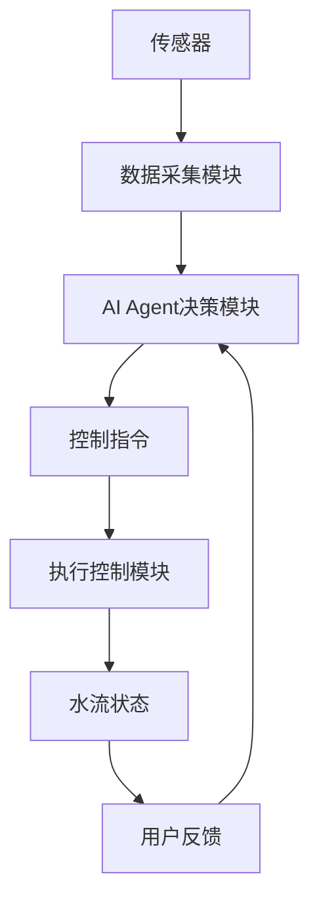
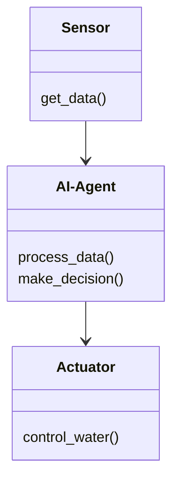
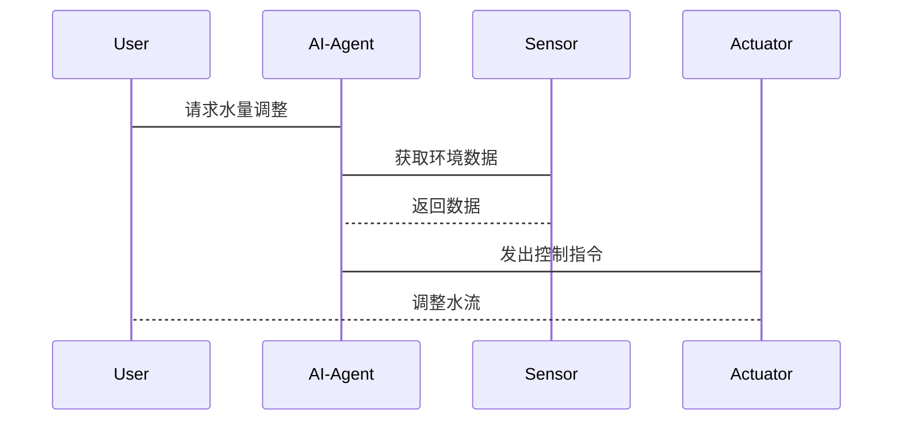

                 


# AI Agent在智能花洒中的水量控制

> 关键词：AI Agent，智能花洒，水量控制，传感器，机器学习，物联网，实时控制

> 摘要：本文详细探讨了AI Agent在智能花洒中的应用，重点分析了其在水量控制中的核心作用。通过背景介绍、核心概念、算法原理、系统架构、项目实战和最佳实践等多维度的深入分析，展示了AI Agent如何通过数据采集、智能决策和自动化控制来实现精准的水量管理。文章结合理论与实践，为智能花洒的设计与优化提供了有价值的参考。

---

# 第一部分: AI Agent与智能花洒的背景介绍

## 第1章: AI Agent的基本概念与应用背景

### 1.1 AI Agent的定义与特点

#### 1.1.1 AI Agent的定义
AI Agent（人工智能代理）是指能够感知环境、自主决策并执行任务的智能实体。它能够通过传感器获取信息，利用算法处理数据，并通过执行器完成特定目标。

#### 1.1.2 AI Agent的核心特点
- **自主性**：AI Agent能够自主决策，无需外部干预。
- **反应性**：能够实时感知环境变化并做出反应。
- **智能性**：通过学习和优化提升决策能力。
- **协作性**：能够与其他系统或用户协同工作。

#### 1.1.3 AI Agent与传统自动控制系统的区别
传统控制系统依赖预设规则，而AI Agent能够通过学习和适应环境动态调整策略。例如，传统花洒可能基于固定时间或用户输入开关，而AI Agent能够根据实时数据（如天气、用户习惯）动态调整出水情况。

### 1.2 智能花洒的工作原理

#### 1.2.1 花洒的基本功能与结构
花洒的基本功能是通过开关控制水流。传统花洒仅支持手动或定时开关，而智能花洒则集成了传感器、控制器和用户交互模块，能够实现智能化控制。

#### 1.2.2 智能花洒的定义与应用场景
智能花洒是一种结合了物联网和AI技术的智能设备，能够通过传感器感知环境数据（如温度、湿度、光照）和用户行为，结合AI算法实现智能控制。

#### 1.2.3 智能花洒与传统花洒的主要区别
- **智能化控制**：智能花洒能够根据环境和用户需求自动调节水流。
- **数据驱动**：通过传感器和数据处理实现精准控制。
- **远程控制**：用户可以通过手机APP或其他设备远程控制花洒。

### 1.3 AI Agent在智能花洒中的应用价值

#### 1.3.1 提高用水效率的意义
AI Agent能够根据实际需求智能调整水流，避免水资源浪费，提升用水效率。

#### 1.3.2 节能环保的重要性
通过优化水量控制，智能花洒能够减少水资源浪费，降低能源消耗，符合绿色发展的理念。

#### 1.3.3 用户体验的提升
AI Agent能够根据用户习惯和环境变化提供个性化服务，提升用户体验，例如自动启动或关闭花洒。

---

## 第2章: AI Agent与智能花洒的结合意义

### 2.1 AI Agent在智能花洒中的核心作用

#### 2.1.1 数据采集与分析
AI Agent通过传感器采集环境数据（如温度、湿度、光照）和用户行为数据，利用机器学习算法进行分析。

#### 2.1.2 自动化控制
AI Agent能够根据分析结果，通过控制器调整花洒的出水状态，实现自动化控制。

#### 2.1.3 智能决策
AI Agent能够基于实时数据和历史数据，优化决策策略，例如在干旱天气减少水流。

### 2.2 AI Agent在水量控制中的具体应用

#### 2.2.1 实时水量调节
AI Agent能够根据土壤湿度和天气预报动态调整出水量，避免过量浇水或不足。

#### 2.2.2 用户行为分析
通过分析用户的使用习惯，AI Agent能够预测用户的用水需求，提供个性化的服务。

#### 2.2.3 环境因素的智能适应
AI Agent能够根据环境变化（如温度、湿度）调整出水量，例如在高温天气增加出水量。

### 2.3 智能花洒AI Agent系统的边界与外延

#### 2.3.1 系统边界
智能花洒AI Agent系统的核心部分包括传感器、控制器、数据处理模块和用户交互模块。边界之外的部分（如外部网络）属于扩展功能。

#### 2.3.2 外延与扩展功能
- **远程控制**：通过手机APP或其他设备远程控制花洒。
- **数据存储与分析**：记录用水数据，提供历史分析和优化建议。
- **多设备协同**：与其他智能家居设备协同工作，例如与智能灯泡联动。

#### 2.3.3 系统与外部环境的交互
AI Agent通过传感器与环境交互，通过用户界面与用户交互，通过网络与外部系统交互。

---

## 第3章: 智能花洒AI Agent系统的概念结构与核心要素

### 3.1 系统概念结构

#### 3.1.1 系统组成模块
- **数据采集模块**：包括温度传感器、湿度传感器、光照传感器等。
- **AI Agent决策模块**：负责数据处理、模型训练和决策。
- **执行控制模块**：通过电机或阀门控制水流。
- **用户交互模块**：包括按钮、LED显示屏和手机APP。

#### 3.1.2 模块之间的关系
数据采集模块将环境数据传递给AI Agent决策模块，决策模块根据数据生成控制指令，通过执行控制模块调整水流状态。用户交互模块用于人机交互，提供反馈和控制指令。

#### 3.1.3 系统整体架构
系统整体架构分为感知层、决策层和执行层。感知层负责数据采集，决策层负责数据处理和决策，执行层负责实际操作。

### 3.2 核心要素分析

#### 3.2.1 数据采集模块
数据采集模块通过多种传感器获取环境数据，例如温度传感器测量土壤温度，湿度传感器测量土壤湿度。

#### 3.2.2 AI Agent决策模块
AI Agent决策模块负责处理数据，训练模型，生成控制指令。例如，使用机器学习算法预测最佳出水量。

#### 3.2.3 执行控制模块
执行控制模块通过电机或阀门调整水流状态，例如打开或关闭阀门，调节水流大小。

#### 3.2.4 用户交互模块
用户交互模块包括按钮、LED显示屏和手机APP，用于用户与系统的交互。

### 3.3 系统核心要素的关联性分析

#### 3.3.1 数据流分析
数据从传感器流向AI Agent决策模块，决策模块生成控制指令，传递给执行控制模块。用户通过交互模块提供反馈或控制指令。

#### 3.3.2 功能模块的协同工作
传感器提供数据，AI Agent处理数据并生成决策，执行模块执行决策，用户通过交互模块与系统互动。

#### 3.3.3 系统整体流程图



---

## 第4章: AI Agent的核心原理与工作流程

### 4.1 AI Agent的基本原理

#### 4.1.1 感知层
AI Agent通过传感器感知环境数据，例如温度、湿度、光照等。

#### 4.1.2 决策层
AI Agent利用机器学习算法处理数据，训练模型，生成决策指令。

#### 4.1.3 执行层
AI Agent通过执行器（如阀门、电机）调整花洒的出水状态。

### 4.2 AI Agent在智能花洒中的工作流程

#### 4.2.1 数据采集
AI Agent通过传感器采集环境数据，例如土壤湿度、温度。

#### 4.2.2 数据处理
AI Agent将采集到的数据进行预处理，例如归一化、特征提取。

#### 4.2.3 模型训练
AI Agent利用机器学习算法（如回归模型、马尔可夫决策过程）训练模型，优化决策策略。

#### 4.2.4 决策与控制
AI Agent根据模型预测结果生成控制指令，调整花洒的出水状态。

#### 4.2.5 反馈与优化
系统根据实际效果提供反馈，AI Agent根据反馈优化模型和决策策略。

---

## 第5章: 智能花洒AI Agent系统的算法原理

### 5.1 算法选择与数学模型

#### 5.1.1 传感器数据的预处理
传感器数据需要进行去噪、归一化等预处理，确保数据质量。

#### 5.1.2 回归模型的建立
使用回归模型预测最佳出水量，例如：
$$ y = \beta_0 + \beta_1x_1 + \beta_2x_2 + \epsilon $$
其中，$y$为出水量，$x_1$为土壤湿度，$x_2$为温度。

#### 5.1.3 马尔可夫决策过程的应用
通过马尔可夫决策过程优化决策策略，例如：
$$ V(s) = \max_a \mathbb{E}[V(s') + r] $$

### 5.2 算法实现与代码示例

#### 5.2.1 数据采集与预处理
```python
import numpy as np
# 传感器数据
temperature = np.array([25, 26, 24, 25])  # 单位：摄氏度
humidity = np.array([60, 65, 58, 62])    # 单位：%
# 数据归一化
normalized_temperature = (temperature - np.mean(temperature)) / np.std(temperature)
normalized_humidity = (humidity - np.mean(humidity)) / np.std(humidity)
```

#### 5.2.2 模型训练
```python
from sklearn.linear_model import LinearRegression
X = np.column_stack((normalized_temperature, normalized_humidity))
y = np.array([0.5, 0.6, 0.4, 0.5])  # 出水量
model = LinearRegression()
model.fit(X, y)
```

#### 5.2.3 决策与控制
```python
# 预测出水量
new_temp = 24
new_hum = 60
new_temp_normalized = (new_temp - np.mean(temperature)) / np.std(temperature)
new_hum_normalized = (new_hum - np.mean(humidity)) / np.std(humidity)
predicted_flow = model.predict([[new_temp_normalized, new_hum_normalized]])
print(f"预测出水量为：{predicted_flow[0]:.2f}")
```

---

## 第6章: 智能花洒AI Agent系统的系统架构设计

### 6.1 系统整体架构



### 6.2 系统功能设计

#### 6.2.1 领域模型


#### 6.2.2 系统交互流程



---

## 第7章: 智能花洒AI Agent系统的项目实战

### 7.1 环境搭建

#### 7.1.1 硬件部分
- **传感器**：土壤湿度传感器、温度传感器。
- **执行器**：微型电机或电磁阀。
- **控制器**：ESP32或Arduino。

#### 7.1.2 软件部分
- **AI框架**：TensorFlow或Scikit-learn。
- **编程语言**：Python。
- **开发环境**：VS Code或PyCharm。

### 7.2 系统核心实现

#### 7.2.1 传感器数据采集
```python
import serial
ser = serial.Serial('COM3', 9600)
data = ser.readline().decode().strip()
```

#### 7.2.2 AI Agent决策模块
```python
from sklearn import linear_model
X = [[25, 60], [26, 65], [24, 58], [25, 62]]
y = [0.5, 0.6, 0.4, 0.5]
model = linear_model.LinearRegression()
model.fit(X, y)
```

#### 7.2.3 执行控制模块
```python
ser.write(b'0.5')  # 发送控制指令
```

### 7.3 案例分析

#### 7.3.1 数据采集与处理
传感器采集到温度为24摄氏度，湿度为60%，经过归一化处理后，输入模型预测出水量为0.5升/分钟。

#### 7.3.2 模型训练与优化
通过历史数据训练回归模型，预测出水量与实际值的误差逐步减小，模型性能提升。

#### 7.3.3 系统运行与反馈
系统根据预测出水量调整花洒，用户通过手机APP观察水流状态并提供反馈，系统根据反馈优化模型。

---

## 第8章: 智能花洒AI Agent系统的最佳实践

### 8.1 优化建议

#### 8.1.1 数据质量
确保传感器数据的准确性和实时性，减少噪声干扰。

#### 8.1.2 模型选择
根据实际需求选择合适的算法，例如使用更复杂的模型（如神经网络）提高预测精度。

#### 8.1.3 系统稳定性
增加冗余设计，确保系统在断网或传感器故障时能够正常运行。

### 8.2 小结

通过本文的详细分析，我们可以看到AI Agent在智能花洒中的应用前景广阔。AI Agent不仅能够提升用户体验，还能够实现资源的高效利用，符合绿色发展的趋势。

---

# 作者：AI天才研究院/AI Genius Institute & 禅与计算机程序设计艺术 /Zen And The Art of Computer Programming

---

**本文为AI天才研究院原创，转载请注明出处。**

