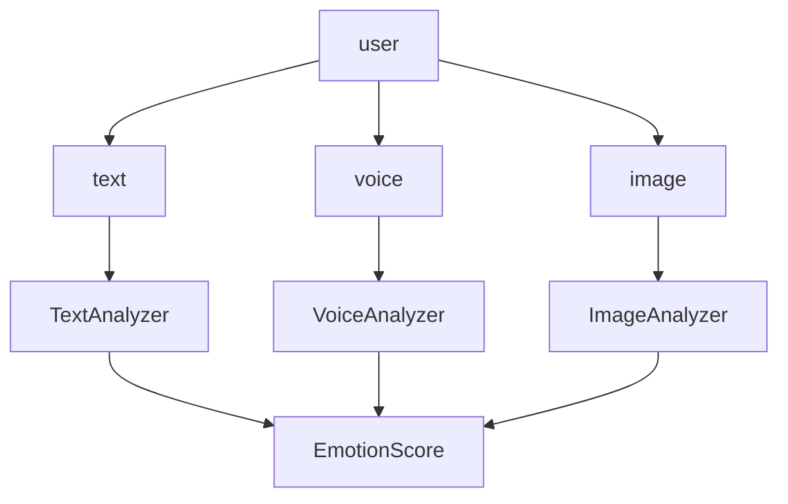
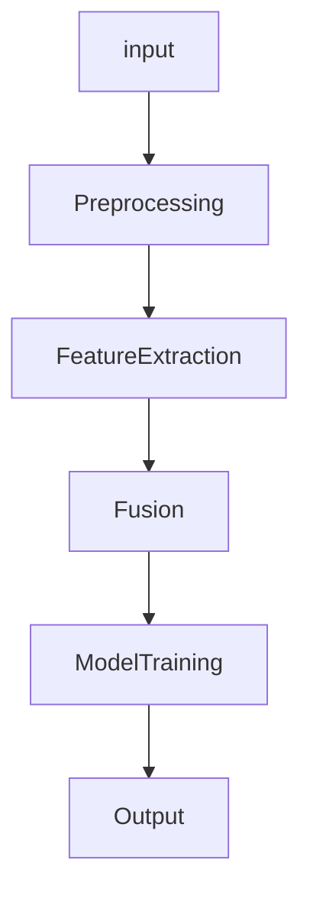
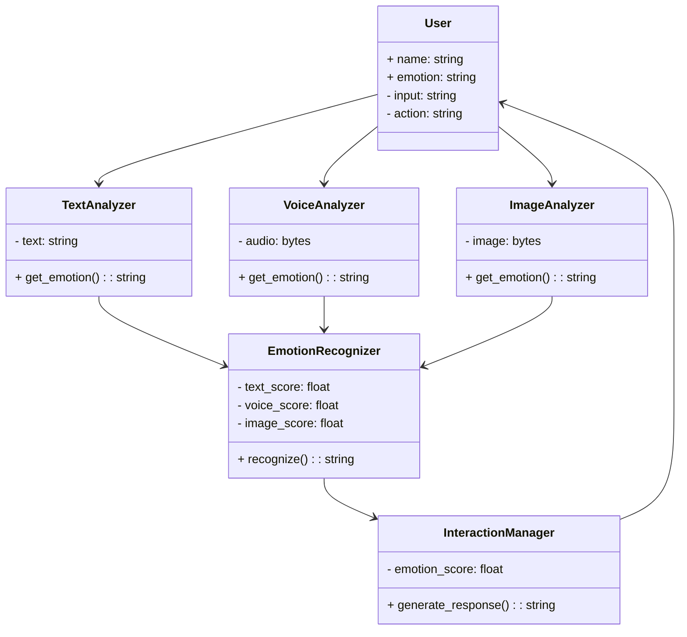
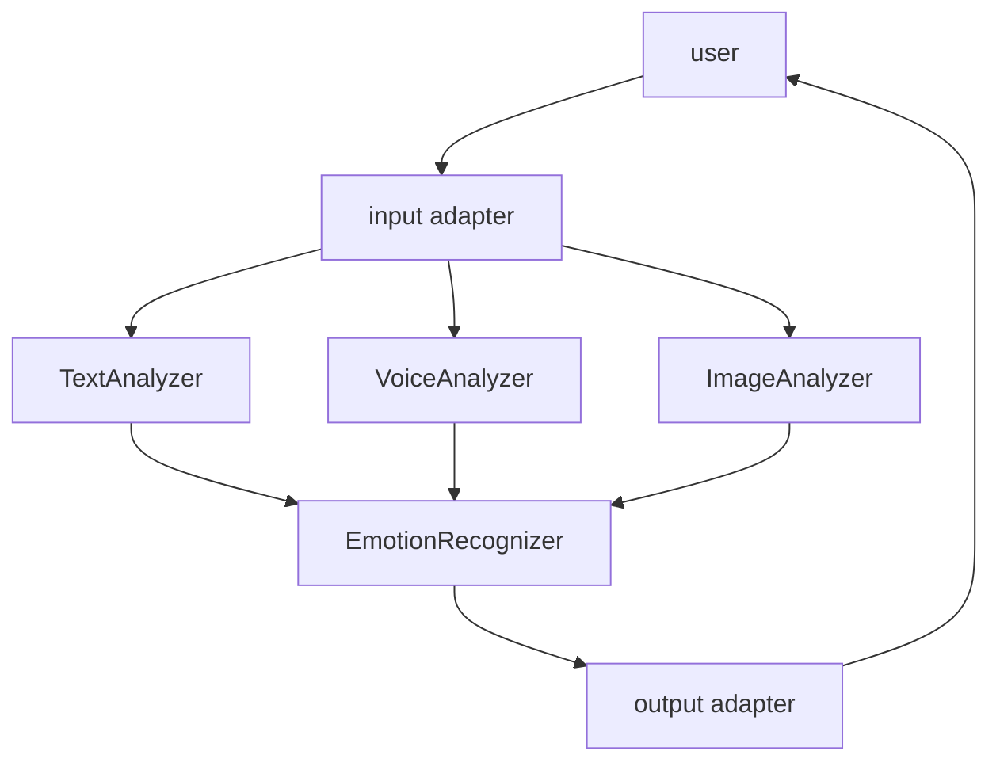
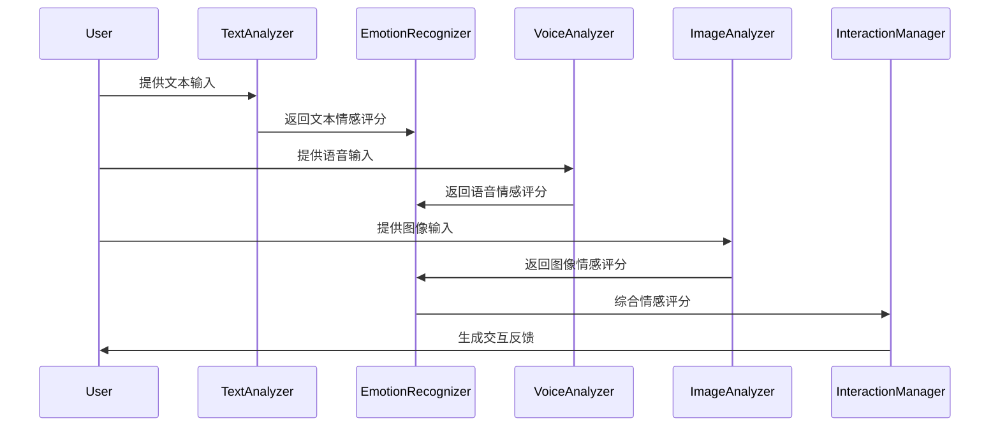

                 


---

# AI Agent的多模态情感交互系统设计

## 关键词：AI Agent、多模态、情感交互、系统设计、机器学习、深度学习

## 摘要：  
本文深入探讨了AI Agent在多模态情感交互系统中的设计与实现。通过分析多模态数据（如文本、语音、图像）的情感计算方法，结合深度学习技术，提出了一种高效的情感交互系统设计方案，为AI Agent在智能交互领域提供了理论支持与实践指导。

---

# 第一章: AI Agent与多模态情感交互系统概述

## 1.1 AI Agent的基本概念

### 1.1.1 AI Agent的定义与特点
AI Agent（人工智能代理）是指能够感知环境、自主决策并执行任务的智能实体。其特点包括：  
1. **自主性**：无需外部干预，自主完成任务。  
2. **反应性**：能够实时感知并响应环境变化。  
3. **目标导向**：基于目标驱动行为。  
4. **社会能力**：能够与人类或其他AI Agent进行交互协作。  

### 1.1.2 多模态交互的必要性
传统单模态交互（如文本或语音）存在信息缺失的问题，多模态交互通过整合多种信息源（如文本、语音、图像）提升交互的准确性和自然性。  

### 1.1.3 情感交互的核心目标
情感交互旨在理解并模拟人类情感，使AI Agent能够更自然地与人类进行情感共鸣，提升用户体验。  

## 1.2 多模态情感交互系统的背景与意义

### 1.2.1 多模态数据的定义与类型
多模态数据包括文本、语音、图像等多种信息形式。  

| 数据类型 | 特点 | 应用场景 |  
|----------|------|----------|  
| 文本     | 结构化、可分析 | 情感分析、意图识别 |  
| 语音     | 表达情感丰富 | 语音识别、语调分析 |  
| 图像     | 信息量大 | 面部表情识别、视觉辅助 |  

### 1.2.2 情感计算的起源与发展
情感计算起源于20世纪90年代，旨在通过计算方法分析和模拟人类情感。近年来，深度学习的兴起推动了情感计算的快速发展。  

### 1.2.3 多模态情感交互的应用场景
- **智能客服**：通过多模态交互提供更贴心的服务。  
- **教育辅助**：根据学生情绪调整教学策略。  
- **健康管理**：通过情感分析监测用户心理健康。  

## 1.3 本章小结  
本章介绍了AI Agent的基本概念、多模态交互的必要性以及情感交互的核心目标，为后续内容奠定了基础。

---

# 第二章: 多模态情感交互的核心概念与联系

## 2.1 多模态数据的特征分析

### 2.1.1 文本数据的特点
文本数据具有结构化、可分析的特点，但难以捕捉语调和情感深度。  

### 2.1.2 语音数据的特点
语音数据包含丰富的语调、语速和音量信息，能够传递强烈的情感信号。  

### 2.1.3 图像数据的特点
图像数据信息量大，但情感分析依赖于图像内容的理解。  

## 2.2 情感计算的原理与方法

### 2.2.1 基于规则的情感分析
通过预定义规则（如关键词匹配）进行情感分类，适用于简单场景。  

### 2.2.2 基于统计的情感计算
利用统计方法（如朴素贝叶斯）分析数据分布，适合处理小规模数据。  

### 2.2.3 深度学习的情感计算
通过神经网络（如LSTM、Transformer）学习数据特征，适用于大规模数据。  

## 2.3 多模态数据融合的挑战与优势

### 2.3.1 数据融合的挑战
- 数据异构性：不同模态数据格式差异大。  
- 信息冗余：多模态数据可能重复传递相同信息。  

### 2.3.2 多模态融合的优势
- 提高准确率：通过多源信息互补提升情感分析的准确性。  
- 增强鲁棒性：单一模态数据的不足可通过其他模态数据弥补。  

### 2.3.3 融合方法的对比分析
| 方法 | 优点 | 缺点 |  
|------|------|------|  
| 线性融合 | 简单易实现 | 易受模态权重影响 |  
| 注意力机制 | 自适应分配权重 | 实现复杂 |  
| 图神经网络 | 能处理复杂关系 | 计算资源需求高 |  

## 2.4 实体关系图与数据流图

### 实体关系图


### 数据流图


## 2.5 本章小结  
本章分析了多模态数据的特点，探讨了情感计算的多种方法，并对比了融合方法的优缺点，为后续系统设计提供了理论依据。

---

# 第三章: 多模态情感计算的算法原理

## 3.1 情感计算的基本算法

### 3.1.1 基于规则的分类算法
- **规则定义**：通过预定义关键词或语句判断情感倾向。  
- **实现步骤**：  
  1. 提取关键词。  
  2. 匹配规则，输出情感评分。  

### 3.1.2 基于统计的分类算法
- **算法选择**：常用朴素贝叶斯、支持向量机（SVM）。  
- **实现步骤**：  
  1. 数据预处理（分词、去停用词）。  
  2. 特征提取（TF-IDF）。  
  3. 训练模型，预测情感。  

### 3.1.3 基于深度学习的分类算法
- **模型选择**：常用LSTM、Transformer。  
- **实现步骤**：  
  1. 数据预处理（分词、编码）。  
  2. 构建模型，训练参数。  
  3. 预测情感，输出结果。  

## 3.2 多模态数据融合算法

### 3.2.1 线性融合方法
- **公式**：$$score = \alpha \cdot text\_score + \beta \cdot voice\_score + \gamma \cdot image\_score$$  
- **优点**：简单易实现。  
- **缺点**：权重需手动调整。  

### 3.2.2 注意力机制融合方法
- **原理**：通过自注意力机制分配各模态权重。  
- **公式**：$$\alpha_i = softmax(w_i^T x)$$  
- **优点**：自适应分配权重。  

### 3.2.3 图神经网络融合方法
- **原理**：构建图结构，通过图传播模型融合特征。  
- **公式**：$$h_i^{(l+1)} = \sigma(\sum_j A_{ij} h_j^{(l)})$$  
- **优点**：适合处理复杂关系。  

## 3.3 情感计算的数学模型

### 情感评分计算公式
$$
\text{emotional\_score} = \sum_{i=1}^n w_i \cdot f_i(x)
$$  
其中，$w_i$为模态权重，$f_i(x)$为对应模态的情感评分函数。  

## 3.4 本章小结  
本章详细讲解了情感计算的基本算法和多模态数据融合方法，并通过公式推导和对比分析，明确了不同方法的适用场景。

---

# 第四章: 多模态情感交互系统架构设计

## 4.1 问题场景介绍
设计一个支持多模态情感交互的AI Agent系统，目标是实现高精度的情感识别和自然的交互反馈。  

## 4.2 系统功能设计

### 领域模型（Mermaid类图）


## 4.3 系统架构设计（Mermaid架构图）


## 4.4 系统接口设计
- **输入接口**：接收文本、语音、图像输入。  
- **输出接口**：输出情感评分和交互反馈。  

## 4.5 系统交互流程（Mermaid序列图）


## 4.6 本章小结  
本章从系统架构的角度，详细设计了多模态情感交互系统，明确了各模块的功能和交互流程。

---

# 第五章: 多模态情感交互系统的实现

## 5.1 项目实战：系统实现

### 5.1.1 环境搭建
- **工具**：Python、TensorFlow、Keras、 librosa、OpenCV。  
- **依赖安装**：  
  ```bash
  pip install numpy pandas scikit-learn librosa tensorflow keras opencv-python
  ```

### 5.1.2 核心代码实现

#### 1. 文本分析模块
```python
import numpy as np
from sklearn.feature_extraction.text import TfidfVectorizer
from sklearn.naive_bayes import MultinomialNB

def text_preprocess(text):
    # 假设text为字符串，进行分词和去停用词处理
    return text.split()

def train_text_model(train_texts, train_labels):
    vectorizer = TfidfVectorizer()
    X = vectorizer.fit_transform(train_texts)
    model = MultinomialNB()
    model.fit(X, train_labels)
    return model, vectorizer

def predict_emotion(model, vectorizer, input_text):
    X = vectorizer.transform([input_text])
    return model.predict(X)[0]
```

#### 2. 语音分析模块
```python
import librosa

def extract_mfcc(audio_path):
    y, sr = librosa.load(audio_path, sr=16000)
    mfcc = librosa.feature.mfcc(y, sr=sr, n_mfcc=13)
    return mfcc.T

def train_voice_model(train_features, train_labels):
    from sklearn.svm import SVC
    model = SVC()
    model.fit(train_features, train_labels)
    return model

def predict_emotion(model, features):
    return model.predict(features)
```

#### 3. 图像分析模块
```python
import cv2
from tensorflow.keras.models import load_model

def extract_face_features(image_path):
    img = cv2.imread(image_path)
    gray = cv2.cvtColor(img, cv2.COLOR_BGR2GRAY)
    faceCascade = cv2.CascadeClassifier(cv2.data.haarcascades + 'haarcascade_frontalface_default.xml')
    faces = faceCascade.detectMultiScale(gray, 1.1, 4)
    if len(faces) == 0:
        return None
    (x, y, w, h) = faces[0]
    face_img = gray[y:y+h, x:x+w]
    face_img = cv2.resize(face_img, (100, 100))
    face_img = np.reshape(face_img, (1, 100, 100, 1))
    return face_img

def train_image_model(train_images, train_labels):
    model = load_model('emotion_model.h5')
    return model

def predict_emotion(model, image_path):
    features = extract_face_features(image_path)
    if features is None:
        return 'neutral'
    return model.predict(features)[0]
```

#### 4. 融合模块
```python
def fuse_emotions(text_score, voice_score, image_score):
    # 线性融合，权重分别为0.4、0.3、0.3
    final_score = 0.4 * text_score + 0.3 * voice_score + 0.3 * image_score
    if final_score > 0.6:
        return 'happy'
    elif final_score > 0.3:
        return 'neutral'
    else:
        return 'sad'
```

### 5.1.3 代码应用解读与分析
- **文本模块**：基于TF-IDF和朴素贝叶斯实现情感分类。  
- **语音模块**：提取MFCC特征，使用SVM进行分类。  
- **图像模块**：使用OpenCV检测面部表情，加载预训练模型进行分类。  
- **融合模块**：通过线性融合方法综合三种模态的情感评分，最终输出情感结果。  

### 5.1.4 案例分析
输入文本：“我今天很高兴。”  
输入语音：带有高音调和快速语速的音频。  
输入图像：面部表情为微笑。  
融合结果：情感为“happy”。  

## 5.2 本章小结  
本章通过具体实现，展示了多模态情感交互系统的核心代码和实现步骤，为读者提供了实践参考。

---

# 第六章: 优化与提升

## 6.1 模型优化策略

### 6.1.1 基于迁移学习的优化
- **领域适配**：将预训练模型迁移到特定领域任务。  
- **数据增强**：通过数据增强技术提升模型鲁棒性。  

### 6.1.2 基于超参数调优的优化
- **网格搜索**：通过网格搜索找到最佳超参数组合。  
- **贝叶斯优化**：使用贝叶斯方法高效优化超参数。  

## 6.2 系统性能优化

### 6.2.1 提升计算效率
- **并行计算**：利用多线程或分布式计算加速处理。  
- **缓存机制**：减少重复计算，提升数据访问速度。  

### 6.2.2 优化实时性
- **轻量化模型**：通过模型剪枝、知识蒸馏等技术降低计算开销。  
- **边缘计算**：将计算任务迁移到边缘设备，减少网络延迟。  

## 6.3 案例分析与优化效果

### 案例分析
- **案例1**：通过迁移学习提升图像模块的准确率。  
- **案例2**：通过超参数调优提高语音模块的分类效果。  

## 6.4 本章小结  
本章探讨了多模态情感交互系统的优化策略，通过具体案例分析展示了优化方法的有效性。

---

# 第七章: 总结与展望

## 7.1 全文总结
本文系统地探讨了AI Agent的多模态情感交互系统设计，从理论到实践，详细介绍了系统架构、算法实现和优化策略。  

## 7.2 未来展望
- **多模态数据的更深层次融合**：探索更复杂的融合方法，如基于图神经网络的多模态交互。  
- **情感计算的实时性优化**：通过边缘计算和轻量化模型提升实时性。  
- **跨文化情感交互**：研究不同文化背景下的情感表达差异，提升系统的普适性。  

## 7.3 本章小结  
本文总结了研究成果，并展望了未来的研究方向。

---

# 作者：AI天才研究院/AI Genius Institute & 禅与计算机程序设计艺术 /Zen And The Art of Computer Programming

