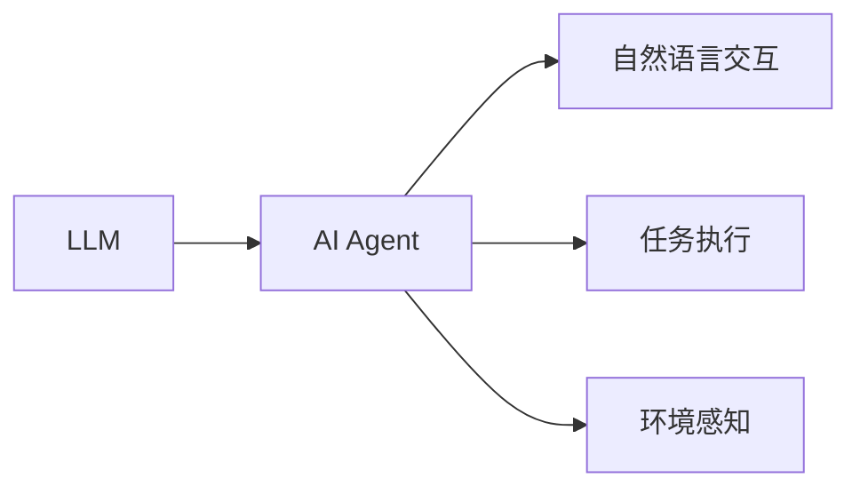
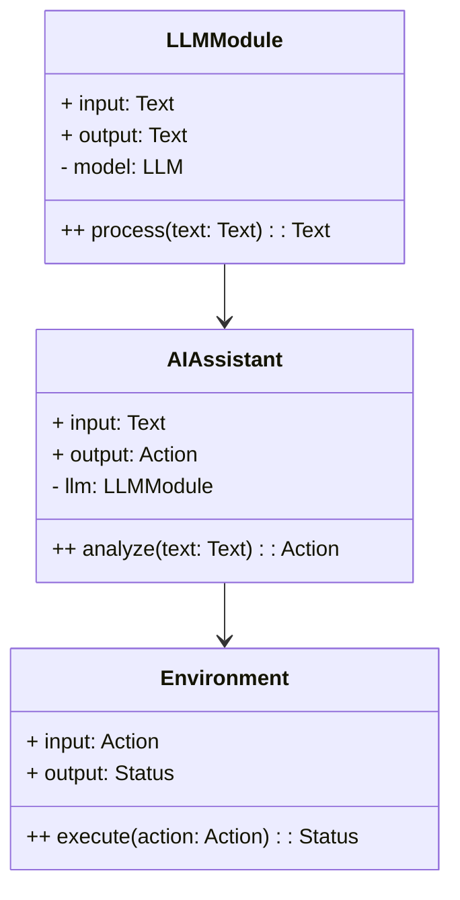
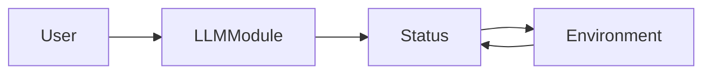
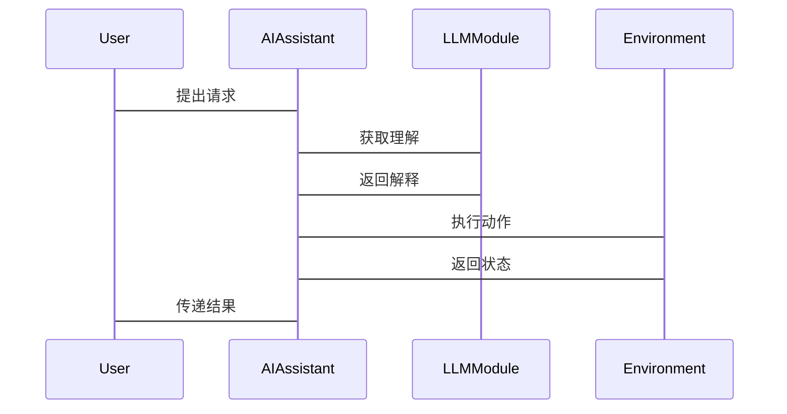

                 


# LLM在AI Agent抽象概念学习中的应用

## 关键词：大语言模型, AI Agent, 抽象概念学习, 算法原理, 系统架构, 项目实战

## 摘要：本文探讨了大语言模型（LLM）在AI Agent中的应用，分析了LLM与AI Agent的核心概念、算法原理及系统架构，并通过项目实战展示了LLM在AI Agent中的具体应用。文章还总结了最佳实践和未来研究方向，为读者提供了全面的视角。

---

# 第一部分: 背景介绍

## 第1章: LLM与AI Agent的基本概念

### 1.1 LLM的定义与特点

#### 1.1.1 大语言模型的定义
大语言模型（Large Language Model, LLM）是指基于深度学习的自然语言处理模型，具有大规模参数和丰富的语义理解能力。LLM通过大量文本数据的训练，能够生成自然流畅的文本，并在多种任务中表现出强大的理解与生成能力。

#### 1.1.2 LLM的核心特点
- **大规模参数**：通常拥有 billions 级别的参数，例如GPT-3有1750亿个参数。
- **预训练**：通过在大规模通用数据集上进行无监督预训练，模型能够学习语言的统计规律。
- **微调**：通过在特定任务数据集上进行有监督微调，模型能够适应具体应用场景的需求。
- **生成能力**：LLM能够生成高质量的文本，支持多种语言和多种任务。

#### 1.1.3 LLM与传统NLP模型的区别
- **传统NLP模型**：如SVM、朴素贝叶斯等，依赖特征工程，性能有限，难以处理复杂任务。
- **LLM**：基于深度学习的端到端模型，能够自动学习特征，处理复杂任务时表现更优。

### 1.2 AI Agent的定义与特点

#### 1.2.1 AI Agent的定义
AI Agent（人工智能代理）是指能够感知环境、自主决策并执行任务的智能实体。AI Agent可以是软件程序、机器人或其他智能系统，其核心能力包括感知、推理、规划和执行。

#### 1.2.2 AI Agent的核心特点
- **自主性**：能够在没有外部干预的情况下自主运行。
- **反应性**：能够实时感知环境并做出响应。
- **目标导向**：基于明确的目标进行决策和行动。
- **学习能力**：通过经验或数据不断优化自身性能。

#### 1.2.3 AI Agent与传统AI的区别
- **传统AI**：基于规则或专家系统，依赖人工编程的规则，缺乏自主性和适应性。
- **AI Agent**：具有自主决策能力，能够根据环境动态调整行为，具备更强的适应性和灵活性。

### 1.3 LLM与AI Agent的关系

#### 1.3.1 LLM在AI Agent中的作用
LLM作为AI Agent的核心组件，负责处理自然语言理解、生成和推理任务。AI Agent可以通过LLM实现与用户的自然语言交互，理解意图并生成回应。

#### 1.3.2 LLM与AI Agent的结合方式
- **直接集成**：将LLM作为AI Agent的自然语言处理模块，用于理解和生成文本。
- **增强决策**：LLM可以辅助AI Agent进行决策推理，提供多语言支持和上下文理解。
- **知识增强**：通过LLM的知识库，AI Agent能够获取丰富的背景信息，提升决策的准确性和全面性。

#### 1.3.3 LLM在AI Agent中的优势
- **强大的自然语言处理能力**：LLM能够理解和生成自然语言，支持多种语言和复杂对话。
- **通用性与可扩展性**：LLM可以在多种任务中复用，降低AI Agent的开发成本。
- **快速响应**：LLM通过预训练和微调，能够快速适应新任务，提升AI Agent的效率。

### 1.4 本章小结
本章介绍了LLM和AI Agent的基本概念和特点，并分析了它们之间的关系。通过对比传统AI和AI Agent，突出了LLM在AI Agent中的重要性及其带来的优势。

---

# 第二部分: LLM在AI Agent中的核心概念与联系

## 第2章: LLM与AI Agent的核心概念

### 2.1 LLM的核心概念原理

#### 2.1.1 LLM的训练原理
- **预训练**：基于大规模文本数据的无监督学习，目标是让模型预测上下文中的词，如BERT的Masked LM任务。
- **微调**：在特定任务上使用有标签数据进行有监督训练，如文本分类、问答系统等。

#### 2.1.2 LLM的推理机制
- **编码器**：将输入文本转换为向量表示，提取文本的语义信息。
- **解码器**：根据编码器的输出生成目标文本，如生成回答或摘要。

#### 2.1.3 LLM的注意力机制
- **自注意力机制**：模型能够关注输入文本中不同位置的重要性，提升语义理解和生成能力。
- **全局注意力**：考虑所有位置的信息，增强长距离依赖关系的理解。

### 2.2 AI Agent的核心概念原理

#### 2.2.1 AI Agent的感知与决策
- **感知**：通过传感器或API获取环境信息，如用户输入、环境状态等。
- **决策**：基于感知信息，结合内部知识库和推理能力，生成行动计划。

#### 2.2.2 AI Agent的规划与执行
- **规划**：根据目标和环境信息，生成可行的行动计划。
- **执行**：按照规划的步骤执行动作，如调用API、发送消息等。

#### 2.2.3 AI Agent的自适应能力
- **学习与优化**：通过与环境的交互，不断优化自身的决策策略和知识库。
- **动态调整**：根据环境变化和用户反馈，实时调整行为策略。

### 2.3 LLM与AI Agent的核心概念对比

#### 2.3.1 概念属性特征对比表格

| 概念       | LLM                     | AI Agent                  |
|------------|--------------------------|---------------------------|
| 核心任务    | 自然语言处理             | 感知、决策、执行          |
| 输入输出    | 文本输入，文本输出       | 环境输入，动作输出        |
| 自主性      | 依赖外部调用             | 高度自主                  |
| 目标导向    | 非目标导向               | 目标导向                  |
| 适应性      | 通过微调增强             | 内在学习机制              |

#### 2.3.2 ER实体关系图架构


### 2.4 本章小结
本章从核心概念的角度分析了LLM和AI Agent的特点，并通过对比表格和ER图展示了它们之间的关系。LLM作为AI Agent的重要组成部分，为其实现自然语言交互和任务执行提供了强大的支持。

---

# 第三部分: LLM在AI Agent中的算法原理

## 第3章: LLM的算法原理

### 3.1 LLM的训练流程

#### 3.1.1 数据预处理
- **清洗数据**：去除噪声数据，如特殊字符、停用词等。
- **分词处理**：将文本分割成词或短语，便于模型处理。
- **数据增强**：通过同义词替换、句式变化等方式扩展数据集。

#### 3.1.2 模型训练
- **选择模型架构**：如Transformer、BERT等。
- **设置超参数**：如学习率、批次大小、训练轮数等。
- **训练过程**：通过反向传播和优化器（如Adam）更新模型参数，最小化损失函数。

#### 3.1.3 模型评估
- **评估指标**：如准确率、BLEU分数、ROUGE分数等。
- **验证集测试**：在验证集上评估模型的性能，调整超参数。

### 3.2 LLM的推理流程

#### 3.2.1 输入处理
- **文本标准化**：将输入文本转换为统一格式，如去除多余空格、统一编码等。
- **分词与编码**：将输入文本分词，并转换为模型可处理的向量表示。

#### 3.2.2 解码过程
- **生成策略**：如贪心解码、随机采样、Top-k采样等。
- **注意力机制**：在解码过程中，模型关注输入文本的不同位置，生成相关性更高的输出。

#### 3.2.3 输出生成
- **文本解码**：将模型生成的向量表示解码为人类可读的文本。
- **结果优化**：通过后处理优化生成文本的质量，如去除重复字符、调整语序等。

### 3.3 LLM的数学模型与公式

#### 3.3.1 概率分布公式
$$ P(y|x) = \frac{\exp(h(y|x))}{\sum_{y'} \exp(h(y'|x))} $$
其中，\( h(y|x) \) 是模型对词 \( y \) 在输入 \( x \) 下的得分。

#### 3.3.2 注意力机制公式
$$ \text{Attention}(Q, K, V) = \text{softmax}\left(\frac{QK^T}{\sqrt{d_k}}\right)V $$
其中，\( Q \) 是查询向量，\( K \) 是键向量，\( V \) 是值向量，\( d_k \) 是向量维度。

#### 3.3.3 损失函数公式
$$ \text{Loss} = -\sum_{i=1}^{n} \log P(y_i|x) $$
其中，\( y_i \) 是训练样本的标签，\( x \) 是输入文本。

### 3.4 代码实现与示例

#### 3.4.1 Python代码实现
```python
import torch
import torch.nn as nn

class LLMModel(nn.Module):
    def __init__(self, vocab_size, embedding_dim, hidden_dim):
        super().__init__()
        self.embedding = nn.Embedding(vocab_size, embedding_dim)
        self.lstm = nn.LSTM(embedding_dim, hidden_dim, batch_first=True)
        self.fc = nn.Linear(hidden_dim, vocab_size)

    def forward(self, input_ids):
        embed = self.embedding(input_ids)
        output, _ = self.lstm(embed)
        logits = self.fc(output)
        return logits

# 示例训练代码
model = LLMModel(vocab_size=10000, embedding_dim=256, hidden_dim=512)
criterion = nn.CrossEntropyLoss()
optimizer = torch.optim.Adam(model.parameters(), lr=0.001)
```

#### 3.4.2 示例场景分析
假设我们有一个简单的文本生成任务，模型需要根据输入的开头生成一个完整的句子。通过上述代码，我们可以训练一个基本的LLM模型，并在验证集上评估其生成能力。

### 3.5 本章小结
本章详细讲解了LLM的训练和推理流程，并通过数学公式和代码示例展示了其算法原理。理解这些原理对于开发和优化AI Agent中的LLM模块至关重要。

---

# 第四部分: AI Agent的系统分析与架构设计

## 第4章: AI Agent的系统功能设计

### 4.1 问题场景介绍
AI Agent需要在复杂多变的环境中执行任务，例如智能客服、智能家居控制、自动驾驶等。在这些场景中，AI Agent需要通过自然语言交互与用户沟通，理解用户需求，并执行相应的动作。

### 4.2 系统功能设计

#### 4.2.1 领域模型设计


### 4.3 系统架构设计

#### 4.3.1 系统架构图


#### 4.3.2 接口设计
- **输入接口**：接收用户的自然语言输入，传递给LLM模块。
- **输出接口**：将AI Assistant的决策结果传递给环境执行。
- **状态反馈接口**：环境执行后的状态反馈给AI Assistant，用于后续决策。

#### 4.3.3 交互流程


### 4.4 本章小结
本章通过领域模型和系统架构图展示了AI Agent的系统功能设计，强调了LLM模块在系统中的重要性，并通过交互流程图说明了系统的运行机制。

---

# 第五部分: 项目实战

## 第5章: 项目实战

### 5.1 环境安装与配置

#### 5.1.1 安装依赖
```bash
pip install torch transformers
```

#### 5.1.2 配置运行环境
- **GPU支持**：确保安装了NVIDIA GPU驱动和CUDA toolkit。
- **PyTorch配置**：设置PyTorch使用GPU进行加速。

### 5.2 核心代码实现

#### 5.2.1 LLM模块实现
```python
from transformers import GPT2LMHeadModel, GPT2Tokenizer

model_name = 'gpt2'
tokenizer = GPT2Tokenizer.from_pretrained(model_name)
model = GPT2LMHeadModel.from_pretrained(model_name)
```

#### 5.2.2 AI Agent实现
```python
class AIAssistant:
    def __init__(self, llm_model):
        self.llm = llm_model

    def process_request(self, user_input):
        # 使用LLM进行解析
        inputs = self.llm.tokenizer(user_input, return_tensors='np')
        outputs = self.llm.model.generate(**inputs, max_length=100)
        response = self.llm.tokenizer.decode(outputs[0])
        return response
```

### 5.3 代码解读与分析

#### 5.3.1 LLM模块
- **Tokenizer**：将输入文本转换为模型可处理的格式。
- **Model**：加载预训练的LLM模型，用于生成文本。

#### 5.3.2 AI Assistant
- **初始化**：加载LLM模块，准备处理用户请求。
- **请求处理**：接收用户输入，调用LLM模块生成响应。

### 5.4 实际案例分析

#### 5.4.1 案例1：智能客服
- **用户输入**：我遇到了登录问题。
- **LLM解析**：识别问题类型为登录问题。
- **生成响应**：提供解决方案，如检查密码是否正确。

#### 5.4.2 案例2：智能家居控制
- **用户输入**：帮我关灯。
- **LLM解析**：识别指令为关闭灯光。
- **执行动作**：调用智能家居API，关闭指定设备。

### 5.5 项目总结
通过本项目，我们展示了如何将LLM集成到AI Agent中，实现自然语言交互和任务执行。代码示例提供了实际的实现思路，读者可以根据具体需求进行扩展和优化。

### 5.6 本章小结
本章通过具体的项目实战，展示了LLM在AI Agent中的应用。通过环境配置和代码实现，读者可以了解如何将理论应用于实践。

---

# 第六部分: 最佳实践

## 第6章: 最佳实践

### 6.1 小结
- LLM为AI Agent提供了强大的自然语言处理能力，是实现智能化交互的关键技术。
- 通过合理的系统设计和算法优化，可以充分发挥LLM的优势。

### 6.2 注意事项
- **数据隐私**：处理用户数据时，需注意隐私保护，遵循相关法律法规。
- **模型性能**：根据具体任务选择合适的模型和参数配置，避免过度消耗资源。
- **用户体验**：确保生成的文本自然流畅，符合用户期望。

### 6.3 未来研究方向
- **多模态LLM**：结合视觉、听觉等多模态信息，提升AI Agent的感知能力。
- **动态自适应LLM**：研究模型的动态调整方法，增强其在复杂环境中的适应性。
- **伦理与安全**：关注LLM在AI Agent中的伦理问题，确保技术的健康发展。

### 6.4 拓展阅读
- **论文推荐**：《The Pretrained Transformer for Text Generation》。
- **工具推荐**：Hugging Face的Transformers库，提供丰富的LLM模型和工具。
- **社区推荐**：参与开源AI Agent项目，如Rasa、Snips，学习和贡献代码。

### 6.5 本章小结
本章总结了LLM在AI Agent中的应用经验，提出了注意事项和未来研究方向，为读者提供了宝贵的指导。

---

# 结语

通过对LLM在AI Agent中的应用分析，我们不仅了解了其核心概念和算法原理，还通过项目实战掌握了其实现方法。未来，随着技术的不断发展，LLM在AI Agent中的应用将更加广泛和深入，为人工智能领域带来更多创新和突破。

---

# 作者：AI天才研究院 & 禅与计算机程序设计艺术

