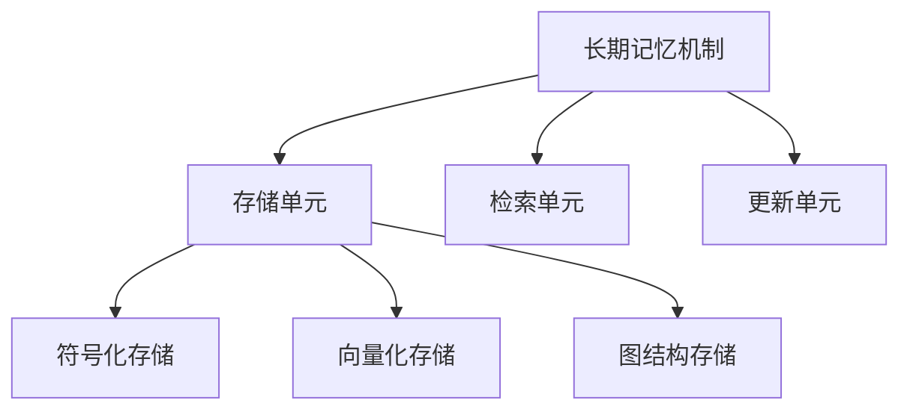
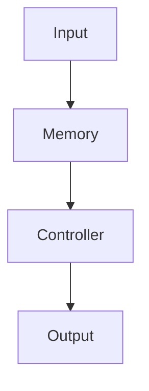
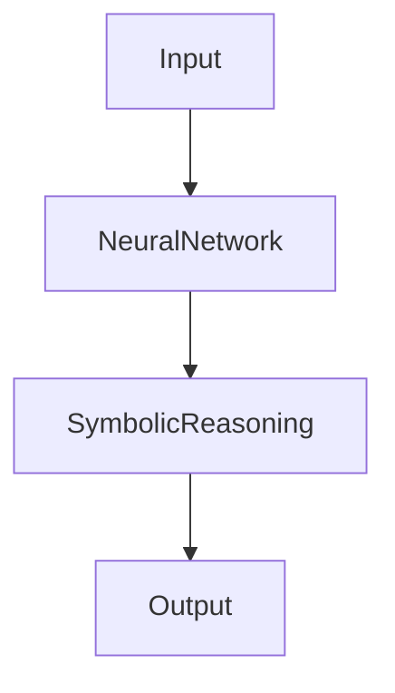
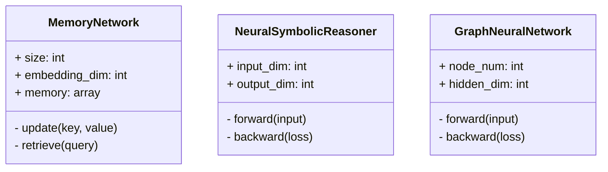
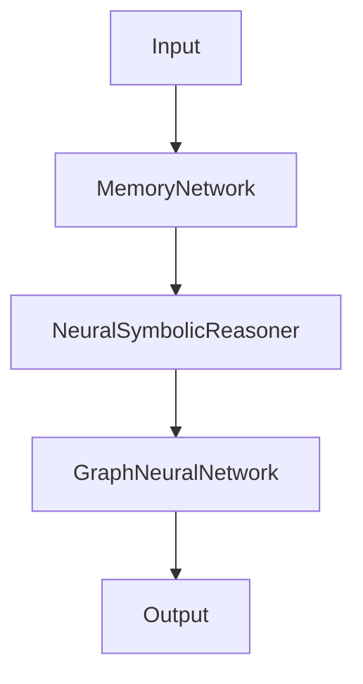
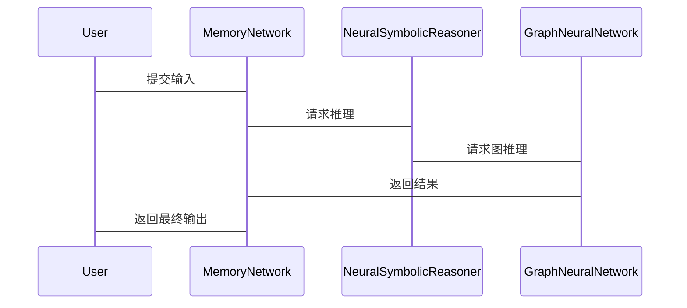

                 


# 从零构建AI Agent的长期记忆机制

> 关键词：长期记忆机制，AI Agent，记忆网络，神经符号推理，图神经网络

> 摘要：  
本文系统地探讨了AI Agent的长期记忆机制的构建方法，从背景介绍、核心概念、算法原理到系统设计和项目实战，全面解析了如何实现AI Agent的持续学习与记忆能力。通过结合记忆网络、神经符号推理和图神经网络等技术，本文为AI Agent的设计与实现提供了理论基础和实践指导。

---

# 第一部分: AI Agent与长期记忆机制的背景介绍

## 第1章: 背景与问题背景

### 1.1 长期记忆机制的定义与重要性

#### 1.1.1 长期记忆机制的定义  
长期记忆机制（Long-term Memory Mechanism）是指AI Agent能够持续存储、检索和更新知识的能力，是实现智能体持续学习和自适应能力的核心模块。它通过存储关键信息，帮助AI Agent在不同任务和时间跨度中保持一致性。

#### 1.1.2 长期记忆机制在AI Agent中的重要性  
长期记忆机制使AI Agent能够：  
- **保持一致性**：在多轮对话或任务中，AI Agent能够记住先前的信息，确保行为的连贯性。  
- **持续学习**：通过存储经验，AI Agent可以逐步优化其决策能力。  
- **处理复杂任务**：在复杂场景中，长期记忆机制能够帮助AI Agent协调不同任务之间的信息。

#### 1.1.3 长期记忆机制的核心目标与应用场景  
- **核心目标**：实现信息的持久化存储、高效检索和灵活更新。  
- **应用场景**：智能对话系统、自动驾驶、机器人控制、推荐系统等。

### 1.2 问题背景与问题描述

#### 1.2.1 当前AI Agent面临的挑战  
- **信息遗忘**：传统AI模型在处理新任务时容易遗忘旧信息。  
- **信息碎片化**：难以整合多源异构数据。  
- **动态环境适应**：在动态环境中，AI Agent需要快速调整其记忆内容。

#### 1.2.2 长期记忆机制的必要性  
通过引入长期记忆机制，AI Agent能够更好地处理复杂任务，提升其智能性和适应性。

#### 1.2.3 问题边界与外延  
- **边界**：专注于信息存储、检索和更新的机制设计。  
- **外延**：涉及数据结构、算法设计、系统架构等多个领域。

### 1.3 核心概念与组成

#### 1.3.1 长期记忆机制的核心要素  
- **存储单元**：用于存储信息的结构化数据。  
- **检索单元**：基于查询条件检索相关信息。  
- **更新单元**：根据新信息更新存储内容。  

#### 1.3.2 相关概念对比分析  
| 概念 | 描述 | 优缺点 |  
|------|------|--------|  
| 短时记忆 | 临时存储信息 | 易丢失，适合快速处理 |  
| 长期记忆 | 持久存储信息 | 需要复杂机制支持 |  
| 瞬时记忆 | 瞬间存储信息 | 仅用于感觉输入 |  

#### 1.3.3 系统架构与组成模块  
- **输入模块**：接收外部输入信息。  
- **存储模块**：存储信息。  
- **检索模块**：根据查询条件检索信息。  
- **更新模块**：根据新信息更新存储内容。  

---

## 第2章: 核心概念与联系

### 2.1 长期记忆机制的原理

#### 2.1.1 记忆存储的结构与模型  
- **符号化存储**：将信息表示为符号或规则。  
- **向量化存储**：将信息表示为向量或嵌入。  
- **图结构存储**：将信息表示为图结构。  

#### 2.1.2 记忆检索的机制与方法  
- **基于关键词检索**：根据关键词匹配相关记忆。  
- **基于相似度检索**：根据向量相似度匹配相关记忆。  
- **基于上下文检索**：根据上下文信息检索相关记忆。  

#### 2.1.3 记忆更新的策略与算法  
- **增量更新**：逐步更新存储内容。  
- **批量更新**：定期批量更新存储内容。  
- **动态更新**：根据实时信息动态更新存储内容。  

### 2.2 核心概念对比与分析

#### 2.2.1 实体关系图（ER图）分析  


#### 2.2.2 比较表格  
| 概念 | 符号化存储 | 向量化存储 | 图结构存储 |  
|------|------------|------------|------------|  
| 优缺点 | 易理解，适合规则推理 | 高维向量，适合相似度计算 | 结构化，适合复杂关系 |  

---

# 第二部分: 长期记忆机制的算法原理

## 第3章: 算法原理与实现

### 3.1 基于记忆网络的算法

#### 3.1.1 记忆网络的基本结构  


#### 3.1.2 记忆网络的更新与检索流程  
1. **输入处理**：将输入信息转换为向量。  
2. **记忆检索**：根据向量检索相关记忆。  
3. **记忆更新**：根据新信息更新存储内容。  
4. **输出生成**：基于检索和更新结果生成输出。  

#### 3.1.3 实现代码示例  
```python
class MemoryNetwork:
    def __init__(self, size, embedding_dim):
        self.size = size
        self.embedding_dim = embedding_dim
        self.memory = np.zeros((size, embedding_dim))
    
    def update(self, key, value):
        # 假设key是向量，value是新值
        self.memory[key] = value
    
    def retrieve(self, query):
        # 假设query是向量，返回最相似的记忆
        similarity = np.dot(self.memory, query)
        return self.memory[np.argmax(similarity)]
```

### 3.2 端到端神经符号推理

#### 3.2.1 神经符号推理的基本原理  
神经符号推理（Neural-symbolic Reasoning）结合了神经网络的感知能力和符号推理的逻辑推理能力。其核心是将符号规则嵌入到神经网络中，实现端到端的学习与推理。

#### 3.2.2 端到端推理的实现方法  


#### 3.2.3 实现代码示例  
```python
class NeuralSymbolicReasoner:
    def __init__(self, input_dim, output_dim):
        self.input_dim = input_dim
        self.output_dim = output_dim
        self.neural_network = NeuralNetwork(input_dim, output_dim)
    
    def forward(self, input):
        output = self.neural_network(input)
        return output
    
    def backward(self, loss):
        self.neural_network.backward(loss)
```

### 3.3 图神经网络的应用

#### 3.3.1 图神经网络的基本概念  
图神经网络（Graph Neural Network, GNN）是一种处理图结构数据的深度学习模型。其核心是通过聚合节点及其邻居的信息，生成节点表示。

#### 3.3.2 在记忆机制中的应用  
图神经网络可以用于构建图结构记忆，通过节点间的关联关系，实现高效的信息检索与更新。

#### 3.3.3 实现代码示例  
```python
class GraphNeuralNetwork:
    def __init__(self, node_num, hidden_dim):
        self.node_num = node_num
        self.hidden_dim = hidden_dim
        self.A = np.random.randn(node_num, node_num)
    
    def forward(self, input):
        # 假设A是邻接矩阵，input是输入
        output = np.matmul(input, self.A)
        return output
    
    def backward(self, loss):
        # 反向传播实现
        pass
```

### 3.4 数学模型与公式

#### 3.4.1 记忆网络的数学模型  
$$ \text{相似度} = \frac{\vec{q} \cdot \vec{m}}{||\vec{q}|| \cdot ||\vec{m}||} $$  

其中，$\vec{q}$ 是查询向量，$\vec{m}$ 是记忆向量。

#### 3.4.2 神经符号推理的公式  
$$ y = f(x; \theta) + r(f(x; \theta)) $$  

其中，$f(x; \theta)$ 是神经网络的输出，$r$ 是符号规则的函数。

#### 3.4.3 图神经网络的公式  
$$ h_i^{(l+1)} = \sigma(\sum_{j} A_{ij} h_j^{(l)}) $$  

其中，$h_i^{(l)}$ 是第$l$层第$i$个节点的表示，$\sigma$ 是激活函数。

---

## 第4章: 系统分析与架构设计

### 4.1 系统功能设计

#### 4.1.1 领域模型类图  


#### 4.1.2 系统架构设计  


#### 4.1.3 接口设计  
- **输入接口**：接受外部输入数据。  
- **输出接口**：返回处理结果。  
- **存储接口**：与存储模块交互。  

#### 4.1.4 交互序列图  


---

## 第5章: 项目实战

### 5.1 环境安装与配置

#### 5.1.1 安装依赖  
```bash
pip install numpy
pip install matplotlib
pip install scikit-learn
```

#### 5.1.2 配置环境  
- 确保安装Python 3.8以上版本。  
- 安装必要的深度学习框架（如TensorFlow或PyTorch）。  

### 5.2 核心代码实现

#### 5.2.1 记忆网络实现  
```python
import numpy as np

class MemoryNetwork:
    def __init__(self, size, embedding_dim):
        self.size = size
        self.embedding_dim = embedding_dim
        self.memory = np.zeros((size, embedding_dim))
    
    def update(self, key, value):
        self.memory[key] = value
    
    def retrieve(self, query):
        similarity = np.dot(self.memory, query)
        return self.memory[np.argmax(similarity)]
```

#### 5.2.2 神经符号推理实现  
```python
class NeuralSymbolicReasoner:
    def __init__(self, input_dim, output_dim):
        self.input_dim = input_dim
        self.output_dim = output_dim
        self.weights = np.random.randn(input_dim, output_dim)
    
    def forward(self, input):
        return np.dot(input, self.weights)
    
    def backward(self, loss):
        # 简单的反向传播实现
        pass
```

#### 5.2.3 图神经网络实现  
```python
class GraphNeuralNetwork:
    def __init__(self, node_num, hidden_dim):
        self.node_num = node_num
        self.hidden_dim = hidden_dim
        self.A = np.random.randn(node_num, node_num)
    
    def forward(self, input):
        return np.matmul(input, self.A)
```

### 5.3 代码解读与分析

#### 5.3.1 记忆网络代码解读  
- **初始化**：创建存储向量。  
- **更新**：根据键值对更新存储内容。  
- **检索**：计算相似度，返回最相似的记忆。  

#### 5.3.2 神经符号推理代码解读  
- **初始化**：随机初始化权重矩阵。  
- **前向传播**：计算输出。  
- **反向传播**：简单实现，实际应用中需要更复杂的梯度计算。  

### 5.4 实际案例分析

#### 5.4.1 数据准备  
- **输入数据**：随机生成向量。  
- **标签数据**：根据规则生成标签。  

#### 5.4.2 模型训练  
- **训练数据**：输入-输出对。  
- **训练过程**：不断更新模型参数。  

#### 5.4.3 模型推理  
- **输入处理**：将输入向量化。  
- **记忆检索**：基于向量检索记忆。  
- **结果生成**：结合检索结果生成输出。  

---

## 第6章: 总结与展望

### 6.1 最佳实践 tips  
- **数据质量**：确保训练数据的多样性和代表性。  
- **模型选择**：根据任务需求选择合适的算法。  
- **性能优化**：通过并行计算和优化算法提升效率。  

### 6.2 小结  
本文系统地探讨了AI Agent的长期记忆机制的构建方法，从理论到实践，全面解析了如何实现AI Agent的持续学习与记忆能力。

### 6.3 注意事项  
- 避免信息过载，合理设计存储容量。  
- 定期验证模型性能，及时优化。  

### 6.4 拓展阅读  
- **推荐书籍**：《Deep Learning》、《Neural Networks and Deep Learning》。  
- **推荐论文**：相关领域的最新研究论文。  

---

# 作者：AI天才研究院/AI Genius Institute & 禅与计算机程序设计艺术 /Zen And The Art of Computer Programming

