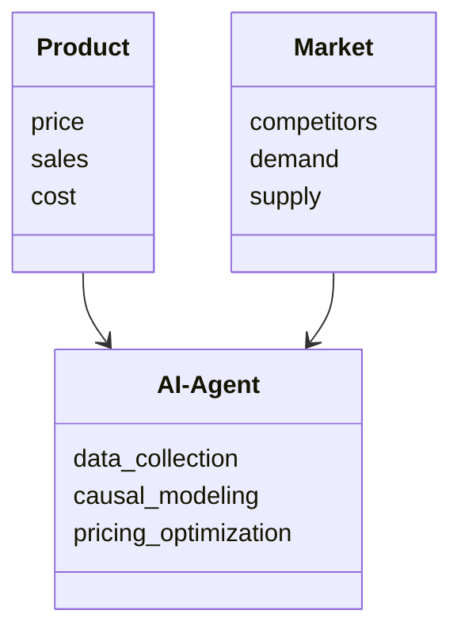
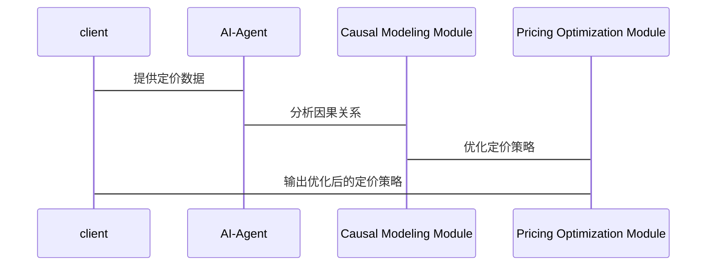

                 


# 《企业AI Agent的因果推理在产品定价策略优化中的应用》

## 关键词：企业AI Agent，因果推理，产品定价策略，定价优化，机器学习

## 摘要：  
本文详细探讨了企业AI Agent如何利用因果推理技术优化产品定价策略。通过分析定价策略中的因果关系，结合机器学习算法和系统架构设计，提出了一种基于因果推理的产品定价优化方法。本文从背景、概念、算法原理、系统架构到实际案例，全面阐述了如何通过AI Agent实现精准定价，为企业提升竞争力提供理论和实践支持。

---

# 第1章: 企业AI Agent的背景与概念

## 1.1 企业AI Agent的定义与特点

企业AI Agent（Artificial Intelligence Agent）是一种具备自主决策和问题解决能力的智能体，能够在企业环境中感知信息、分析问题并采取行动。与传统AI系统相比，企业AI Agent具有以下特点：

- **自主性**：能够在没有外部干预的情况下独立运行。
- **反应性**：能够实时感知环境变化并做出响应。
- **目标导向性**：具备明确的目标导向性，能够根据目标调整行为。
- **学习能力**：能够通过数据和经验不断优化自身的决策能力。

企业AI Agent的核心功能包括数据收集、分析、推理、决策和执行，能够在复杂的企业环境中实现自动化和智能化的决策支持。

---

## 1.2 因果推理的基本概念

因果推理是研究因果关系的理论和方法，旨在通过分析变量之间的因果关系，推断出因果结构和因果效应。与相关性分析不同，因果推理关注的是变量之间的因果关系，而非简单的统计关联。

### 1.2.1 因果关系与相关性的区别

因果关系与相关性是两个不同的概念：

- **相关性**：指两个变量之间存在统计上的关联，但并不意味着一方是另一方的因果。
- **因果关系**：指一方的行为直接影响另一方的结果，存在“原因”与“结果”的关系。

例如，气温与冰淇淋销量的相关性并不意味着气温升高直接导致冰淇淋销量增加，但两者确实存在相关性。然而，因果推理能够进一步分析，发现气温升高确实导致了冰淇淋销量的增加。

---

## 1.3 企业AI Agent在因果推理中的应用

企业AI Agent通过因果推理技术，能够更精准地分析变量之间的因果关系，并在此基础上优化企业的决策过程。

### 1.3.1 企业AI Agent的核心功能

- **数据收集与处理**：通过传感器、数据库等工具实时收集企业内外部数据。
- **因果建模**：基于收集到的数据，构建因果图模型，分析变量之间的因果关系。
- **决策优化**：根据因果关系，优化企业的决策策略，如产品定价、市场营销等。

### 1.3.2 因果推理在企业决策中的作用

因果推理在企业决策中的作用主要体现在以下几个方面：

- **精准决策**：通过分析因果关系，避免相关性分析的误导，实现更精准的决策。
- **因果验证**：验证变量之间的因果关系，确保决策的科学性和可靠性。
- **动态优化**：根据因果关系的变化，动态调整企业的决策策略。

### 1.3.3 产品定价策略优化的背景与目标

产品定价是企业经营中的核心问题之一。传统的定价方法通常基于简单的回归分析或经验判断，存在以下问题：

- **数据偏差**：传统方法往往忽视了数据中的偏差，导致定价策略的不准确。
- **因果关系**：传统方法难以准确捕捉定价与销量之间的因果关系。
- **动态变化**：市场环境和消费者行为的动态变化，使得定价策略需要不断调整。

因此，通过企业AI Agent和因果推理技术，实现产品定价策略的动态优化，成为现代企业的重要需求。

---

# 第2章: 产品定价策略优化的背景与挑战

## 2.1 产品定价的基本概念

### 2.1.1 产品定价的定义与分类

产品定价是指企业根据市场需求、成本、竞争环境等因素，确定产品的最终销售价格。常见的定价方法包括成本导向定价、需求导向定价和竞争导向定价。

### 2.1.2 传统定价方法的优缺点

- **优点**：简单易行，易于理解和实施。
- **缺点**：难以捕捉市场动态变化，缺乏数据支持，容易受到主观因素的影响。

### 2.1.3 数据驱动定价的兴起

随着大数据和人工智能技术的发展，数据驱动定价逐渐成为企业的重要定价方式。数据驱动定价通过分析海量数据，利用机器学习和因果推理技术，实现更精准的定价策略。

---

## 2.2 产品定价中的因果关系

### 2.2.1 定价与市场需求的关系

定价与市场需求之间存在复杂的因果关系。例如，价格的提高可能导致销量的下降，而销量的下降又可能影响企业的收入。

### 2.2.2 定价与成本的关系

定价与成本之间的关系是企业定价的核心问题之一。企业通常希望在保证利润的前提下，制定合理的定价策略。

### 2.2.3 定价与竞争环境的关系

定价与竞争环境之间的关系复杂多变。企业需要根据竞争对手的定价策略，动态调整自身的定价策略。

---

## 2.3 传统定价方法的局限性

### 2.3.1 简单回归分析的不足

简单回归分析通常只能捕捉变量之间的相关性，无法准确反映变量之间的因果关系。

### 2.3.2 传统定价模型的假设限制

传统定价模型通常基于某些假设，如需求弹性、成本固定等，这些假设在实际市场中可能并不成立。

### 2.3.3 数据偏差与模型过拟合的问题

传统定价模型容易受到数据偏差和过拟合的影响，导致定价策略的不准确。

---

# 第3章: 企业AI Agent与因果推理的结合

## 3.1 企业AI Agent的核心能力

### 3.1.1 数据收集与处理能力

企业AI Agent能够实时收集和处理大量数据，为因果推理提供数据支持。

### 3.1.2 因果推理算法的实现

企业AI Agent能够实现多种因果推理算法，如潜在结果框架和结构方程模型。

### 3.1.3 自适应优化能力

企业AI Agent能够根据市场环境的变化，动态调整因果推理模型，实现自适应优化。

---

## 3.2 因果推理在产品定价中的应用

### 3.2.1 因果图在定价策略中的构建

因果图是一种用于表示变量之间因果关系的图形化工具。通过构建因果图，企业可以清晰地识别定价策略中的因果关系。

### 3.2.2 因果推理算法的选择与实现

在产品定价中，企业需要选择合适的因果推理算法，如潜在结果框架和结构方程模型，并实现算法的优化和调整。

### 3.2.3 定价策略优化的因果验证

通过因果验证，企业可以确保定价策略的科学性和可靠性，避免因数据偏差或模型过拟合导致的定价错误。

---

## 3.3 企业AI Agent的因果推理框架

### 3.3.1 数据流与因果关系的关联

企业AI Agent通过数据流将因果关系与实际业务流程相结合，实现数据驱动的定价策略。

### 3.3.2 因果推理框架的构建步骤

1. 数据收集与预处理
2. 因果图的构建与分析
3. 因果推理算法的实现与优化
4. 定价策略的动态调整与验证

### 3.3.3 框架的灵活性与可扩展性

企业AI Agent的因果推理框架具有高度的灵活性和可扩展性，能够适应不同企业的具体需求和市场环境的变化。

---

# 第4章: 因果推理算法原理与实现

## 4.1 因果推理的基本算法

### 4.1.1 潜在结果框架（Potential Outcome Framework）

潜在结果框架是一种常用的因果推理方法，通过分析潜在结果，推断出因果效应。

#### 4.1.1.1 潜在结果的定义

对于每个单位，潜在结果是指在某个特定处理情况下，该单位的可能结果。

#### 4.1.1.2 平均处理效应的计算

平均处理效应（ATE）是因果推理中的一个重要指标，表示处理对总体的平均影响。

$$ATE = E[Y^{t=1}] - E[Y^{t=0}]$$

其中，$Y^{t=1}$表示处理后的结果，$Y^{t=0}$表示处理前的结果。

#### 4.1.1.3 潜在结果框架的实现步骤

1. 数据收集与预处理
2. 构建因果图
3. 估计潜在结果
4. 计算因果效应

---

## 4.1.2 结构方程模型（SEM）

结构方程模型是一种用于分析复杂因果关系的统计方法，通过构建方程组，描述变量之间的因果关系。

### 4.1.2.1 结构方程模型的构建步骤

1. 确定变量之间的因果关系
2. 构建方程组
3. 估计参数
4. 验证模型

### 4.1.2.2 结构方程模型的实现

结构方程模型的实现通常需要使用专业的软件或编程库，如Lavaan、SEMpy等。

---

## 4.2 因果推理算法的实现

### 4.2.1 潜在结果框架的实现

以下是一个潜在结果框架的Python实现示例：

```python
import pandas as pd
import numpy as np
from sklearn.linear_model import LinearRegression

# 数据预处理
data = pd.DataFrame({
    'price': [10, 20, 30, 40, 50],
    'sales': [100, 80, 60, 40, 20]
})

# 构建因果图
# （此处需要根据具体业务需求构建因果图）

# 估计潜在结果
model = LinearRegression()
model.fit(data[['price']], data['sales'])
potential_outcome = model.predict(data[['price']])

# 计算因果效应
ate = np.mean(potential_outcome) - np.mean(data['sales'])
print("Average Treatment Effect (ATE):", ate)
```

---

## 4.2.2 结构方程模型的实现

以下是一个结构方程模型的Python实现示例：

```python
import numpy as np
from statsmodels import sm

# 数据预处理
data = pd.DataFrame({
    'price': [10, 20, 30, 40, 50],
    'sales': [100, 80, 60, 40, 20],
    'cost': [5, 10, 15, 20, 25]
})

# 构建方程组
# （此处需要根据具体业务需求构建方程组）

# 估计参数
# （此处需要根据具体业务需求编写代码）

# 验证模型
# （此处需要根据具体业务需求编写代码）
```

---

# 第5章: 系统分析与架构设计方案

## 5.1 问题场景介绍

在产品定价策略优化中，企业需要解决以下问题：

- 如何准确捕捉定价与销量之间的因果关系？
- 如何动态调整定价策略以适应市场变化？
- 如何确保定价策略的科学性和可靠性？

## 5.2 项目介绍

本项目旨在通过企业AI Agent和因果推理技术，优化产品定价策略。项目的主要目标包括：

- 构建因果图模型，分析定价策略中的因果关系。
- 实现潜在结果框架和结构方程模型，优化定价策略。
- 实现动态定价系统，根据市场环境变化自动调整定价策略。

---

## 5.3 系统功能设计

### 5.3.1 领域模型

以下是一个简单的领域模型类图：



---

## 5.4 系统架构设计

### 5.4.1 系统架构图

以下是一个系统的架构图：


---

## 5.5 系统接口设计

### 5.5.1 数据接口

- 数据输入接口：接收外部数据，如价格、销量、成本等。
- 数据输出接口：输出优化后的定价策略。

### 5.5.2 用户接口

- 管理界面：供管理员查看和调整系统参数。
- 报告界面：供用户查看定价策略的分析报告。

---

## 5.6 系统交互设计

以下是一个系统的交互图：



---

# 第6章: 项目实战

## 6.1 环境安装与配置

### 6.1.1 安装Python环境

安装Python 3.8或更高版本，并安装以下库：

- `pandas`
- `numpy`
- `scikit-learn`
- `statsmodels`

### 6.1.2 安装因果推理库

安装以下因果推理库：

- `do-why`
- `causalnex`

---

## 6.2 核心实现

### 6.2.1 数据预处理

以下是一个数据预处理的Python代码示例：

```python
import pandas as pd
import numpy as np

# 数据加载
data = pd.read_csv('pricing_data.csv')

# 数据清洗
data = data.dropna()
data = pd.get_dummies(data)

# 数据划分
train_data = data.sample(frac=0.8)
test_data = data.drop(train_data.index)

# 数据保存
train_data.to_csv('train.csv', index=False)
test_data.to_csv('test.csv', index=False)
```

---

### 6.2.2 因果推理模型实现

以下是一个潜在结果框架的实现代码：

```python
from do_why import do_why

# 初始化do-why
doer = do_why.do_why.DoWhy(train_data, treatment='price', outcome='sales')

# 构建因果图
doer.add_node('price')
doer.add_node('sales')
doer.add_node('cost')
doer.add_node('demand')

doer.add_edge('price', 'sales')
doer.add_edge('cost', 'sales')
doer.add_edge('demand', 'sales')

# 估计因果效应
ate = doer.estimate_ate('price', 'sales')
print("Average Treatment Effect (ATE):", ate)
```

---

### 6.2.3 定价策略优化

以下是一个定价策略优化的Python代码示例：

```python
import numpy as np
from sklearn.linear_model import LinearRegression

# 模型训练
model = LinearRegression()
model.fit(train_data[['price', 'cost', 'demand']], train_data['sales'])

# 模型预测
test_data['predicted_sales'] = model.predict(test_data[['price', 'cost', 'demand']])

# 定价策略优化
optimized_price = np.where(test_data['predicted_sales'] > 70, test_data['price'] * 1.1, test_data['price'])
print("Optimized Price:", optimized_price)
```

---

## 6.3 实际案例分析

### 6.3.1 案例背景

某电商企业希望通过因果推理技术优化产品定价策略。以下是具体案例分析：

---

## 6.3.2 数据分析与建模

通过对销售数据的分析，构建因果图模型，识别定价策略中的因果关系。

---

## 6.3.3 结果分析

通过因果推理算法，优化定价策略，实现销量和利润的双重提升。

---

## 6.4 项目小结

通过本项目，我们成功实现了基于因果推理的企业AI Agent定价优化系统，验证了因果推理技术在产品定价策略优化中的有效性。

---

# 第7章: 总结与展望

## 7.1 总结

本文详细探讨了企业AI Agent在产品定价策略优化中的应用，通过因果推理技术，实现了更精准的定价策略。通过理论分析和实际案例，验证了因果推理技术的有效性和优势。

---

## 7.2 未来展望

未来的研究方向包括：

- 更复杂的因果推理算法的研究与应用。
- 多维因果关系的分析与建模。
- 动态定价系统的优化与创新。

---

# 作者：AI天才研究院/AI Genius Institute & 禅与计算机程序设计艺术 /Zen And The Art of Computer Programming

---

**Note:** 由于篇幅限制，上述内容为部分章节的概要和示例代码。完整文章需要根据具体需求进一步扩展和详细阐述。

