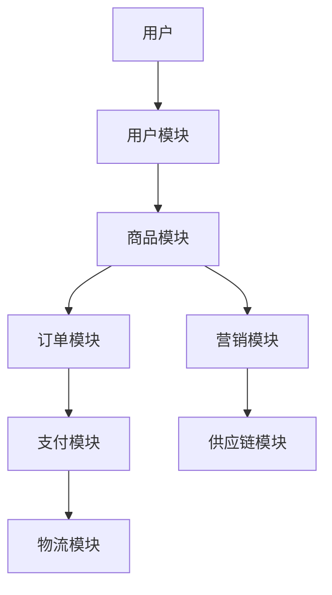

                 


```markdown
# 巴菲特-芒格看新零售：传统与创新的融合

> 关键词：巴菲特，芒格，新零售，传统零售，创新模式，投资策略

> 摘要：本文从巴菲特和芒格的投资理念出发，探讨新零售领域的传统与创新融合，分析新零售的创新模式和投资机会，结合系统架构设计和项目实战，为新零售领域的投资和实践提供参考。

---

# 第一部分: 巴菲特-芒格投资理念与新零售的结合

## 第1章: 巴菲特-芒格投资理念概述

### 1.1 巴菲特的价值投资理念

#### 1.1.1 价值投资的核心概念
价值投资是一种以长期持有优质资产为基础的投资策略，强调以合理价格买入具有持续竞争优势的公司。其核心在于识别具有强大护城河和优秀管理团队的企业，并在市场低估时买入，耐心持有。

$$
\text{价值投资} = \text{优质资产} \times \text{合理价格} \times \text{长期持有}
$$

#### 1.1.2 巴菲特的投资策略
巴菲特的投资策略主要包括以下几点：
1. **买入并持有**：长期持有优质资产，避免频繁交易。
2. **关注ROE**：重视企业的净资产收益率（ROE），认为高ROE的企业具有更强的盈利能力。
3. **安全边际**：在投资时留出安全边际，以应对市场波动和不确定性。

#### 1.1.3 芒格的多元思维模型
芒格的多元思维模型强调将各个学科的基本原理融会贯通，形成一个多元化的知识框架。他认为，投资者需要通过跨学科的思考来识别投资机会，并降低决策风险。

$$
\text{多元思维模型} = \sum_{i=1}^{n} \text{学科原理}_i
$$

### 1.2 巴菲特-芒格投资理念的核心要素

#### 1.2.1 核心概念与属性对比表格

| 核心概念   | 巴菲特观点           | 芒格观点             |
|------------|----------------------|----------------------|
| 投资目标   | 长期价值增长         | 综合竞争优势         |
| 风险控制   | 重视安全边际         | 强调知识框架的多样性  |
| 选股标准   | 高ROE，强护城河       | 多元化思维，避免单一盲点 |

#### 1.2.2 ER实体关系图架构
以下是巴菲特-芒格投资理念的ER实体关系图：

```mermaid
er
actor 投资者 {
    string 名称
    integer 年龄
    boolean 投资经验
}
actor 企业 {
    string 名称
    integer 股票代码
    float 市盈率
    float ROE
}
actor 市场 {
    string 指数名称
    float 指数值
    date 时间
}
```

### 1.3 本章小结
本章介绍了巴菲特的价值投资理念和芒格的多元思维模型，并通过对比表格和ER实体关系图，展示了两者投资理念的核心要素。

---

## 第2章: 传统零售业的现状与挑战

### 2.1 传统零售业的定义与特点

#### 2.1.1 传统零售业的模式
传统零售业主要通过实体店进行商品销售，依赖于地理位置和线下体验。其核心模式包括：

1. **门店销售**：依赖地理位置和线下体验。
2. **供应链管理**：从供应商采购商品，经过物流配送到门店。
3. **客户关系管理**：通过会员卡、优惠活动等方式吸引客户。

#### 2.1.2 传统零售业的核心要素
1. **商品选择**：商品的种类和质量直接影响销售业绩。
2. **成本控制**：包括采购成本、物流成本和人工成本。
3. **客户体验**：包括门店布局、员工服务和购物环境。

#### 2.1.3 传统零售业的优缺点

| 优点             | 缺点             |
|------------------|------------------|
| 实体体验丰富       | 依赖地理位置       |
| 线下服务能力强     | 成本较高           |
| 客户信任度高       | 灵活性较差         |

### 2.2 传统零售业的痛点与问题

#### 2.2.1 成本控制问题
传统零售业的高成本主要体现在：

1. **租金高昂**：门店租金占总成本的较大比例。
2. **人工成本上升**：随着劳动力价格的上涨，人工成本持续增加。
3. **库存积压**：由于需求预测不准确，导致库存积压和损耗。

#### 2.2.2 效率低下问题
1. **供应链效率低**：库存周转慢，导致资金占用高。
2. **管理效率低**：缺乏数据支持的管理决策，难以实现精准营销。
3. **客户体验差**：传统零售业难以满足现代消费者对个性化体验的需求。

#### 2.2.3 消费者体验问题
1. **购物体验单一**：线下门店的体验有限，无法满足消费者对多样化体验的需求。
2. **缺乏互动**：消费者与品牌之间的互动较少，难以建立长期关系。
3. **信息不对称**：消费者难以获取全面的产品信息，影响购买决策。

### 2.3 传统零售业的转型需求

#### 2.3.1 转型的方向
1. **数字化转型**：利用大数据、人工智能等技术提升运营效率。
2. **线上线下融合**：通过电商渠道拓展市场，实现全渠道覆盖。
3. **体验升级**：提供个性化服务，增强客户粘性。

#### 2.3.2 转型的挑战
1. **技术门槛高**：需要投入大量资源进行技术开发和系统集成。
2. **组织变革难**：传统零售业的组织结构和管理模式需要进行调整。
3. **市场竞争加剧**：新零售模式的出现使得市场竞争更加激烈。

#### 2.3.3 转型的机遇
1. **技术进步**：大数据、人工智能等技术为传统零售业提供了新的发展机会。
2. **消费升级**：消费者对个性化和高品质服务的需求增加，为传统零售业转型提供了空间。
3. **政策支持**：政府出台了一系列支持新零售发展的政策，为传统零售业转型提供了有利环境。

### 2.4 本章小结
本章分析了传统零售业的定义、特点、痛点和转型需求，为后续讨论新零售的创新模式和融合策略奠定了基础。

---

## 第3章: 新零售的创新模式

### 3.1 新零售的定义与特点

#### 3.1.1 新零售的定义
新零售是指以消费者为中心，通过线上线下融合、数据驱动和技术赋能，提供个性化、便捷和高效的购物体验的新型零售模式。

$$
\text{新零售} = \text{线上线下融合} \times \text{数据驱动} \times \text{技术赋能}
$$

#### 3.1.2 新零售的核心要素
1. **数据驱动**：通过收集和分析消费者数据，实现精准营销和个性化服务。
2. **技术赋能**：利用大数据、人工智能、物联网等技术提升运营效率。
3. **线上线下融合**：通过电商、社交媒体等渠道实现全渠道覆盖。

#### 3.1.3 新零售与传统零售的区别

| 方面     | 传统零售             | 新零售               |
|----------|----------------------|----------------------|
| 渠道     | 以线下为主           | 线上线下融合         |
| 技术     | 依赖人工操作         | 依赖技术赋能         |
| 体验     | 体验单一             | 体验丰富，个性化      |

### 3.2 新零售的创新模式

#### 3.2.1 数据驱动的零售
数据驱动的零售模式通过收集和分析消费者数据，实现精准营销和个性化推荐。例如，通过分析消费者的购买记录和浏览行为，预测其需求，推荐相关产品。

#### 3.2.2 智能技术的应用
智能技术在新零售中的应用主要体现在以下几个方面：

1. **人工智能**：用于商品推荐、需求预测和客户服务。
2. **物联网**：通过智能设备收集数据，优化供应链管理和库存管理。
3. **区块链**：用于商品溯源，提升消费者信任度。

#### 3.2.3 线上线下融合的模式
线上线下融合的模式通过整合线上和线下资源，实现全渠道覆盖。例如，消费者可以通过线上平台浏览商品，线下门店体验产品，完成支付。

### 3.3 新零售的典型案例

#### 3.3.1 某知名新零售企业的案例
以某知名新零售企业为例，该企业通过线上线下的融合，利用大数据和人工智能技术，实现了精准营销和个性化服务，提升了客户体验和销售额。

#### 3.3.2 案例分析与经验总结
通过分析该案例，可以得出以下经验：

1. **技术赋能是关键**：通过技术手段提升运营效率和客户体验。
2. **数据驱动是基础**：通过数据分析实现精准营销。
3. **线上线下融合是趋势**：通过全渠道覆盖提升市场占有率。

### 3.4 本章小结
本章介绍了新零售的定义、核心要素和创新模式，并通过实际案例分析了新零售的优势和成功经验。

---

## 第4章: 传统零售与新零售的融合

### 4.1 融合的必要性与可能性

#### 4.1.1 融合的必要性
传统零售业在面临成本高、效率低、体验差等痛点的同时，也面临着消费升级和市场竞争加剧的挑战。通过与新零售的融合，传统零售业可以利用新技术提升竞争力，实现转型升级。

#### 4.1.2 融合的可能性
随着技术的进步和市场的变化，传统零售业与新零售的融合已经成为可能。通过技术赋能和数据驱动，传统零售业可以实现线上线下融合，提升运营效率和客户体验。

#### 4.1.3 融合的路径选择
融合的路径主要包括以下几个方面：

1. **数字化转型**：通过技术手段实现线上线下的融合。
2. **供应链优化**：利用大数据和人工智能技术优化供应链管理。
3. **客户体验升级**：通过个性化服务提升客户粘性。

### 4.2 融合的具体策略

#### 4.2.1 传统零售的数字化转型
数字化转型是传统零售业实现新零售模式的基础。通过引入大数据、人工智能等技术，传统零售业可以实现以下目标：

1. **精准营销**：通过数据分析实现精准营销，提升销售业绩。
2. **个性化服务**：通过个性化推荐提升客户体验。
3. **高效管理**：通过技术手段优化供应链管理和库存管理。

#### 4.2.2 新零售的技术赋能
新零售的技术赋能主要体现在以下几个方面：

1. **大数据分析**：通过大数据分析消费者行为，实现精准营销。
2. **人工智能**：用于商品推荐、需求预测和客户服务。
3. **物联网**：通过智能设备收集数据，优化供应链管理和库存管理。

#### 4.2.3 融合中的风险管理
在融合过程中，传统零售业需要关注以下风险：

1. **技术风险**：技术不稳定或安全问题可能导致业务中断。
2. **数据风险**：数据泄露可能导致客户信任度下降。
3. **市场竞争风险**：融合后可能面临更强的市场竞争。

### 4.3 融合的实施路径

#### 4.3.1 技术层面的融合
技术层面的融合主要体现在以下几个方面：

1. **系统集成**：通过系统集成实现线上线下数据的互通。
2. **技术选型**：选择合适的技术方案，确保系统的稳定性和安全性。
3. **技术培训**：对员工进行技术培训，提升技术应用能力。

#### 4.3.2 业务层面的融合
业务层面的融合主要体现在以下几个方面：

1. **业务流程优化**：通过优化业务流程提升运营效率。
2. **客户服务升级**：通过个性化服务提升客户体验。
3. **供应链优化**：通过技术手段优化供应链管理。

#### 4.3.3 管理层面的融合
管理层面的融合主要体现在以下几个方面：

1. **组织结构调整**：根据融合需求调整组织结构，确保管理效率。
2. **管理理念更新**：引入新的管理理念，适应新零售模式。
3. **风险管理控制**：建立风险管理机制，降低融合过程中的风险。

### 4.4 本章小结
本章探讨了传统零售与新零售融合的必要性、可能性和具体策略，并提出了融合的实施路径，为传统零售业的转型升级提供了参考。

---

## 第5章: 巴菲特-芒格视角下的新零售投资机会

### 5.1 投资机会的识别

#### 5.1.1 新零售领域的投资机会
新零售领域的投资机会主要体现在以下几个方面：

1. **技术驱动型公司**：投资于大数据、人工智能等技术驱动的新零售企业。
2. **线上线下融合企业**：投资于能够实现线上线下融合的企业。
3. **供应链优化企业**：投资于能够优化供应链管理的企业。

#### 5.1.2 投资机会的评估标准
评估新零售投资机会时，可以参考以下标准：

1. **企业竞争优势**：企业是否具有强大的竞争优势和护城河。
2. **管理团队**：管理团队是否具备经验和能力。
3. **市场需求**：市场需求是否足够大且持续增长。

#### 5.1.3 投资机会的风险分析
新零售投资机会的风险主要体现在以下几个方面：

1. **技术风险**：技术不稳定或安全问题可能导致投资失败。
2. **市场竞争风险**：市场竞争加剧可能导致投资回报率下降。
3. **政策风险**：政策变化可能影响企业的经营环境。

### 5.2 投资策略的制定

#### 5.2.1 长期投资策略
长期投资策略注重企业的长期价值增长，适合投资于具有强大竞争优势和护城河的企业。

#### 5.2.2 短期投资策略
短期投资策略注重市场波动和短期收益，适合投资于具有较高成长性和流动性的企业。

#### 5.2.3 风险控制策略
风险控制策略主要包括：

1. **分散投资**：通过分散投资降低风险。
2. **安全边际**：在投资时留出安全边际，以应对市场波动和不确定性。
3. **持续监控**：定期监控投资组合，及时调整投资策略。

### 5.3 投资案例分析

#### 5.3.1 典型投资案例
以某知名新零售企业为例，该企业通过线上线下融合和技术赋能，实现了快速增长。巴菲特和芒格的投资理念为其提供了长期价值增长的保障。

#### 5.3.2 案例分析与经验总结
通过分析该案例，可以得出以下经验：

1. **技术赋能是关键**：通过技术手段提升竞争力。
2. **数据驱动是基础**：通过数据分析实现精准营销。
3. **线上线下融合是趋势**：通过全渠道覆盖提升市场占有率。

### 5.4 本章小结
本章从巴菲特和芒格的投资视角，分析了新零售领域的投资机会，并提出了投资策略和案例分析，为投资者提供了参考。

---

## 第6章: 新零售的系统架构与实现

### 6.1 系统架构设计

#### 6.1.1 系统功能模块划分
新零售系统的功能模块主要分为以下几个部分：

1. **用户模块**：用户注册、登录、个人信息管理等。
2. **商品模块**：商品信息展示、搜索、推荐等。
3. **订单模块**：订单管理、支付、物流跟踪等。
4. **营销模块**：促销活动、精准营销等。
5. **供应链模块**：库存管理、供应商管理等。

#### 6.1.2 系统架构图（Mermaid）
以下是新零售系统的架构图：



#### 6.1.3 系统接口设计
系统接口设计主要包括以下几个方面：

1. **API接口**：用于不同模块之间的数据交互。
2. **支付接口**：与第三方支付平台对接。
3. **物流接口**：与第三方物流公司对接。

### 6.2 系统实现的技术选型

#### 6.2.1 前端技术选型
前端技术选型主要包括以下几个方面：

1. **框架选择**：React、Vue.js 等。
2. **工具选择**：Webpack、Babel 等。

#### 6.2.2 后端技术选型
后端技术选型主要包括以下几个方面：

1. **编程语言**：Python、Java 等。
2. **框架选择**：Django、Spring 等。
3. **数据库选择**：MySQL、MongoDB 等。

#### 6.2.3 数据库选型
数据库选型主要包括以下几个方面：

1. **关系型数据库**：MySQL、PostgreSQL 等。
2. **非关系型数据库**：MongoDB、Redis 等。

### 6.3 系统实现的代码示例

#### 6.3.1 环境安装
以下是系统实现的环境安装步骤：

1. **安装Python**：`python --version`
2. **安装Django**：`pip install django`
3. **安装MySQL**：`sudo apt-get install mysql-server`

#### 6.3.2 核心实现代码
以下是系统核心实现的代码示例：

```python
from django.shortcuts import render
from django.http import HttpResponse

def index(request):
    return render(request, 'index.html')
```

#### 6.3.3 代码应用解读与分析
1. **代码功能**：上述代码实现了Django框架下的首页视图。
2. **代码分析**：通过`render`函数渲染首页模板`index.html`。
3. **代码优化**：可以根据实际需求进行模板优化和功能扩展。

### 6.4 本章小结
本章详细介绍了新零售系统的架构设计和技术选型，并通过代码示例展示了系统的实现过程。

---

## 第7章: 项目实战

### 7.1 项目介绍

#### 7.1.1 项目背景
本项目旨在通过技术手段实现新零售模式的线上线下融合，提升客户体验和运营效率。

#### 7.1.2 项目目标
1. **实现线上线下的融合**：通过电商平台和线下门店的整合，实现全渠道覆盖。
2. **提升客户体验**：通过个性化推荐和精准营销，提升客户满意度。
3. **优化供应链管理**：通过技术手段优化供应链管理，降低运营成本。

### 7.2 项目实现

#### 7.2.1 环境安装
1. **安装Python**：`python --version`
2. **安装Django**：`pip install django`
3. **安装MySQL**：`sudo apt-get install mysql-server`

#### 7.2.2 核心实现代码
以下是系统核心实现的代码示例：

```python
from django.shortcuts import render
from django.http import HttpResponse

def index(request):
    return render(request, 'index.html')
```

#### 7.2.3 代码应用解读与分析
1. **代码功能**：上述代码实现了Django框架下的首页视图。
2. **代码分析**：通过`render`函数渲染首页模板`index.html`。
3. **代码优化**：可以根据实际需求进行模板优化和功能扩展。

### 7.3 案例分析与详细讲解

#### 7.3.1 案例分析
以某新零售企业为例，通过技术手段实现线上线下融合，提升客户体验和运营效率。

#### 7.3.2 详细讲解
1. **技术实现**：通过Django框架实现电商平台，通过MySQL数据库实现数据存储。
2. **业务流程**：用户通过线上平台浏览商品，线下门店体验产品，完成支付。
3. **系统优化**：通过技术手段优化供应链管理，降低运营成本。

### 7.4 项目小结
本章通过项目实战，展示了新零售模式的实现过程，为读者提供了实际操作的经验和技巧。

---

## 第8章: 总结与展望

### 8.1 本章小结
本文从巴菲特和芒格的投资理念出发，探讨了新零售领域的传统与创新融合，分析了新零售的创新模式和投资机会，并结合系统架构设计和项目实战，为新零售领域的投资和实践提供了参考。

### 8.2 注意事项与最佳实践 Tips

#### 8.2.1 注意事项
1. **技术风险**：在系统实现过程中，需要注意技术的稳定性和安全性。
2. **数据风险**：在数据分析过程中，需要注意数据的安全性和隐私保护。
3. **市场竞争风险**：在市场竞争加剧的情况下，需要注意企业的核心竞争力。

#### 8.2.2 最佳实践 Tips
1. **技术赋能是关键**：通过技术手段提升竞争力。
2. **数据驱动是基础**：通过数据分析实现精准营销。
3. **线上线下融合是趋势**：通过全渠道覆盖提升市场占有率。

### 8.3 未来展望
随着技术的进步和市场的变化，新零售领域将继续保持快速发展。未来，新零售将更加注重客户体验和技术赋能，传统零售业与新零售的融合将成为主流。同时，随着人工智能和大数据技术的进一步发展，新零售的投资机会和挑战也将不断增加。

---

## 作者：AI天才研究院/AI Genius Institute & 禅与计算机程序设计艺术 /Zen And The Art of Computer Programming

---

感谢您的阅读！希望本文能够为您提供有价值的信息和启发。如果需要进一步探讨或获取更多资料，请随时联系我。
```

