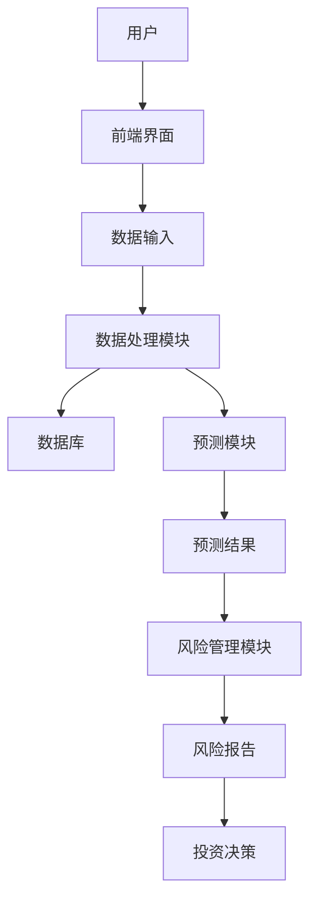
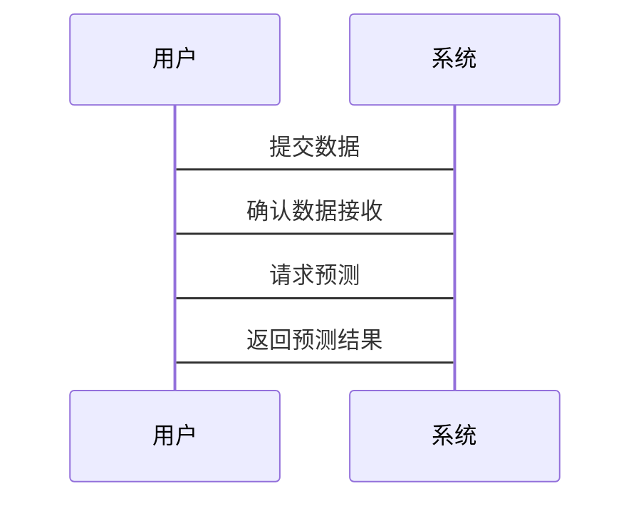

                 


# 巴菲特的现金管理策略：在低利率环境中的资金配置

## 关键词：巴菲特, 现金管理, 资金配置, 低利率环境, 资产配置, 投资策略

## 摘要：本文系统地分析了巴菲特的现金管理策略，特别是在低利率环境下的资金配置。通过理论分析和实际案例，探讨了巴菲特的投资理念、现金管理的重要性、低利率环境下的策略优化，以及数学模型在现金管理中的应用。文章最后结合实际案例，展示了如何应用巴菲特的策略进行资金配置，并总结了最佳实践。

---

## 第一部分: 巴菲特投资理念概述

### 第1章: 巴菲特投资理念的核心思想

#### 1.1 巴菲特投资哲学

##### 1.1.1 价值投资的定义与核心理念
价值投资是一种投资策略，强调以低于公平市场价值的价格购买优质资产。巴菲特的价值投资体系基于基本面分析，注重企业的长期盈利能力、财务健康状况和管理团队的稳定性。

##### 1.1.2 巴菲特的价值投资体系
巴菲特的价值投资体系包括以下几个关键要素：
1. **安全边际**：以低于内在价值的价格买入资产，确保投资的安全性。
2. **长期视角**：关注企业的长期盈利能力，而非短期市场波动。
3. **集中投资**：将资金集中在少数优质资产上，以提高投资效果。

##### 1.1.3 现金管理在巴菲特投资策略中的地位
现金是巴菲特投资组合中的重要组成部分，被视为“企业最好的朋友”。在低利率环境下，现金管理尤为重要，因为它可以为投资者提供灵活性和安全性。

#### 1.2 现金管理的重要性

##### 1.2.1 现金管理的定义与作用
现金管理是指对现金及现金等价物进行合理配置和管理，以实现资金的保值和增值。现金管理的作用包括：
1. **流动性管理**：确保企业有足够的流动性应对短期需求。
2. **风险控制**：通过合理配置资产，降低投资风险。
3. **收益最大化**：在保证流动性和安全性的前提下，实现资金的最优配置。

##### 1.2.2 巴菲特对现金储备的看法
巴菲特认为，现金储备是投资组合的重要组成部分，尤其是在市场不确定性增加时，现金储备能够为投资者提供灵活性和安全性。他通常建议保持一定的现金储备，以应对市场波动和投资机会。

##### 1.2.3 现金管理与企业价值的关系
现金管理与企业价值密切相关。合理的现金管理可以提高企业的资金使用效率，降低融资成本，从而提升企业价值。此外，通过优化资产配置，现金管理还可以提高企业的投资收益。

---

## 第二部分: 低利率环境下的现金管理策略

### 第2章: 低利率环境下的现金管理策略

#### 2.1 低利率环境的现状与挑战

##### 2.1.1 低利率环境的定义与特征
低利率环境是指市场利率水平低于正常水平的经济环境。其主要特征包括：
1. **低通货膨胀率**：低通胀环境下，央行倾向于降低利率以刺激经济增长。
2. **市场流动性过剩**：低利率导致市场流动性过剩，资金成本下降。
3. **债券收益率低**：低利率环境下，债券收益率通常较低，吸引力下降。

##### 2.1.2 当前全球经济与利率环境分析
当前全球经济面临低利率环境的挑战。许多国家的中央银行采取了量化宽松政策，导致市场利率水平处于低位。这种环境下，传统的债券投资收益率较低，投资者需要寻找新的投资机会。

##### 2.1.3 低利率对现金管理的影响
低利率环境对现金管理的影响主要体现在以下几个方面：
1. **资产收益率下降**：低利率环境下，债券和其他固定收益类资产的收益率下降，影响整体投资收益。
2. **资产配置难度增加**：低利率环境下，传统的资产配置策略可能失效，需要进行优化和调整。
3. **风险增加**：低利率环境下，市场波动性增加，投资风险上升。

#### 2.2 巴菲特的应对策略

##### 2.2.1 现金储备的最优配置
巴菲特在低利率环境下，通常会增加现金储备的比例。他认为，现金储备可以在市场波动时提供灵活性，同时避免在高估值时投资于低质量资产。

##### 2.2.2 股票与债券的平衡配置
在低利率环境下，巴菲特倾向于平衡配置股票和债券。他建议投资者选择那些具有稳定股息收益和良好基本面的股票，同时配置一定比例的债券以降低风险。

##### 2.2.3 其他投资工具的运用
除了股票和债券，巴菲特还会考虑其他投资工具，如房地产信托基金（REITs）和优先股。这些工具可以在低利率环境下提供较高的收益，同时具备一定的流动性。

#### 2.3 现金管理的优化与创新

##### 2.3.1 现金流预测与风险评估
现金流预测是现金管理的重要环节。通过分析企业的现金流状况，可以制定合理的资金配置策略。同时，风险评估可以帮助投资者识别潜在的风险，并制定相应的应对措施。

##### 2.3.2 资产配置的动态调整
在低利率环境下，资产配置需要动态调整。投资者可以根据市场变化和企业状况，及时调整股票和债券的比例，以优化投资收益。

##### 2.3.3 现金管理的全球化视角
随着全球经济的不确定性增加，现金管理需要具备全球化视角。投资者可以考虑配置全球资产，分散风险，同时利用不同市场的利率差异，优化资金配置。

---

## 第三部分: 现金管理策略的数学模型与算法分析

### 第3章: 现金管理的数学模型

#### 3.1 资产配置的优化模型

##### 3.1.1 资产配置的定义与目标
资产配置是指将资金分配到不同的资产类别中，以实现投资目标。其目标是在风险可控的前提下，最大化投资收益。

##### 3.1.2 资产配置的数学模型
资产配置的数学模型通常包括以下步骤：
1. **确定投资目标**：明确投资目标和风险承受能力。
2. **选择资产类别**：根据市场状况和企业需求，选择合适的资产类别。
3. **确定资产权重**：根据历史数据和市场预测，确定各类资产的权重。
4. **优化配置**：通过优化算法，调整资产权重，以实现最优配置。

##### 3.1.3 模型的求解方法与应用
常见的资产配置优化方法包括均值-方差优化和风险平价优化。均值-方差优化通过最小化投资组合的方差，实现收益最大化；风险平价优化则通过平衡各类资产的风险贡献，实现风险分散。

#### 3.2 现金流预测的算法

##### 3.2.1 现金流预测的定义与意义
现金流预测是指对未来一段时间内现金流入和流出的预测。它是现金管理的重要基础，帮助投资者制定合理的资金配置策略。

##### 3.2.2 时间序列分析模型（ARIMA）
ARIMA模型是一种常用的时间序列分析方法，适用于预测未来的现金流。通过分析历史数据，ARIMA模型可以捕捉到数据中的趋势和季节性变化，从而提高预测的准确性。

##### 3.2.3 预测模型的实现与优化
在实现ARIMA模型时，需要进行参数估计和模型验证。通常使用AIC准则选择最优模型，并通过交叉验证评估模型的预测能力。

#### 3.3 风险管理的数学方法

##### 3.3.1 风险管理的定义与目标
风险管理是指识别、评估和控制投资中的风险。其目标是降低投资组合的波动性，提高投资的稳定性。

##### 3.3.2 风险度量的数学模型
常见的风险度量方法包括标准差、VaR和CVaR。其中，VaR（Value at Risk）是衡量投资组合在一定置信水平下的潜在损失，常用于风险管理。

##### 3.3.3 风险控制的策略与方法
风险控制的策略包括分散投资、对冲交易和设定止损点。通过这些方法，投资者可以有效降低投资风险，保护资金安全。

### 第4章: 现金管理策略的算法实现

#### 4.1 资产配置算法的设计

##### 4.1.1 均值-方差优化算法
均值-方差优化算法是一种经典的资产配置方法，通过最小化投资组合的方差，实现收益最大化。其数学模型如下：

$$
\text{minimize } \sum_{i=1}^n w_i^2 \sigma_i^2 + 2 \sum_{i=1}^n \sum_{j=1}^n w_i w_j \sigma_{ij}
$$

$$
\text{subject to } \sum_{i=1}^n w_i = 1
$$

其中，\( w_i \) 是资产 \( i \) 的权重，\( \sigma_i^2 \) 是资产 \( i \) 的方差，\( \sigma_{ij} \) 是资产 \( i \) 和 \( j \) 的协方差。

##### 4.1.2 风险平价优化算法
风险平价优化算法是一种基于风险贡献的资产配置方法，通过平衡各类资产的风险贡献，实现风险分散。其数学模型如下：

$$
\text{minimize } \sum_{i=1}^n \left( \frac{w_i \sigma_i}{\sum_{j=1}^n w_j \sigma_j} \right)^2
$$

$$
\text{subject to } \sum_{i=1}^n w_i = 1
$$

其中，\( \sigma_i \) 是资产 \( i \) 的波动率。

#### 4.2 现金流预测的实现

##### 4.2.1 ARIMA模型的实现
以下是使用Python实现ARIMA模型的代码：

```python
from statsmodels.tsa.arima_model import ARIMA
import pandas as pd
import matplotlib.pyplot as plt

# 加载数据
data = pd.read_csv('cash_flow.csv')

# 定义模型
model = ARIMA(data['cash_flow'], order=(5, 1, 0))

# 拟合模型
model_fit = model.fit()

# 预测未来现金流
forecast = model_fit.forecast(steps=10)

# 可视化预测结果
plt.plot(data['cash_flow'], label='实际现金流')
plt.plot(forecast[0], label='预测现金流')
plt.xlabel('时间')
plt.ylabel('现金流')
plt.legend()
plt.show()
```

#### 4.3 风险管理的实现

##### 4.3.1 VaR模型的实现
以下是使用Python计算VaR的代码：

```python
import numpy as np
import pandas as pd

# 加载数据
data = pd.read_csv('returns.csv')

# 计算VaR
alpha = 0.05
returns_sorted = np.sort(data['returns'])
var = returns_sorted[int(alpha * len(returns_sorted))]

print(f'VaR在{alpha}置信水平下为：{var}')
```

---

## 第四部分: 系统分析

### 第5章: 现金流管理系统分析

#### 5.1 系统架构设计

##### 5.1.1 系统架构图
以下是现金流管理系统的架构图：



#### 5.2 系统功能设计

##### 5.2.1 数据输入模块
数据输入模块用于接收用户的现金流数据和市场数据，包括历史现金流、资产价格等。

##### 5.2.2 数据处理模块
数据处理模块对输入的数据进行清洗和转换，确保数据的准确性和一致性。

##### 5.2.3 预测模块
预测模块基于ARIMA模型，对未来现金流进行预测，并生成预测报告。

##### 5.2.4 风险管理模块
风险管理模块利用VaR模型，评估投资组合的风险，并生成风险报告。

#### 5.3 系统接口设计

##### 5.3.1 数据接口
数据接口用于与外部数据源（如数据库、API）进行数据交互。

##### 5.3.2 用户接口
用户接口是系统的前端界面，供用户输入数据和查看结果。

#### 5.4 系统交互流程

##### 5.4.1 交互流程图
以下是系统交互流程图：



---

## 第五部分: 项目实战

### 第6章: 项目实战

#### 6.1 环境安装

##### 6.1.1 安装Python
安装Python环境，建议使用Anaconda。

##### 6.1.2 安装依赖库
安装以下依赖库：
- statsmodels
- pandas
- matplotlib
- numpy

#### 6.2 核心实现

##### 6.2.1 现金流预测代码
以下是现金流预测的Python代码：

```python
from statsmodels.tsa.arima_model import ARIMA
import pandas as pd
import matplotlib.pyplot as plt

# 加载数据
data = pd.read_csv('cash_flow.csv')

# 定义模型
model = ARIMA(data['cash_flow'], order=(5, 1, 0))

# 拟合模型
model_fit = model.fit()

# 预测未来现金流
forecast = model_fit.forecast(steps=10)

# 可视化预测结果
plt.plot(data['cash_flow'], label='实际现金流')
plt.plot(forecast[0], label='预测现金流')
plt.xlabel('时间')
plt.ylabel('现金流')
plt.legend()
plt.show()
```

##### 6.2.2 风险管理代码
以下是风险管理的Python代码：

```python
import numpy as np
import pandas as pd

# 加载数据
data = pd.read_csv('returns.csv')

# 计算VaR
alpha = 0.05
returns_sorted = np.sort(data['returns'])
var = returns_sorted[int(alpha * len(returns_sorted))]

print(f'VaR在{alpha}置信水平下为：{var}')
```

#### 6.3 案例分析

##### 6.3.1 案例背景
假设我们有一个投资组合，包含股票和债券，目标是在低利率环境下优化资产配置。

##### 6.3.2 数据分析
通过ARIMA模型预测未来现金流，利用VaR模型评估投资组合的风险。

##### 6.3.3 结果解读
预测结果显示未来现金流将有所增长，但投资组合的风险也在增加。因此，需要调整资产配置，增加债券的比例，以降低整体风险。

---

## 第六部分: 总结与展望

### 第7章: 总结与展望

#### 7.1 最佳实践

##### 7.1.1 投资建议
在低利率环境下，投资者应保持适当的现金储备，同时优化资产配置，平衡股票和债券的比例。

##### 7.1.2 风险管理
通过VaR模型等工具，评估投资组合的风险，并制定相应的风险控制策略。

##### 7.1.3 持续学习
投资环境不断变化，投资者需要持续学习，关注市场动态，及时调整投资策略。

#### 7.2 小结
本文系统地分析了巴菲特的现金管理策略，特别是在低利率环境下的资金配置。通过理论分析和实际案例，探讨了现金管理的重要性、策略优化和数学模型的应用。

#### 7.3 注意事项
投资者在实际操作中，应结合自身的风险承受能力和投资目标，制定合理的现金管理策略。同时，需密切关注市场变化，及时调整投资组合。

#### 7.4 拓展阅读
建议读者进一步阅读巴菲特的著作《投资之道》和《证券分析》，以深入理解其投资理念。

---

## 作者：AI天才研究院/AI Genius Institute & 禅与计算机程序设计艺术 /Zen And The Art of Computer Programming

---

以上是《巴菲特的现金管理策略：在低利率环境中的资金配置》的完整目录和内容概要。

