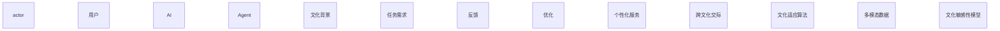
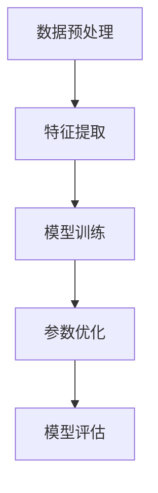
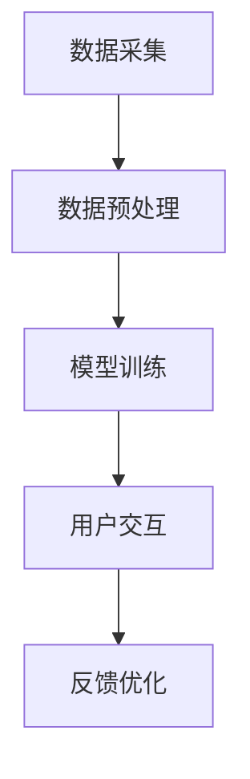

                 


# 文化适应：让AI Agent理解不同文化背景

> 关键词：AI Agent，文化适应，跨文化交际，多模态数据，文化敏感性模型，深度学习，系统架构

> 摘要：本文探讨了如何让AI Agent具备文化适应能力，使其能够理解并适应不同文化背景下的用户需求。通过分析文化适应的核心概念、模型构建、算法实现、系统架构设计以及实际项目案例，本文详细阐述了如何在AI Agent中实现文化适应，并通过多模态数据处理和文化敏感性模型的设计，解决了跨文化交际中的诸多挑战。本文还提供了基于深度学习的文化适应算法和系统架构设计方案，帮助读者全面理解文化适应在AI Agent中的重要性及实现方法。

---

# 正文

## 第一部分: 文化适应与AI Agent概述

### 第1章: 文化适应与AI Agent的核心概念

#### 1.1 问题背景与描述

##### 1.1.1 问题背景介绍
在当今全球化和多元化的社会中，AI Agent（智能体）需要与来自不同文化背景的用户进行交互。文化差异可能导致AI Agent的理解和响应出现偏差，进而影响用户体验和决策的准确性。例如，在商业谈判中，AI Agent需要理解不同文化背景下的沟通风格和决策偏好；在医疗领域，文化差异可能影响患者对AI诊断结果的接受程度。

##### 1.1.2 问题描述与目标
AI Agent在处理跨文化交际时，常常面临以下问题：
1. **语言差异**：不同语言的表达习惯和语境差异可能导致AI Agent误解用户意图。
2. **非语言交际**：文化背景影响肢体语言、面部表情等非语言信号的解读。
3. **文化背景对决策的影响**：不同文化背景下，用户的决策偏好和价值观可能截然不同。
4. **潜在冲突**：文化差异可能导致沟通中的误解和冲突。

目标是通过文化适应技术，使AI Agent能够理解和适应不同文化背景下的用户需求，提升跨文化交际的准确性和用户体验。

##### 1.1.3 问题解决的必要性
文化适应技术是AI Agent实现跨文化交际的关键。通过文化适应，AI Agent能够：
- 理解不同文化背景下的语言和非语言信号。
- 调整响应策略以适应用户的文化习惯。
- 提供个性化服务，满足不同文化背景用户的需求。

##### 1.1.4 问题的边界与外延
文化适应的边界包括：
- **语言文化差异**：不同语言中的成语、俚语和文化特定表达。
- **非语言文化差异**：肢体语言、面部表情和时间观念在不同文化中的差异。
- **文化价值观**：集体主义与个人主义、权力距离等文化维度对决策的影响。

外延包括：
- **跨文化适应**：AI Agent在不同文化环境中的自适应能力。
- **文化敏感性模型**：用于描述和建模文化差异的数学模型。
- **多模态数据处理**：整合语言、视觉、情感等多种数据源进行文化适应。

##### 1.1.5 核心概念结构与组成要素
文化适应的核心概念包括：
- **文化特征**：语言、习俗、价值观等文化元素。
- **文化敏感性模型**：用于描述文化差异的数学模型。
- **多模态数据处理**：整合语言、视觉、情感等多种数据源进行文化适应。
- **文化适应算法**：基于深度学习的文化适应方法。

### 1.2 文化适应与AI Agent的关系

#### 1.2.1 文化适应的定义与特征
文化适应是指AI Agent在与不同文化背景的用户交互时，能够理解和适应用户的文化习惯，从而提供更准确和个性化的服务。

文化适应的特征包括：
- **动态性**：能够根据用户的文化背景实时调整响应策略。
- **适应性**：基于用户反馈不断优化文化适应模型。
- **多模态性**：整合语言、视觉、情感等多种数据源进行文化适应。

#### 1.2.2 AI Agent的基本概念与功能
AI Agent是一种智能系统，能够感知环境、理解用户需求并执行任务。AI Agent的核心功能包括：
- **感知**：通过传感器或用户输入获取环境信息。
- **理解**：解析用户需求和意图。
- **推理**：基于知识库和推理引擎生成解决方案。
- **决策**：根据推理结果做出决策并执行任务。

#### 1.2.3 文化适应在AI Agent中的作用
文化适应在AI Agent中的作用体现在以下几个方面：
- **提升用户体验**：通过理解用户文化背景，提供更个性化的服务。
- **降低误解风险**：通过文化适应算法减少跨文化交际中的误解。
- **增强决策准确性**：结合文化背景信息，提高决策的准确性和适用性。

#### 1.2.4 两者关系的实体关系图（ER图）



---

### 第2章: 文化适应模型与方法

#### 2.1 文化适应模型的构建原理

##### 2.1.1 模型构建的基本原理
文化适应模型的构建基于以下几个关键步骤：
1. **数据收集**：收集多模态数据，包括语言、视觉、情感等。
2. **特征提取**：从多模态数据中提取文化相关的特征。
3. **模型训练**：基于训练数据训练文化适应模型。
4. **模型优化**：通过反馈不断优化模型性能。

##### 2.1.2 文化特征的提取与表示
文化特征的提取包括以下几个方面：
- **语言特征**：从文本中提取文化相关的关键词和语义信息。
- **视觉特征**：从图像中提取文化相关的视觉元素，如颜色、图案等。
- **情感特征**：分析用户的情感倾向，结合文化背景进行情感建模。

##### 2.1.3 模型的训练与优化
模型的训练采用深度学习方法，如卷积神经网络（CNN）和循环神经网络（RNN）。训练过程中，模型通过反向传播算法优化参数，以最小化预测误差。

##### 2.1.4 模型的评估与验证
模型的评估采用交叉验证方法，通过准确率、召回率和F1值等指标评估模型的性能。验证过程中，模型需要在不同文化背景的数据集上进行测试，确保模型的泛化能力。

#### 2.2 文化适应方法的对比分析

##### 2.2.1 基于规则的方法
基于规则的方法通过预定义的文化规则来实现文化适应。例如，针对不同文化背景下的问候语，AI Agent可以根据预定义的规则选择合适的回应。

##### 2.2.2 基于统计的方法
基于统计的方法利用统计学习算法，如朴素贝叶斯和决策树，基于历史数据统计文化特征的分布情况，从而实现文化适应。

##### 2.2.3 基于深度学习的方法
基于深度学习的方法利用神经网络模型，如Transformer和BERT，从多模态数据中自动学习文化特征，实现文化适应。

##### 2.2.4 各种方法的优缺点对比（表格形式）

| 方法类型       | 优点                           | 缺点                           |
|----------------|--------------------------------|--------------------------------|
| 基于规则的方法 | 实现简单，易于解释             | 需要大量手动定义规则           |
| 基于统计的方法 | 能够处理大量数据               | 解释性较差，难以处理复杂文化差异 |
| 基于深度学习的方法 | 能够自动学习文化特征，处理复杂文化差异 | 需要大量数据和计算资源           |

---

### 第3章: 跨文化交际中的挑战与解决方案

#### 3.1 跨文化交际的主要挑战

##### 3.1.1 语言差异的影响
不同语言的语法、词汇和语境差异可能导致AI Agent误解用户意图。例如，中文中的成语和谚语在其他语言中可能没有直接对应的表达方式。

##### 3.1.2 非语言交际的复杂性
非语言交际（如肢体语言、面部表情）在不同文化中的含义截然不同。例如，在某些文化中，直接的眼神接触被视为尊重，而在其他文化中，可能被视为不礼貌。

##### 3.1.3 文化背景对决策的影响
不同文化背景下的用户在决策时可能具有不同的偏好和价值观。例如，在集体主义文化中，决策更倾向于集体意见，而在个人主义文化中，决策更倾向于个人意见。

##### 3.1.4 跨文化交际中的潜在冲突
文化差异可能导致沟通中的误解和冲突。例如，在商务谈判中，某些文化背景下可能更倾向于直接表达意见，而其他文化背景下可能更倾向于委婉表达。

#### 3.2 解决方案的设计与实现

##### 3.2.1 多模态数据的处理方法
多模态数据处理方法通过整合语言、视觉、情感等多种数据源，全面理解用户的意图和情感状态。例如，结合文本和图像信息，AI Agent可以更准确地理解用户的意图。

##### 3.2.2 文化敏感性模型的设计
文化敏感性模型通过建模文化差异，帮助AI Agent理解和适应不同文化背景下的用户需求。例如，模型可以基于文化维度理论（如霍夫斯泰德文化维度理论）进行建模。

##### 3.2.3 跨文化适应算法的实现
跨文化适应算法通过深度学习方法，从多模态数据中自动学习文化特征，实现文化适应。例如，基于Transformer的跨文化适应模型可以在不同文化背景下自适应地调整模型参数。

##### 3.2.4 解决方案的实际案例分析
例如，在跨文化商务谈判中，AI Agent可以通过分析用户的文化背景，调整谈判策略，以满足用户的文化习惯和决策偏好。

---

### 第4章: 基于深度学习的文化适应算法

#### 4.1 算法原理与流程

##### 4.1.1 数据预处理与特征提取
数据预处理包括文本清洗、分词和情感分析。特征提取包括从文本中提取文化相关的关键词和语义信息。

##### 4.1.2 模型训练与参数优化
模型训练采用深度学习算法，如BERT和Transformer，通过反向传播算法优化模型参数，以最小化预测误差。

##### 4.1.3 文化适应的评估指标
评估指标包括准确率、召回率和F1值。模型在不同文化背景的数据集上进行测试，确保模型的泛化能力。

##### 4.1.4 算法流程的mermaid图示



#### 4.2 算法实现与代码解读

##### 4.2.1 环境安装与配置
需要安装Python、TensorFlow、Keras等依赖库。

##### 4.2.2 核心代码实现
以下是一个基于深度学习的文化适应算法的代码示例：

```python
import tensorflow as tf
from tensorflow.keras import layers

# 定义文化适应模型
def build_model(max_sequence_length, vocab_size):
    model = tf.keras.Sequential()
    model.add(layers.Embedding(input_dim=vocab_size, output_dim=100, input_length=max_sequence_length))
    model.add(layers.Bidirectional(layers.LSTM(64)))
    model.add(layers.Dense(1, activation='sigmoid'))
    return model

# 训练模型
model = build_model(max_sequence_length, vocab_size)
model.compile(loss='binary_crossentropy', optimizer='adam', metrics=['accuracy'])
model.fit(X_train, y_train, epochs=10, batch_size=32)
```

##### 4.2.3 代码的功能解读与分析
上述代码定义了一个基于双向LSTM的文化适应模型，用于分类任务。模型通过嵌入层将文本转换为向量表示，然后通过双向LSTM提取序列特征，最后通过全连接层进行分类。

##### 4.2.4 代码的实际应用案例
例如，在跨文化情感分析任务中，AI Agent可以通过上述模型分析用户情感，并根据用户的文化背景调整情感分析结果。

---

### 第5章: 系统架构与交互设计

#### 5.1 系统架构设计

##### 5.1.1 系统功能模块划分
系统功能模块包括：
- 数据采集模块：收集多模态数据。
- 数据预处理模块：清洗和标注数据。
- 模型训练模块：训练文化适应模型。
- 用户交互模块：与用户进行跨文化交际。

##### 5.1.2 系统架构的mermaid图示



#### 5.2 系统交互设计

##### 5.2.1 用户需求分析
用户需求包括跨文化交际、个性化服务和文化适应功能。

##### 5.2.2 系统交互流程设计
用户与AI Agent进行交互，系统根据用户的文化背景调整响应策略。

##### 5.2.3 交互界面的原型设计
设计一个友好的用户界面，支持多语言切换和文化背景设置。

##### 5.2.4 交互设计的注意事项
确保交互设计的易用性和文化适应性，避免因文化差异导致的误解。

---

### 第6章: 项目实战与案例分析

#### 6.1 项目环境与工具安装

##### 6.1.1 开发环境的搭建
需要搭建Python开发环境，并安装必要的库如TensorFlow、Keras等。

##### 6.1.2 依赖库的安装与配置
使用pip安装依赖库：`pip install tensorflow keras numpy pandas`

##### 6.1.3 开发工具的使用说明
推荐使用Jupyter Notebook进行开发和调试。

##### 6.1.4 项目运行的准备工作
准备好多模态数据集，并进行数据预处理。

#### 6.2 核心功能实现

##### 6.2.1 多模态数据处理
结合文本、图像和情感数据，进行文化适应。

##### 6.2.2 文化敏感性模型设计
基于文化维度理论，设计文化敏感性模型。

##### 6.2.3 跨文化适应算法实现
实现基于深度学习的文化适应算法，如BERT和Transformer。

##### 6.2.4 代码实现与解读
以下是一个文化适应算法的实现示例：

```python
import tensorflow as tf
from tensorflow.keras import layers

def build_cultural_adaptation_model(max_sequence_length, vocab_size):
    model = tf.keras.Sequential()
    model.add(layers.Embedding(input_dim=vocab_size, output_dim=100, input_length=max_sequence_length))
    model.add(layers.Bidirectional(layers.LSTM(64)))
    model.add(layers.Dense(1, activation='sigmoid'))
    return model

model = build_cultural_adaptation_model(max_sequence_length, vocab_size)
model.compile(loss='binary_crossentropy', optimizer='adam', metrics=['accuracy'])
model.fit(X_train, y_train, epochs=10, batch_size=32)
```

---

### 第7章: 结论与展望

#### 7.1 研究总结
本文详细探讨了文化适应在AI Agent中的实现方法，包括文化适应模型的构建、算法实现和系统设计。

#### 7.2 未来研究方向
未来的研究方向包括：
- 提高文化适应模型的泛化能力。
- 结合更多模态数据，进一步提升文化适应效果。
- 研究文化适应在更多领域的应用。

#### 7.3 注意事项与建议
在实际应用中，需要注意文化适应模型的泛化能力和数据多样性，避免因文化偏见导致的错误。

---

# 作者

作者：AI天才研究院/AI Genius Institute & 禅与计算机程序设计艺术/Zen And The Art of Computer Programming

---

通过本文的详细阐述，我们希望读者能够全面理解文化适应在AI Agent中的重要性，并掌握实现文化适应的核心方法和技巧。

