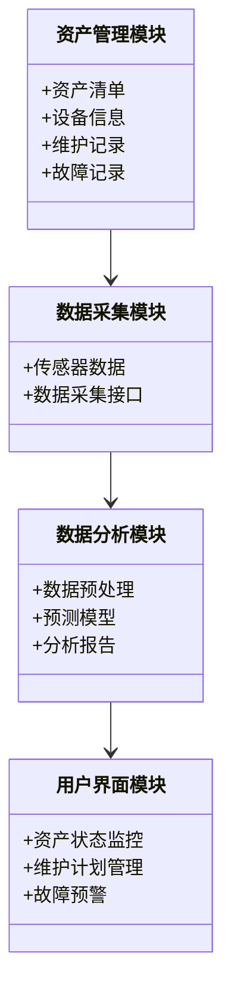

                 


# 构建智能企业资产管理平台：全生命周期优化与预测性维护系统

> **关键词**：企业资产管理、预测性维护、全生命周期管理、人工智能、大数据分析

> **摘要**：本文将详细探讨如何构建智能企业资产管理平台，通过全生命周期优化与预测性维护系统，利用人工智能和大数据分析技术，实现资产高效管理、降低维护成本、提升企业运营效率。

---

## 第一部分: 企业资产管理平台的背景与概述

### 第1章: 企业资产管理平台的背景与现状

#### 1.1 企业资产管理的现状与挑战
##### 1.1.1 传统资产管理的痛点
在传统的企业资产管理中，企业通常面临以下痛点：
- **信息孤岛**：各个部门之间的数据分散，缺乏统一的管理系统，导致数据不一致。
- **维护成本高**：由于缺乏预测性维护，设备故障往往导致高昂的维修成本和停机损失。
- **管理效率低**：人工管理大量资产数据，效率低下，容易出错。

##### 1.1.2 数字化转型对企业资产管理的影响
随着企业数字化转型的推进，企业资产管理也在逐步向智能化方向发展。数字化技术（如物联网、大数据、人工智能）的应用，使得企业能够更高效地管理资产，实现预测性维护。

##### 1.1.3 智能化资产管理的必要性
智能化资产管理通过实时监测设备状态、预测设备故障、优化维护计划，能够显著降低维护成本、减少停机时间，提高设备利用率。

#### 1.2 预测性维护的定义与价值
##### 1.2.1 预测性维护的基本概念
预测性维护是通过分析设备的运行数据，预测设备的健康状态，提前安排维护计划，以避免设备故障。

##### 1.2.2 预测性维护的优势与应用场景
预测性维护的优势包括：
- **降低维护成本**：通过提前维护，减少突发故障的维修成本。
- **减少停机时间**：预测性维护可以最大限度地减少设备停机时间，提高生产效率。
- **延长设备寿命**：通过及时维护，延长设备的使用寿命。

预测性维护的应用场景包括制造业、能源行业、交通运输等领域。

#### 1.3 全生命周期管理的核心要素
##### 1.3.1 资产全生命周期的定义
资产全生命周期管理是指从资产的规划、采购、使用、维护到退役的整个过程进行管理。

##### 1.3.2 全生命周期管理的关键环节
- **规划阶段**：包括资产的需求分析、预算制定等。
- **采购阶段**：包括设备选型、供应商选择等。
- **使用阶段**：包括设备的运行监控、维护管理等。
- **退役阶段**：包括设备的报废处理等。

##### 1.3.3 全生命周期管理的业务价值
- **提高资产利用率**：通过优化资产的使用，提高资产的回报率。
- **降低管理成本**：通过全生命周期管理，减少管理中的浪费。
- **延长设备寿命**：通过科学的维护计划，延长设备的使用寿命。

---

### 第2章: 智能企业资产管理平台的构建目标

#### 2.1 平台构建的核心目标
##### 2.1.1 实现资产的全生命周期管理
通过平台实现对资产的全生命周期管理，包括资产的规划、采购、使用、维护和退役。

##### 2.1.2 提高预测性维护的准确性
通过实时监测设备状态，利用人工智能算法，提高预测性维护的准确性。

##### 2.1.3 优化资产的使用效率
通过数据分析和优化算法，提高资产的使用效率，降低运营成本。

#### 2.2 平台的业务价值
##### 2.2.1 提高企业运营效率
通过智能化的资产管理，减少设备故障，提高生产效率。

##### 2.2.2 降低维护成本
通过预测性维护，减少突发故障的维修成本。

##### 2.2.3 提升资产的使用寿命
通过科学的维护计划，延长设备的使用寿命，降低资产的报废率。

---

## 第二部分: 核心概念与技术基础

### 第3章: 预测性维护的核心概念

#### 3.1 预测性维护的核心原理
预测性维护的核心原理是通过分析设备的运行数据，预测设备的健康状态，提前安排维护计划。

#### 3.2 预测性维护的关键技术
- **数据采集**：通过物联网技术，实时采集设备的运行数据。
- **数据分析**：利用大数据分析技术，对设备数据进行分析，发现潜在故障。
- **预测模型**：通过机器学习算法，建立设备故障预测模型。

#### 3.3 预测性维护的实现步骤
1. 数据采集：通过传感器等设备，实时采集设备的运行数据。
2. 数据预处理：对采集的数据进行清洗、归一化等处理。
3. 数据分析：利用统计分析和机器学习算法，分析设备的健康状态。
4. 预测模型：建立设备故障预测模型，预测设备的健康状态。
5. 维护计划：根据预测结果，制定维护计划。

---

### 第4章: 全生命周期管理的技术基础

#### 4.1 全生命周期管理的核心技术
- **数据管理**：对资产的全生命周期数据进行管理。
- **流程管理**：实现资产全生命周期的流程自动化。
- **决策支持**：通过数据分析，为资产的管理决策提供支持。

#### 4.2 全生命周期管理的实现步骤
1. 数据采集：采集资产的全生命周期数据。
2. 数据存储：将数据存储在数据库中，便于后续分析。
3. 数据分析：对数据进行分析，发现资产的使用趋势和潜在问题。
4. 决策支持：根据分析结果，制定资产的管理策略。

---

## 第三部分: 算法原理

### 第5章: 预测性维护的算法原理

#### 5.1 回归分析
回归分析是一种常用的预测算法，用于预测设备的剩余寿命。

##### 5.1.1 线性回归
线性回归是一种简单的回归分析方法，假设设备的剩余寿命与使用时间呈线性关系。

公式：
$$ y = \beta_0 + \beta_1x + \epsilon $$

其中：
- $y$：设备的剩余寿命
- $x$：使用时间
- $\beta_0$：截距
- $\beta_1$：斜率
- $\epsilon$：误差项

##### 5.1.2 逻辑回归
逻辑回归用于分类问题，可以用于预测设备是否处于健康状态。

公式：
$$ P(y=1|x) = \frac{1}{1 + e^{-\beta_0 - \beta_1x}} $$

其中：
- $P(y=1|x)$：设备处于健康状态的概率
- $\beta_0$：截距
- $\beta_1$：斜率
- $x$：使用时间

#### 5.2 时间序列分析
时间序列分析用于分析设备的历史数据，预测未来的状态。

##### 5.2.1 ARIMA模型
ARIMA模型是一种常用的时间序列分析模型，用于预测设备的健康状态。

公式：
$$ ARIMA(p, d, q) $$

其中：
- $p$：自回归阶数
- $d$：差分阶数
- $q$：移动平均阶数

##### 5.2.2 LSTM网络
LSTM（长短期记忆网络）是一种深度学习模型，用于处理时间序列数据。

公式：
$$
\begin{align*}
i_t &= \sigma(W_{i}x_t + U_{i}h_{t-1} + b_i) \\
f_t &= \sigma(W_{f}x_t + U_{f}h_{t-1} + b_f) \\
o_t &= \sigma(W_{o}x_t + U_{o}h_{t-1} + b_o) \\
g_t &= \tanh(W_{g}x_t + U_{g}h_{t-1} + b_g) \\
h_t &= f_t \cdot h_{t-1} + i_t \cdot g_t \\
\end{align*}
$$

其中：
- $i_t$：输入门
- $f_t$：遗忘门
- $o_t$：输出门
- $g_t$：候选细胞状态
- $h_t$：隐藏状态

---

## 第四部分: 系统分析与架构设计

### 第6章: 系统分析与架构设计

#### 6.1 问题场景介绍
企业资产管理平台需要解决的问题包括：
- 实时监测设备状态
- 预测设备故障
- 优化维护计划
- 管理资产全生命周期

#### 6.2 系统功能设计
##### 6.2.1 领域模型设计
通过Mermaid类图展示系统功能模块之间的关系。



##### 6.2.2 系统架构设计
通过Mermaid架构图展示系统的整体架构。


##### 6.2.3 接口设计
系统需要以下接口：
- 数据采集接口：用于采集设备的运行数据。
- 数据分析接口：用于调用预测模型进行分析。
- 用户界面接口：用于展示资产状态和维护计划。

##### 6.2.4 交互流程图
通过Mermaid序列图展示系统的交互流程。

```mermaid
sequenceDiagram
    用户 -> 数据采集模块: 发起数据采集请求
    数据采集模块 -> 数据存储模块: 保存数据
    数据存储模块 -> 数据分析模块: 请求分析数据
    数据分析模块 -> 用户界面模块: 返回分析结果
    用户 <- 用户界面模块: 显示资产状态
```

---

## 第五部分: 项目实战

### 第7章: 项目实战

#### 7.1 环境安装
需要安装以下工具：
- Python 3.8+
- Jupyter Notebook
- Scikit-learn
- TensorFlow
- Pandas
- Matplotlib

#### 7.2 系统核心实现
##### 7.2.1 数据采集模块
```python
import pandas as pd
import numpy as np

# 数据采集函数
def collect_data():
    # 模拟传感器数据
    data = {
        'timestamp': pd.date_range(start='2023-01-01', periods=100, freq='T'),
        'temperature': np.random.normal(20, 1, 100),
        'vibration': np.random.uniform(0, 1, 100)
    }
    return pd.DataFrame(data)
```

##### 7.2.2 数据分析模块
```python
from sklearn.linear_model import LinearRegression
import matplotlib.pyplot as plt

# 数据预处理
def preprocess_data(data):
    # 填充缺失值
    data = data.dropna()
    return data

# 预测模型
def predict_failure(data):
    # 训练线性回归模型
    model = LinearRegression()
    model.fit(data[['temperature', 'vibration']], data['failure'])
    return model.predict(data[['temperature', 'vibration']])

# 可视化
def visualize_data(data):
    plt.scatter(data['temperature'], data['vibration'])
    plt.xlabel('Temperature')
    plt.ylabel('Vibration')
    plt.show()
```

##### 7.2.3 用户界面模块
```python
import dash
import dash_core_components as dcc
import dash_html_components as html

# 创建Dash应用
app = dash.Dash(__name__)
app.layout = html.Div(children=[
    html.H1(children='智能企业资产管理平台'),
    dcc.Graph(
        id='example-graph',
        figure={
            'data': [
                {'x': [1, 2, 3], 'y': [2, 1, 3], 'type': 'bar'}
            ],
            'layout': {
                'title': '资产状态监控'
            }
        }
    )
])

# 运行Dash应用
if __name__ == '__main__':
    app.run_server()
```

#### 7.3 案例分析与实现
##### 7.3.1 案例背景
某制造企业有100台设备，需要通过平台实现预测性维护。

##### 7.3.2 数据分析
通过分析设备的历史数据，建立预测模型，预测设备的故障时间。

##### 7.3.3 系统实现
实现数据采集、数据分析、用户界面等功能，展示资产状态和维护计划。

##### 7.3.4 实施效果
通过平台实现预测性维护，减少设备故障率，降低维护成本。

#### 7.4 项目总结
项目通过智能化的资产管理，显著提高了企业的运营效率，降低了维护成本。

---

## 第六部分: 总结与展望

### 第8章: 总结与展望

#### 8.1 总结
本文详细探讨了构建智能企业资产管理平台的背景、核心概念、算法原理、系统架构和项目实战。通过智能化的资产管理，企业能够实现预测性维护，优化资产全生命周期管理，降低维护成本，提高运营效率。

#### 8.2 未来展望
未来，随着人工智能和大数据技术的不断发展，智能企业资产管理平台将更加智能化、自动化。预测性维护的准确性将进一步提高，资产全生命周期管理将更加精细化。

---

## 作者：AI天才研究院/AI Genius Institute & 禅与计算机程序设计艺术 /Zen And The Art of Computer Programming

