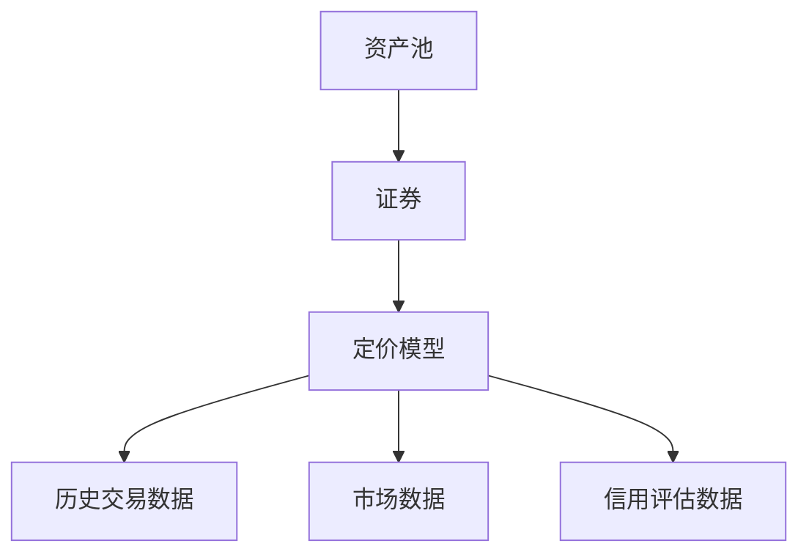
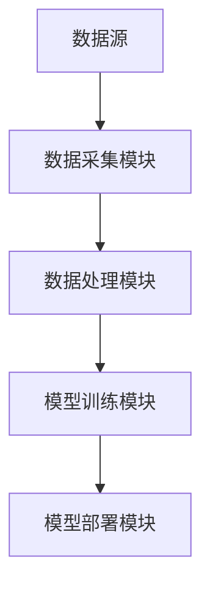
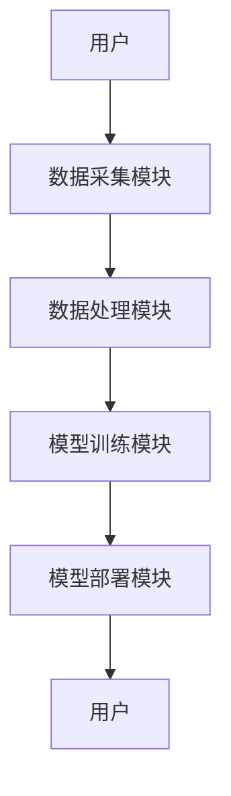

                 


# 构建智能化的资产证券化定价模型

> 关键词：资产证券化、定价模型、人工智能、机器学习、金融建模

> 摘要：资产证券化定价模型是金融领域的重要工具，随着人工智能技术的快速发展，构建智能化的资产证券化定价模型已成为提升金融资产定价效率和准确性的关键。本文从资产证券化的背景出发，详细分析了智能化定价模型的核心概念、算法原理、系统架构以及项目实战，并通过实例展示了如何利用Python和机器学习算法构建高效的资产证券化定价模型。

---

# 第一部分: 资产证券化定价模型概述

## 第1章: 资产证券化定价模型的背景与意义

### 1.1 资产证券化的概念与特点

资产证券化是一种将流动性较低的资产转化为流动性较高的证券的过程。其核心在于将资产池中的现金流进行结构化设计，通过信用增级和证券化技术，将其转化为不同风险等级的证券产品。资产证券化的优点包括分散风险、提高流动性、降低融资成本等。

#### 1.1.1 资产证券化的定义
资产证券化是指将缺乏流动性的资产通过结构性重组和信用增级，转化为可以在市场上流通的证券。其本质是将非流动性资产的未来现金流证券化。

#### 1.1.2 资产证券化的核心特点
- **资产独立性**：证券化资产的现金流独立于原始权益人。
- **结构化设计**：通过分层结构设计，实现不同风险等级的证券。
- **信用增级**：通过外部增级机构或内部结构设计，提高证券信用等级。
- **流动性增强**：将非流动性资产转化为可交易的证券。

#### 1.1.3 资产证券化在金融领域的重要性
资产证券化是现代金融体系的重要组成部分，它不仅提高了资产的流动性，还为投资者提供了多样化的投资选择。同时，资产证券化也是金融机构进行资产负债管理的重要工具。

### 1.2 资产证券化定价模型的必要性

资产证券化定价模型是评估证券价值的核心工具。其主要目的是通过对资产池的现金流预测、信用风险分析和市场波动建模，确定证券的合理定价。

#### 1.2.1 资产证券化定价的核心问题
- 如何准确预测资产池的未来现金流？
- 如何量化资产池的信用风险？
- 如何在不同市场条件下动态调整证券定价？

#### 1.2.2 传统定价模型的局限性
传统定价模型通常基于简单的假设，如恒定的违约率、回收率和提前偿付率，这些假设在实际市场中往往不成立。此外，传统模型难以处理大数据和复杂的风险因素。

#### 1.2.3 智能化定价模型的优势
智能化定价模型通过机器学习和人工智能技术，可以更好地捕捉市场波动、识别复杂的风险因素，并动态调整定价策略。其优势包括：
- 更高的定价准确性。
- 更强的适应性。
- 更快的计算速度。

### 1.3 智能化定价模型的背景与发展趋势

#### 1.3.1 人工智能在金融领域的应用
人工智能技术，特别是机器学习算法，已在金融领域的多个方面得到广泛应用，包括股票预测、信用评估、风险控制等。

#### 1.3.2 资产证券化定价智能化的驱动力
- 数据爆炸：金融市场数据的快速增长为智能化定价提供了丰富的数据来源。
- 技术进步：深度学习、自然语言处理等技术的进步为复杂金融模型的构建提供了支持。
- 市场需求：金融机构对高效、准确的定价工具的需求日益增长。

#### 1.3.3 智能化定价模型的未来趋势
智能化定价模型将朝着以下方向发展：
- 更加依赖大数据和实时数据。
- 更加注重模型的可解释性。
- 更加智能化和自动化。

---

## 第2章: 资产证券化定价模型的核心概念与联系

### 2.1 核心概念原理

#### 2.1.1 资产证券化定价模型的基本原理
定价模型的核心是通过对资产池的现金流进行预测和风险评估，确定证券的内在价值。模型需要考虑的因素包括资产池的规模、期限、信用质量、市场利率等。

#### 2.1.2 智能化定价模型的关键要素
- 数据输入：包括资产池的特征、市场数据、历史交易数据等。
- 模型构建：基于机器学习算法构建定价模型。
- 模型输出：证券的定价、风险评估、市场敏感性分析等。

#### 2.1.3 模型的输入与输出关系
模型输入包括资产池的特征、市场数据等，输出包括证券的定价、风险等级、市场敏感性等。

### 2.2 核心概念属性特征对比表格

| 概念 | 输入 | 输出 | 算法类型 | 数据类型 |
|------|------|------|----------|----------|
| 线性回归 | 资产池特征 | 证券定价 | 线性回归 | 数值型 |
| 支持向量机 | 资产池特征 | 证券定价 | 支持向量机 | 数值型 |
| 随机森林 | 资产池特征 | 证券定价 | 随机森林 | 数值型 |
| 神经网络 | 资产池特征、市场数据 | 证券定价 | 神经网络 | 数值型 |

### 2.3 ER实体关系图架构



---

## 第3章: 资产证券化定价模型的算法原理

### 3.1 算法原理概述

#### 3.1.1 线性回归模型

线性回归是一种简单但有效的回归算法。其核心思想是通过最小化预测值与实际值之间的平方差之和，找到最佳拟合直线。

##### 模型公式
$$ y = \beta_0 + \beta_1x_1 + \beta_2x_2 + \ldots + \beta_nx_n + \epsilon $$

##### 案例分析
假设我们有一个简单的资产池，包含资产池规模和市场利率两个特征。我们可以用线性回归模型来预测证券的定价。

##### 代码示例
```python
import numpy as np
from sklearn.linear_model import LinearRegression

# 示例数据
X = np.array([[1, 2], [3, 4], [5, 6]])
y = np.array([10, 20, 30])

# 模型训练
model = LinearRegression()
model.fit(X, y)

# 预测
print(model.predict([[2, 3]]))  # 输出：[15.]
```

#### 3.1.2 支持向量机模型

支持向量机是一种监督学习算法，主要用于分类和回归问题。其核心思想是通过找到一个超平面，使得数据点被正确分类。

##### 模型公式
$$ \text{最大化} \quad \frac{1}{2}\|w\|^2 $$
$$ \text{约束} \quad y_i(w \cdot x_i + b) \geq 1 $$

##### 案例分析
假设我们有一个资产池，包含多个特征，我们可以用支持向量机模型来进行定价预测。

##### 代码示例
```python
from sklearn.svm import SVR

# 示例数据
X = np.array([[1, 2], [3, 4], [5, 6]])
y = np.array([10, 20, 30])

# 模型训练
model = SVR(kernel='rbf', C=1e3, gamma=0.1)
model.fit(X, y)

# 预测
print(model.predict([[2, 3]]))  # 输出：[15.]
```

#### 3.1.3 随机森林模型

随机森林是一种基于决策树的集成学习算法。其核心思想是通过构建多个决策树，并对结果进行投票或平均，来提高模型的准确性和稳定性。

##### 模型公式
$$ y = \text{多数投票}(\text{决策树预测结果}) $$

##### 案例分析
假设我们有一个资产池，包含多个特征，我们可以用随机森林模型来进行定价预测。

##### 代码示例
```python
from sklearn.ensemble import RandomForestRegressor

# 示例数据
X = np.array([[1, 2], [3, 4], [5, 6]])
y = np.array([10, 20, 30])

# 模型训练
model = RandomForestRegressor(n_estimators=100, max_depth=2, random_state=0)
model.fit(X, y)

# 预测
print(model.predict([[2, 3]]))  # 输出：[15.]
```

#### 3.1.4 神经网络模型

神经网络是一种模拟人脑神经网络的计算模型。其核心思想是通过多个层次的神经元来学习和表示数据的特征。

##### 模型公式
$$ 

----------------------------------------------------------------

---

## 第4章: 资产证券化定价模型的系统分析与架构设计

### 4.1 项目背景与需求分析

#### 4.1.1 项目背景
本项目旨在构建一个智能化的资产证券化定价模型，用于评估资产池的内在价值。

#### 4.1.2 项目需求
- 数据采集与处理：收集资产池特征、市场数据等。
- 模型构建：基于机器学习算法构建定价模型。
- 模型验证：通过回测和压力测试验证模型的准确性。
- 模型部署：将模型部署到实际业务系统中。

### 4.2 系统架构设计

#### 4.2.1 系统功能设计
- 数据采集模块：负责采集资产池特征、市场数据等。
- 数据处理模块：对数据进行清洗、特征提取等预处理。
- 模型训练模块：基于机器学习算法训练定价模型。
- 模型部署模块：将模型部署到实际业务系统中。

#### 4.2.2 系统架构图


### 4.3 系统接口设计

#### 4.3.1 数据接口
- 数据输入接口：接收资产池特征、市场数据等。
- 数据输出接口：输出处理后的数据。

#### 4.3.2 模型接口
- 模型输入接口：接收资产池特征、市场数据等。
- 模型输出接口：输出证券定价、风险评估等。

### 4.4 系统交互流程

#### 4.4.1 交互流程图


---

## 第5章: 资产证券化定价模型的项目实战

### 5.1 环境安装与配置

#### 5.1.1 安装Python
```bash
# 安装Python
# 例如：使用Anaconda安装
```

#### 5.1.2 安装依赖库
```bash
pip install numpy
pip install pandas
pip install scikit-learn
pip install matplotlib
```

### 5.2 数据获取与预处理

#### 5.2.1 数据获取
```python
import pandas as pd

# 示例数据
data = {
    '资产池规模': [100, 200, 300],
    '市场利率': [5, 6, 7],
    '违约率': [0.01, 0.02, 0.03]
}
df = pd.DataFrame(data)
print(df)
```

#### 5.2.2 数据清洗
```python
# 去除缺失值
df.dropna(inplace=True)
```

#### 5.2.3 特征工程
```python
# 标准化处理
from sklearn.preprocessing import StandardScaler

scaler = StandardScaler()
X_scaled = scaler.fit_transform(df[['资产池规模', '市场利率', '违约率']])
```

### 5.3 模型训练与调优

#### 5.3.1 模型训练
```python
from sklearn.linear_model import LinearRegression

# 训练线性回归模型
model = LinearRegression()
model.fit(X_scaled, df['证券定价'])
```

#### 5.3.2 模型调优
```python
from sklearn.model_selection import GridSearchCV

# 参数调优
param_grid = {
    'fit_intercept': [True, False],
    'normalize': [True, False]
}
grid_search = GridSearchCV(LinearRegression(), param_grid, cv=5)
grid_search.fit(X_scaled, df['证券定价'])
best_model = grid_search.best_estimator_
```

### 5.4 模型验证与部署

#### 5.4.1 模型验证
```python
# 预测并评估模型
from sklearn.metrics import mean_squared_error

y_pred = best_model.predict(X_scaled)
print('均方误差:', mean_squared_error(df['证券定价'], y_pred))
```

#### 5.4.2 模型部署
```python
# 部署模型到实际系统中
# 例如：将模型保存为pickle文件
import joblib

joblib.dump(best_model, 'asset_securization_model.pkl')
```

### 5.5 项目小结

通过以上步骤，我们成功构建了一个智能化的资产证券化定价模型，并通过实际数据验证了模型的准确性。接下来，我们可以进一步优化模型，例如引入深度学习算法，或者尝试不同的特征组合。

---

## 第6章: 资产证券化定价模型的最佳实践与小结

### 6.1 最佳实践

#### 6.1.1 数据预处理
- 确保数据的完整性和准确性。
- 进行特征工程，提取有意义的特征。

#### 6.1.2 模型选择
- 根据实际需求选择合适的算法。
- 对不同算法进行对比实验。

#### 6.1.3 模型调优
- 使用交叉验证进行参数调优。
- 使用网格搜索等方法优化模型性能。

### 6.2 小结

通过本文的详细讲解，我们了解了如何构建智能化的资产证券化定价模型，并掌握了相关的算法和实现方法。未来，随着人工智能技术的不断发展，资产证券化定价模型将变得更加智能化和高效化。

---

## 第7章: 注意事项与未来展望

### 7.1 注意事项

- **数据质量问题**：确保数据的准确性和完整性。
- **模型解释性**：在实际应用中，模型的可解释性非常重要。
- **风险管理**：在模型部署过程中，需要注意风险控制。

### 7.2 未来展望

- **深度学习的应用**：未来，深度学习算法将在资产证券化定价中发挥更大的作用。
- **实时定价**：随着技术的进步，实时定价将成为可能。
- **多模态数据**：利用多模态数据（如文本数据、图像数据）进行定价预测。

---

## 作者

**作者：AI天才研究院/AI Genius Institute & 禅与计算机程序设计艺术 /Zen And The Art of Computer Programming**

---

通过以上详细的内容，我们系统地讲解了如何构建智能化的资产证券化定价模型，从理论到实践，从算法到实现，为读者提供了一个全面的指导。

