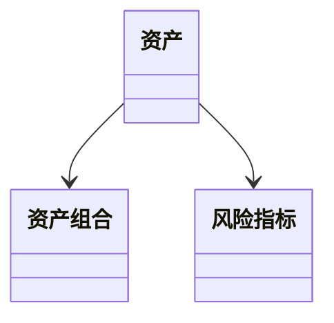
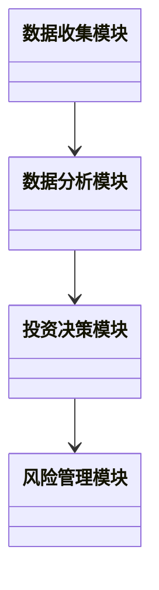

                 


# 约翰·伯格的广泛多元化vs聚焦投资

> 关键词：投资策略，约翰·伯格，广泛多元化，聚焦投资，风险收益，资产配置

> 摘要：本文深入分析了约翰·伯格提出的两种投资策略：广泛多元化和聚焦投资。通过对比分析，探讨了两种策略的核心原理、优缺点以及适用场景，并结合数学模型和算法原理，提供了系统的投资分析框架。最后，通过项目实战案例，展示了如何在实际投资中应用这些策略。

---

# 第一部分: 广泛多元化与聚焦投资的背景与核心概念

## 第1章: 投资策略的背景与问题背景

### 1.1 投资策略的多样性

#### 1.1.1 投资策略的定义与分类
投资策略是指投资者在金融市场中进行资产配置和交易时所采用的方法和原则。常见的投资策略包括价值投资、成长投资、指数投资、趋势投资等。每种策略都有其独特的理论基础和适用场景。

#### 1.1.2 广泛多元化与聚焦投资的定义
- **广泛多元化**：通过投资多种资产类别、行业或地区，分散风险，降低单一资产波动对整体投资组合的影响。
- **聚焦投资**：集中投资于少数优质资产或行业，通过深度研究和精选个股来实现超额收益。

#### 1.1.3 两种策略的核心区别与应用场景
- **核心区别**：
  - 广泛多元化注重风险分散，追求稳定收益。
  - 聚焦投资注重收益潜力，承担更高的风险。
- **应用场景**：
  - 广泛多元化适合风险厌恶型投资者或长期稳健收益目标。
  - 聚焦投资适合风险偏好型投资者或对市场有深刻理解的专业投资者。

### 1.2 投资策略的选择问题

#### 1.2.1 投资者风险偏好与收益目标
投资者的风险偏好和收益目标是选择投资策略的核心因素。风险厌恶型投资者倾向于广泛多元化，而风险偏好型投资者倾向于聚焦投资。

#### 1.2.2 市场环境对策略选择的影响
市场环境（如牛熊市、经济周期）也会影响策略的选择。例如，在牛市中，聚焦投资可能表现更好；而在熊市中，广泛多元化可能更稳健。

#### 1.2.3 投资期限与策略匹配
投资期限较长的投资者可能更适合广泛多元化，因为长期来看，市场波动会被平滑，而短期投资者可能更适合聚焦投资以抓住市场机会。

### 1.3 约翰·伯格的投资理念

#### 1.3.1 约翰·伯格的个人投资哲学
约翰·伯格是指数投资的倡导者，他强调长期投资和分散投资的重要性。他认为，长期来看，市场波动是投资的最大敌人，而分散投资可以有效降低波动风险。

#### 1.3.2 伯格对广泛多元化与聚焦投资的评价
伯格认为，广泛多元化是一种更为稳健的投资策略，尤其适合普通投资者。他不提倡聚焦投资，因为这需要投资者具备极高的市场判断能力和选股能力。

#### 1.3.3 伯格投资理念的现实意义
伯格的理念强调了投资的纪律性和长期性，反对短期投机和频繁交易。这种理念对普通投资者尤其具有指导意义。

### 1.4 本章小结

#### 1.4.1 两种投资策略的核心区别
- 广泛多元化注重风险分散，适合稳健型投资者。
- 聚焦投资注重收益潜力，适合风险偏好型投资者。

#### 1.4.2 投资者选择策略的关键因素
- 风险偏好
- 收益目标
- 市场环境
- 投资期限

#### 1.4.3 约翰·伯格投资理念的启示
- 长期投资的重要性
- 分散投资的稳健性
- 避免频繁交易的必要性

---

## 第2章: 广泛多元化与聚焦投资的核心概念

### 2.1 广泛多元化投资的原理

#### 2.1.1 多元化投资的基本原理
多元化投资的核心原理是“不要把所有鸡蛋放在一个篮子里”。通过投资不同资产类别、行业或地区的资产，可以有效降低单一资产波动带来的风险。

#### 2.1.2 资产配置的数学模型
资产配置可以通过以下数学模型进行优化：
$$ E(R_p) = \sum w_i E(R_i) $$
其中，\( E(R_p) \) 是投资组合的期望收益，\( w_i \) 是资产 \( i \) 的权重，\( E(R_i) \) 是资产 \( i \) 的期望收益。

#### 2.1.3 多元化与风险分散的关系
通过分散投资，投资组合的总风险可以被分解为系统性风险和非系统性风险。非系统性风险可以通过多元化投资被降低，而系统性风险则无法通过分散化来消除。

### 2.2 聚焦投资的原理

#### 2.2.1 聚焦投资的核心思想
聚焦投资的核心思想是通过精选优质资产（如个股或行业）来实现超额收益。这种策略依赖于对市场趋势和个股基本面的深入研究。

#### 2.2.2 个股选择与市场时机的策略
聚焦投资的关键在于选择具有强大基本面和增长潜力的个股，并在合适的时间点进行投资。

#### 2.2.3 聚焦投资的风险与收益特征
- **收益潜力**：可能获得更高收益。
- **风险**：波动性更大，且依赖于个股表现。

### 2.3 两种策略的对比分析

#### 2.3.1 理论基础对比
| 对比维度 | 广泛多元化 | 聚焦投资 |
|----------|------------|----------|
| 理论基础 | 风险分散   | 股价上涨 |
| 适用场景 | 稳健收益   | 高收益潜力 |

#### 2.3.2 风险-收益曲线对比
- 广泛多元化：收益曲线较为平缓，波动小。
- 聚焦投资：收益曲线波动大，潜在收益高。

#### 2.3.3 短期与长期表现对比
- 短期：聚焦投资可能表现更好。
- 长期：广泛多元化可能表现更稳定。

### 2.4 核心概念对比表格

| 对比维度 | 广泛多元化 | 聚焦投资 |
|----------|------------|----------|
| 风险     | 低         | 高       |
| 收益     | 稳定       | 有潜力   |
| 投资难度 | 低         | 高       |
| 适用人群 | 保守型     | 进取型   |

### 2.5 本章小结

#### 2.5.1 两种策略的核心差异
- 广泛多元化注重风险分散，收益稳定。
- 聚焦投资注重收益潜力，风险较高。

#### 2.5.2 不同市场环境下的策略选择
- 牛市：聚焦投资表现更好。
- 熊市：广泛多元化更稳健。

#### 2.5.3 约翰·伯格的平衡观点
伯格认为，广泛多元化是一种更为稳健和可持续的投资策略，尤其适合普通投资者。

---

## 第3章: 投资策略的数学模型与算法原理

### 3.1 广泛多元化投资的数学模型

#### 3.1.1 资产配置的优化模型
$$ E(R_p) = \sum w_i E(R_i) $$
其中，\( w_i \) 是资产 \( i \) 的权重，\( E(R_i) \) 是资产 \( i \) 的期望收益。

#### 3.1.2 风险分散的数学证明
通过分散投资，非系统性风险可以被降低，公式为：
$$ \sigma_p^2 = \sum w_i^2 \sigma_i^2 + \sum_{i \neq j} w_i w_j \sigma_{ij} $$
其中，\( \sigma_p^2 \) 是投资组合的方差，\( \sigma_i^2 \) 是资产 \( i \) 的方差，\( \sigma_{ij} \) 是资产 \( i \) 和 \( j \) 的协方差。

#### 3.1.3 组合收益与风险的计算公式
$$ R_p = \sum w_i R_i $$
$$ \sigma_p = \sqrt{\sum w_i^2 \sigma_i^2 + \sum_{i \neq j} w_i w_j \sigma_{ij}} $$

### 3.2 聚焦投资的数学模型

#### 3.2.1 股票选择的数学模型
聚焦投资可以通过以下步骤进行：
1. 选择具有高成长潜力的个股。
2. 计算个股的期望收益和风险。
3. 进行组合优化。

#### 3.2.2 投资组合优化的算法
使用均值-方差优化模型：
$$ \text{Minimize } \sigma_p^2 $$
$$ \text{Subject to } \sum w_i = 1 $$

### 3.3 两种策略的算法对比

#### 3.3.1 广泛多元化的算法流程
1. 收集多资产的历史数据。
2. 计算每种资产的期望收益和风险。
3. 进行资产配置优化。
4. 定期再平衡投资组合。

#### 3.3.2 聚焦投资的算法流程
1. 选择优质个股。
2. 计算个股的期望收益和风险。
3. 构建投资组合。
4. 定期监控和调整。

### 3.4 本章小结

#### 3.4.1 广泛多元化的算法优势
- 分散风险能力强。
- 计算复杂度低。

#### 3.4.2 聚焦投资的算法挑战
- 需要精准的个股选择。
- 计算复杂度高。

---

## 第4章: 系统分析与架构设计

### 4.1 投资场景介绍

#### 4.1.1 系统目标
设计一个投资管理系统，支持广泛多元化和聚焦投资两种策略。

#### 4.1.2 系统功能需求
- 数据收集：获取多资产的历史数据。
- 数据分析：计算资产的期望收益和风险。
- 投资决策：根据策略选择最优投资组合。
- 风险管理：监控投资组合的风险。

### 4.2 系统功能设计

#### 4.2.1 领域模型设计


#### 4.2.2 系统架构设计


### 4.3 本章小结

#### 4.3.1 系统设计的核心思想
- 模块化设计，便于扩展和维护。
- 数据流清晰，各模块协同工作。

#### 4.3.2 系统架构的可扩展性
- 支持多种投资策略。
- 支持多种数据源。

---

## 第5章: 项目实战

### 5.1 环境安装

#### 5.1.1 Python环境安装
- 使用Anaconda安装Python 3.8及以上版本。
- 安装必要的库：pandas、numpy、scipy。

### 5.2 核心代码实现

#### 5.2.1 广泛多元化的代码实现
```python
import numpy as np
import pandas as pd

# 假设我们有三种资产的数据
assets = ['股票', '债券', '黄金']
returns = pd.DataFrame({
    '股票': [0.1, 0.05, -0.02],
    '债券': [0.03, 0.02, 0.01],
    '黄金': [0.05, 0.03, -0.01]
})

# 计算期望收益
expected_returns = returns.mean()
print("期望收益：", expected_returns)

# 计算协方差矩阵
cov_matrix = returns.cov()
print("协方差矩阵：", cov_matrix)
```

#### 5.2.2 聚焦投资的代码实现
```python
import numpy as np
from scipy.optimize import minimize

def portfolio Optimization(returns, weights):
    # 计算投资组合的波动率
    cov = returns.cov()
    port_vol = np.sqrt(weights.T.dot(cov).dot(weights))
    return port_vol

# 约束条件
def constraint(weights):
    return np.sum(weights) - 1

# 目标函数
def objective(weights, returns):
    return portfolio_Optimization(returns, weights)

# 求解优化问题
initial_weights = np.array([1/3, 1/3, 1/3])
result = minimize(objective, initial_weights, args=(returns,), method='SLSQP', constraints={'type': 'eq', 'fun': constraint})
print("最优权重：", result.x)
```

### 5.3 本章小结

#### 5.3.1 代码实现的核心功能
- 计算资产的期望收益和风险。
- 进行投资组合优化。

#### 5.3.2 实战案例的分析与解读
- 广泛多元化：通过分散投资降低风险。
- 聚焦投资：通过精选个股实现超额收益。

---

## 第6章: 总结与最佳实践

### 6.1 本章小结

#### 6.1.1 核心观点回顾
- 广泛多元化适合稳健型投资者。
- 聚焦投资适合风险偏好型投资者。

#### 6.1.2 投资策略选择的关键因素
- 风险偏好
- 市场环境
- 投资期限

### 6.2 最佳实践 tips

#### 6.2.1 投资策略选择的注意事项
- 根据自身风险偏好选择策略。
- 定期评估投资组合。
- 避免过度交易。

#### 6.2.2 代码实现的注意事项
- 数据来源要可靠。
- 算法要经过回测。
- 风险管理要严格。

### 6.3 拓展阅读

#### 6.3.1 推荐书籍
- 《投资学》（书籍名称）
- 《投资组合管理》（书籍名称）

#### 6.3.2 推荐博客与技术资料
- [投资策略博客](链接)
- [量化投资资料](链接)

### 6.4 作者寄语

#### 6.4.1 对读者的期望
希望读者能够根据自身的实际情况，选择适合自己的投资策略，并在投资过程中保持纪律性和耐心。

#### 6.4.2 对未来展望
未来，我们将继续深入研究投资策略，并结合人工智能技术，为投资者提供更智能的投资解决方案。

---

# 作者：AI天才研究院/AI Genius Institute & 禅与计算机程序设计艺术 /Zen And The Art of Computer Programming

---

**本文由AI天才研究院原创，转载请注明出处。**

