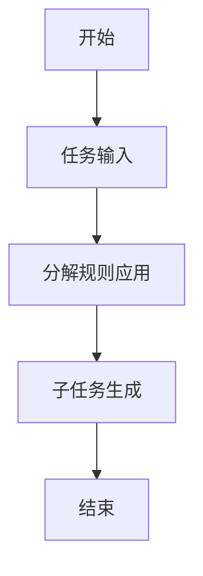
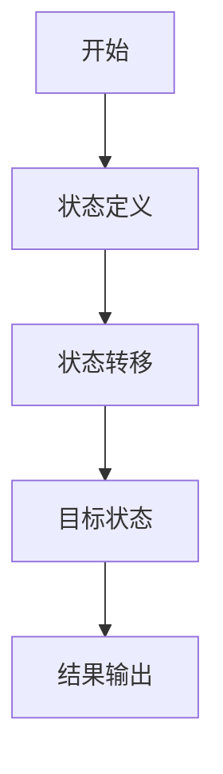

                 


# 设计AI Agent的动态任务分解与规划

> 关键词：AI Agent, 动态任务分解, 动态规划, 任务规划, 人工智能, 系统架构

> 摘要：本文详细探讨了AI Agent的动态任务分解与规划的核心概念、算法原理、系统架构设计及实际应用。通过背景介绍、核心概念分析、算法实现、系统设计和项目实战，本文为读者提供了从理论到实践的全面指导，帮助读者深入理解并掌握AI Agent的动态任务分解与规划的技术要点。

---

## 第一部分: AI Agent的动态任务分解与规划背景介绍

### 第1章: 动态任务分解与规划的背景与问题背景

#### 1.1 问题背景

##### 1.1.1 AI Agent的基本概念与特点

AI Agent（人工智能代理）是指能够感知环境、自主决策并执行任务的智能实体。AI Agent的特点包括：

- **自主性**：能够在没有外部干预的情况下自主运行。
- **反应性**：能够根据环境的变化实时调整行为。
- **目标导向性**：具有明确的目标，并致力于实现这些目标。
- **社会能力**：能够与其他Agent或人类进行交互和协作。

##### 1.1.2 动态任务分解与规划的定义

动态任务分解是指将复杂任务分解为多个子任务，并根据环境的变化动态调整分解方式。动态规划则是指在任务分解的基础上，根据当前状态和目标，制定最优的执行计划。

##### 1.1.3 动态任务分解与规划的必要性

在复杂动态环境中，AI Agent需要处理的任务往往具有不确定性、多样性和时间敏感性。动态任务分解与规划能够帮助AI Agent灵活应对环境变化，提高任务执行的效率和成功率。

#### 1.2 问题描述

##### 1.2.1 AI Agent在复杂环境中的任务处理挑战

AI Agent在复杂环境中的任务处理面临以下挑战：

- **任务复杂性**：任务可能涉及多个子任务，且子任务之间可能存在依赖关系。
- **环境不确定性**：环境中的信息可能不完整或动态变化，导致任务执行过程中需要频繁调整。
- **资源限制**：AI Agent可能受到计算资源、时间资源等限制。

##### 1.2.2 动态任务分解与规划的核心问题

动态任务分解与规划的核心问题包括：

- **任务分解的粒度**：如何确定子任务的粒度，以确保分解后的任务能够高效执行。
- **动态调整的时机**：在什么情况下需要对任务分解进行调整，以应对环境变化。
- **规划的最优性**：如何在动态变化的环境中制定最优的执行计划。

##### 1.2.3 问题边界与外延

动态任务分解与规划的边界包括：

- **任务分解的范围**：明确哪些任务需要分解，哪些任务不需要分解。
- **规划的范围**：明确规划的时间范围和空间范围。
- **外部依赖**：明确AI Agent与其他系统或人类交互的接口和依赖关系。

#### 1.3 问题解决

##### 1.3.1 动态任务分解与规划的目标

动态任务分解与规划的目标包括：

- **提高任务执行效率**：通过合理分解任务，减少不必要的重复劳动，提高执行效率。
- **增强适应性**：通过动态调整任务分解和规划，使AI Agent能够更好地适应环境变化。
- **确保任务完成质量**：通过优化任务分解和规划，确保任务完成的质量和效果。

##### 1.3.2 解决方案的基本思路

动态任务分解与规划的基本思路包括：

- **任务建模**：对任务进行建模，明确任务的结构、依赖关系和执行约束。
- **分解策略**：根据任务建模结果，制定任务分解策略，确定子任务的粒度和分解方式。
- **动态调整机制**：根据环境变化，动态调整任务分解和规划。
- **优化算法**：使用动态规划等算法，优化任务分解和规划的过程，提高效率和效果。

##### 1.3.3 解决方案的可行性分析

动态任务分解与规划的可行性分析包括：

- **技术可行性**：现有的动态规划算法和分布式计算技术能够支持动态任务分解与规划的实现。
- **资源可行性**：AI Agent的计算资源和通信资源能够支持动态任务分解与规划的实现。
- **应用可行性**：动态任务分解与规划能够应用于多个领域，如自动驾驶、机器人控制、分布式系统等。

---

### 第2章: 动态任务分解与规划的核心概念与联系

#### 2.1 核心概念原理

##### 2.1.1 动态任务分解的基本原理

动态任务分解的基本原理包括：

- **任务分解的层次性**：任务可以分解为多个子任务，子任务之间可能存在依赖关系。
- **动态调整的驱动因素**：环境变化、任务优先级变化等因素驱动任务分解的动态调整。
- **分解策略的多样性**：根据任务特性和环境变化，采用不同的分解策略。

##### 2.1.2 动态规划的核心思想

动态规划的核心思想包括：

- **最优子结构**：问题的最优解包含子问题的最优解。
- **重叠子问题**：子问题之间可能存在重叠，可以通过记忆化技术减少重复计算。
- **动态转移**：根据当前状态和决策，转移到下一个状态。

##### 2.1.3 任务分解与规划的结合

任务分解与规划的结合包括：

- **分解为规划提供基础**：任务分解为规划提供了子任务的结构和依赖关系。
- **规划指导分解**：规划的结果反向指导任务分解的策略和粒度。

#### 2.2 核心概念属性对比

##### 2.2.1 动态任务分解与静态任务分解的对比

| 属性             | 动态任务分解                | 静态任务分解                |
|------------------|---------------------------|---------------------------|
| 分解时机          | 动态变化时进行调整          | 预先分解，不考虑动态变化    |
| 分解粒度          | 根据环境变化动态调整        | 预先确定，不考虑环境变化    |
| 灵活性            | 高，能够适应环境变化        | 低，难以适应环境变化        |

##### 2.2.2 不同动态规划算法的对比

| 算法名称          | 适用场景                   | 优点                       | 缺点                       |
|------------------|--------------------------|--------------------------|--------------------------|
| 最短路径动态规划    | 图形路径规划               | 计算效率高                 | 对大规模问题计算量大       |
| 资源分配动态规划    | 资源分配优化               | 能够优化资源分配           | 对约束条件的处理复杂       |
| 序列决策动态规划    | 序列决策问题               | 能够处理序列决策问题       | 对决策的独立性要求较高     |

##### 2.2.3 任务分解与规划的相互作用

任务分解与规划的相互作用包括：

- **分解影响规划**：任务分解的粒度和结构直接影响规划的可行性和优化程度。
- **规划反哺分解**：规划的结果可以反向指导任务分解的策略和粒度。

#### 2.3 实体关系图


---

### 第3章: 动态任务分解与规划的算法原理

#### 3.1 动态任务分解的算法原理

##### 3.1.1 动态任务分解的流程



##### 3.1.2 动态任务分解的核心算法

动态任务分解的核心算法包括：

- **基于优先级的任务分解**：根据任务的优先级动态调整分解策略。
- **基于环境变化的任务分解**：根据环境变化动态调整分解策略。
- **基于子任务依赖的任务分解**：根据子任务之间的依赖关系动态调整分解策略。

##### 3.1.3 动态任务分解的数学模型

动态任务分解的数学模型可以表示为：

$$
f: T \rightarrow S
$$

其中，$T$ 表示任务集合，$S$ 表示子任务集合。

#### 3.2 动态规划的算法原理

##### 3.2.1 动态规划的基本流程

动态规划的基本流程包括：

- **状态定义**：定义问题的状态。
- **状态转移**：定义状态之间的转移关系。
- **目标状态**：定义目标状态。
- **结果输出**：输出最优解。



##### 3.2.2 动态规划的核心算法

动态规划的核心算法包括：

- **最短路径算法**：用于求解路径规划问题。
- **资源分配算法**：用于求解资源分配优化问题。
- **序列决策算法**：用于求解序列决策问题。

##### 3.2.3 动态规划的数学模型

动态规划的数学模型可以表示为：

$$
s_{i+1} = f(s_i, a_i)
$$

其中，$s_i$ 表示第 $i$ 个状态，$a_i$ 表示第 $i$ 个决策，$s_{i+1}$ 表示第 $i+1$ 个状态。

---

## 第4章: 动态任务分解与规划的系统分析与架构设计

### 4.1 系统分析与设计

#### 4.1.1 项目场景介绍

项目场景介绍包括：

- **项目目标**：设计一个能够动态分解任务并制定执行计划的AI Agent系统。
- **项目需求**：支持动态任务分解和规划，能够适应环境变化。
- **项目范围**：应用于多个领域，如自动驾驶、机器人控制等。

#### 4.1.2 系统功能设计

系统功能设计包括：

- **任务分解模块**：负责将复杂任务分解为子任务。
- **动态调整模块**：负责根据环境变化动态调整任务分解和规划。
- **规划模块**：负责制定最优的执行计划。
- **执行模块**：负责执行分解后的任务。

#### 4.1.3 系统架构设计

系统架构设计包括：

- **分层架构**：将系统分为感知层、分解层、规划层和执行层。
- **模块化架构**：将系统划分为多个功能模块，模块之间通过接口进行通信。


#### 4.1.4 系统接口设计

系统接口设计包括：

- **任务分解接口**：提供任务分解的功能接口。
- **动态调整接口**：提供动态调整任务分解和规划的接口。
- **规划接口**：提供制定执行计划的接口。
- **执行接口**：提供执行分解后的任务的接口。

#### 4.1.5 系统交互设计

系统交互设计包括：

- **用户与系统的交互**：用户可以通过界面与系统进行交互，输入任务和调整参数。
- **系统内部交互**：系统内部模块之间通过接口进行交互，确保系统的协调运行。


---

## 第5章: 动态任务分解与规划的项目实战

### 5.1 项目实战

#### 5.1.1 环境安装

环境安装包括：

- **安装Python**：安装最新版本的Python。
- **安装依赖库**：安装所需的依赖库，如numpy、pandas、scipy等。

#### 5.1.2 核心实现

核心实现包括：

- **任务分解模块的实现**：实现任务分解的核心算法。
- **动态调整模块的实现**：实现动态调整任务分解和规划的核心算法。
- **规划模块的实现**：实现制定最优执行计划的核心算法。
- **执行模块的实现**：实现分解后任务的执行。

#### 5.1.3 代码实现

以下是动态任务分解与规划的核心代码实现：

```python
import numpy as np

def dynamic_task_decomposition(tasks):
    subtasks = []
    for task in tasks:
        subtasks.extend(decompose_task(task))
    return subtasks

def decompose_task(task):
    # 根据任务类型分解任务
    if task.type == 'complex':
        return complex_decomposition(task)
    elif task.type == 'simple':
        return simple_decomposition(task)
    else:
        return []

def complex_decomposition(task):
    # 复杂任务分解
    subtasks = []
    for step in task.steps:
        subtasks.append(step)
    return subtasks

def simple_decomposition(task):
    # 简单任务分解
    return [task]

def dynamic_planning(subtasks, environment):
    # 动态规划算法实现
    states = initialize_states(subtasks, environment)
    for state in states:
        update_state(state, environment)
    return optimal_plan(states)
```

#### 5.1.4 案例分析

案例分析包括：

- **案例1**：自动驾驶中的动态任务分解与规划。
- **案例2**：机器人路径规划中的动态任务分解与规划。
- **案例3**：分布式系统中的动态任务分解与规划。

---

## 第6章: 总结与扩展

### 6.1 最佳实践

最佳实践包括：

- **任务分解的粒度**：根据任务特性和环境变化动态调整分解粒度。
- **动态调整的时机**：在环境变化时及时进行动态调整。
- **算法优化**：根据具体场景优化动态任务分解与规划算法。

### 6.2 小结

本文详细探讨了AI Agent的动态任务分解与规划的核心概念、算法原理、系统架构设计及实际应用。通过背景介绍、核心概念分析、算法实现、系统设计和项目实战，本文为读者提供了从理论到实践的全面指导。

### 6.3 注意事项

注意事项包括：

- **资源限制**：动态任务分解与规划需要考虑计算资源和通信资源的限制。
- **环境不确定性**：动态任务分解与规划需要能够应对环境的不确定性。
- **安全性**：动态任务分解与规划需要考虑系统的安全性。

### 6.4 拓展阅读

拓展阅读包括：

- **动态规划的经典算法**：如Dijkstra算法、Bellman-Ford算法等。
- **任务分解与规划的结合**：如任务规划系统（TPS）等。
- **AI Agent的应用场景**：如自动驾驶、机器人控制、分布式系统等。

---

## 作者

作者：AI天才研究院/AI Genius Institute & 禅与计算机程序设计艺术/Zen And The Art of Computer Programming

