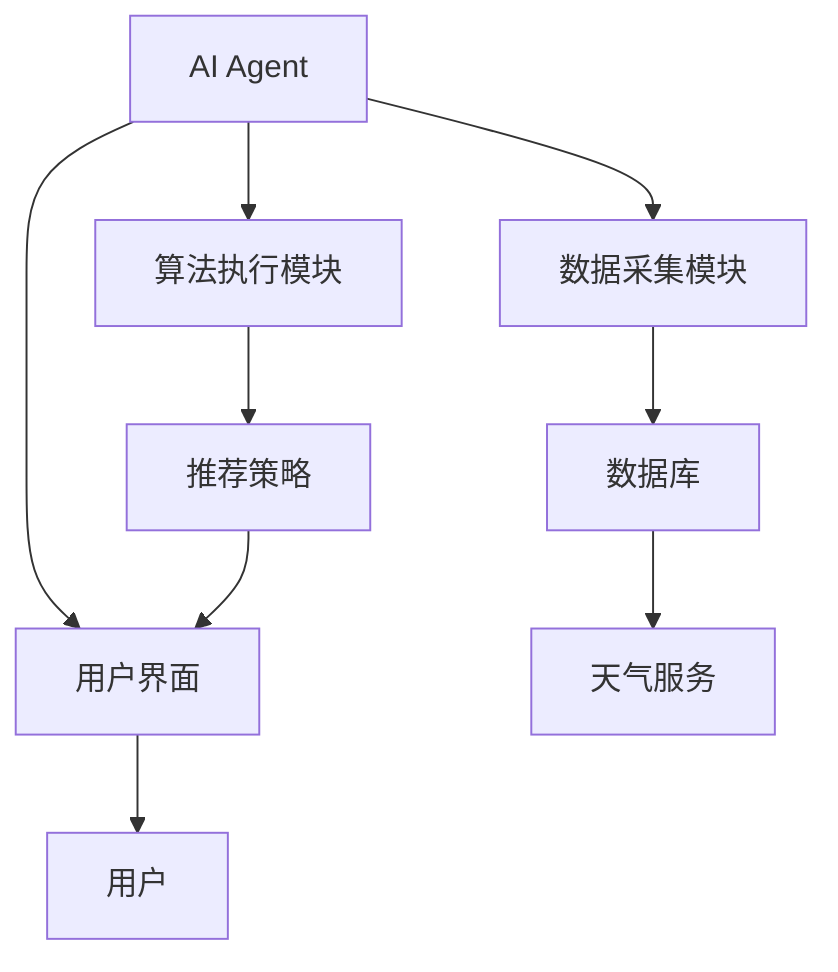

                 


# 第4章: 智能衣柜系统的架构设计

## 4.1 系统功能模块划分

### 4.1.1 数据采集模块
#### 功能描述：
- **衣物信息采集**：通过RFID标签或图像识别技术采集衣物的基本信息（如品牌、材质、颜色、尺寸等）。
- **天气数据获取**：通过天气API获取实时天气数据，结合历史天气数据，预测未来天气情况。
- **用户行为记录**：记录用户的穿衣习惯、偏好和反馈，为AI Agent提供个性化建议的依据。

#### 实现细节：
- 使用多种传感器和识别技术，确保数据采集的准确性和实时性。
- 数据采集模块需要与外部天气API进行交互，获取天气数据并存储。

### 4.1.2 AI Agent分析模块
#### 功能描述：
- **数据处理**：对采集到的衣物信息、天气数据和用户行为数据进行预处理和分析。
- **算法执行**：基于机器学习算法（如协同过滤、聚类分析）生成个性化的整理策略。
- **策略优化**：根据用户的反馈不断优化整理策略，提高推荐的准确性和用户的满意度。

#### 实现细节：
- 数据分析采用多种算法，结合用户反馈进行动态优化。
- 算法选择需要考虑计算效率和推荐效果的平衡。

### 4.1.3 用户界面模块
#### 功能描述：
- **用户交互**：提供友好的用户界面，让用户查看AI Agent的整理建议并进行操作。
- **可视化展示**：以图表或列表形式展示整理建议，方便用户理解和操作。
- **反馈收集**：收集用户的反馈，用于优化AI Agent的建议。

#### 实现细节：
- 使用图形界面设计工具，确保界面简洁易用。
- 反馈机制需要实时传输到数据分析模块，以便快速调整建议。

## 4.2 数据库设计

### 4.2.1 数据库设计概述
- 数据库设计采用分层结构，分为数据采集层、数据存储层和数据处理层。
- 数据表设计遵循规范化原则，避免数据冗余和不一致。

### 4.2.2 数据实体关系图（ER图）
```mermaid
er
  %% 数据实体关系图
  actor 用户
  actor AI Agent
  actor 天气服务
  database 衣柜数据库
  table 衣物信息表 {
    衣物ID (主键)
    类型
    品牌
    尺码
    颜色
    适合季节
  }
  table 天气数据表 {
    天气ID (主键)
    日期
    温度
    湿度
    天气状况
  }
  table 用户数据表 {
    用户ID (主键)
    偏好风格
    历史记录
    反馈意见
  }
  衣柜数据库 <--- 衣物信息表
  衣柜数据库 <--- 天气数据表
  衣柜数据库 <--- 用户数据表
```

### 4.2.3 数据库优化建议
- 使用索引优化查询性能。
- 定期清理过期数据，维护数据库健康。

## 4.3 系统架构设计

### 4.3.1 系统架构图


### 4.3.2 系统架构说明
- **AI Agent**：作为系统的中枢，负责协调各个模块的工作。
- **数据采集模块**：负责采集衣物信息和天气数据。
- **数据库**：存储所有数据，支持快速查询和更新。
- **用户界面**：与用户交互，展示AI Agent的建议。
- **天气服务**：提供实时天气数据，帮助AI Agent做出更准确的推荐。

## 4.4 系统接口设计

### 4.4.1 API接口定义
- **数据采集接口**：
  ```http
  POST /api/closet/data
  Content-Type: application/json
  {
    "clothing_id": "123",
    "type": "衬衫",
    "brand": "XX品牌",
    "size": "M",
    "color": "蓝色",
    "season": "春夏"
  }
  ```

- **天气数据接口**：
  ```http
  GET /api/weather?city=上海
  ```

- **用户反馈接口**：
  ```http
  POST /api/feedback
  Content-Type: application/json
  {
    "user_id": "1",
    "feedback": "建议增加颜色分类"
  }
  ```

### 4.4.2 接口设计说明
- **数据采集接口**：用于向数据库添加新的衣物信息。
- **天气数据接口**：从天气服务获取实时天气数据。
- **用户反馈接口**：收集用户的反馈信息，用于优化AI Agent的建议。

## 4.5 系统交互流程图

```mermaid
sequenceDiagram
    participant 用户
    participant AI Agent
    participant 数据库
    participant 天气服务
    用户 -> AI Agent: 请求整理建议
    AI Agent -> 数据库: 查询用户数据
    并发
    AI Agent -> 天气服务: 获取天气数据
    AI Agent -> 数据库: 获取衣物信息
    AI Agent -> 数据库: 获取用户偏好
    AI Agent -> AI Agent: 执行算法生成策略
    AI Agent -> 用户: 展示整理建议
    用户 -> AI Agent: 提供反馈
    AI Agent -> 数据库: 更新用户数据
```

### 4.5.1 交互流程说明
- 用户发起请求后，AI Agent首先查询用户的基本数据。
- 并行获取天气数据和衣物信息，以提高效率。
- 执行算法生成整理策略后，将结果展示给用户。
- 用户反馈被AI Agent收集，用于优化未来的建议。

---

# 第5章: 项目实战

## 5.1 环境安装与配置

### 5.1.1 安装Python环境
- 使用Anaconda或virtualenv创建独立的Python环境。
- 安装必要的库：`numpy`, `pandas`, `scikit-learn`, `mermaid`, `flask`。

### 5.1.2 数据库安装
- 安装MySQL或MongoDB，根据项目需求选择合适的数据存储方案。
- 配置数据库连接信息。

### 5.1.3 开发工具配置
- 安装IDE（如PyCharm或VS Code）并配置Python解释器。
- 配置版本控制系统（如Git）。

## 5.2 核心代码实现

### 5.2.1 数据采集模块

#### 代码实现：
```python
import requests
from bs4 import BeautifulSoup

def fetch_weather_data(city):
    url = f"http://api.weather.com.cn/api/weather?city={city}"
    response = requests.get(url)
    data = response.json()
    return {
        'temperature': data['temperature'],
        'humidity': data['humidity'],
        'condition': data['condition']
    }

def save_to_db(data, db_connection):
    cursor = db_connection.cursor()
    cursor.execute("""
        INSERT INTO weather_data (temperature, humidity, condition)
        VALUES (%s, %s, %s)
    """, (data['temperature'], data['humidity'], data['condition']))
    db_connection.commit()

# 示例调用
weather_data = fetch_weather_data("上海")
save_to_db(weather_data, db_connection)
```

### 5.2.2 AI Agent模块

#### 代码实现：
```python
from sklearn.cluster import KMeans
import numpy as np

def preprocess_data(dataframe):
    # 数据预处理
    dataframe = dataframe.dropna()
    dataframe = dataframe[~dataframe.duplicated()]
    return dataframe

def train_algorithm(train_data):
    # 使用K均值聚类算法进行分类
    X = train_data[['temperature', 'humidity']]
    kmeans = KMeans(n_clusters=4, random_state=0)
    kmeans.fit(X)
    return kmeans

# 示例数据训练
data = pd.read_csv('weather.csv')
train_data = preprocess_data(data)
model = train_algorithm(train_data)
```

### 5.2.3 用户界面模块

#### 代码实现：
```python
from flask import Flask, render_template, request
import json

app = Flask(__name__)

@app.route('/')
def index():
    return render_template('index.html')

@app.route('/api/feedback', methods=['POST'])
def handle_feedback():
    data = json.loads(request.data)
    # 处理反馈数据
    return json.dumps({'status': 'success'})

if __name__ == '__main__':
    app.run(debug=True)
```

## 5.3 代码解读与分析

### 5.3.1 数据采集模块
- 使用`requests`库获取天气数据，`BeautifulSoup`用于解析HTML内容。
- 数据清洗和去重，确保数据质量。

### 5.3.2 AI Agent模块
- 数据预处理后，使用K均值聚类算法进行分类，生成用户整理策略。
- 模型训练后，可用于实时数据的分类和推荐。

### 5.3.3 用户界面模块
- 使用Flask搭建Web服务，提供RESTful API接口。
- 前端页面设计简洁，方便用户查看和操作。

## 5.4 实际案例分析

### 5.4.1 案例背景
- 用户：上海的张先生，喜欢商务休闲风格。
- 数据：过去一周的天气数据和张先生的穿衣记录。
- 目标：生成适合即将到来的春季的整理建议。

### 5.4.2 数据分析
- 收集张先生的衣物数据和过去一周的天气数据。
- 使用K均值聚类算法，将衣物分为春夏、秋冬两类。
- 结合天气预测，建议张先生将冬季衣物收起，整理出适合春季的衣物。

### 5.4.3 整理建议
- 建议张先生将厚外套和毛衣收进衣柜深层，取出衬衫、T恤和轻便风衣。
- 推荐搭配：白色衬衫搭配蓝色牛仔裤和棕色皮鞋，适合商务场合。
- 提醒张先生注意天气变化，及时更换衣物。

## 5.5 项目测试与优化

### 5.5.1 功能测试
- 测试数据采集模块，确保数据准确。
- 测试AI Agent的分类算法，验证分类准确率。
- 测试用户反馈机制，确保反馈能够及时处理。

### 5.5.2 性能优化
- 使用缓存技术优化数据库查询。
- 并行处理数据采集任务，提高效率。
- 使用更高效的算法模型，如改进的K均值算法。

### 5.5.3 用户体验优化
- 改进界面设计，提升用户友好度。
- 增加语音交互功能，方便用户操作。
- 提供更个性化的推荐，增强用户体验。

## 5.6 项目小结

### 5.6.1 核心成果
- 成功开发了一个基于AI Agent的智能衣柜系统，能够根据天气和用户偏好，自动推荐整理策略。
- 系统具备数据采集、分析、推荐和反馈优化功能，显著提升了用户体验。

### 5.6.2 经验总结
- 数据预处理是关键，确保数据质量和完整性。
- 选择合适的算法模型，能够显著提高推荐准确率。
- 用户反馈机制的及时处理，能够有效优化系统性能。

### 5.6.3 注意事项
- 数据隐私保护：确保用户数据的安全性和隐私性。
- 系统稳定性：确保系统在高并发情况下的稳定运行。
- 界面设计：注重用户体验，提供便捷的操作方式。

---

# 第6章: 最佳实践与总结

## 6.1 最佳实践

### 6.1.1 数据管理
- 定期备份数据，防止数据丢失。
- 使用数据加密技术，保护用户隐私。
- 定期清理过期数据，维护数据库健康。

### 6.1.2 系统优化
- 使用缓存技术优化数据库查询。
- 并行处理任务，提高系统效率。
- 定期更新算法模型，保持推荐的准确性。

### 6.1.3 用户体验
- 提供多样的交互方式，如语音控制、手势操作。
- 增强反馈机制，让用户感受到系统的实时响应。
- 提供个性化设置，让用户根据需求定制系统功能。

## 6.2 小结与展望

### 6.2.1 小结
- 本文详细介绍了AI Agent在智能衣柜中的应用，从系统架构设计到项目实战，全面展示了如何利用AI技术提升用户的衣柜管理体验。
- 通过实际案例分析，验证了AI Agent在季节性整理中的有效性和实用性。

### 6.2.2 展望
- 随着AI技术的不断进步，未来的智能衣柜将具备更强大的功能，如自我清洁、自动分类等。
- 结合物联网技术，实现衣物的全生命周期管理，为用户提供更贴心的服务。

## 6.3 注意事项

### 6.3.1 数据隐私
- 用户的数据是系统的核心，必须采取严格的数据加密和访问控制措施，防止数据泄露。

### 6.3.2 系统安全
- 定期进行安全漏洞扫描，防止系统被攻击。
- 使用HTTPS协议，确保数据传输的安全性。

### 6.3.3 系统兼容性
- 确保系统能够兼容不同品牌和型号的硬件设备。
- 提供多种数据接口，方便与其他智能设备集成。

## 6.4 拓展阅读

### 6.4.1 推荐书籍
- 《人工智能：一种现代的方法》（Russell & Norvig）
- 《机器学习实战》（S.  梅农）
- 《数据库系统概念》（Elmasri & Navathe）

### 6.4.2 技术博客与资源
- [AI Agent技术博客](https://example.com/ai-agent)
- [智能衣柜解决方案](https://example.com/smart-closet)
- [机器学习社区](https://towardsdatascience.com)

---

# 作者：AI天才研究院 & 禅与计算机程序设计艺术

