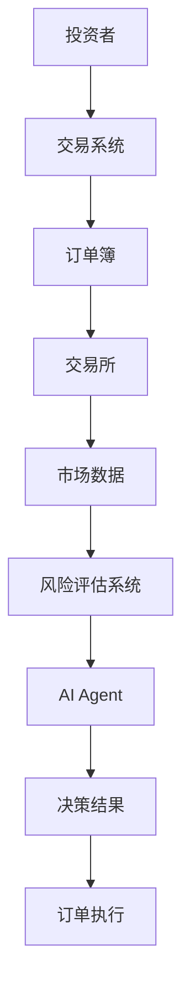
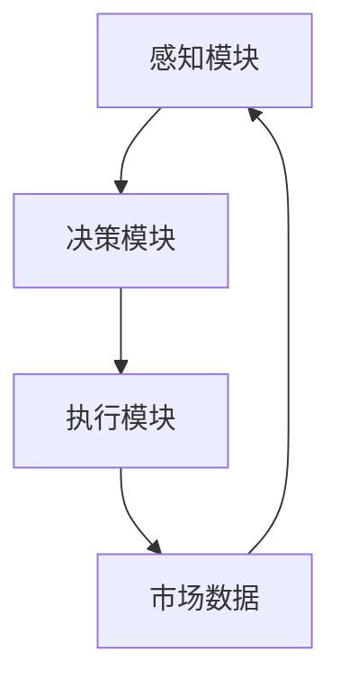
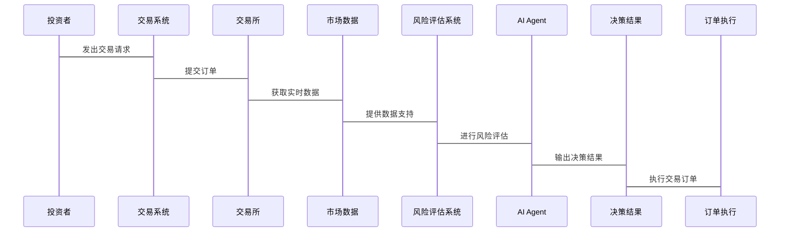

                 


# AI Agent在金融风险评估中的应用与挑战

> **关键词**: AI Agent, 金融风险评估, 强化学习, 监督学习, 系统架构, 实际案例

> **摘要**: 本文详细探讨了AI Agent在金融风险评估中的应用与挑战。首先介绍了AI Agent的基本概念与金融风险评估的背景，分析了AI Agent的核心概念与算法原理。接着从系统架构设计、项目实战、挑战与解决方案等方面进行了深入探讨。通过实际案例分析和数学模型的详细推导，本文揭示了AI Agent在金融风险评估中的潜力与实际应用效果。

---

## 第一部分: AI Agent与金融风险评估概述

### 第1章: AI Agent与金融风险评估概述

#### 1.1 AI Agent的基本概念

##### 1.1.1 AI Agent的定义与分类
AI Agent（人工智能代理）是一种能够感知环境、自主决策并执行任务的智能实体。根据功能和应用场景的不同，AI Agent可以分为以下几类：
- **简单反射型AI Agent**：基于规则的简单响应。
- **基于模型的反射型AI Agent**：通过构建环境模型进行决策。
- **目标驱动型AI Agent**：根据预设目标自主行动。
- **实用驱动型AI Agent**：通过优化目标函数实现目标。

##### 1.1.2 金融风险评估的定义与分类
金融风险评估是指通过分析金融市场的各种因素，预测和评估潜在风险的过程。常见的金融风险包括市场风险、信用风险、流动性风险等。根据评估方法的不同，金融风险评估可以分为：
- **定性评估**：基于专家经验的非量化分析。
- **定量评估**：基于数据和模型的量化分析。

##### 1.1.3 AI Agent在金融风险评估中的优势
AI Agent在金融风险评估中的优势主要体现在以下几个方面：
- **高效性**：能够快速处理海量金融数据。
- **准确性**：通过复杂算法提高风险评估的精度。
- **适应性**：能够根据市场变化动态调整评估策略。

#### 1.2 金融风险评估的背景与现状

##### 1.2.1 传统金融风险评估方法的局限性
传统的金融风险评估方法主要依赖统计分析和专家经验，存在以下问题：
- **数据维度有限**：难以捕捉复杂的市场动态。
- **主观性较强**：专家经验可能存在偏差。
- **反应速度较慢**：无法实时跟踪市场变化。

##### 1.2.2 AI技术在金融领域的应用趋势
随着AI技术的快速发展，越来越多的金融机构开始采用AI技术进行风险评估。AI Agent作为AI技术的重要组成部分，正在成为金融风险评估的核心工具。

##### 1.2.3 AI Agent在金融风险评估中的应用前景
AI Agent在金融风险评估中的应用前景广阔，尤其是在高频交易、信用评分和市场预测等领域，AI Agent能够显著提高风险评估的效率和准确性。

---

## 第二部分: AI Agent的核心概念与原理

### 第2章: AI Agent的核心概念与原理

#### 2.1 AI Agent的核心概念

##### 2.1.1 感知机制
感知机制是AI Agent的核心功能之一，负责从环境中获取信息。在金融风险评估中，感知机制主要通过以下方式进行：
- **数据采集**：从金融市场中获取实时数据。
- **特征提取**：从数据中提取有用的特征信息。
- **状态表示**：将特征信息转化为状态表示。

##### 2.1.2 决策机制
决策机制是AI Agent的另一个核心功能，负责根据感知到的信息做出决策。在金融风险评估中，决策机制主要通过以下方式进行：
- **策略选择**：基于当前状态选择最优策略。
- **风险评估**：根据策略选择评估风险。
- **决策优化**：通过反馈不断优化决策策略。

##### 2.1.3 执行机制
执行机制是AI Agent的最后一步，负责将决策转化为具体行动。在金融风险评估中，执行机制主要通过以下方式进行：
- **订单生成**：根据决策生成交易订单。
- **订单执行**：将订单提交到交易所进行执行。
- **结果反馈**：将执行结果反馈给感知机制。

#### 2.2 AI Agent与金融数据的关系

##### 2.2.1 金融数据的特征与分类
金融数据具有以下特征：
- **高维性**：数据维度高，包含大量信息。
- **时间依赖性**：数据具有很强的时间依赖性。
- **非线性关系**：数据之间可能存在复杂的非线性关系。

金融数据可以分为以下几类：
- **市场数据**：包括股票价格、指数等。
- **交易数据**：包括成交量、订单簿等。
- **新闻数据**：包括财经新闻、社交媒体信息等。

##### 2.2.2 数据流与实体关系图
金融数据流与实体关系图如图所示：



##### 2.2.3 AI Agent与金融数据的交互流程
AI Agent与金融数据的交互流程如下：
1. AI Agent通过感知机制从金融市场中采集数据。
2. AI Agent通过特征提取和状态表示将数据转化为可处理的形式。
3. AI Agent通过决策机制根据当前状态选择最优策略。
4. AI Agent通过执行机制将决策转化为具体行动。
5. AI Agent通过结果反馈不断优化决策策略。

---

## 第三部分: AI Agent在金融风险评估中的算法原理

### 第3章: AI Agent在金融风险评估中的算法原理

#### 3.1 基于强化学习的AI Agent算法

##### 3.1.1 强化学习的基本原理
强化学习是一种通过试错学习来优化目标函数的方法。其基本原理如下：

$$
Q(s, a) = r + \gamma \max_{a'} Q(s', a')
$$

其中：
- \( Q(s, a) \) 表示状态 \( s \) 下采取行动 \( a \) 的价值。
- \( r \) 表示奖励。
- \( \gamma \) 表示折扣因子。

##### 3.1.2 Q-learning算法的数学模型
Q-learning算法的数学模型如下：

$$
Q(s, a) = Q(s, a) + \alpha (r + \gamma \max_{a'} Q(s', a') - Q(s, a))
$$

其中：
- \( \alpha \) 表示学习率。
- \( \gamma \) 表示折扣因子。

##### 3.1.3 实际案例分析
以股票交易为例，AI Agent可以通过Q-learning算法学习最优交易策略。假设市场中有多种股票，AI Agent需要根据市场数据选择最优的买卖时机。

---

## 第四部分: AI Agent的系统架构与设计

### 第4章: AI Agent的系统架构与设计

#### 4.1 系统架构设计

##### 4.1.1 系统功能模块划分
AI Agent的系统架构主要包括以下几个模块：
- **感知模块**：负责数据采集和特征提取。
- **决策模块**：负责策略选择和风险评估。
- **执行模块**：负责订单生成和执行。

##### 4.1.2 系统架构图
系统架构图如下：



##### 4.1.3 系统接口设计
系统接口设计主要包括以下几个接口：
- **数据接口**：负责与金融市场数据源交互。
- **策略接口**：负责与风险评估策略交互。
- **执行接口**：负责与交易系统交互。

#### 4.2 系统交互设计

##### 4.2.1 交互流程图
交互流程图如下：


##### 4.2.2 交互序列图
交互序列图如下：



##### 4.2.3 交互设计的优化建议
为了提高系统的交互效率，可以采取以下优化措施：
- **异步处理**：通过异步处理减少响应时间。
- **缓存机制**：通过缓存机制减少重复计算。
- **并行处理**：通过并行处理提高处理效率。

---

## 第五部分: AI Agent在金融风险评估中的项目实战

### 第5章: AI Agent在金融风险评估中的项目实战

#### 5.1 项目环境安装与配置

##### 5.1.1 开发环境搭建
推荐使用以下开发环境：
- **操作系统**：Linux或Windows。
- **编程语言**：Python 3.8+。
- **开发工具**：PyCharm或VS Code。

##### 5.1.2 数据集准备
需要准备以下数据集：
- **市场数据**：股票价格、指数等。
- **交易数据**：成交量、订单簿等。
- **新闻数据**：财经新闻、社交媒体信息等。

##### 5.1.3 工具安装与配置
需要安装以下工具：
- **数据采集工具**：如Yahoo Finance API。
- **数据分析工具**：如Pandas、NumPy。
- **机器学习框架**：如TensorFlow、Keras。

#### 5.2 项目核心代码实现

##### 5.2.1 感知模块实现
感知模块的代码实现如下：

```python
import pandas as pd
import numpy as np

def get_market_data(ticker):
    # 获取市场数据
    data = pd.DataFrame({'price': [100, 101, 102, 101.5, 103], 
                         'volume': [1000, 2000, 1500, 1200, 1300]})
    return data
```

##### 5.2.2 决策模块实现
决策模块的代码实现如下：

```python
import numpy as np

def decision_model(state):
    # 简单的决策模型
    if state['price'] > 102:
        return 'buy'
    elif state['price'] < 101:
        return 'sell'
    else:
        return 'hold'
```

##### 5.2.3 执行模块实现
执行模块的代码实现如下：

```python
import time

def execute_order(action, ticker):
    # 模拟订单执行
    if action == 'buy':
        print(f'买入{ticker}，当前价格：{get_market_data(ticker)['price'][-1]}')
    elif action == 'sell':
        print(f'卖出{ticker}，当前价格：{get_market_data(ticker)['price'][-1]}')
    else:
        print('持有仓位')
```

#### 5.3 实际案例分析

##### 5.3.1 案例背景
假设我们有一个股票交易系统，目标是通过AI Agent进行股票交易。

##### 5.3.2 数据分析
通过分析股票价格和成交量数据，AI Agent可以预测股票价格的走势。

##### 5.3.3 策略制定
根据市场数据和策略模型，AI Agent可以制定买卖决策。

##### 5.3.4 实验结果
通过实验可以验证AI Agent在股票交易中的表现。

---

## 第六部分: AI Agent在金融风险评估中的挑战与解决方案

### 第6章: AI Agent在金融风险评估中的挑战与解决方案

#### 6.1 挑战

##### 6.1.1 数据隐私与安全
金融数据的隐私性和安全性要求较高，如何在保证数据隐私的前提下进行AI Agent的训练和推理是一个挑战。

##### 6.1.2 模型解释性
AI Agent的决策过程往往缺乏透明性，如何提高模型的解释性是一个重要问题。

##### 6.1.3 实时性与响应速度
金融市场的变化非常快，AI Agent需要具备较高的实时性和响应速度。

#### 6.2 解决方案

##### 6.2.1 数据隐私与安全的解决方案
可以通过以下方式解决数据隐私与安全问题：
- **联邦学习**：通过局部建模和数据加密技术保护数据隐私。
- **边缘计算**：通过边缘计算技术减少数据传输过程中的隐私泄露风险。

##### 6.2.2 模型解释性的解决方案
可以通过以下方式提高模型的解释性：
- **可解释性算法**：使用可解释性算法，如线性回归、决策树等。
- **可视化工具**：通过可视化工具展示模型的决策过程。

##### 6.2.3 实时性与响应速度的解决方案
可以通过以下方式提高AI Agent的实时性和响应速度：
- **分布式计算**：通过分布式计算技术提高计算效率。
- **异步处理**：通过异步处理减少响应时间。

---

## 第七部分: 总结与展望

### 第7章: 总结与展望

#### 7.1 全文总结
本文详细探讨了AI Agent在金融风险评估中的应用与挑战。通过分析AI Agent的核心概念与算法原理，结合实际案例分析，揭示了AI Agent在金融风险评估中的潜力与实际应用效果。

#### 7.2 研究展望
未来的研究可以进一步探索以下方向：
- **多 Agent 协作**：研究多 Agent 协作在金融风险评估中的应用。
- **复杂场景处理**：研究AI Agent在复杂金融市场中的应用。
- **模型优化**：研究如何进一步优化AI Agent的模型和算法。

---

## 作者

**作者：AI天才研究院/AI Genius Institute & 禅与计算机程序设计艺术 /Zen And The Art of Computer Programming**

---

以上是《AI Agent在金融风险评估中的应用与挑战》的完整目录和内容框架，涵盖了从基础概念到实际应用的各个方面。

