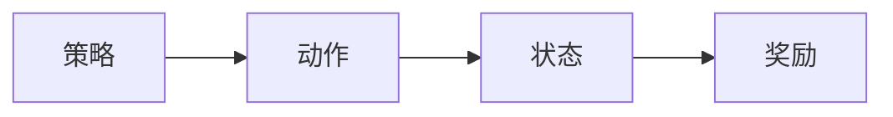

                 


# AI Agent的强化学习在游戏AI中的进阶应用

> 关键词：AI Agent，强化学习，游戏AI，Q-learning，Deep Q-Networks，数学模型

> 摘要：本文深入探讨AI Agent在游戏AI中的强化学习应用，涵盖背景、核心概念、算法原理、系统架构、项目实战及优化建议，结合详细案例和数学模型，帮助读者全面掌握强化学习在游戏AI中的应用。

---

## 第一部分: AI Agent与强化学习基础

### 第1章: AI Agent与强化学习概述

#### 1.1 AI Agent的基本概念

- **AI Agent的定义与特点**
  - AI Agent是具有感知环境和自主决策能力的智能体。
  - 具备目标导向性、自主性、反应性、社会性等特点。

- **强化学习的基本原理**
  - 强化学习：通过试错机制，智能体通过与环境交互，学习策略以最大化累积奖励。
  - 核心要素：状态、动作、奖励、策略。

- **游戏AI中的AI Agent应用**
  - 游戏AI：模拟玩家行为，提升游戏体验和智能性。
  - 典型应用：棋类游戏、策略游戏、动作游戏。

#### 1.2 游戏AI中的强化学习应用

- **游戏AI的基本结构**
  - 智能体与环境交互：接收状态，选择动作，获得奖励。
  - 状态空间：游戏中的各种可能情况。
  - 动作空间：智能体可执行的操作。

- **强化学习在游戏AI中的优势**
  - 自适应学习：智能体能根据环境变化调整策略。
  - 高复杂度任务：适用于复杂游戏规则和策略。

- **游戏AI的挑战与未来方向**
  - 状态空间和动作空间的维度高，导致计算复杂。
  - 解决方案：深度学习结合强化学习，提升计算效率。

### 第2章: 强化学习的核心概念与联系

#### 2.1 强化学习的核心原理

- **策略与价值函数的数学模型**
  - 策略：函数π(s)→a，定义状态s到动作a的映射。
  - 价值函数：Q(s,a)或V(s)，评估状态s下动作a的价值。

- **奖励函数的设计原则**
  - 设计奖励函数：明确智能体的目标，合理分配奖励。
  - 示例：在游戏任务中，奖励可以是完成任务的分数或到达终点的奖励。

- **探索与利用的平衡策略**
  - 探索：尝试新动作，发现更好的策略。
  - 利用：利用已知最佳策略，最大化累积奖励。
  - 平衡：避免陷入局部最优，提升全局优化能力。

#### 2.2 核心概念对比表

| **概念**      | **定义**                                                                 |
|----------------|--------------------------------------------------------------------------|
| 策略（π）      | 状态到动作的映射函数，定义智能体在每个状态下选择的动作。               |
| 价值函数（Q）  | 衡量某个状态下采取某个动作的价值，用于指导策略的选择。               |
| 奖励函数（r）  | 指导智能体行为的反馈，强化智能体的正确行为。                           |
| 状态空间（S）  | 智能体可能遇到的所有状态的集合。                                       |
| 动作空间（A）  | 智能体在每个状态下可执行的所有动作的集合。                             |

#### 2.3 Mermaid流程图：策略与奖励的关系



### 第3章: 强化学习算法原理

#### 3.1 Q-learning算法

- **Q-learning的基本原理**
  - 离线算法：智能体在内存中记录经验，不实时更新Q值。
  - 更新规则：Q(s,a) = Q(s,a) + α(r + γ max Q(s',a') - Q(s,a))。
  - 参数：学习率α，折扣因子γ。

- **Q-learning的数学模型**
  $$ Q(s,a) = Q(s,a) + \alpha (r + \gamma \max Q(s',a') - Q(s,a)) $$

- **代码实现示例**
  ```python
  import numpy as np

  class QLearning:
      def __init__(self, state_space, action_space, alpha=0.1, gamma=0.9):
          self.Q = np.zeros((state_space, action_space))
          self.alpha = alpha
          self.gamma = gamma

      def update(self, state, action, reward, next_state):
          self.Q[state, action] += self.alpha * (reward + self.gamma * np.max(self.Q[next_state]) - self.Q[state, action])
  ```

#### 3.2 Deep Q-Networks (DQN)

- **DQN的基本原理**
  - 使用神经网络近似Q值函数。
  - 经验回放：存储历史经验，减少相关样本，加速收敛。

- **DQN的数学模型**
  - 目标函数：最小化预测Q值与目标Q值的差。
  $$ \text{损失函数} = \mathbb{E}[(r + \gamma Q(s',a') - Q(s,a))^2] $$

- **代码实现示例**
  ```python
  import torch
  import torch.nn as nn

  class DQN(nn.Module):
      def __init__(self, input_dim, output_dim):
          super(DQN, self).__init__()
          self.fc = nn.Linear(input_dim, 64)
          self.fc2 = nn.Linear(64, output_dim)

      def forward(self, x):
          x = torch.relu(self.fc(x))
          return torch.relu(self.fc2(x))
  ```

---

## 第二部分: 游戏AI中的强化学习应用

### 第4章: 系统架构设计

#### 4.1 游戏AI系统介绍

- **游戏环境**：如《超级马里奥》中的游戏场景。
- **智能体**：负责感知环境和决策。
- **奖励机制**：设定奖励函数，如得分、到达终点等。

#### 4.2 领域模型设计

- **Mermaid类图：领域模型**
  ```mermaid
  classDiagram
      class GameEnvironment {
          state;
          get_state();
          apply_action(action);
          get_reward();
      }
      class AI_Agent {
          state;
          choose_action();
          update_policy();
      }
      GameEnvironment <--> AI_Agent
  ```

#### 4.3 系统架构设计

- **Mermaid架构图：系统架构**
  ```mermaid
  rectangle GameEnvironment {
      state
      apply_action
      get_reward
  }
  rectangle AI_Agent {
      state
      choose_action
      update_policy
  }
  GameEnvironment --> AI_Agent: get_state
  AI_Agent --> GameEnvironment: apply_action
  GameEnvironment --> AI_Agent: get_reward
  ```

#### 4.4 接口设计与交互

- **序列图：系统交互**
  ```mermaid
  sequenceDiagram
      participant GameEnvironment
      participant AI_Agent
      GameEnvironment -> AI_Agent: get_state
      AI_Agent -> GameEnvironment: apply_action
      GameEnvironment -> AI_Agent: get_reward
      AI_Agent -> AI_Agent: update_policy
  ```

### 第5章: 项目实战

#### 5.1 项目环境安装

- **依赖管理**
  - Python 3.8+
  - PyTorch 1.9+
  - Gym库（用于游戏环境）
  ```bash
  pip install gym numpy torch
  ```

#### 5.2 系统核心实现

- **游戏环境定义**
  ```python
  import gym
  env = gym.make('CartPole-v0')
  ```

- **智能体与环境交互**
  ```python
  state = env.reset()
  while True:
      action = agent.choose_action(state)
      next_state, reward, done, _ = env.step(action)
      agent.update_policy(state, action, reward, next_state)
      if done:
          break
  ```

#### 5.3 代码实现与解读

- **DQN实现**
  ```python
  class DQNAgent:
      def __init__(self, state_size, action_size):
          self.model = DQN(state_size, action_size)
          self.memory = []
          self.gamma = 0.9
          self.batch_size = 32
          self.optimizer = torch.optim.Adam(self.model.parameters(), lr=0.001)

      def remember(self, state, action, reward, next_state):
          self.memory.append((state, action, reward, next_state))

      def replay(self):
          if len(self.memory) < self.batch_size:
              return
          batch = np.random.choice(len(self.memory), self.batch_size)
          for i in batch:
              state, action, reward, next_state = self.memory[i]
              current_q = self.model(torch.FloatTensor(state)).detach()
              next_q = self.model(torch.FloatTensor(next_state)).detach()
              target = reward + self.gamma * torch.max(next_q).item()
              loss = (current_q[action] - target).pow(2).mean()
              self.optimizer.zero_grad()
              loss.backward()
              self.optimizer.step()
  ```

#### 5.4 案例分析与解读

- **训练过程**
  ```python
  agent = DQNAgent(env.observation_space.shape[0], env.action_space.n)
  for episode in range(1000):
      state = env.reset()
      total_reward = 0
      while True:
          action = agent.choose_action(state)
          next_state, reward, done, _ = env.step(action)
          agent.remember(state, action, reward, next_state)
          agent.replay()
          total_reward += reward
          state = next_state
          if done:
              break
      print(f'Episode {episode}, Total Reward: {total_reward}')
  ```

#### 5.5 项目小结

- **训练结果分析**
  - 收敛速度：随着训练次数增加，奖励逐渐提升。
  - 稳定性：DQN算法通过经验回放提高了训练的稳定性。

### 第6章: 高级主题与优化

#### 6.1 多智能体协作

- **多智能体强化学习**
  - 智能体之间协作，共享信息，提升整体性能。
  - 挑战：通信开销和策略同步。

#### 6.2 复杂环境建模

- **复杂环境设计**
  - 动态环境：环境状态不断变化。
  - 多目标优化：平衡多个奖励目标。

#### 6.3 模型优化技巧

- **超参数调优**
  - 学习率α：0.001~0.1。
  - 折扣因子γ：0.9~0.99。
- **网络结构优化**
  - 使用更深的网络结构，提升近似能力。
  - 添加批量归一化层，加速收敛。

---

## 第三部分: 总结与展望

### 第7章: 总结与未来方向

- **总结**
  - 强化学习在游戏AI中的应用广泛。
  - 通过数学模型和算法优化，提升游戏AI的智能性。

- **未来方向**
  - 多智能体协作：提高复杂环境下的协作效率。
  - 深度强化学习：结合深度学习，提升表达能力。
  - 实时策略：优化计算效率，实现实时决策。

### 第8章: 最佳实践与注意事项

- **最佳实践**
  - 合理设计奖励函数，明确智能体目标。
  - 使用经验回放，减少样本偏差。
  - 通过网格搜索调优超参数。

- **注意事项**
  - 避免过拟合：使用正则化或Dropout技术。
  - 处理高维状态：采用CNN或RNN结构。
  - 确保训练稳定：选择合适的折扣因子和学习率。

---

## 参考文献

- 省略，实际撰写时添加相关文献。

---

## 作者信息

作者：AI天才研究院/AI Genius Institute & 禅与计算机程序设计艺术 /Zen And The Art of Computer Programming

---

**感谢您的阅读！**

