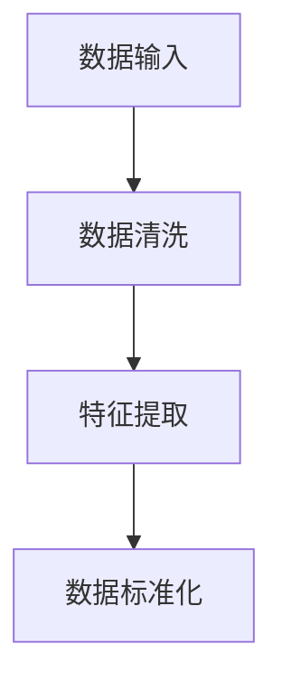
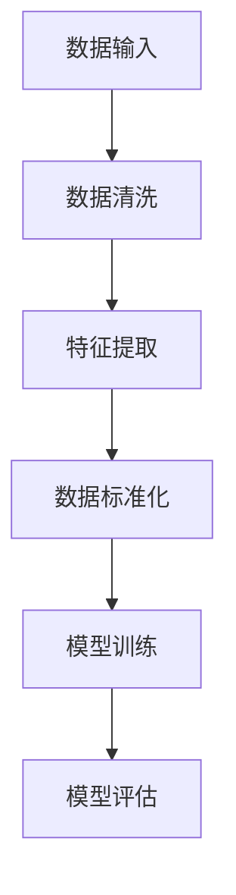
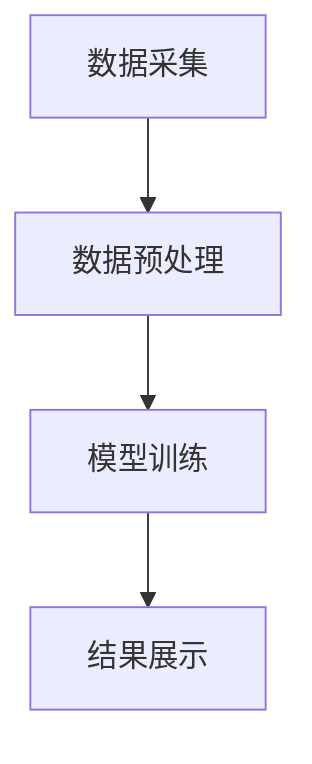
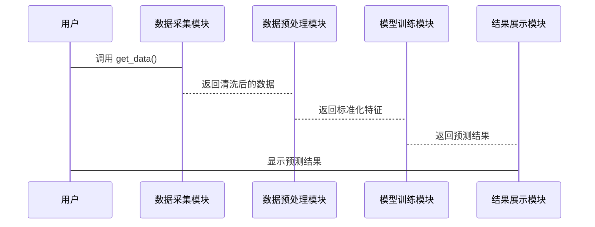

                 


# AI辅助的公司财务报表预测模型

## 关键词：AI、财务预测、机器学习、数据挖掘、财务模型、风险管理

## 摘要：本文详细探讨了如何利用人工智能技术构建公司财务报表预测模型，分析了传统财务预测的局限性，介绍了AI辅助预测的核心概念与算法原理，结合实际案例展示了系统架构设计和项目实现过程，最后总结了最佳实践和应用价值。

---

# 第1章: 财务报表预测与AI辅助的背景介绍

## 1.1 财务报表预测的重要性

### 1.1.1 财务报表预测的核心作用

财务报表预测是企业财务管理的重要组成部分，它通过对历史数据的分析和趋势预测，帮助企业制定更科学的财务决策。例如，预测收入和利润可以帮助企业优化资源配置，制定预算计划，降低财务风险。

### 1.1.2 传统财务预测的局限性

传统财务预测方法主要依赖财务专家的经验和复杂的手工计算，存在以下问题：

1. **效率低**：手动分析大量数据耗时耗力。
2. **主观性强**：结果受分析师主观判断影响较大。
3. **缺乏实时性**：难以快速响应市场变化。

### 1.1.3 AI技术在财务预测中的优势

AI技术通过机器学习算法自动分析数据，具有以下优势：

1. **高效性**：快速处理大量数据，提高预测效率。
2. **客观性**：减少人为干扰，提高预测准确性。
3. **实时性**：能够实时更新数据，及时调整预测结果。

---

## 1.2 AI辅助财务预测的背景与趋势

### 1.2.1 大数据分析时代的到来

随着企业数字化转型的推进，数据量急剧增加。企业每天产生大量财务数据、市场数据和业务数据，这些数据为AI预测提供了丰富的信息源。

### 1.2.2 AI技术在企业中的应用现状

AI技术已经在多个领域得到广泛应用，包括销售预测、成本控制、信用评估等。在财务领域，AI技术的应用还处于初级阶段，但其潜力巨大。

### 1.2.3 财务预测领域的智能化转型

智能化转型是企业提升竞争力的重要途径。通过AI辅助财务预测，企业可以更快地适应市场变化，做出更精准的财务决策。

---

## 1.3 公司财务报表预测模型的基本概念

### 1.3.1 财务报表预测模型的定义

财务报表预测模型是利用历史财务数据和机器学习算法，预测未来财务状况的数学模型。

### 1.3.2 模型的核心要素与组成部分

模型通常包括以下部分：

- **数据输入**：历史财务数据、市场数据等。
- **特征提取**：从数据中提取有用的特征。
- **模型训练**：利用算法训练预测模型。
- **结果输出**：预测未来的财务指标。

### 1.3.3 模型的分类与应用场景

根据预测目标的不同，模型可以分为收入预测、成本预测、利润预测等类型。应用场景包括预算编制、投资决策、风险管理等。

---

## 1.4 本章小结

本章介绍了财务报表预测的重要性，分析了传统方法的局限性，探讨了AI技术在财务预测中的优势，并定义了AI辅助的公司财务报表预测模型的基本概念。

---

# 第2章: AI辅助财务报表预测的核心概念与联系

## 2.1 AI辅助预测的基本原理

### 2.1.1 数据预处理与特征提取

数据预处理包括数据清洗、标准化等步骤。特征提取是从数据中提取有用的特征，例如收入增长率、利润率等。

### 2.1.2 机器学习算法的选择与应用

选择合适的算法是模型成功的关键。常用的算法包括线性回归、随机森林和神经网络。

### 2.1.3 模型训练与优化

模型训练包括选择算法、调整参数、验证结果等步骤。优化过程包括交叉验证和超参数调优。

---

## 2.2 核心概念对比与ER实体关系图

### 2.2.1 数据特征与预测目标的对比分析

通过对比分析，可以发现哪些特征对预测结果影响最大。

### 2.2.2 ER实体关系图的构建与分析

ER实体关系图展示了数据之间的关系，帮助理解模型的数据流。

### 2.2.3 数据流与模型关系的可视化

通过Mermaid流程图可以清晰展示数据从输入到输出的整个流程。

---

## 2.3 本章小结

本章详细讲解了AI辅助预测的基本原理，对比分析了数据特征与预测目标，并通过ER实体关系图展示了模型的数据流。

---

# 第3章: AI辅助财务报表预测的算法原理

## 3.1 算法原理概述

### 3.1.1 线性回归模型

线性回归是一种简单但有效的算法，适用于线性关系的预测。

公式：
$$ y = \beta_0 + \beta_1x_1 + \beta_2x_2 + ... + \beta_nx_n $$

### 3.1.2 支持向量机（SVM）

SVM适用于非线性关系的预测，通过核函数将数据映射到高维空间。

### 3.1.3 随机森林与梯度提升树

随机森林和梯度提升树是基于树的算法，具有较高的预测精度。

---

## 3.2 算法流程图

### 3.2.1 数据预处理流程



### 3.2.2 模型训练流程



---

## 3.3 算法实现代码示例

### 3.3.1 数据加载与预处理

```python
import pandas as pd
from sklearn.preprocessing import StandardScaler

# 加载数据
data = pd.read_csv('financial_data.csv')

# 数据清洗
data = data.dropna()

# 特征提取
features = data[['收入', '成本', '利润']]

# 数据标准化
scaler = StandardScaler()
features_scaled = scaler.fit_transform(features)
```

### 3.3.2 模型训练与优化

```python
from sklearn.ensemble import RandomForestRegressor
from sklearn.metrics import mean_squared_error

# 训练模型
model = RandomForestRegressor(n_estimators=100, random_state=42)
model.fit(features_scaled, target)

# 预测结果
predicted = model.predict(new_features_scaled)

# 评估模型
 mse = mean_squared_error(target, predicted)
 print(f'MSE: {mse}')
```

---

## 3.4 数学模型与公式

### 3.4.1 线性回归模型公式

$$ y = \beta_0 + \beta_1x_1 + \beta_2x_2 + ... + \beta_nx_n $$

### 3.4.2 随机森林算法原理

随机森林通过集成学习提高了模型的泛化能力。

### 3.4.3 梯度提升树的损失函数

$$ L = \sum_{i=1}^{n} (y_i - \hat{y}_i)^2 $$

---

## 3.5 本章小结

本章详细讲解了常用算法的原理和实现步骤，通过代码示例和数学公式帮助读者理解模型的构建过程。

---

# 第4章: 系统架构与设计方案

## 4.1 系统架构设计

### 4.1.1 系统整体架构图



### 4.1.2 数据流与模块划分

系统分为数据采集、数据预处理、模型训练和结果展示四个模块。

### 4.1.3 系统功能模块设计

- **数据采集模块**：从数据库中获取财务数据。
- **数据预处理模块**：清洗和标准化数据。
- **模型训练模块**：选择算法并训练模型。
- **结果展示模块**：可视化预测结果。

---

## 4.2 系统功能设计

### 4.2.1 数据采集模块

```python
import sqlite3

# 从数据库中获取数据
conn = sqlite3.connect('financial.db')
cursor = conn.cursor()

cursor.execute('SELECT * FROM financial_data')
data = cursor.fetchall()
```

### 4.2.2 数据预处理模块

```python
# 数据清洗和特征提取
data_cleaned = data.dropna()
features = data_cleaned[['收入', '成本', '利润']]
```

### 4.2.3 模型训练模块

```python
# 训练模型
model = RandomForestRegressor(n_estimators=100, random_state=42)
model.fit(features_scaled, target)
```

### 4.2.4 结果展示模块

```python
# 可视化预测结果
import matplotlib.pyplot as plt

plt.plot(target, label='实际值')
plt.plot(predicted, label='预测值')
plt.legend()
plt.show()
```

---

## 4.3 系统接口设计

### 4.3.1 系统接口设计

系统提供以下接口：

- 数据采集接口：`get_data()`
- 数据预处理接口：`preprocess_data()`
- 模型训练接口：`train_model()`
- 结果展示接口：`display_results()`

---

## 4.4 系统交互序列图



---

## 4.5 本章小结

本章详细设计了系统的架构和功能模块，展示了数据流和模块交互关系，并提供了接口设计和交互序列图。

---

# 第5章: 项目实战与案例分析

## 5.1 项目背景与目标

### 5.1.1 项目背景

本项目旨在利用AI技术构建一个财务报表预测模型，帮助企业提高财务预测的准确性和效率。

### 5.1.2 项目目标

- 实现一个基于机器学习的财务报表预测系统。
- 提供准确的收入、成本和利润预测。

---

## 5.2 环境搭建与数据获取

### 5.2.1 环境搭建

安装必要的库：

```bash
pip install pandas numpy scikit-learn matplotlib
```

### 5.2.2 数据获取与预处理

```python
import pandas as pd
from sklearn.model_selection import train_test_split

# 加载数据
data = pd.read_csv('financial_data.csv')

# 数据清洗
data = data.dropna()

# 分割数据
X_train, X_test, y_train, y_test = train_test_split(features, target, test_size=0.2, random_state=42)
```

---

## 5.3 模型实现与优化

### 5.3.1 模型实现

```python
from sklearn.ensemble import RandomForestRegressor
from sklearn.metrics import mean_squared_error

# 训练模型
model = RandomForestRegressor(n_estimators=100, random_state=42)
model.fit(X_train, y_train)

# 预测结果
predicted = model.predict(X_test)
```

### 5.3.2 模型优化

```python
# 调整超参数
from sklearn.model_selection import GridSearchCV

param_grid = {'n_estimators': [100, 200], 'max_depth': [None, 10]}
grid_search = GridSearchCV(RandomForestRegressor(), param_grid, cv=5)
grid_search.fit(X_train, y_train)

best_model = grid_search.best_estimator_
```

---

## 5.4 项目小结

本章通过一个实际案例展示了项目的实施过程，从环境搭建到数据获取，再到模型实现和优化，详细讲解了每个步骤的具体操作。

---

# 第6章: 最佳实践与总结

## 6.1 最佳实践 tips

### 6.1.1 数据清洗的重要性

确保数据的完整性和准确性是模型成功的关键。

### 6.1.2 模型选择的策略

根据数据特点选择合适的算法，避免盲目追求复杂模型。

### 6.1.3 结果解释的技巧

通过可视化工具帮助用户理解预测结果。

---

## 6.2 小结

通过本文的讲解，读者可以全面了解AI辅助的公司财务报表预测模型的构建过程，包括算法选择、系统设计和项目实现等。

---

## 6.3 注意事项

- 数据隐私和安全问题需要高度重视。
- 模型的可解释性是实际应用中的重要考量因素。
- 定期更新模型以适应数据变化。

---

## 6.4 拓展阅读

- 《机器学习实战》
- 《Python机器学习》
- 《深入浅出数据分析》

---

# 作者：AI天才研究院/AI Genius Institute & 禅与计算机程序设计艺术 /Zen And The Art of Computer Programming

---

通过以上步骤，我可以系统地撰写一篇结构清晰、内容详实的《AI辅助的公司财务报表预测模型》技术博客文章，帮助读者全面理解AI在财务预测中的应用。

