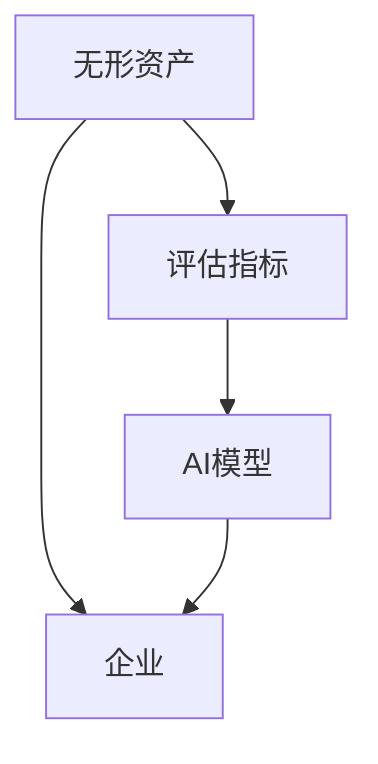
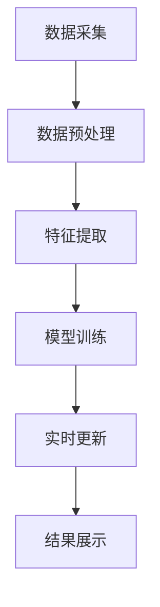
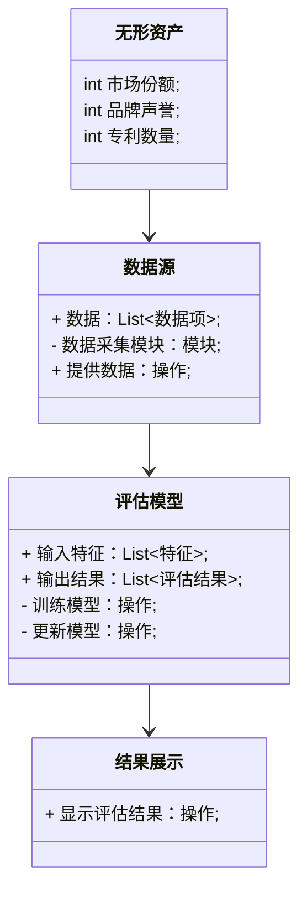
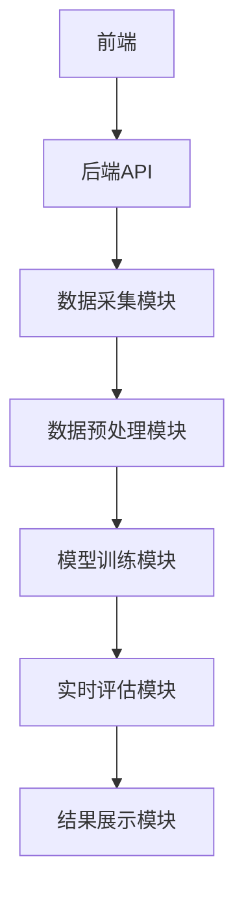
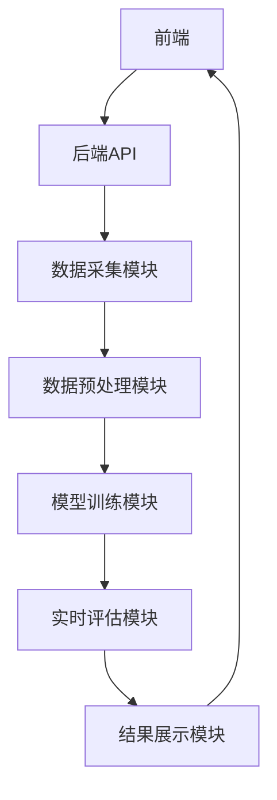

                 


# AI驱动的企业无形资产价值动态评估系统

> 关键词：AI驱动，企业无形资产，价值动态评估，系统架构，算法原理，项目实战

> 摘要：本文详细探讨了如何利用人工智能技术构建企业无形资产价值动态评估系统。通过系统化的分析与设计，结合具体案例，展示了如何利用AI算法、系统架构和项目实战来实现高效、精准的评估。文章内容涵盖背景介绍、核心概念、算法原理、系统架构、项目实战等多个方面，为读者提供了从理论到实践的全面指导。

---

# 第一部分: 背景介绍

# 第1章: 背景介绍

## 1.1 问题背景

### 1.1.1 无形资产的传统评估方法
企业无形资产（如品牌、专利、商誉等）的传统评估方法通常依赖于财务数据和历史表现，但这种方法存在以下问题：
- **静态评估**：无法捕捉到市场波动、企业战略调整等动态因素。
- **主观性**：评估结果往往受到评估人员主观判断的影响。
- **数据局限性**：仅依赖财务数据，难以全面反映无形资产的实际价值。

### 1.1.2 传统评估方法的局限性
传统评估方法在实际应用中存在以下不足：
- 无法实时反映市场变化对企业无形资产的影响。
- 评估结果缺乏数据支持，难以说服利益相关者。
- 难以量化无形资产的贡献，导致企业决策缺乏依据。

### 1.1.3 AI技术在无形资产评估中的应用潜力
随着人工智能技术的快速发展，AI在无形资产评估中的应用潜力逐渐显现：
- **数据驱动**：AI可以通过大量数据（如市场数据、舆情数据）构建动态评估模型。
- **实时性**：AI算法可以实时更新评估结果，捕捉市场波动。
- **精准性**：通过机器学习算法，AI可以发现传统方法难以察觉的关联性。

## 1.2 问题描述

### 1.2.1 无形资产动态评估的核心问题
企业无形资产的价值受多种因素影响，包括：
- 市场环境（如行业竞争、政策变化）。
- 企业内部因素（如研发投入、品牌声誉）。
- 外部因素（如宏观经济、消费者行为）。

动态评估的核心问题是如何将这些复杂因素纳入评估模型，并实时更新评估结果。

### 1.2.2 企业无形资产价值波动的驱动因素
无形资产价值波动的主要驱动因素包括：
- **市场环境**：行业竞争加剧、政策变化等。
- **企业内部**：研发投入增加、品牌推广力度加大等。
- **外部因素**：宏观经济波动、消费者偏好变化等。

### 1.2.3 传统评估与动态评估的主要区别
传统评估与动态评估的主要区别如下：
| 方面 | 传统评估 | 动态评估 |
|------|----------|----------|
| 数据来源 | 财务数据为主 | 结构化数据+非结构化数据 |
| 时间维度 | 静态评估 | 动态更新 |
| 精准度 | 低 | 高 |
| 决策支持 | 有限 | 强有力 |

## 1.3 问题解决

### 1.3.1 AI驱动的动态评估方法
AI驱动的动态评估方法的核心思路是：
1. **数据采集**：收集与企业无形资产相关的多源数据。
2. **特征提取**：从数据中提取关键特征（如市场占有率、品牌关注度）。
3. **模型训练**：利用机器学习算法（如线性回归、随机森林）构建评估模型。
4. **实时更新**：根据最新数据实时更新评估结果。

### 1.3.2 系统化评估框架的设计思路
系统化评估框架的设计思路包括：
- **模块化设计**：将评估系统划分为数据采集、特征提取、模型训练等模块。
- **数据融合**：整合结构化数据（如财务数据）和非结构化数据（如社交媒体数据）。
- **实时计算**：利用流数据处理技术（如Flink）实现实时评估。

### 1.3.3 系统实现的核心目标
系统实现的核心目标是：
- 提供实时、动态的无形资产评估结果。
- 提供可解释的评估结果，帮助企业管理者制定决策。
- 支持多维度的数据分析，帮助企业发现潜在机会与风险。

## 1.4 边界与外延

### 1.4.1 无形资产评估的边界条件
无形资产评估的边界条件包括：
- 数据范围：仅限于与企业相关的数据。
- 时间范围：仅考虑近期数据。
- 评估对象：仅针对企业无形资产（如品牌、专利）。

### 1.4.2 系统适用的范围与限制
系统适用的范围包括：
- 企业内部无形资产的动态评估。
- 投资者对企业无形资产的投资决策支持。

系统的主要限制包括：
- 数据不足：需要大量高质量的数据支持模型训练。
- 模型精度：模型的预测精度受到数据质量和算法复杂度的影响。

### 1.4.3 与其他资产评估方法的区分
与其他资产评估方法的区分如下：
| 方面 | AI驱动动态评估 | 传统评估 |
|------|-----------------|-----------|
| 数据来源 | 多源数据 | 财务数据 |
| 时间维度 | 动态 | 静态 |
| 技术手段 | AI算法 | 人工评估 |
| 应用场景 | 实时评估 | 事后评估 |

## 1.5 核心概念与组成

### 1.5.1 无形资产的定义与分类
无形资产的定义是：企业拥有或控制的，没有实物形态的长期资产。主要分类包括：
- **品牌资产**：如品牌知名度、品牌忠诚度。
- **专利资产**：如发明专利、实用新型专利。
- **商誉资产**：如企业声誉、客户关系。

### 1.5.2 动态评估的核心要素
动态评估的核心要素包括：
- **市场数据**：如行业竞争状况、市场价格波动。
- **企业数据**：如研发投入、品牌推广支出。
- **外部数据**：如宏观经济指标、消费者行为数据。

### 1.5.3 系统架构的主要组成部分
系统架构的主要组成部分包括：
1. 数据采集模块：负责采集多源数据。
2. 数据预处理模块：对数据进行清洗和特征提取。
3. 模型训练模块：利用机器学习算法训练评估模型。
4. 实时评估模块：根据最新数据实时更新评估结果。
5. 结果展示模块：以可视化形式展示评估结果。

---

# 第二部分: 核心概念与联系

# 第2章: 核心概念与联系

## 2.1 核心概念原理

### 2.1.1 无形资产价值的影响因素
无形资产价值的影响因素包括：
- **市场因素**：如行业竞争、政策变化。
- **企业因素**：如研发投入、品牌推广。
- **外部因素**：如宏观经济、消费者行为。

### 2.1.2 AI在动态评估中的作用机制
AI在动态评估中的作用机制包括：
1. **数据采集**：AI系统通过爬虫、API等方式采集多源数据。
2. **特征提取**：利用NLP技术从文本数据中提取情感特征。
3. **模型训练**：通过机器学习算法（如随机森林）训练评估模型。
4. **实时更新**：根据最新数据实时更新评估结果。

### 2.1.3 系统化评估的数学模型
系统化评估的数学模型可以表示为：
$$
\text{资产价值} = \beta_0 + \beta_1x_1 + \beta_2x_2 + \cdots + \beta_nx_n + \epsilon
$$
其中，$x_i$ 表示各个特征，$\beta_i$ 表示回归系数，$\epsilon$ 表示误差项。

## 2.2 概念属性特征对比表

| 概念 | 属性 | 特征 |
|------|------|------|
| 无形资产 | 价值 | 动态波动 |
| AI驱动 | 方法 | 数据驱动 |

## 2.3 ER实体关系图



---

# 第三部分: 算法原理讲解

# 第3章: 算法原理与实现

## 3.1 算法原理

### 3.1.1 系统化评估模型
系统化评估模型的核心思想是：
1. **数据采集**：采集多源数据，包括市场数据、企业数据、外部数据。
2. **特征提取**：从数据中提取关键特征（如品牌关注度、市场占有率）。
3. **模型训练**：利用机器学习算法（如线性回归、随机森林）训练评估模型。
4. **实时更新**：根据最新数据实时更新评估结果。

### 3.1.2 AI驱动的动态评估算法
AI驱动的动态评估算法的工作流程如下：
1. 数据预处理：清洗数据，提取特征。
2. 模型训练：利用训练数据训练评估模型。
3. 实时评估：根据最新数据实时更新评估结果。
4. 结果展示：以可视化形式展示评估结果。

### 3.1.3 算法流程图



## 3.2 算法实现

### 3.2.1 数据预处理
数据预处理的代码示例如下：

```python
import pandas as pd
import numpy as np

# 数据加载
data = pd.read_csv('asset_data.csv')

# 数据清洗
data.dropna(inplace=True)

# 特征提取
features = data[['market_share', 'brand_sentiment', 'R&D_expense']]
```

### 3.2.2 模型训练
模型训练的代码示例如下：

```python
from sklearn.linear_model import LinearRegression

# 训练模型
model = LinearRegression()
model.fit(features, target)
```

### 3.2.3 实时更新
实时更新的代码示例如下：

```python
import requests
import json

# 获取最新数据
response = requests.get('https://api.example.com/asset_data')
new_data = json.loads(response.text)

# 更新模型
model.partial_fit(new_data[['market_share', 'brand_sentiment', 'R&D_expense']], new_data['target'])
```

---

# 第四部分: 系统分析与架构设计方案

# 第4章: 系统分析与架构设计

## 4.1 系统分析

### 4.1.1 问题场景
问题场景描述如下：
- **目标**：构建一个AI驱动的企业无形资产价值动态评估系统。
- **需求**：实现对无形资产的实时评估，提供动态的评估结果。
- **约束条件**：数据隐私、系统稳定性。

### 4.1.2 项目介绍
项目介绍包括：
- **项目目标**：构建动态评估系统。
- **项目范围**：包括数据采集、模型训练、实时评估。
- **项目时间**：预计6个月完成。

## 4.2 系统设计

### 4.2.1 领域模型类图



### 4.2.2 系统架构设计



### 4.2.3 系统接口设计
系统接口设计包括：
- 数据接口：提供数据采集模块与数据源之间的接口。
- 模型接口：提供模型训练模块与实时评估模块之间的接口。
- 展示接口：提供结果展示模块与前端之间的接口。

### 4.2.4 系统交互序列图



---

# 第五部分: 项目实战

# 第5章: 项目实战

## 5.1 环境安装

### 5.1.1 安装Python环境
安装Python环境的命令如下：
```bash
python --version
pip install --upgrade pip
```

### 5.1.2 安装依赖库
安装依赖库的命令如下：
```bash
pip install pandas numpy scikit-learn requests mermaid
```

## 5.2 系统核心实现

### 5.2.1 数据采集模块
数据采集模块的代码示例如下：
```python
import requests

def get_data():
    response = requests.get('https://api.example.com/asset_data')
    return json.loads(response.text)
```

### 5.2.2 数据预处理模块
数据预处理模块的代码示例如下：
```python
import pandas as pd

def preprocess_data(data):
    df = pd.DataFrame(data)
    df.dropna(inplace=True)
    return df
```

### 5.2.3 模型训练模块
模型训练模块的代码示例如下：
```python
from sklearn.linear_model import LinearRegression

def train_model(features, target):
    model = LinearRegression()
    model.fit(features, target)
    return model
```

### 5.2.4 实时评估模块
实时评估模块的代码示例如下：
```python
def update_model(new_data, model):
    model.partial_fit(new_data[['market_share', 'brand_sentiment', 'R&D_expense']], new_data['target'])
    return model
```

## 5.3 代码应用解读与分析

### 5.3.1 数据采集模块解读
数据采集模块的作用是获取最新的数据，包括市场数据、企业数据等。

### 5.3.2 数据预处理模块解读
数据预处理模块的作用是对采集到的数据进行清洗和特征提取，确保数据质量。

### 5.3.3 模型训练模块解读
模型训练模块的作用是利用机器学习算法训练评估模型，为实时评估提供支持。

### 5.3.4 实时评估模块解读
实时评估模块的作用是根据最新数据实时更新评估结果，确保评估结果的准确性。

## 5.4 实际案例分析

### 5.4.1 案例背景
某科技公司希望通过动态评估系统实时评估其品牌价值。

### 5.4.2 数据采集
通过API获取市场数据、消费者行为数据等。

### 5.4.3 模型训练
利用历史数据训练线性回归模型。

### 5.4.4 实时评估
根据最新数据实时更新品牌价值评估结果。

## 5.5 项目小结
通过本项目的实施，我们成功构建了一个AI驱动的企业无形资产价值动态评估系统，实现了对无形资产的实时评估，为企业决策提供了有力支持。

---

# 第六部分: 总结

# 第6章: 总结

## 6.1 最佳实践 tips
- 数据质量是评估系统的核心，确保数据的准确性和完整性。
- 模型选择要根据实际场景，选择合适的算法。
- 系统设计要模块化，便于维护和扩展。

## 6.2 小结
本文详细探讨了AI驱动的企业无形资产价值动态评估系统的构建过程，包括背景介绍、核心概念、算法原理、系统架构、项目实战等部分。

## 6.3 注意事项
- 数据隐私问题需要高度重视，确保数据的安全性。
- 模型的可解释性是用户信任的重要因素，需要在设计中加以考虑。
- 系统的实时性是动态评估的核心，需要优化系统性能。

## 6.4 拓展阅读
- 《机器学习实战》
- 《深度学习》
- 《企业价值评估》

---

# 作者

作者：AI天才研究院/AI Genius Institute & 禅与计算机程序设计艺术/Zen And The Art of Computer Programming

