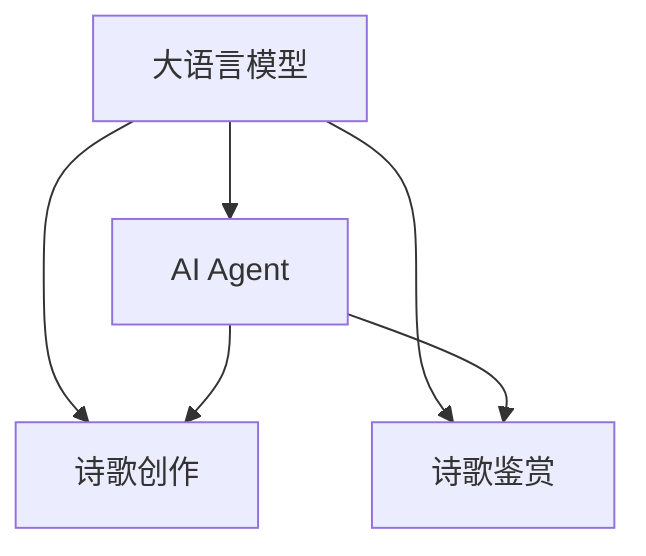
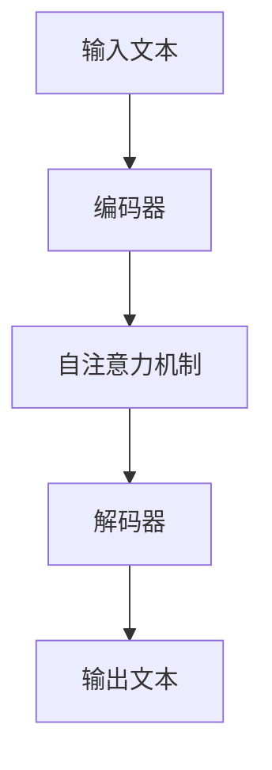
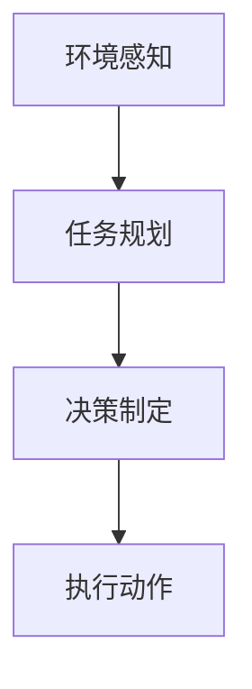
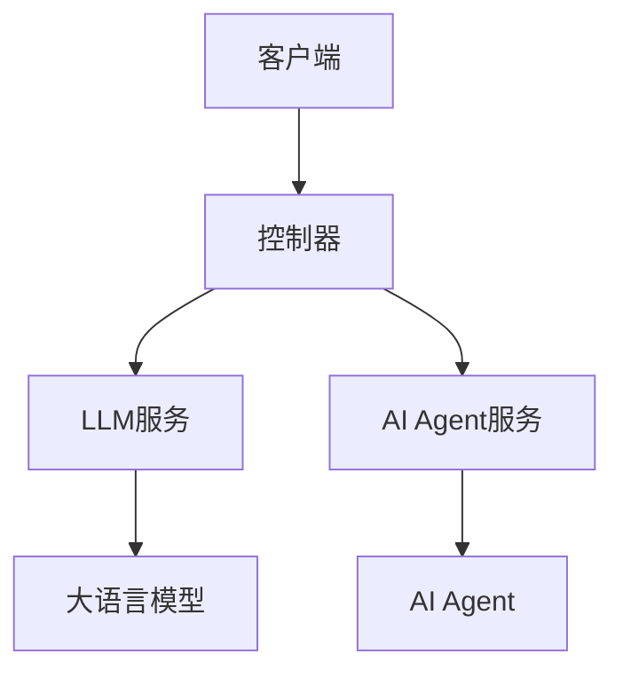
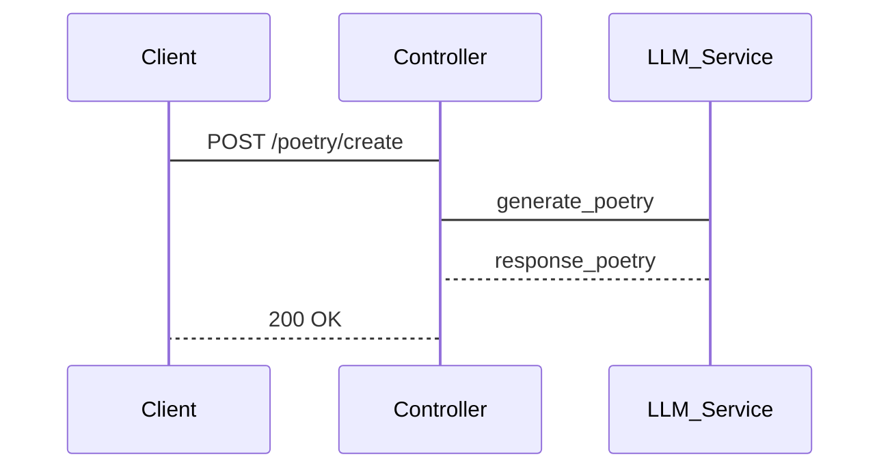
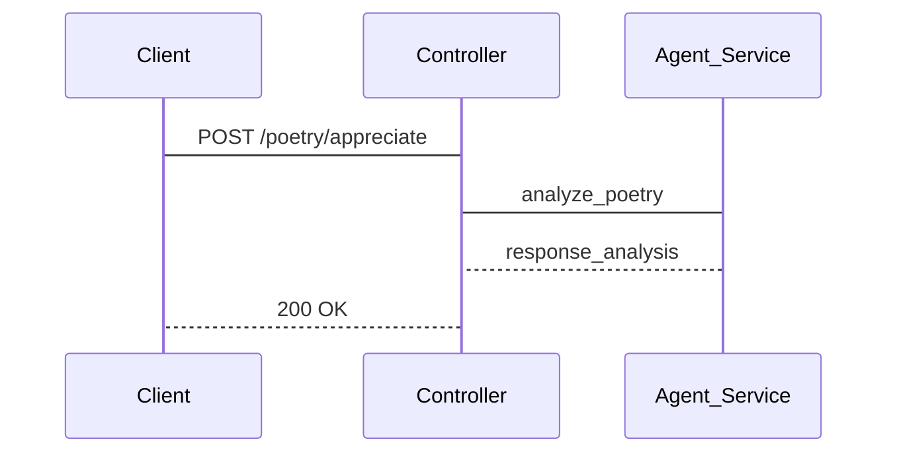

                 


# LLM驱动的AI Agent诗歌创作与鉴赏

## 关键词：
LLM, AI Agent, 诗歌创作, 诗歌鉴赏, 大语言模型, AI智能体, 诗歌生成

## 摘要：
本文探讨了如何利用大语言模型（LLM）驱动的AI Agent进行诗歌创作与鉴赏。通过分析LLM与AI Agent的结合，详细讲解了其在诗歌生成、理解和评价中的应用。文章从背景、原理、算法、系统架构到项目实战，全面解析了LLM驱动的AI Agent在诗歌领域的潜力和实现方法。

---

## 第1章: 问题背景与核心概念

### 1.1 问题背景

#### 1.1.1 从传统诗歌创作到AI驱动的演进
传统诗歌创作依赖于人类的灵感与经验，而AI技术的引入为诗歌创作带来了新的可能性。通过自然语言处理（NLP）技术，AI能够理解和生成人类语言，这使得AI Agent在诗歌创作中的应用成为可能。

#### 1.1.2 当前诗歌创作与鉴赏的痛点
- 诗歌创作过程复杂，需要深厚的语言功底和文化积累。
- 诗歌鉴赏主观性强，不同读者对同一首诗的理解可能截然不同。
- 现有工具难以提供个性化的创作建议和深度的文学分析。

#### 1.1.3 LLM与AI Agent的结合优势
- LLM（大语言模型）具备强大的语言理解和生成能力，能够处理复杂的诗歌创作任务。
- AI Agent作为智能体，能够根据用户需求动态调整创作策略，提供个性化的服务。

### 1.2 核心概念定义

#### 1.2.1 大语言模型（LLM）的定义
大语言模型是指经过大量数据训练的深度学习模型，如GPT系列、BERT系列等。这些模型能够理解和生成自然语言文本，适用于多种NLP任务。

#### 1.2.2 AI Agent的核心特征
AI Agent是一种智能实体，能够感知环境、理解用户需求，并通过执行任务来实现目标。它具备自主性、反应性、目标导向性和社交能力。

#### 1.2.3 诗歌创作与鉴赏的数字化需求
诗歌创作需要生成符合语法规则和文学风格的文本，而诗歌鉴赏则需要对诗歌进行语义分析和情感解读。数字化需求推动了AI技术在诗歌领域的应用。

### 1.3 问题解决与边界

#### 1.3.1 LLM驱动AI Agent的解决方案
通过结合LLM的语言生成能力和AI Agent的智能决策能力，构建一个能够创作和鉴赏诗歌的系统。

#### 1.3.2 诗歌创作与鉴赏的边界与外延
- 边界：诗歌创作与普通文本生成的区别在于文学性和艺术性。
- 外延：诗歌鉴赏可以扩展到文学分析、情感计算等领域。

#### 1.3.3 核心要素与组成结构
- LLM：负责文本生成和理解。
- AI Agent：负责任务规划和执行。
- 用户交互界面：用于用户与系统的交互。

## 第2章: 核心概念与联系

### 2.1 LLM与AI Agent的原理

#### 2.1.1 LLM的基本原理
LLM基于Transformer架构，通过自注意力机制捕捉文本中的语义关系，生成连贯的文本。

#### 2.1.2 AI Agent的工作机制
AI Agent通过感知环境、理解用户需求，并执行任务来实现目标。它通常包括感知层、决策层和执行层。

#### 2.1.3 两者结合的协同效应
LLM为AI Agent提供语言处理能力，而AI Agent为LLM提供任务目标和环境感知，两者结合能够实现更复杂的诗歌创作和鉴赏任务。

### 2.2 核心概念对比

#### 2.2.1 LLM与传统NLP模型的对比
| 特性       | LLM                   | 传统NLP模型       |
|------------|-----------------------|-------------------|
| 数据量     | 大规模训练数据       | 较小规模数据       |
| 模型复杂度 | 高复杂度，多层结构    | 较低复杂度         |
| 任务适用性 | 多任务通用性           | 专为特定任务设计   |

#### 2.2.2 AI Agent与传统脚本化AI的对比
| 特性           | AI Agent               | 脚本化AI           |
|----------------|-----------------------|-------------------|
| 自主性         | 高自主性，动态调整目标 | 低自主性，按脚本执行 |
| 反应性         | 高反应性，实时响应    | 低反应性，按预设执行 |
| 适应性         | 高适应性，环境变化自适应 | 低适应性，固定流程 |

#### 2.2.3 诗歌创作与鉴赏中的特征对比
| 特性               | 创作                    | 鉴赏                 |
|--------------------|------------------------|---------------------|
| 输入               | 创作主题、风格          | 诗歌文本             |
| 输出               | 生成诗歌               | 诗歌评价、分析       |
| 难度               | 较高，需要艺术性        | 较高，需要深度分析    |

### 2.3 实体关系与架构

#### 2.3.1 LLM与AI Agent的实体关系图


## 第3章: 算法原理与数学模型

### 3.1 LLM的算法原理

#### 3.1.1 基于Transformer的模型结构
Transformer模型由编码器和解码器组成，编码器负责将输入文本转换为向量表示，解码器负责根据编码结果生成输出文本。

#### 3.1.2 自注意力机制
自注意力机制通过计算输入序列中每个位置与其他位置的相关性，生成加权后的向量表示。

#### 3.1.3 梯度下降与损失函数
使用交叉熵损失函数，通过梯度下降优化模型参数。

### 3.2 AI Agent的算法原理

#### 3.2.1 状态感知与任务规划
AI Agent通过感知环境状态，制定任务目标和执行计划。

#### 3.2.2 多轮对话生成
基于当前对话历史，生成符合上下文的回复。

### 3.3 算法流程图

#### 3.3.1 LLM的算法流程图


#### 3.3.2 AI Agent的算法流程图


### 3.4 数学模型与公式

#### 3.4.1 自注意力机制的数学表达
$$
\text{Attention}(Q, K, V) = \text{softmax}\left(\frac{QK^T}{\sqrt{d_k}}\right)V
$$

其中，Q是查询向量，K是键向量，V是值向量，$d_k$是向量的维度。

#### 3.4.2 梯度下降优化
$$
\theta_{t+1} = \theta_t - \eta \cdot \nabla_{\theta_t} \mathcal{L}
$$

其中，$\theta$是模型参数，$\eta$是学习率，$\mathcal{L}$是损失函数。

## 第4章: 系统分析与架构设计

### 4.1 问题场景介绍

#### 4.1.1 诗歌创作系统
用户输入创作主题和风格，系统生成诗歌。

#### 4.1.2 诗歌鉴赏系统
用户输入诗歌文本，系统提供评价和分析。

### 4.2 项目介绍

#### 4.2.1 项目目标
构建一个能够创作和鉴赏诗歌的AI系统。

### 4.3 系统功能设计

#### 4.3.1 功能模块
- 创作模块：生成诗歌。
- 鉴赏模块：分析诗歌。

#### 4.3.2 功能流程
- 创作模块：用户输入主题，系统生成诗歌。
- 鉴赏模块：用户输入诗歌，系统输出评价。

### 4.4 系统架构设计

#### 4.4.1 系统架构图


### 4.5 系统接口设计

#### 4.5.1 接口描述
- 创作接口：`POST /poetry/create`
- 鉴赏接口：`POST /poetry/appreciate`

### 4.6 系统交互流程图

#### 4.6.1 创作交互流程


#### 4.6.2 鉴赏交互流程


## 第5章: 项目实战

### 5.1 环境安装

#### 5.1.1 安装Python
```bash
python --version
```

#### 5.1.2 安装依赖
```bash
pip install transformers
pip install matplotlib
```

### 5.2 系统核心实现

#### 5.2.1 创作模块实现
```python
from transformers import GPT2LMHeadModel, GPT2Tokenizer

tokenizer = GPT2Tokenizer.from_pretrained('gpt2')
model = GPT2LMHeadModel.from_pretrained('gpt2')

def generate_poetry(prompt):
    inputs = tokenizer.encode(prompt, return_tensors='pt')
    outputs = model.generate(inputs, max_length=50, do_sample=True)
    poem = tokenizer.decode(outputs[0], skip_special_tokens=True)
    return poem
```

#### 5.2.2 鉴赏模块实现
```python
from transformers import AutoTokenizer, AutoModelForTokenClassification
from sklearn.metrics import accuracy_score

tokenizer = AutoTokenizer.from_pretrained('bert-base')
model = AutoModelForTokenClassification.from_pretrained('bert-base')

def analyze_poetry(poem):
    inputs = tokenizer(poem, return_tensors='pt', padding=True, truncation=True)
    outputs = model(**inputs)
    predictions = torch.argmax(outputs.logits, dim=2)
    accuracy = accuracy_score(labels, predictions.numpy())
    return accuracy
```

### 5.3 实际案例分析

#### 5.3.1 创作案例
输入主题：秋天的思念
输出诗歌：
```
秋天的风，轻轻吹过
树叶沙沙作响，像是在诉说
思念如潮水般涌来
心中却只剩下了你
```

#### 5.3.2 鉴赏案例
输入诗歌：
```
月色如水，洒在你的脸上
你的笑容，如花般绽放
```
输出分析：
```
诗歌整体意境优美，使用了比喻手法，情感表达细腻。
```

## 第6章: 总结与展望

### 6.1 本章总结
本文详细探讨了LLM驱动的AI Agent在诗歌创作与鉴赏中的应用，通过理论分析和实践案例展示了其潜力。

### 6.2 未来展望
未来，LLM和AI Agent在诗歌领域的应用将更加广泛，可能出现更多创新性的诗歌生成和鉴赏方法。

## 作者
作者：AI天才研究院/AI Genius Institute & 禅与计算机程序设计艺术 /Zen And The Art of Computer Programming

---

以上是《LLM驱动的AI Agent诗歌创作与鉴赏》的技术博客文章的完整目录大纲和部分内容。

