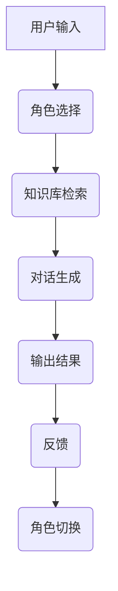
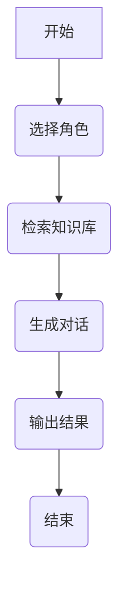
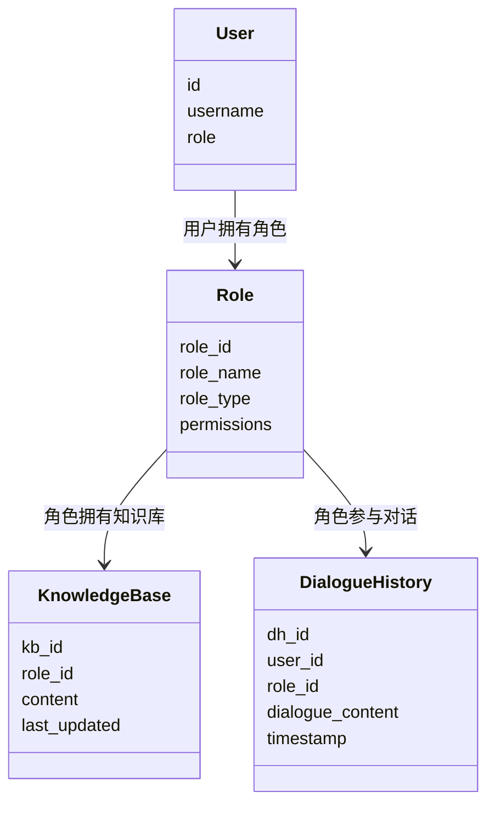
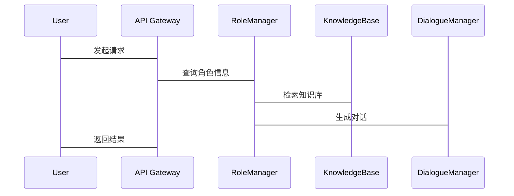

                 


# 多角色扮演AI Agent：基于LLM的复杂场景模拟

> **关键词**：多角色扮演AI Agent, 大语言模型, 复杂场景模拟, 对话生成, 知识库管理, 系统架构

> **摘要**：  
本文深入探讨了多角色扮演AI Agent的设计与实现，基于大语言模型（LLM）构建复杂场景模拟的解决方案。文章从背景介绍、核心概念、算法原理、系统架构、项目实战到最佳实践，全面解析了多角色扮演AI Agent的技术细节和实际应用。通过详细的技术分析和案例解读，本文为读者提供了从理论到实践的完整指导，帮助技术爱好者和研究人员快速掌握多角色扮演AI Agent的核心技术。

---

# 第一部分: 多角色扮演AI Agent的背景与概念

## 第1章: 多角色扮演AI Agent的基本概念

### 1.1 多角色扮演AI Agent的定义

#### 1.1.1 多角色扮演AI Agent的定义
多角色扮演AI Agent（Multi-Role Play AI Agent, MRP-AI）是一种能够同时模拟多个不同角色的智能体，通过大语言模型（LLM）实现复杂场景下的多角色协作与对话生成。MRP-AI的核心在于其能够动态切换角色，并在每个角色中表现出相应的知识、语气和行为模式。

#### 1.1.2 多角色扮演AI Agent的核心特征
- **多角色切换**：能够根据上下文动态选择并切换角色。
- **知识库管理**：每个角色都有独立的知识库，支持跨角色知识共享与协作。
- **对话生成**：基于角色属性和上下文生成自然流畅的对话。
- **动态推理**：在复杂场景中实时推理决策，确保角色行为的一致性。

#### 1.1.3 多角色扮演AI Agent与传统AI Agent的区别
| 特性                 | 多角色扮演AI Agent              | 传统AI Agent                  |
|----------------------|----------------------------------|------------------------------|
| 角色多样性           | 支持多角色切换                  | 单一角色或固定角色            |
| 知识库管理           | 多角色知识库，支持动态切换      | 单一知识库                   |
| 对话生成能力         | 复杂对话生成，支持多角色协作    | 简单对话生成                 |
| 动态推理能力         | 高，支持复杂场景推理            | 较低，适用于简单场景           |

### 1.2 多角色扮演AI Agent的应用场景

#### 1.2.1 游戏中的多角色扮演AI Agent
在游戏领域，MRP-AI可以模拟游戏中的NPC（非玩家角色）行为，实现与玩家的互动。例如，在角色扮演类游戏中，MRP-AI可以同时扮演多个NPC角色，与玩家进行对话和协作。

#### 1.2.2 教育培训中的多角色扮演AI Agent
在教育和培训领域，MRP-AI可以模拟真实场景中的多个角色，帮助学员进行角色扮演训练。例如，在模拟法庭中，MRP-AI可以分别扮演法官、检察官和辩护律师，与学员进行互动。

#### 1.2.3 企业协作中的多角色扮演AI Agent
在企业协作场景中，MRP-AI可以模拟不同部门的角色，帮助团队进行跨部门协作。例如，在模拟会议中，MRP-AI可以分别扮演CEO、CTO和CFO，与团队成员进行讨论和决策。

### 1.3 多角色扮演AI Agent的实现基础

#### 1.3.1 大语言模型（LLM）的作用
大语言模型（LLM）是多角色扮演AI Agent的核心技术基础。通过LLM，MRP-AI可以实现自然语言理解、生成和对话管理。

#### 1.3.2 多角色模拟的必要性
在复杂场景中，单个AI Agent的能力往往不足以完成任务。通过引入多角色模拟，MRP-AI能够更好地应对复杂任务，例如任务分配、协作决策和问题解决。

#### 1.3.3 复杂场景模拟的关键技术
- **角色建模**：构建每个角色的知识库和行为模型。
- **对话管理**：实现多角色之间的对话生成与协调。
- **知识库管理**：支持多角色知识的共享与动态更新。

## 第2章: 多角色扮演AI Agent的背景与问题分析

### 2.1 多角色扮演AI Agent的背景介绍

#### 2.1.1 人工智能技术的发展现状
人工智能技术近年来取得了显著进展，特别是在自然语言处理（NLP）领域，大语言模型（LLM）的崛起为多角色模拟提供了技术基础。

#### 2.1.2 大语言模型（LLM）的崛起
大语言模型（LLM）通过海量数据的训练，掌握了丰富的语言知识和上下文理解能力，为多角色模拟提供了强大的技术支持。

#### 2.1.3 多角色模拟的需求驱动
随着人工智能应用场景的拓展，复杂场景中的多角色协作需求日益增加。例如，在教育、游戏和企业协作等领域，多角色模拟已经成为重要的技术需求。

### 2.2 多角色扮演AI Agent的问题背景

#### 2.2.1 单一AI Agent的局限性
单一AI Agent的能力有限，难以应对复杂场景中的多样化任务。例如，在模拟法庭中，单一AI Agent无法同时扮演法官、检察官和辩护律师。

#### 2.2.2 多角色协作的必要性
在复杂场景中，多个角色之间的协作是任务成功的关键。通过引入多角色扮演AI Agent，可以实现高效的协作与决策。

#### 2.2.3 复杂场景模拟的挑战
复杂场景模拟需要处理多个角色之间的知识共享、行为协调和动态推理等问题，这对AI Agent的技术实现提出了更高的要求。

### 2.3 多角色扮演AI Agent的目标与意义

#### 2.3.1 多角色协作的核心目标
通过多角色协作，MRP-AI能够更好地完成复杂任务，例如任务分配、问题解决和决策制定。

#### 2.3.2 复杂场景模拟的价值
复杂场景模拟为用户提供了接近真实世界的交互体验，能够帮助用户在虚拟环境中进行角色扮演和技能训练。

#### 2.3.3 多角色扮演AI Agent的未来发展
随着人工智能技术的不断进步，多角色扮演AI Agent将在更多领域得到应用，例如教育、游戏和企业协作等。

---

# 第二部分: 多角色扮演AI Agent的核心概念与联系

## 第3章: 多角色扮演AI Agent的核心概念

### 3.1 多角色扮演AI Agent的构成要素

#### 3.1.1 多角色模型
多角色模型是MRP-AI的核心，包括角色属性、知识库和行为规则。每个角色都有独立的知识库和行为模型，支持动态切换和协作。

#### 3.1.2 对话管理模块
对话管理模块负责协调多个角色之间的对话生成与切换。通过对话管理模块，MRP-AI可以实现流畅的多角色对话。

#### 3.1.3 知识库管理模块
知识库管理模块负责多角色知识的存储、检索和更新。通过知识库管理模块，MRP-AI可以支持跨角色的知识共享与协作。

---

### 3.2 多角色模型的属性特征

| 属性           | 描述                               |
|----------------|------------------------------------|
| 角色ID         | 唯一标识符，用于区分不同角色       |
| 角色属性       | 包括角色名称、角色类型和权限       |
| 知识库         | 每个角色都有独立的知识库           |
| 行为规则       | 角色的行为规范和决策逻辑           |
| 对话风格       | 角色在对话中的语气和用词风格       |

---

### 3.3 多角色模型的ER实体关系图

```mermaid
erd
  title 多角色模型的ER实体关系图
  User (用户)
    id: int (PK)
    username: string
    role: string
  Role (角色)
    role_id: int (PK)
    role_name: string
    role_type: string
    permissions: string
  KnowledgeBase (知识库)
    kb_id: int (PK)
    role_id: int (FK)
    content: string
    last_updated: timestamp
  DialogueHistory (对话历史)
    dh_id: int (PK)
    user_id: int (FK)
    role_id: int (FK)
    dialogue_content: string
    timestamp: timestamp
  Relationships:
    User --> Role: 用户可以拥有多个角色
    Role --> KnowledgeBase: 每个角色对应多个知识库
    Role --> DialogueHistory: 每个角色参与多个对话
```

---

### 3.4 对话管理模块的算法流程



---

## 第4章: 多角色扮演AI Agent的核心算法原理

### 4.1 大语言模型（LLM）的实现原理

#### 4.1.1 大语言模型的数学模型

$$ P(\text{output} | \text{input}) = \prod_{i=1}^{n} P(w_i | w_{i-1}, ..., w_1) $$

其中，$w_i$ 表示生成文本中的第$i$个词，$P(w_i | w_{i-1}, ..., w_1)$ 表示在给定前缀的条件下生成下一个词的概率。

#### 4.1.2 大语言模型的训练过程

1. **数据预处理**：对大规模文本数据进行清洗、分词和格式化。
2. **模型构建**：搭建深度学习模型（如Transformer架构）。
3. **损失函数定义**：使用交叉熵损失函数。
4. **优化器选择**：采用Adam优化器。
5. **训练过程**：通过反向传播更新模型参数，最小化损失函数。

#### 4.1.3 大语言模型的对话生成

对话生成过程如下：

1. **输入处理**：接收用户输入，解析角色信息和上下文。
2. **知识库检索**：根据角色信息检索相关知识。
3. **对话生成**：基于知识库内容生成对话回复。
4. **输出结果**：返回生成的对话内容。

---

### 4.2 多角色对话管理算法

#### 4.2.1 对话管理的实现流程

1. **角色切换**：根据当前上下文选择合适的角色。
2. **知识库检索**：检索当前角色的知识库内容。
3. **对话生成**：基于知识库内容生成对话回复。
4. **动态推理**：根据对话结果动态调整角色行为。

#### 4.2.2 对话管理的算法流程图



---

## 第5章: 多角色扮演AI Agent的系统架构设计方案

### 5.1 问题场景介绍

在复杂场景中，MRP-AI需要同时模拟多个角色，实现高效的协作与对话生成。例如，在模拟法庭中，MRP-AI需要同时扮演法官、检察官和辩护律师，与用户进行互动。

### 5.2 系统功能设计

#### 5.2.1 领域模型



#### 5.2.2 系统架构设计


#### 5.2.3 系统交互流程



---

## 第6章: 多角色扮演AI Agent的项目实战

### 6.1 环境安装

1. **安装Python**：确保安装了Python 3.8或更高版本。
2. **安装依赖库**：使用pip安装以下库：
   ```
   pip install transformers torch numpy
   ```

---

### 6.2 系统核心实现源代码

#### 6.2.1 角色管理模块

```python
class RoleManager:
    def __init__(self):
        self.roles = {}

    def add_role(self, role_id, role_info):
        self.roles[role_id] = role_info

    def get_role(self, role_id):
        return self.roles.get(role_id)
```

#### 6.2.2 知识库管理模块

```python
class KnowledgeBase:
    def __init__(self):
        self.knowledge = {}

    def add_knowledge(self, role_id, content):
        if role_id not in self.knowledge:
            self.knowledge[role_id] = []
        self.knowledge[role_id].append(content)

    def get_knowledge(self, role_id):
        return self.knowledge.get(role_id, [])
```

#### 6.2.3 对话管理模块

```python
class DialogueManager:
    def __init__(self):
        self.dialogue_history = []

    def generate_response(self, role_info, input_text):
        # 这里可以集成大语言模型进行对话生成
        pass
```

---

### 6.3 代码应用解读与分析

1. **角色管理模块**：负责管理多个角色的信息，支持角色的添加和查询。
2. **知识库管理模块**：负责管理每个角色的知识库，支持知识的添加和检索。
3. **对话管理模块**：负责生成对话回复，集成大语言模型进行对话生成。

---

### 6.4 实际案例分析与详细讲解

以模拟法庭为例，MRP-AI需要同时扮演法官、检察官和辩护律师，与用户进行互动。通过角色管理模块，MRP-AI可以动态切换角色，根据当前角色的身份生成相应的对话回复。

---

### 6.5 项目小结

通过本项目，我们实现了多角色扮演AI Agent的核心功能，包括角色管理、知识库管理和对话生成。通过实际案例分析，我们验证了MRP-AI在复杂场景中的应用价值。

---

# 第三部分: 最佳实践与总结

## 第7章: 多角色扮演AI Agent的最佳实践

### 7.1 小结

多角色扮演AI Agent通过大语言模型实现了复杂场景下的多角色协作与对话生成。本文详细介绍了MRP-AI的核心概念、算法原理和系统架构，并通过实际案例展示了其应用价值。

### 7.2 注意事项

1. **角色切换的实时性**：在复杂场景中，角色切换需要实时完成，以确保对话的连贯性。
2. **知识库的动态更新**：需要定期更新知识库内容，以保持MRP-AI的知识准确性。
3. **系统的可扩展性**：设计时需要考虑系统的可扩展性，支持新角色的快速添加。

### 7.3 拓展阅读

1. **大语言模型的优化与调优**：进一步优化模型性能，提升对话生成的准确性和流畅性。
2. **多角色协作的算法改进**：研究更高效的多角色协作算法，提升系统的响应速度和准确性。
3. **复杂场景模拟的应用探索**：探索MRP-AI在更多领域的应用，例如医疗、法律和金融等。

---

# 作者信息

**作者：AI天才研究院/AI Genius Institute & 禅与计算机程序设计艺术 /Zen And The Art of Computer Programming**

