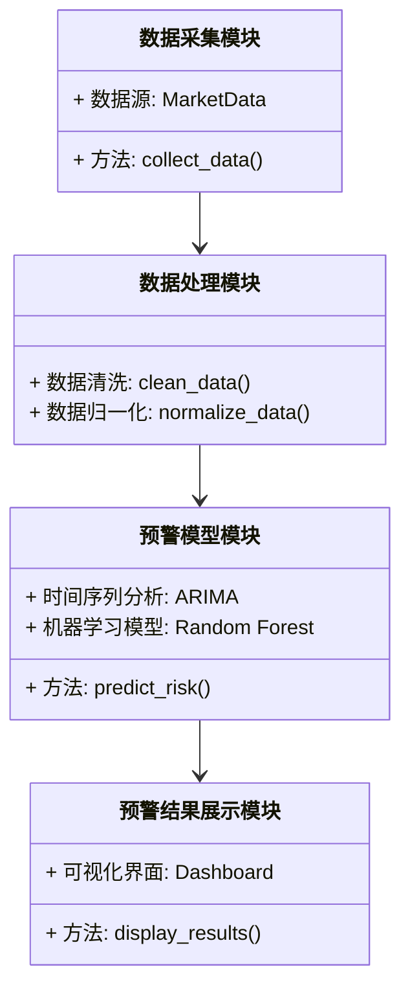

                 


# 开发智能化的金融市场流动性风险预警模型

**关键词**：流动性风险，预警模型，机器学习，时间序列分析，系统架构，金融市场

**摘要**：  
本文详细探讨了开发智能化的金融市场流动性风险预警模型的关键技术与方法。文章首先介绍了流动性风险的基本概念、特征及其对金融市场的潜在影响，接着从数据源、预警指标、算法选择等多个维度分析了模型的核心构成。随后，文章深入讲解了时间序列分析和机器学习算法在模型中的应用，并结合实际案例展示了如何构建一个高效的预警系统。最后，文章讨论了系统架构设计、优化策略以及实际应用场景，为读者提供了一套完整的解决方案。

---

# 第一部分: 金融市场流动性风险预警模型概述

## 第1章: 金融市场流动性风险概述

### 1.1 金融市场流动性风险的定义与特征

#### 1.1.1 金融市场的基本概念  
金融市场是资金流动和资产交易的场所，参与者包括个人、机构、政府等。流动性是指资产在市场中的交易活跃程度，即资产能否迅速以合理价格转化为现金的能力。  

#### 1.1.2 流动性风险的定义与分类  
流动性风险是指由于市场流动性不足，导致资产无法以合理价格迅速变现的风险。常见的流动性风险包括：  
1. **市场流动性风险**：整体市场交易量不足，导致资产价格波动。  
2. **机构流动性风险**：单个机构因资金需求无法满足而引发的风险。  
3. **系统性流动性风险**：整个金融系统因市场流动性枯竭而引发的系统性风险。  

#### 1.1.3 流动性风险的核心特征  
- **突发性**：流动性风险往往在市场波动加剧时突然显现。  
- **传染性**：流动性风险可能在市场中迅速蔓延，影响多个资产或机构。  
- **隐蔽性**：在正常市场条件下，流动性风险可能不易察觉。  

---

### 1.2 流动性风险的影响与重要性

#### 1.2.1 流动性风险对金融市场的冲击  
流动性风险可能导致资产价格大幅波动，甚至引发市场崩盘。例如，2008年金融危机中，流动性不足是导致许多金融机构破产的重要原因。  

#### 1.2.2 机构投资者的流动性需求  
机构投资者通常需要在短时间内进行大规模交易，流动性风险的管理对其至关重要。如果流动性不足，机构可能被迫出售资产，进一步加剧市场波动。  

#### 1.2.3 系统性风险的潜在威胁  
流动性风险可能从单个机构蔓延至整个金融系统，引发系统性危机。因此，建立有效的流动性风险预警机制对维护金融稳定具有重要意义。  

---

### 1.3 流动性风险预警模型的背景与意义

#### 1.3.1 传统流动性风险管理的局限性  
传统的流动性风险管理方法依赖于经验判断和简单的指标分析，存在主观性强、实时性差、覆盖面窄等局限性。  

#### 1.3.2 智能化预警模型的必要性  
随着人工智能和大数据技术的发展，智能化预警模型能够实时捕捉市场信号，提前识别潜在风险，显著提升流动性风险管理的效率和准确性。  

#### 1.3.3 技术进步对流动性风险管理的推动  
近年来，机器学习、深度学习等技术的快速发展为流动性风险预警模型的构建提供了新的工具和方法。  

---

### 1.4 本章小结  
本章从金融市场的基本概念出发，详细介绍了流动性风险的定义、特征及其对金融市场的潜在影响。同时，分析了传统流动性风险管理的局限性，强调了智能化预警模型的必要性和重要性。

---

## 第2章: 流动性风险预警模型的核心概念

### 2.1 流动性风险预警模型的构成要素

#### 2.1.1 数据源的选择与处理  
流动性风险预警模型需要依赖高质量的数据源，常见的数据包括：  
1. **市场数据**：如股票价格、成交量、订单簿等。  
2. **宏观经济数据**：如GDP、利率、通货膨胀率等。  
3. **机构行为数据**：如机构的资金流动、交易频率等。  

#### 2.1.2 预警指标的设计与选取  
预警指标是模型的核心，常见的指标包括：  
1. **成交量变化率**：衡量市场交易活跃程度。  
2. **价差波动率**：衡量买卖价差的变化情况。  
3. **订单簿深度**：衡量市场深度和流动性。  

#### 2.1.3 预警阈值的确定方法  
预警阈值是模型触发预警的临界值，通常基于历史数据和统计方法确定。例如，可以使用标准差、百分位数等方法。  

---

### 2.2 流动性风险预警模型的分类

#### 2.2.1 基于时间序列分析的模型  
这类模型通过分析历史数据的规律，预测未来市场的流动性状况。例如，ARIMA模型和GARCH模型。  

#### 2.2.2 基于机器学习的模型  
机器学习模型能够从海量数据中提取非线性特征，例如支持向量机（SVM）、随机森林（Random Forest）和深度学习模型（如LSTM）。  

#### 2.2.3 混合型预警模型  
混合型模型结合了时间序列分析和机器学习的优势，通过多模型融合提高预警准确性。  

---

### 2.3 核心概念的实体关系图


---

### 2.4 本章小结  
本章详细介绍了流动性风险预警模型的核心构成要素，包括数据源、预警指标和模型分类，并通过实体关系图展示了各部分之间的关系。

---

# 第二部分: 流动性风险预警模型的算法原理

## 第3章: 流动性风险预警模型的算法原理

### 3.1 时间序列分析方法

#### 3.1.1 ARIMA模型原理  
ARIMA（自回归积分滑动平均模型）是一种广泛应用于时间序列分析的模型。其基本公式为：  
$$ARIMA(p, d, q) = y_t - \phi_1 y_{t-1} - \dots - \phi_p y_{t-p} = \theta_1 \epsilon_{t-1} + \dots + \theta_q \epsilon_{t-q}$$  

#### 3.1.2 GARCH模型的应用  
GARCH（广义自回归条件异方差模型）用于捕捉时间序列中的波动性。其基本公式为：  
$$r_t^2 = \alpha_0 + \alpha_1 r_{t-1}^2 + \beta_1 r_{t-1}^2$$  

#### 3.1.3 LSTM网络在时间序列预测中的应用  
LSTM（长短期记忆网络）通过记忆单元捕获长期依赖关系，适用于非线性时间序列预测。  

---

### 3.2 机器学习算法的选择与实现

#### 3.2.1 支持向量机（SVM）的应用  
SVM通过构建超平面实现分类或回归。在流动性风险预警中，可以用于分类市场状态。  

#### 3.2.2 随机森林（Random Forest）的实现  
随机森林通过集成多个决策树模型，提高预测准确性和鲁棒性。  

#### 3.2.3 神经网络模型的构建  
神经网络模型通过多层结构提取非线性特征，适用于复杂市场环境下的风险预警。  

---

### 3.3 算法实现的代码示例

#### 3.3.1 ARIMA模型代码示例  
```python
from statsmodels.tsa.arima.model import ARIMA

# 示例数据
data = [100, 110, 120, 130, 140]

# 模型训练
model = ARIMA(data, order=(1, 1, 0))
model_fit = model.fit()

# 预测
forecast = model_fit.forecast(steps=5)
print(forecast)
```

#### 3.3.2 LSTM网络代码示例  
```python
import numpy as np
from tensorflow.keras import layers

# 示例数据
X = np.random.randn(100, 10)
y = np.random.randn(100, 1)

# 模型构建
model = layers.Sequential()
model.add(layers.LSTM(64, input_shape=(10, 1)))
model.add(layers.Dense(1))
model.compile(optimizer='adam', loss='mean_squared_error')

# 训练
model.fit(X, y, epochs=10, batch_size=32)
```

---

### 3.4 本章小结  
本章详细讲解了时间序列分析和机器学习算法在流动性风险预警模型中的应用，并通过代码示例展示了模型的实现过程。

---

# 第三部分: 流动性风险预警模型的系统架构设计

## 第4章: 流动性风险预警模型的系统架构设计

### 4.1 系统功能设计

#### 4.1.1 数据采集模块  
负责从金融市场获取实时数据，包括价格、成交量、订单簿等。  

#### 4.1.2 数据处理模块  
对数据进行清洗、归一化处理，确保模型输入的准确性。  

#### 4.1.3 预警模型模块  
根据选择的算法构建预警模型，并实时生成预警结果。  

#### 4.1.4 预警结果展示模块  
将预警结果以可视化形式展示给用户。  

---

### 4.2 系统架构设计

#### 4.2.1 类图设计  


#### 4.2.2 架构图设计  


---

### 4.3 本章小结  
本章从系统架构的角度，详细设计了流动性风险预警模型的功能模块和整体架构，并通过类图和架构图展示了各部分之间的关系。

---

# 第四部分: 流动性风险预警模型的项目实战

## 第5章: 流动性风险预警模型的项目实战

### 5.1 环境安装与数据准备

#### 5.1.1 环境安装  
安装必要的Python库，例如：  
```bash
pip install numpy pandas scikit-learn tensorflow
```

#### 5.1.2 数据准备  
从金融数据API获取股票数据，例如使用Yahoo Finance API。  

---

### 5.2 系统核心实现

#### 5.2.1 数据预处理  
对原始数据进行清洗、归一化处理。  

#### 5.2.2 模型训练  
选择合适的算法进行训练，并评估模型性能。  

#### 5.2.3 模型部署  
将模型部署到生产环境，实现实时预警。  

---

### 5.3 代码实现与解读

#### 5.3.1 数据预处理代码  
```python
import pandas as pd
import numpy as np

# 数据加载
data = pd.read_csv('market_data.csv')

# 数据清洗
data.dropna(inplace=True)
data = data[~data.isin([np.nan, np.inf, -np.inf]).any(axis=1)]

# 数据归一化
from sklearn.preprocessing import MinMaxScaler
scaler = MinMaxScaler()
data_scaled = scaler.fit_transform(data)
```

#### 5.3.2 模型训练代码  
```python
from sklearn.ensemble import RandomForestClassifier
from sklearn.metrics import accuracy_score

# 数据分割
X_train, X_test, y_train, y_test = train_test_split(data_scaled, labels, test_size=0.2)

# 模型训练
model = RandomForestClassifier(n_estimators=100)
model.fit(X_train, y_train)

# 模型评估
y_pred = model.predict(X_test)
print("Accuracy:", accuracy_score(y_test, y_pred))
```

---

### 5.4 本章小结  
本章通过实际案例展示了流动性风险预警模型的开发过程，从环境搭建到数据处理、模型训练和结果分析，为读者提供了完整的实现步骤。

---

# 第五部分: 流动性风险预警模型的优化与扩展

## 第6章: 流动性风险预警模型的优化与扩展

### 6.1 模型优化策略

#### 6.1.1 参数优化  
通过网格搜索或随机搜索优化模型参数，提升预测精度。  

#### 6.1.2 模型集成  
结合多个模型的结果，提高预警的准确性和鲁棒性。  

#### 6.1.3 实时更新  
根据市场变化实时更新模型，确保预警的及时性。  

---

### 6.2 模型的应用场景

#### 6.2.1 机构投资者的风险管理  
帮助机构投资者实时监控市场风险，制定合理的投资策略。  

#### 6.2.2 金融监管机构的市场监控  
为金融监管机构提供实时预警，维护市场稳定。  

#### 6.2.3 股票交易策略的优化  
基于预警结果优化交易策略，降低投资风险。  

---

### 6.3 模型的未来发展趋势

#### 6.3.1 多模态数据融合  
结合文本、图像等多种数据源，提升模型的预警能力。  

#### 6.3.2 自适应学习  
通过自适应学习算法，模型能够自动调整参数，适应市场变化。  

#### 6.3.3 分布式计算  
利用分布式计算技术，提升模型的计算效率和扩展性。  

---

### 6.4 本章小结  
本章讨论了流动性风险预警模型的优化策略、应用场景以及未来发展趋势，为读者提供了进一步的研究方向。

---

# 第六部分: 总结与最佳实践

## 第7章: 总结与最佳实践

### 7.1 本章总结  
本文详细探讨了开发智能化的金融市场流动性风险预警模型的关键技术与方法，从理论分析到实际应用，为读者提供了一套完整的解决方案。  

---

### 7.2 最佳实践 tips

#### 7.2.1 数据质量  
确保数据的完整性和准确性，是模型性能的基础。  

#### 7.2.2 模型选择  
根据实际需求选择合适的算法，避免盲目追求复杂性。  

#### 7.2.3 实时性优化  
尽可能减少模型的计算延迟，确保实时预警的准确性。  

---

### 7.3 注意事项

1. **数据隐私**：确保数据的合规性，避免隐私泄露。  
2. **模型解释性**：选择具有可解释性的模型，便于分析和优化。  
3. **系统稳定性**：确保系统的高可用性，避免因技术问题导致预警失效。  

---

### 7.4 拓展阅读  
推荐读者进一步阅读以下文献，深入了解流动性风险预警模型的最新研究进展：  
1. [LSTM-based stock market prediction](https://example.com/lstm-prediction)  
2. [Machine learning for financial risk management](https://example.com/ml-risk)  

---

# 作者：AI天才研究院/AI Genius Institute & 禅与计算机程序设计艺术/Zen And The Art of Computer Programming

---

通过本文的系统介绍，读者可以全面了解流动性风险预警模型的开发过程，并能够实际操作模型的构建与优化。希望本文能够为金融从业者和技术爱好者提供有价值的参考与启发。

