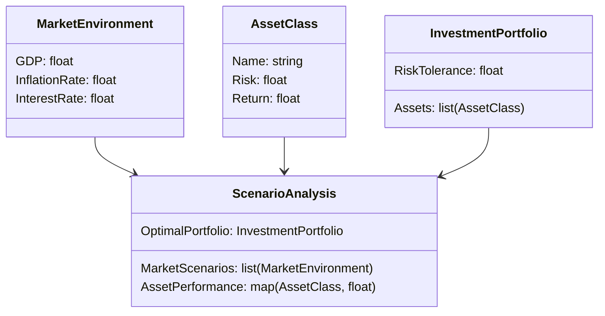
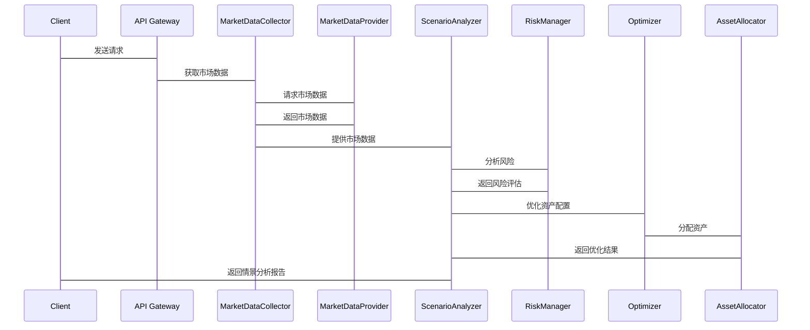

                 


# 情景分析：评估不同市场环境下的组合表现

> **关键词**：情景分析、投资组合、市场环境、资产配置、风险管理、经济指标

> **摘要**：本文通过系统性地分析不同市场环境对投资组合表现的影响，探讨如何利用情景分析方法优化资产配置和风险管理。文章从情景分析的基本概念出发，结合宏观经济因素、行业分析和资产配置策略，深入探讨其在实际投资中的应用，并通过具体案例展示其在不同市场环境下的表现。同时，文章还介绍了情景分析的数学模型和算法原理，为投资者提供科学的决策依据。

---

## 第一部分：情景分析概述

### 第1章：情景分析的核心概念

#### 1.1 什么是情景分析

##### 1.1.1 情景分析的定义
情景分析（Scenario Analysis）是一种评估投资组合在不同市场环境下的表现的方法，通过构建多种可能的市场情景，分析投资组合在这些情景下的收益和风险。情景分析不仅帮助投资者理解潜在的市场变化，还能为资产配置和风险管理提供科学依据。

##### 1.1.2 情景分析的目的与作用
情景分析的主要目的是通过模拟不同市场环境，评估投资组合在这些环境下的表现，从而帮助投资者制定更稳健的投资策略。其作用包括：
- 识别潜在风险和机会
- 优化资产配置
- 提高投资决策的科学性
- 评估投资组合的稳健性

##### 1.1.3 情景分析与投资决策的关系
情景分析是投资决策的重要工具，它通过模拟不同市场情景，帮助投资者在不同情况下做出最优决策。通过情景分析，投资者可以更好地理解市场波动对投资组合的影响，并制定相应的应对策略。

#### 1.2 情景分析的基本方法

##### 1.2.1 情景分析的分类
情景分析可以分为以下几类：
- **历史情景分析**：基于历史市场数据构建情景，分析投资组合在历史情景下的表现。
- **假设情景分析**：基于假设的市场情景（如经济衰退、牛市等）分析投资组合的表现。
- **预测情景分析**：基于对未来的经济预测构建情景，评估投资组合的潜在表现。

##### 1.2.2 不同类型的情景分析方法
情景分析的方法多种多样，主要包括：
- **情景树法**：通过构建情景树，分析不同市场情景的概率和影响。
- **蒙特卡洛模拟法**：通过随机模拟市场情景，评估投资组合的潜在表现。
- **因子分析法**：基于市场因子（如利率、通货膨胀率等）构建情景，分析投资组合的表现。

##### 1.2.3 情景分析的步骤与流程
情景分析的步骤通常包括：
1. 确定分析目标和范围
2. 收集和整理相关数据
3. 构建市场情景
4. 分析投资组合在不同情景下的表现
5. 制定优化策略
6. 监控和调整

### 第2章：情景分析的背景与应用领域

#### 2.1 情景分析的背景

##### 2.1.1 金融市场波动的复杂性
金融市场受多种因素影响，包括经济指标、政策变化、地缘政治等，这些因素使得市场波动具有高度不确定性。

##### 2.1.2 投资者面临的不确定性
投资者在面对不确定性时，需要通过情景分析来评估不同市场环境下的投资组合表现，从而制定更稳健的投资策略。

##### 2.1.3 情景分析在风险管理中的重要性
情景分析可以帮助投资者识别潜在风险，并制定相应的风险管理策略，从而降低投资组合的波动性。

#### 2.2 情景分析的主要应用领域

##### 2.2.1 股票投资
情景分析在股票投资中用于评估不同市场环境下股票组合的表现，帮助投资者制定资产配置策略。

##### 2.2.2 债券投资
情景分析在债券投资中用于评估不同利率环境下的债券组合表现，帮助投资者优化债券组合。

##### 2.2.3 组合管理
情景分析在组合管理中用于评估投资组合在不同市场环境下的表现，帮助投资者优化资产配置和风险管理。

##### 2.2.4 行业分析
情景分析在行业分析中用于评估不同经济环境下不同行业的表现，帮助投资者选择具有潜力的行业。

### 第3章：情景分析的核心要素与框架

#### 3.1 情景分析的核心要素

##### 3.1.1 市场环境
市场环境是情景分析的核心要素之一，包括宏观经济指标（如GDP增长率、通货膨胀率、利率等）和市场情绪。

##### 3.1.2 经济指标
经济指标是情景分析的重要依据，包括GDP增长率、失业率、消费者价格指数（CPI）等。

##### 3.1.3 投资目标
投资目标是情景分析的基础，包括投资期限、风险偏好、收益目标等。

##### 3.1.4 风险偏好
风险偏好是情景分析的重要因素，不同投资者的风险偏好会影响其对不同市场情景的选择。

#### 3.2 情景分析的框架体系

##### 3.2.1 框架设计的原则
情景分析的框架设计应遵循科学性、系统性、可操作性等原则。

##### 3.2.2 框架的组成部分
情景分析的框架通常包括情景构建、情景分析、情景评估和情景应用等部分。

##### 3.2.3 框架的适用性与局限性
情景分析的框架适用于多种市场环境下的投资组合评估，但其局限性在于情景构建的主观性和不确定性。

---

## 第二部分：市场环境与资产表现分析

### 第4章：宏观经济环境对资产表现的影响

#### 4.1 宏观经济指标与资产表现

##### 4.1.1 GDP增长率与资产价格
GDP增长率是衡量经济发展的重要指标，高GDP增长率通常伴随着资产价格上涨。

##### 4.1.2 利率水平与债券价格
利率水平对债券价格有直接影响，利率上升通常会导致债券价格下降。

##### 4.1.3 通货膨胀率与股票收益
通货膨胀率上升通常会导致股票收益增加，但过高的通货膨胀率可能引发货币政策收紧，影响股票市场。

#### 4.2 不同经济周期下的资产表现

##### 4.2.1 经济复苏期的资产配置
在经济复苏期，股票和房地产等资产通常表现较好，债券和现金的表现相对疲软。

##### 4.2.2 经济繁荣期的资产表现
在经济繁荣期，股票和房地产等资产表现优异，债券和现金的表现相对较弱。

##### 4.2.3 经济衰退期的资产风险
在经济衰退期，股票和房地产等资产面临较大风险，债券和现金通常成为避险资产。

### 第5章：行业与板块分析

#### 5.1 行业分析的基本方法

##### 5.1.1 行业生命周期理论
行业生命周期理论将行业分为幼稚期、成长期、成熟期和衰退期，不同阶段的行业表现不同。

##### 5.1.2 行业竞争结构分析
行业竞争结构分析包括行业内竞争程度、新进入者威胁、替代品威胁等。

##### 5.1.3 行业财务指标分析
行业财务指标分析包括盈利能力、成长能力、偿债能力等。

#### 5.2 不同市场环境下的行业表现

##### 5.2.1 高增长行业的识别与投资
高增长行业通常在经济繁荣期表现优异，但在经济衰退期可能面临较大风险。

##### 5.2.2 周期性行业的波动与风险
周期性行业受经济周期影响较大，其表现通常与宏观经济指标密切相关。

##### 5.2.3 防御性行业的稳定性分析
防御性行业（如公用事业、医疗保健等）在经济衰退期通常表现较为稳定。

---

## 第三部分：投资组合优化与情景分析

### 第6章：资产配置策略

#### 6.1 资产配置的基本原理

##### 6.1.1 资产配置的目标与原则
资产配置的目标是在不同市场环境下实现投资收益的最大化，同时控制风险。资产配置的原则包括分散化、长期性、动态调整等。

##### 6.1.2 不同资产类别的风险与收益特征
股票具有较高的收益潜力，但也伴随着较高的风险；债券通常具有稳定的收益，风险较低；现金流动性好，但收益较低。

##### 6.1.3 资产配置的动态调整
根据市场环境的变化，定期调整资产配置，以适应不同的市场情景。

#### 6.2 基于情景分析的资产配置

##### 6.2.1 不同情景下的资产配置策略
在牛市情景下，应增加股票配置；在熊市情景下，应增加债券和现金配置。

##### 6.2.2 资产配置的优化模型
资产配置的优化模型包括均值-方差模型、风险调整收益模型等。

##### 6.2.3 资产配置的实施与监控
资产配置的实施需要结合市场环境和投资目标，定期监控和调整。

### 第7章：风险管理与情景分析

#### 7.1 风险管理的基本概念

##### 7.1.1 风险的定义与分类
风险是指投资收益的不确定性，通常分为市场风险、流动性风险、信用风险等。

##### 7.1.2 风险管理的目标与方法
风险管理的目标是通过识别和评估风险，制定相应的应对策略。常用方法包括分散投资、对冲、保险等。

##### 7.1.3 风险管理在投资组合中的作用
风险管理在投资组合中起到降低风险、提高收益的作用。

#### 7.2 基于情景分析的风险管理

##### 7.2.1 不同情景下的风险管理策略
在不同市场情景下，风险管理策略有所不同。例如，在经济衰退情景下，应增加防御性资产配置。

##### 7.2.2 风险对冲的实现方式
风险对冲可以通过投资于相关资产或使用金融衍生品来实现。

##### 7.2.3 风险管理的监控与评估
定期监控和评估风险管理的效果，根据市场环境的变化调整风险管理策略。

---

## 第四部分：系统分析与架构设计方案

### 第8章：系统分析与架构设计方案

#### 8.1 问题场景介绍

##### 8.1.1 投资者面临的市场环境复杂性
投资者需要应对复杂的市场环境，包括经济波动、政策变化等。

##### 8.1.2 投资组合管理的挑战
投资组合管理需要考虑多种因素，包括资产配置、风险管理等。

#### 8.2 项目介绍

##### 8.2.1 项目目标
通过构建情景分析系统，帮助投资者优化资产配置和风险管理。

##### 8.2.2 项目范围
涵盖市场环境分析、资产配置优化、风险管理等方面。

#### 8.3 系统功能设计

##### 8.3.1 领域模型（Mermaid 类图）


##### 8.3.2 系统架构设计（Mermaid 架构图）
```mermaid
client --> API Gateway: 请求
API Gateway --> MarketDataCollector: 获取市场数据
MarketDataCollector --> MarketDataProvider: 数据源
MarketDataProvider --> MarketDataCollector: 返回市场数据
ScenarioAnalyzer --> RiskManager: 分析风险
Optimizer --> AssetAllocator: 优化资产配置
```

##### 8.3.3 系统接口设计
- 输入接口：市场数据、资产配置参数
- 输出接口：情景分析报告、优化后的资产配置

#### 8.4 系统交互设计（Mermaid 序列图）


---

## 第五部分：项目实战

### 第9章：项目实战

#### 9.1 环境安装

##### 9.1.1 安装Python环境
使用Anaconda安装Python环境，版本为3.8或以上。

##### 9.1.2 安装依赖库
安装必要的依赖库，如pandas、numpy、scipy等。

#### 9.2 系统核心实现源代码

##### 9.2.1 市场数据处理代码
```python
import pandas as pd
import numpy as np

# 示例市场数据
market_data = {
    'GDP Growth': [2.5, 3.0, 2.8, 1.5, 2.2],
    'Inflation Rate': [2.0, 1.8, 2.5, 1.2, 1.9],
    'Interest Rate': [4.0, 3.5, 4.5, 2.8, 3.2]
}

df = pd.DataFrame(market_data)
print(df)
```

##### 9.2.2 情景分析实现代码
```python
import numpy as np

def create_scenarios(market_data, num_scenarios):
    scenarios = []
    for _ in range(num_scenarios):
        scenario = {
            'GDP Growth': np.random.uniform(min(market_data['GDP Growth']), max(market_data['GDP Growth'])),
            'Inflation Rate': np.random.uniform(min(market_data['Inflation Rate']), max(market_data['Inflation Rate'])),
            'Interest Rate': np.random.uniform(min(market_data['Interest Rate']), max(market_data['Interest Rate']))
        }
        scenarios.append(scenario)
    return scenarios

market_data = {
    'GDP Growth': [2.5, 3.0, 2.8, 1.5, 2.2],
    'Inflation Rate': [2.0, 1.8, 2.5, 1.2, 1.9],
    'Interest Rate': [4.0, 3.5, 4.5, 2.8, 3.2]
}

scenarios = create_scenarios(market_data, 10)
print(scenarios)
```

##### 9.2.3 风险评估与优化代码
```python
import numpy as np

def calculate_risk(asset_returns, num_scenario):
    return np.std(asset_returns[:, num_scenario])

def optimize_portfolio(asset_returns, num_assets, num_scenario):
    # 示例优化：等权重配置
    weights = np.array([1.0 / num_assets] * num_assets)
    optimized_returns = np.dot(asset_returns[:, num_scenario], weights)
    return optimized_returns

# 示例资产收益数据
asset_returns = np.array([
    [0.12, 0.08, 0.15, 0.05, 0.10],  # 股票
    [0.03, 0.02, 0.04, 0.01, 0.03],   # 债券
    [0.01, 0.01, 0.02, 0.01, 0.01],   # 现金
])

num_assets = 3
num_scenario = 2

risk = calculate_risk(asset_returns, num_scenario)
optimized_return = optimize_portfolio(asset_returns, num_assets, num_scenario)

print(f"风险：{risk}")
print(f"优化后收益：{optimized_return}")
```

#### 9.3 代码应用解读与分析

##### 9.3.1 市场数据处理代码解读
上述代码展示了如何处理市场数据，包括读取数据和生成情景。

##### 9.3.2 情景分析实现代码解读
情景分析实现代码通过随机生成不同市场情景，评估投资组合在不同情景下的表现。

##### 9.3.3 风险评估与优化代码解读
风险评估代码计算了资产收益的标准差，优化代码实现了等权重配置策略。

#### 9.4 实际案例分析和详细讲解剖析
通过具体案例，分析不同市场情景下投资组合的表现，展示如何通过情景分析优化资产配置和风险管理。

#### 9.5 项目小结
总结项目实现的关键点和成果，强调情景分析在实际投资中的重要性。

---

## 第六部分：最佳实践、小结与展望

### 第10章：最佳实践、小结与展望

#### 10.1 最佳实践

##### 10.1.1 定期进行情景分析
定期进行情景分析，以适应市场环境的变化。

##### 10.1.2 结合定量分析与定性分析
结合定量分析和定性分析，提高分析的准确性和全面性。

##### 10.1.3 保持风险意识
始终关注风险，制定相应的风险管理策略。

#### 10.2 小结
情景分析是评估不同市场环境下投资组合表现的重要工具，通过科学的情景分析，投资者可以更好地优化资产配置和风险管理。

#### 10.3 展望
未来，随着人工智能和大数据技术的发展，情景分析将更加智能化和精准化，为投资者提供更强大的决策支持。

---

## 作者：AI天才研究院/AI Genius Institute & 禅与计算机程序设计艺术/Zen And The Art of Computer Programming

