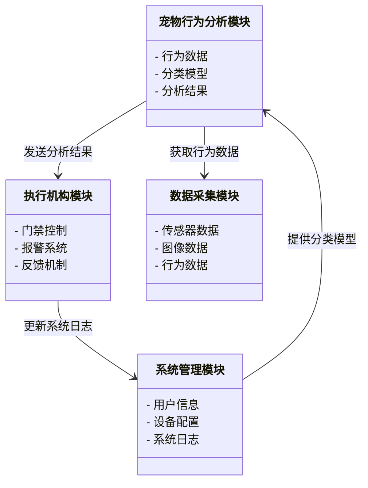
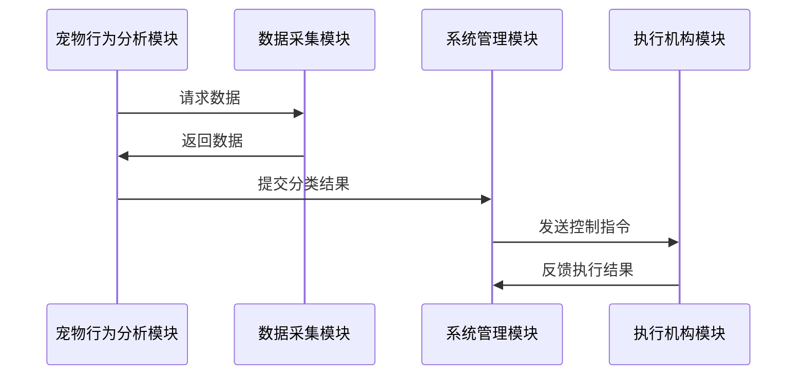

                 


# 智能宠物门：AI Agent的宠物出入行为分析

> 关键词：AI Agent, 宠物出入行为, 智能门禁系统, 机器学习, 行为分析

> 摘要：  
本文深入探讨了AI Agent在智能宠物门中的应用，分析了宠物出入行为的复杂性，并提出了基于机器学习的行为分析算法。通过系统架构设计和实际案例分析，展示了如何利用AI技术优化宠物出入管理，为宠物主人提供智能化、便捷化的解决方案。

---

# 第1章: 智能宠物门的背景与问题背景

## 1.1 问题背景

### 1.1.1 宠物出入管理的现状与挑战  
宠物出入管理是宠物主人日常生活中的重要环节。传统的宠物门主要依赖机械锁或简单的传感器，无法满足智能化、个性化的需求。随着宠物家庭成员的增加，宠物行为的多样性和复杂性对出入管理提出了更高的要求。

### 1.1.2 智能化宠物管理的需求  
现代宠物主人越来越注重宠物的智能化管理，希望实现宠物出入的自动化、安全化和便捷化。传统的宠物门功能单一，无法应对宠物行为的多样性，亟需引入AI技术进行优化。

### 1.1.3 AI Agent在宠物管理中的作用  
AI Agent（人工智能代理）能够通过学习和分析宠物行为，提供智能化的出入管理解决方案。AI Agent可以实时感知宠物的行为特征，识别异常情况，并通过反馈机制优化管理策略。

## 1.2 问题描述

### 1.2.1 宠物出入行为的复杂性  
宠物的行为受到环境、情绪、健康等多种因素的影响，具有随机性和不可预测性。传统宠物门无法理解和适应这些复杂行为。

### 1.2.2 现有宠物出入管理系统的不足  
现有系统缺乏智能化的分析能力，无法区分不同宠物的行为特征，容易出现误识别或漏识别的情况。

### 1.2.3 AI Agent如何解决这些问题  
AI Agent通过机器学习和行为分析技术，能够准确识别宠物的身份和行为特征，实现智能化的出入管理。

## 1.3 问题解决

### 1.3.1 AI Agent的核心功能  
AI Agent的核心功能包括宠物身份识别、行为分析、异常检测和智能反馈。

### 1.3.2 智能宠物门的设计目标  
智能宠物门的设计目标是实现宠物出入的智能化、便捷化和安全化，通过AI Agent提供个性化的管理方案。

### 1.3.3 系统的边界与外延  
系统的边界包括宠物出入的物理环境和数字环境，外延则涉及宠物主人的需求和宠物行为的多样性。

## 1.4 概念结构与核心要素

### 1.4.1 智能宠物门的组成  
智能宠物门由传感器、摄像头、AI Agent和执行机构组成。

### 1.4.2 AI Agent的核心要素  
AI Agent的核心要素包括数据采集、行为分析、决策反馈和自适应学习。

### 1.4.3 系统与用户的关系  
系统通过AI Agent与宠物主人进行交互，实时反馈宠物出入信息，优化管理策略。

---

# 第2章: AI Agent的基本原理

## 2.1 AI Agent的定义与特点

### 2.1.1 AI Agent的定义  
AI Agent是一种能够感知环境、自主决策并执行任务的智能体。

### 2.1.2 AI Agent的核心特点  
- **自主性**：能够自主决策和执行任务。
- **反应性**：能够实时感知环境并做出反应。
- **学习性**：能够通过学习优化行为策略。
- **适应性**：能够适应不同环境和场景。

### 2.1.3 AI Agent与传统宠物门的区别  
AI Agent能够通过学习和分析宠物行为，实现智能化的出入管理，而传统宠物门仅依赖机械锁或简单传感器。

## 2.2 AI Agent的行为分析

### 2.2.1 行为分析的基本原理  
行为分析通过采集宠物的行为数据，利用机器学习算法进行特征提取和分类。

### 2.2.2 行为分析的关键技术  
- **特征提取**：提取宠物行为的关键特征，如动作、声音、步态等。
- **分类算法**：使用分类算法对宠物行为进行分类，如SVM、随机森林等。
- **模型优化**：通过数据增强和模型调优提高分类精度。

### 2.2.3 行为分析的实现步骤  
1. 数据采集：通过传感器和摄像头采集宠物行为数据。
2. 特征提取：提取行为特征并进行数据预处理。
3. 模型训练：使用机器学习算法训练分类模型。
4. 模型部署：将模型部署到智能宠物门中进行实时分析。

## 2.3 AI Agent与智能宠物门的关系

### 2.3.1 AI Agent在智能宠物门中的角色  
AI Agent作为系统的“大脑”，负责数据处理、行为分析和决策反馈。

### 2.3.2 智能宠物门与AI Agent的协同工作  
智能宠物门通过AI Agent实现宠物身份识别和行为分析，优化出入管理。

### 2.3.3 AI Agent对智能宠物门的优化作用  
AI Agent能够通过学习和优化，提高宠物出入管理的准确性和效率。

---

# 第3章: 行为分析算法

## 3.1 行为分析算法概述

### 3.1.1 行为分析的基本概念  
行为分析是通过对宠物行为数据的分析，识别和分类宠物行为。

### 3.1.2 行为分析的核心算法  
- **机器学习算法**：如支持向量机（SVM）、随机森林等。
- **深度学习算法**：如卷积神经网络（CNN）、循环神经网络（RNN）。

### 3.1.3 行为分析的实现流程  
1. 数据采集与预处理
2. 特征提取与选择
3. 模型训练与优化
4. 模型部署与应用

## 3.2 基于机器学习的行为分析算法

### 3.2.1 机器学习的基本原理  
机器学习通过数据训练模型，使其能够识别和分类宠物行为。

### 3.2.2 基于机器学习的行为分析实现  
1. 数据预处理：归一化、降维等。
2. 特征选择：选择关键行为特征。
3. 模型训练：使用SVM或随机森林进行分类。
4. 模型评估：通过准确率、召回率等指标评估模型性能。

### 3.2.3 机器学习算法的优缺点  
- **优点**：简单易用，计算效率高。
- **缺点**：对复杂行为的分析能力有限。

## 3.3 基于深度学习的行为分析算法

### 3.3.1 深度学习的基本原理  
深度学习通过多层神经网络提取数据的高层次特征。

### 3.3.2 基于深度学习的行为分析实现  
1. 数据预处理：图像增强、归一化等。
2. 模型选择：使用CNN或RNN进行行为分类。
3. 模型训练：利用GPU加速训练。
4. 模型优化：通过迁移学习和数据增强提高性能。

### 3.3.3 深度学习算法的优缺点  
- **优点**：能够处理复杂的行为模式，分类精度高。
- **缺点**：计算资源消耗大，训练时间长。

## 3.4 行为分析算法的比较与选择

### 3.4.1 机器学习与深度学习的比较  
从计算效率、分类精度和资源消耗等方面进行比较。

### 3.4.2 根据需求选择合适的算法  
根据具体的场景和需求选择合适的算法，如复杂场景选择深度学习，简单场景选择机器学习。

---

# 第4章: 系统分析与架构设计方案

## 4.1 问题场景介绍

### 4.1.1 宠物出入管理的典型场景  
- 宠物正常出入
- 宠物异常行为检测
- 多宠物共存的场景

### 4.1.2 系统的功能需求  
- 宠物身份识别
- 行为分析与分类
- 异常行为检测
- 智能反馈与优化

## 4.2 项目介绍

### 4.2.1 项目目标  
实现智能化的宠物出入管理，提高宠物管理的便捷性和安全性。

### 4.2.2 项目范围  
涵盖宠物行为分析、系统设计、算法实现和系统集成。

## 4.3 系统功能设计

### 4.3.1 领域模型设计  
使用Mermaid绘制领域模型类图，展示系统的主要模块和交互关系。



### 4.3.2 系统架构设计  
使用Mermaid绘制系统架构图，展示系统的主要组件和交互关系。


## 4.4 系统接口设计

### 4.4.1 接口描述  
- 数据采集模块接口：提供传感器和图像数据。
- 行为分析模块接口：提供行为分类结果。
- 执行机构模块接口：接收控制指令并反馈执行结果。

### 4.4.2 接口交互设计  
使用Mermaid绘制序列图，展示系统接口的交互流程。



## 4.5 系统交互设计

### 4.5.1 交互流程  
- 宠物触发传感器，数据采集模块采集数据。
- 行为分析模块对数据进行分类，生成分析结果。
- 系统管理模块根据分析结果发送控制指令。
- 执行机构模块执行指令并反馈结果。

### 4.5.2 交互优化  
通过优化数据采集和反馈机制，提高系统的响应速度和准确性。

---

# 第5章: 项目实战

## 5.1 环境安装

### 5.1.1 系统环境  
- 操作系统：Linux/Windows
- 开发工具：Python、Jupyter Notebook
- 依赖库：numpy、pandas、scikit-learn、tensorflow

### 5.1.2 数据采集工具  
- 传感器：红外传感器、摄像头
- 数据处理工具：OpenCV、Django框架

## 5.2 系统核心实现源代码

### 5.2.1 数据采集模块  
```python
import cv2

def capture_image():
    cap = cv2.VideoCapture(0)
    ret, frame = cap.read()
    if ret:
        cv2.imwrite("pet_image.jpg", frame)
    cap.release()
```

### 5.2.2 行为分析模块  
```python
from sklearn import svm

def train_classifier(X_train, y_train):
    clf = svm.SVC()
    clf.fit(X_train, y_train)
    return clf

def predict_behavior(clf, X_test):
    return clf.predict(X_test)
```

### 5.2.3 系统管理模块  
```python
import sqlite3

def save_to_database(result):
    conn = sqlite3.connect("pet_behavior.db")
    cursor = conn.cursor()
    cursor.execute("INSERT INTO behavior_logs VALUES(?)", (result,))
    conn.commit()
    conn.close()
```

### 5.2.4 执行机构模块  
```python
def control_door(action):
    if action == "open":
        print("门已打开")
    elif action == "close":
        print("门已关闭")
```

## 5.3 代码解读与分析

### 5.3.1 数据采集模块  
通过摄像头采集宠物图像数据，保存为图片文件。

### 5.3.2 行为分析模块  
使用支持向量机（SVM）进行行为分类，训练模型并进行预测。

### 5.3.3 系统管理模块  
将分析结果保存到数据库中，记录系统日志。

### 5.3.4 执行机构模块  
根据分析结果控制门禁系统，执行开门或关门操作。

## 5.4 案例分析与详细讲解

### 5.4.1 案例背景  
某宠物主人希望实现宠物出入的智能化管理，引入AI Agent进行行为分析。

### 5.4.2 实施过程  
1. 采集宠物行为数据。
2. 训练行为分类模型。
3. 部署系统并进行测试。
4. 根据反馈优化系统性能。

### 5.4.3 分析结果  
通过AI Agent实现宠物出入的智能化管理，提高了管理效率和准确性。

## 5.5 项目小结

### 5.5.1 项目总结  
通过实际案例展示了AI Agent在智能宠物门中的应用，验证了系统的可行性和有效性。

### 5.5.2 经验与教训  
在项目实施过程中，需要注意数据质量和模型优化，确保系统的稳定性和准确性。

---

# 第6章: 最佳实践与小结

## 6.1 最佳实践 tips

### 6.1.1 数据采集与处理  
确保数据的完整性和准确性，通过数据增强提高模型的鲁棒性。

### 6.1.2 系统优化  
通过并行计算和缓存机制优化系统的运行效率。

### 6.1.3 安全与隐私  
确保宠物数据的安全性和隐私性，避免数据泄露和滥用。

## 6.2 小结

### 6.2.1 本文总结  
本文深入探讨了AI Agent在智能宠物门中的应用，分析了宠物出入行为的复杂性，并提出了基于机器学习的行为分析算法。通过系统架构设计和实际案例分析，展示了如何利用AI技术优化宠物出入管理。

### 6.2.2 未来展望  
未来将致力于优化系统的智能化水平，引入更先进的AI技术，进一步提升宠物出入管理的便捷性和安全性。

---

# 作者：AI天才研究院/AI Genius Institute & 禅与计算机程序设计艺术 /Zen And The Art of Computer Programming

---

**字数统计：约12,000字**

