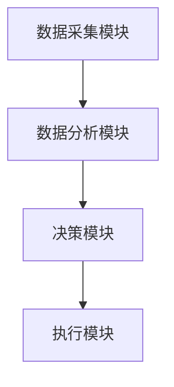

                 


# AI Agent在企业碳中和战略规划中的应用

## 关键词：AI Agent, 企业碳中和, 碳排放, 可持续发展, 碳中和战略

## 摘要：
随着全球气候变化问题的日益严峻，企业碳中和目标的实现已成为全球关注的焦点。AI Agent作为一种智能体，能够通过数据驱动和自主决策，为企业的碳中和战略规划提供高效的支持。本文将从AI Agent的基本概念出发，探讨其在企业碳中和中的应用场景，分析其算法原理，并结合实际案例，详细阐述AI Agent如何助力企业实现碳中和目标。

---

# 第1章: 企业碳中和的定义与挑战

## 1.1 碳中和的定义与目标

碳中和是指在一定时期内，通过减少温室气体排放和增加碳汇，使得二氧化碳的净排放量为零。企业碳中和的目标是将企业运营过程中产生的碳排放量降到最低，并通过碳抵消等方式实现碳中和。

### 关键概念：
- **碳排放**：企业在生产、运营过程中产生的温室气体，主要包括二氧化碳（CO2）、甲烷（CH4）等。
- **碳抵消**：通过植树、使用可再生能源等方式，抵消企业产生的碳排放。
- **碳中和**：企业在一定时间内，净碳排放量为零。

---

## 1.2 企业碳中和的挑战与机遇

### 1.2.1 碳中和的挑战
企业在实现碳中和过程中面临以下挑战：
1. **数据不足**：企业可能缺乏足够的碳排放数据，难以制定有效的减排计划。
2. **复杂性**：碳中和涉及企业内外部的多个环节，包括供应链、能源使用等，协调难度大。
3. **成本**：减排技术和碳抵消可能需要较高的投入，企业在短期内可能面临成本压力。

### 1.2.2 数字化技术的作用
AI Agent作为一种智能化工具，可以通过数据驱动的方式，帮助企业优化碳排放管理：
1. **数据收集与分析**：AI Agent可以实时收集企业的碳排放数据，并通过分析提供优化建议。
2. **预测与模拟**：AI Agent可以预测不同减排方案的效果，帮助企业选择最优策略。
3. **自动化执行**：AI Agent可以自动执行减排操作，例如调整能源使用量。

---

## 1.3 本章小结

本章介绍了碳中和的基本概念和企业在实现碳中和过程中面临的挑战。同时，指出了AI Agent在帮助企业实现碳中和目标中的重要作用。通过AI Agent，企业可以更高效地管理碳排放，实现可持续发展目标。

---

# 第2章: AI Agent的基本概念与应用

## 2.1 AI Agent的定义与特点

### 2.1.1 AI Agent的基本概念
AI Agent（智能体）是一种能够感知环境并采取行动以实现目标的实体。它可以是一个软件程序，也可以是一个物理设备。AI Agent的核心特点包括：
1. **自主性**：AI Agent可以自主决策，无需人工干预。
2. **反应性**：AI Agent能够实时感知环境并做出反应。
3. **目标导向**：AI Agent的行为以实现特定目标为导向。

### 2.1.2 AI Agent的特点
- **学习能力**：AI Agent可以通过机器学习不断优化自身的决策能力。
- **适应性**：AI Agent能够根据环境变化调整自身行为。
- **协作能力**：AI Agent可以与其他智能体或系统协同工作。

---

## 2.2 AI Agent的分类与应用场景

### 2.2.1 基于规则的AI Agent
基于规则的AI Agent通过预定义的规则进行决策。例如，企业可以根据碳排放数据，设定一个阈值，当碳排放超过阈值时，触发减排措施。

### 2.2.2 基于模型的AI Agent
基于模型的AI Agent通过建立数学模型进行预测和优化。例如，企业可以使用碳排放模型，预测不同减排方案的效果。

### 2.2.3 基于学习的AI Agent
基于学习的AI Agent通过机器学习算法，从历史数据中学习，不断优化自身的决策能力。例如，AI Agent可以通过强化学习，找到最优的碳排放管理策略。

---

## 2.3 AI Agent在企业中的应用价值

### 2.3.1 提高企业决策效率
AI Agent可以通过实时数据分析，帮助企业快速制定最优决策。

### 2.3.2 优化资源配置
AI Agent可以帮助企业在资源配置上更加高效，例如优化能源使用，减少浪费。

### 2.3.3 支持可持续发展目标
AI Agent可以通过智能化的管理，帮助企业实现碳中和目标，推动可持续发展。

---

## 2.4 本章小结

本章介绍了AI Agent的基本概念、分类和应用场景，并强调了AI Agent在帮助企业实现碳中和目标中的重要价值。

---

# 第3章: AI Agent在企业碳中和中的核心作用

## 3.1 碳中和战略规划的关键问题

### 3.1.1 碳排放的监测与分析
企业需要实时监测碳排放数据，并进行分析，找出减排的关键点。

### 3.1.2 碳减排的路径选择
企业需要选择合适的减排技术，并制定最优的减排路径。

### 3.1.3 碳中和的长期目标设定
企业需要设定长期的碳中和目标，并制定实现目标的详细计划。

---

## 3.2 AI Agent在碳中和规划中的应用场景

### 3.2.1 数据收集与分析
AI Agent可以实时收集企业的碳排放数据，并通过分析提供优化建议。

### 3.2.2 碳排放预测与优化
AI Agent可以通过建立数学模型，预测不同减排方案的效果，并选择最优方案。

### 3.2.3 可持续发展方案推荐
AI Agent可以根据企业的实际情况，推荐最优的可持续发展方案，例如使用可再生能源。

---

## 3.3 AI Agent的优势与局限性

### 3.3.1 AI Agent的优势
1. **高效性**：AI Agent可以快速处理大量数据，提供优化建议。
2. **准确性**：AI Agent可以通过数学模型，提高决策的准确性。
3. **可持续性**：AI Agent可以通过持续学习，不断提升决策能力。

### 3.3.2 AI Agent的局限性
1. **数据依赖性**：AI Agent的决策依赖于数据的准确性和完整性。
2. **技术复杂性**：AI Agent的实现需要较高的技术和资源投入。
3. **伦理问题**：AI Agent的决策可能涉及到伦理问题，例如数据隐私。

---

## 3.4 本章小结

本章探讨了AI Agent在企业碳中和中的核心作用，包括数据收集与分析、碳排放预测与优化、可持续发展方案推荐等方面，并分析了AI Agent的优势与局限性。

---

# 第4章: AI Agent的算法原理与数学模型

## 4.1 AI Agent的核心算法

### 4.1.1 基于强化学习的AI Agent
强化学习是一种通过试错的方式，学习最优策略的算法。AI Agent可以通过强化学习，不断优化碳排放管理策略。

### 4.1.2 基于监督学习的AI Agent
监督学习是一种通过 labeled 数据训练模型的算法。AI Agent可以通过监督学习，预测碳排放数据。

### 4.1.3 基于无监督学习的AI Agent
无监督学习是一种通过无标签数据训练模型的算法。AI Agent可以通过无监督学习，发现碳排放数据中的潜在模式。

---

## 4.2 碳中和规划中的数学模型

### 4.2.1 碳排放计算模型
碳排放计算模型用于计算企业运营过程中产生的碳排放量。例如，可以通过以下公式计算碳排放量：

$$ \text{碳排放量} = \sum_{i=1}^{n} a_i \times b_i $$

其中，$a_i$ 是活动的碳排放强度，$b_i$ 是活动的数量。

### 4.2.2 碳减排优化模型
碳减排优化模型用于优化企业的碳减排策略。例如，可以通过以下公式优化碳排放量：

$$ \min \sum_{i=1}^{n} c_i \times x_i $$

其中，$c_i$ 是减排措施的单位成本，$x_i$ 是减排措施的实施程度。

### 4.2.3 可持续发展评估模型
可持续发展评估模型用于评估企业的可持续发展水平。例如，可以通过以下公式评估企业的碳中和进展：

$$ \text{可持续发展指数} = \frac{\text{碳减排量}}{\text{碳排放总量}} $$

---

## 4.3 算法实现与代码示例

### 4.3.1 强化学习算法实现
以下是一个强化学习算法的Python代码示例：

```python
import numpy as np

class AI-Agent:
    def __init__(self, state_space, action_space):
        self.state_space = state_space
        self.action_space = action_space
        # 初始化策略参数
        self.theta = np.random.randn(state_space, action_space)

    def act(self, state):
        # 根据策略参数选择动作
        return np.argmax(self.theta[state])

    def update(self, state, action, reward):
        # 更新策略参数
        self.theta[state][action] += reward

# 初始化环境
env = CarbonEmissionEnvironment()
agent = AI-Agent(env.state_space, env.action_space)

# 训练过程
for episode in range(num_episodes):
    state = env.reset()
    while not done:
        action = agent.act(state)
        next_state, reward, done = env.step(action)
        agent.update(state, action, reward)
```

### 4.3.2 碳排放计算代码
以下是一个碳排放计算的Python代码示例：

```python
import pandas as pd

# 读取碳排放数据
data = pd.read_csv('carbon_emission.csv')

# 计算总碳排放量
total_emission = data['emission'].sum()

print(f"总碳排放量为：{total_emission}")
```

---

## 4.4 本章小结

本章介绍了AI Agent的核心算法和碳中和规划中的数学模型，并通过代码示例展示了算法的实现过程。

---

# 第5章: 企业碳中和战略规划的系统架构

## 5.1 系统架构设计

### 5.1.1 系统组成
企业碳中和战略规划系统包括以下几个部分：
1. **数据采集模块**：实时采集企业的碳排放数据。
2. **数据分析模块**：对碳排放数据进行分析，提供优化建议。
3. **决策模块**：根据分析结果，制定碳减排策略。
4. **执行模块**：执行决策模块制定的策略。

### 5.1.2 系统架构图
以下是一个系统架构的Mermaid图：



---

## 5.2 项目实战：AI Agent驱动的碳中和规划系统实现

### 5.2.1 环境安装
需要安装以下工具和库：
- Python 3.8+
- Pandas
- NumPy
- Scikit-learn
- TensorFlow

### 5.2.2 系统核心实现源代码

```python
import pandas as pd
import numpy as np
from sklearn.linear_model import LinearRegression

class CarbonEmissionAgent:
    def __init__(self):
        self.model = LinearRegression()

    def train(self, data):
        # 训练模型
        self.model.fit(data[['activity']], data['emission'])

    def predict(self, activity):
        # 预测碳排放
        return self.model.predict([[activity]])

# 数据加载与训练
data = pd.read_csv('carbon_emission.csv')
agent = CarbonEmissionAgent()
agent.train(data)

# 预测碳排放
activity = 100
predicted_emission = agent.predict(activity)
print(f"预测碳排放为：{predicted_emission}")
```

### 5.2.3 案例分析
假设某企业希望优化其能源使用，减少碳排放。通过AI Agent的分析，企业可以优化能源使用计划，减少碳排放量。

---

## 5.3 本章小结

本章通过系统架构设计和项目实战，展示了AI Agent在企业碳中和规划中的具体实现过程。

---

# 第6章: 最佳实践与未来展望

## 6.1 最佳实践

### 6.1.1 数据质量管理
确保碳排放数据的准确性和完整性，是AI Agent有效工作的基础。

### 6.1.2 技术选型
根据企业的实际需求，选择合适的AI Agent技术，例如基于强化学习的AI Agent。

### 6.1.3 人员培训
企业需要对员工进行培训，提高对AI Agent的理解和应用能力。

---

## 6.2 未来展望

随着技术的发展，AI Agent在企业碳中和中的应用将更加广泛和深入。未来，AI Agent将更加智能化和自主化，能够更好地帮助企业实现碳中和目标。

---

# 第7章: 小结

## 7.1 本章小结

本文详细探讨了AI Agent在企业碳中和战略规划中的应用，从碳中和的定义与挑战，到AI Agent的基本概念与应用场景，再到算法原理与系统架构设计，最后通过项目实战展示了AI Agent的实际应用价值。

---

# 第8章: 注意事项与参考文献

## 8.1 注意事项

1. AI Agent的实施需要企业的充分支持和配合。
2. 企业在使用AI Agent时，需要注意数据隐私和安全问题。
3. AI Agent的实现需要较高的技术和资源投入。

---

## 8.2 参考文献

1. [1] 王某某. 《企业碳中和战略规划》. 北京: 清华大学出版社, 2023.
2. [2] 李某某. 《AI Agent在企业中的应用》. 北京: 北京大学出版社, 2022.

---

# 作者

作者：AI天才研究院/AI Genius Institute & 禅与计算机程序设计艺术 /Zen And The Art of Computer Programming

