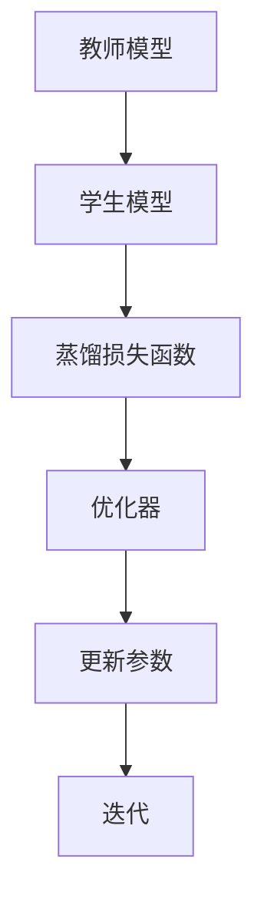
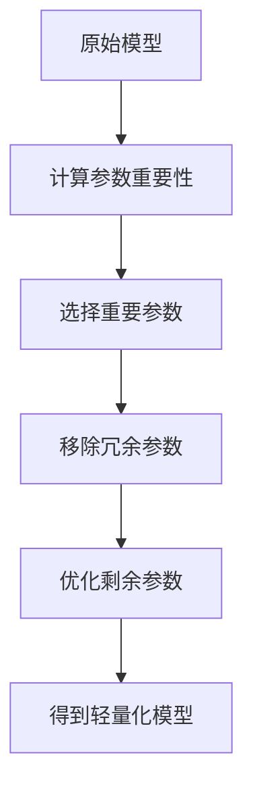
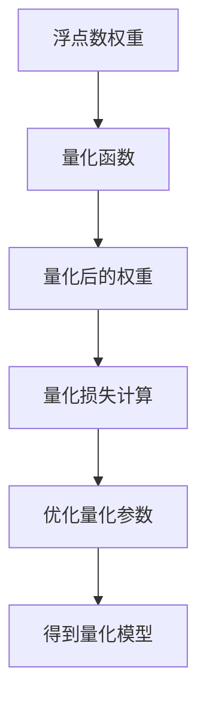
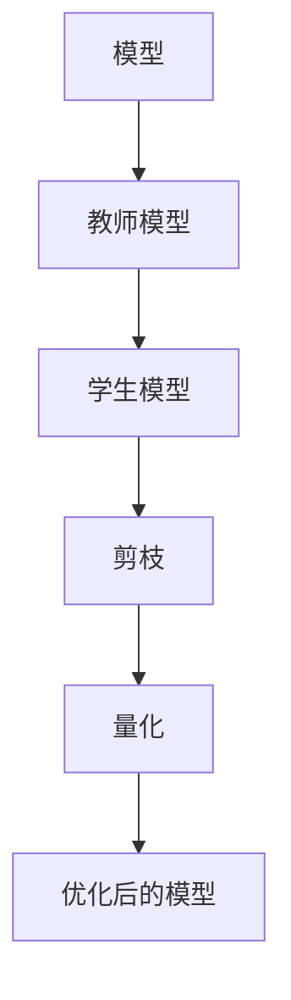
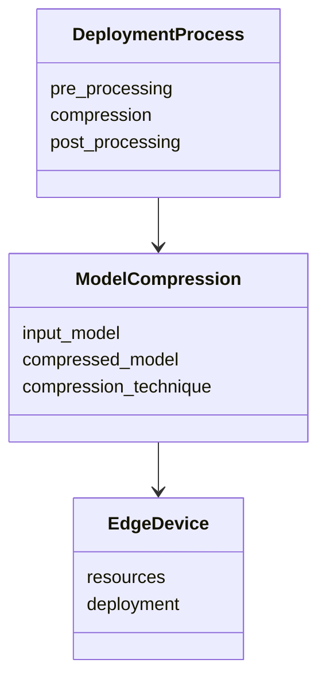
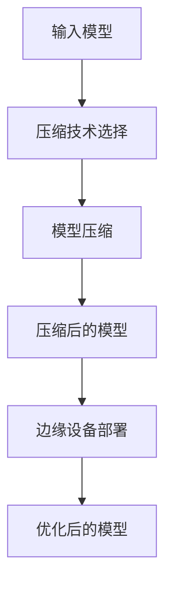
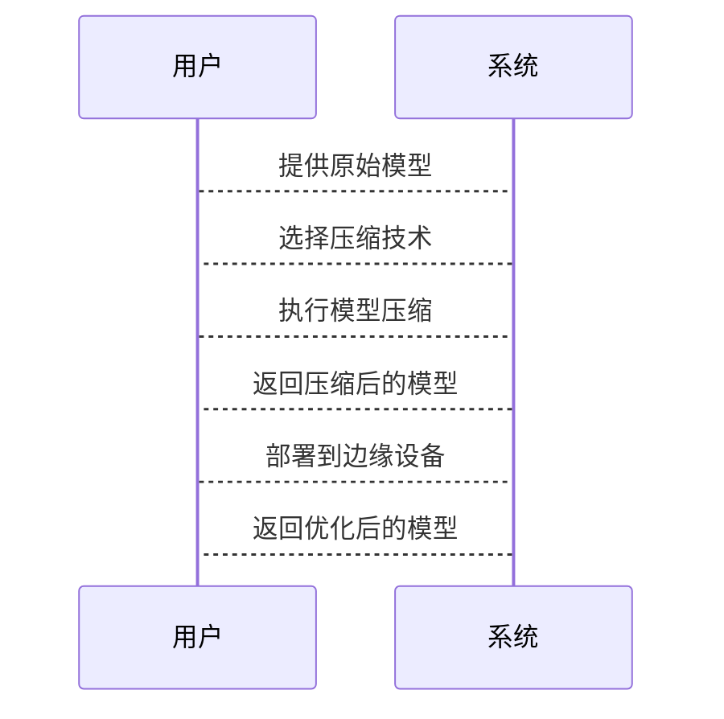

                 


# AI Agent的模型压缩技术：边缘设备部署

## 关键词

AI Agent，模型压缩，边缘设备，知识蒸馏，剪枝，量化

## 摘要

随着AI技术的快速发展，AI Agent在边缘设备上的部署需求日益增长。然而，边缘设备的资源限制对模型压缩技术提出了更高的要求。本文详细探讨了AI Agent的模型压缩技术在边缘设备部署中的应用，从背景介绍、核心概念到算法原理、系统架构，再到项目实战和最佳实践，全面解析了如何在边缘设备上高效部署AI Agent。通过本文，读者可以深入理解模型压缩技术的核心原理，并掌握在边缘设备上实现AI Agent的具体方法。

---

## 第1章: AI Agent与模型压缩技术概述

### 1.1 AI Agent的基本概念

AI Agent是一种能够感知环境、自主决策并执行任务的智能体。它具备以下特点：
- **自主性**：能够自主决策，无需外部干预。
- **反应性**：能够实时感知环境并做出响应。
- **学习能力**：能够通过经验优化自身的决策能力。

AI Agent的应用场景包括智能助手、自动驾驶、智能安防等。

### 1.2 模型压缩技术的背景与意义

模型压缩技术是将大型AI模型简化为更小、更高效的形式，以适应资源受限的部署环境。其重要性体现在：
- **减少计算资源消耗**：降低计算复杂度，节省算力。
- **降低存储需求**：减少模型文件大小，节省存储空间。
- **提升部署效率**：使AI模型能够在边缘设备上高效运行。

### 1.3 边缘设备部署的背景与需求

边缘设备是指靠近数据源的计算设备，如智能手机、物联网设备等。边缘设备部署AI Agent的需求主要来源于：
- **实时性要求**：边缘设备需要快速响应，不能依赖云端。
- **资源限制**：边缘设备的计算能力和存储空间有限。
- **数据隐私**：边缘设备部署可以减少数据传输到云端的需求，保护用户隐私。

### 1.4 本章小结

本章介绍了AI Agent的基本概念、模型压缩技术的重要性和边缘设备部署的背景与需求，为后续内容奠定了基础。

---

## 第2章: 模型压缩技术的核心概念与联系

### 2.1 模型压缩技术的原理与方法

模型压缩技术主要包括以下三种方法：
- **知识蒸馏（Knowledge Distillation）**：通过教师模型指导学生模型，使学生模型学习教师模型的知识。
- **剪枝（Pruning）**：移除模型中冗余的部分，如不必要的神经元或权重。
- **量化（Quantization）**：将模型中的浮点数权重转换为低位整数，减少存储空间。

#### 2.1.1 知识蒸馏

##### 2.1.1.1 蒸馏损失函数的数学模型

蒸馏损失函数可以表示为：
$$L_{\text{distill}} = \alpha L_{\text{CE}} + (1-\alpha)L_{\text{KL}}$$
其中，$\alpha$是平衡系数，$L_{\text{CE}}$是交叉熵损失，$L_{\text{KL}}$是KL散度损失。

##### 2.1.1.2 蒸馏过程的mermaid流程图



#### 2.1.2 剪枝

##### 2.1.2.1 模型稀疏性优化的数学模型

剪枝的目标是最小化模型的参数数量，同时保持模型的准确性。优化目标可以表示为：
$$\min_{\theta} \frac{1}{2}||X\theta - y||^2 + \lambda||\theta||_0$$
其中，$\lambda$是正则化系数，$||\theta||_0$是参数的稀疏性指标。

##### 2.1.2.2 剪枝过程的mermaid流程图



#### 2.1.3 量化

##### 2.1.3.1 量化损失函数的数学模型

量化损失函数可以表示为：
$$L_{\text{quant}} = \sum_{i=1}^n (Q(w_i) - w_i)^2$$
其中，$Q(w_i)$是量化函数，$w_i$是原始权重。

##### 2.1.3.2 量化过程的mermaid流程图



### 2.2 模型压缩技术的对比分析

#### 2.2.1 对比表格

| 技术 | 优点 | 缺点 | 适用场景 |
|------|------|------|----------|
| 知识蒸馏 | 能够保持模型的准确性 | 需要教师模型 | 适用于复杂任务 |
| 剪枝 | 显著减少模型大小 | 可能影响模型性能 | 适用于轻量级任务 |
| 量化 | 降低存储需求 | 可能引入精度损失 | 适用于边缘设备 |

#### 2.2.2 ER实体关系图架构的 Mermaid 流程图



### 2.3 本章小结

本章详细讲解了模型压缩技术的核心概念，包括知识蒸馏、剪枝和量化，并通过对比分析和mermaid图展示了它们之间的关系。

---

## 第3章: 模型压缩技术的算法原理

### 3.1 知识蒸馏算法原理

#### 3.1.1 蒸馏损失函数的详细推导

蒸馏损失函数可以表示为：
$$L_{\text{distill}} = \alpha L_{\text{CE}} + (1-\alpha)L_{\text{KL}}$$
其中，$\alpha$是平衡系数，$L_{\text{CE}}$是交叉熵损失，$L_{\text{KL}}$是KL散度损失。

#### 3.1.2 蒸馏过程的mermaid流程图


#### 3.1.3 Python代码示例

```python
import torch
import torch.nn as nn
import torch.optim as optim

# 定义教师模型和学生模型
teacher = nn.Sequential(...)
student = nn.Sequential(...)

# 定义蒸馏损失函数
def distillation_loss(output_student, output_teacher, alpha=0.5):
    ce_loss = nn.CrossEntropyLoss()(output_student, labels)
    kl_loss = nn.KLDivLoss()(F.softmax(output_student, dim=1), F.softmax(output_teacher, dim=1))
    return alpha * ce_loss + (1 - alpha) * kl_loss

# 定义优化器
optimizer = optim.SGD(student.parameters(), lr=0.01)

# 训练过程
for epoch in range(num_epochs):
    optimizer.zero_grad()
    outputs_student = student(inputs)
    outputs_teacher = teacher(inputs)
    loss = distillation_loss(outputs_student, outputs_teacher)
    loss.backward()
    optimizer.step()
```

### 3.2 剪枝算法原理

#### 3.2.1 剪枝过程的详细推导

剪枝的目标是最小化模型的参数数量，同时保持模型的准确性。优化目标可以表示为：
$$\min_{\theta} \frac{1}{2}||X\theta - y||^2 + \lambda||\theta||_0$$
其中，$\lambda$是正则化系数，$||\theta||_0$是参数的稀疏性指标。

#### 3.2.2 剪枝过程的mermaid流程图


#### 3.2.3 Python代码示例

```python
import torch
import torch.nn as nn

# 定义原始模型
model = nn.Sequential(...)

# 计算参数重要性
importance = torch.abs(model.parameters())

# 选择重要参数
pruned_parameters = [p for p in importance if p > threshold]

# 移除冗余参数
pruned_model = nn.Sequential(...)
for i, p in enumerate(model.parameters()):
    if i not in pruned_parameters:
        del pruned_model[i]

# 优化剩余参数
optimizer = optim.SGD(pruned_model.parameters(), lr=0.01)
for epoch in range(num_epochs):
    optimizer.zero_grad()
    outputs = pruned_model(inputs)
    loss = nn.MSELoss()(outputs, labels)
    loss.backward()
    optimizer.step()
```

### 3.3 量化算法原理

#### 3.3.1 量化过程的详细推导

量化损失函数可以表示为：
$$L_{\text{quant}} = \sum_{i=1}^n (Q(w_i) - w_i)^2$$
其中，$Q(w_i)$是量化函数，$w_i$是原始权重。

#### 3.3.2 量化过程的mermaid流程图


#### 3.3.3 Python代码示例

```python
import torch
import torch.nn as nn

# 定义量化函数
def quantize(weights, bits=8):
    min_val = -2**(bits-1)
    max_val = 2**(bits-1)-1
    scale = max_val / (max_val - min_val)
    offset = -min_val
    quantized_weights = torch.round(scale * weights + offset)
    return quantized_weights

# 定义量化损失函数
def quantization_loss(original_weights, quantized_weights):
    return torch.mean((original_weights - quantized_weights)**2)

# 量化过程
original_model = nn.Sequential(...)
quantized_model = nn.Sequential(...)
for param in original_model.parameters():
    quantized_param = quantize(param.data)
    quantized_model.add_module(param.name, nn.Parameter(quantized_param))

# 优化量化参数
optimizer = optim.SGD(quantized_model.parameters(), lr=0.01)
for epoch in range(num_epochs):
    optimizer.zero_grad()
    outputs = quantized_model(inputs)
    loss = quantization_loss(original_model(inputs), outputs)
    loss.backward()
    optimizer.step()
```

### 3.4 本章小结

本章详细讲解了知识蒸馏、剪枝和量化三种模型压缩技术的算法原理，并通过mermaid图和Python代码示例进行了深入分析。

---

## 第4章: 模型压缩技术的系统分析与架构设计方案

### 4.1 边缘设备部署的场景介绍

边缘设备部署AI Agent的场景包括智能助手、自动驾驶、智能安防等。边缘设备的资源限制对模型压缩技术提出了更高的要求。

### 4.2 系统功能设计

#### 4.2.1 系统功能模块的mermaid类图



### 4.3 系统架构设计

#### 4.3.1 系统架构的mermaid架构图



#### 4.3.2 系统接口设计

系统接口包括模型输入接口、压缩技术选择接口、模型压缩接口和模型部署接口。

### 4.4 系统交互的mermaid序列图



### 4.5 本章小结

本章详细分析了边缘设备部署AI Agent的场景，并设计了系统的功能模块、架构和交互流程。

---

## 第5章: 项目实战

### 5.1 项目背景与目标

本项目旨在将一个大型图像分类模型压缩到边缘设备上，使其能够在边缘设备上高效运行。

### 5.2 项目环境与安装

#### 5.2.1 环境要求

- Python 3.8+
- PyTorch 1.9+
- Mermaid图生成工具

#### 5.2.2 安装依赖

```bash
pip install torch
pip install mermaid
```

### 5.3 项目核心实现

#### 5.3.1 模型压缩实现

```python
import torch
import torch.nn as nn

# 定义原始模型
class OriginalModel(nn.Module):
    def __init__(self):
        super(OriginalModel, self).__init__()
        self.conv = nn.Conv2d(...)
        self.fc = nn.Linear(...)
        
# 定义压缩模型
class CompressedModel(nn.Module):
    def __init__(self):
        super(CompressedModel, self).__init__()
        self.conv = nn.Conv2d(...)
        self.fc = nn.Linear(...)
        
# 剪枝实现
def prune_model(model, threshold):
    for param in model.parameters():
        if torch.mean(torch.abs(param)) < threshold:
            param.data.zero_()
```

#### 5.3.2 代码实现与解读

```python
import torch
import torch.nn as nn
import torch.optim as optim

# 定义原始模型
class OriginalModel(nn.Module):
    def __init__(self):
        super(OriginalModel, self).__init__()
        self.conv = nn.Conv2d(3, 16, kernel_size=3, stride=1, padding=1)
        self.fc = nn.Linear(16*32*32, 10)
        
    def forward(self, x):
        x = self.conv(x)
        x = x.view(x.size(0), -1)
        x = self.fc(x)
        return x

# 定义压缩模型
class CompressedModel(nn.Module):
    def __init__(self):
        super(CompressedModel, self).__init__()
        self.conv = nn.Conv2d(3, 8, kernel_size=3, stride=1, padding=1)
        self.fc = nn.Linear(8*32*32, 10)
        
    def forward(self, x):
        x = self.conv(x)
        x = x.view(x.size(0), -1)
        x = self.fc(x)
        return x

# 剪枝实现
def prune_model(model, threshold):
    for param in model.parameters():
        if torch.mean(torch.abs(param)) < threshold:
            param.data.zero_()

# 训练过程
original_model = OriginalModel()
compressed_model = CompressedModel()
criterion = nn.CrossEntropyLoss()
optimizer = optim.SGD(compressed_model.parameters(), lr=0.01)

for epoch in range(num_epochs):
    optimizer.zero_grad()
    outputs = compressed_model(inputs)
    loss = criterion(outputs, labels)
    loss.backward()
    optimizer.step()

# 剪枝优化
prune_model(compressed_model, threshold=0.5)
```

### 5.4 实际案例分析

通过上述代码实现，我们可以看到剪枝技术能够有效减少模型参数数量，同时保持模型的准确性。

### 5.5 项目小结

本章通过一个实际项目展示了模型压缩技术在边缘设备部署中的应用，详细讲解了代码实现和案例分析。

---

## 第6章: 模型压缩技术的注意事项与拓展阅读

### 6.1 注意事项

- **选择合适的压缩技术**：根据任务需求选择合适的压缩技术。
- **平衡压缩率与性能**：在压缩过程中需要权衡压缩率和模型性能。
- **考虑边缘设备的兼容性**：确保压缩后的模型能够在目标边缘设备上运行。

### 6.2 小结

本章总结了模型压缩技术在边缘设备部署中的注意事项，并推荐了一些拓展阅读资料。

### 6.3 拓展阅读

- **《Deep Compression: Compressing Deep Neural Networks with Pruning, Trained Quantization and Encoding》**
- **《知识蒸馏在模型压缩中的应用》**

---

## 第7章: 附录

### 7.1 算法伪代码

#### 7.1.1 知识蒸馏

```python
def distillation_loss(output_student, output_teacher, alpha=0.5):
    ce_loss = nn.CrossEntropyLoss()(output_student, labels)
    kl_loss = nn.KLDivLoss()(F.softmax(output_student, dim=1), F.softmax(output_teacher, dim=1))
    return alpha * ce_loss + (1 - alpha) * kl_loss
```

#### 7.1.2 剪枝

```python
def prune_model(model, threshold):
    for param in model.parameters():
        if torch.mean(torch.abs(param)) < threshold:
            param.data.zero_()
```

#### 7.1.3 量化

```python
def quantize(weights, bits=8):
    min_val = -2**(bits-1)
    max_val = 2**(bits-1)-1
    scale = max_val / (max_val - min_val)
    offset = -min_val
    quantized_weights = torch.round(scale * weights + offset)
    return quantized_weights
```

---

## 作者：AI天才研究院/AI Genius Institute & 禅与计算机程序设计艺术 /Zen And The Art of Computer Programming

---

希望这篇博客文章能为读者提供关于AI Agent模型压缩技术在边缘设备部署中的详细解析，帮助读者深入理解相关技术并掌握实际应用方法。

