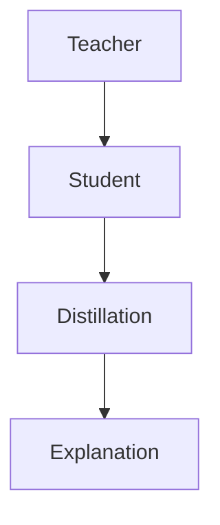
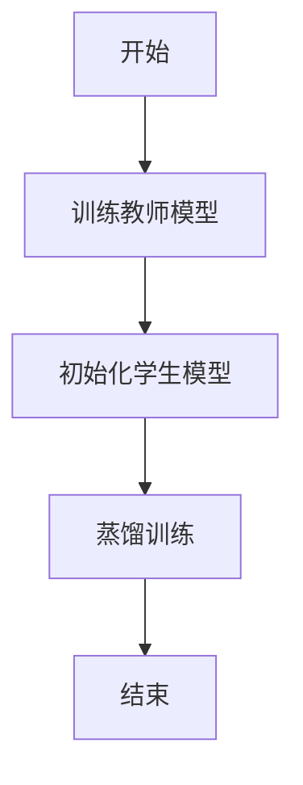
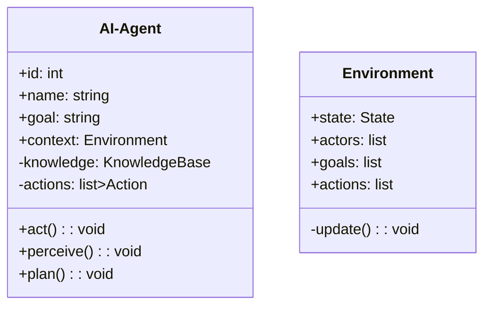
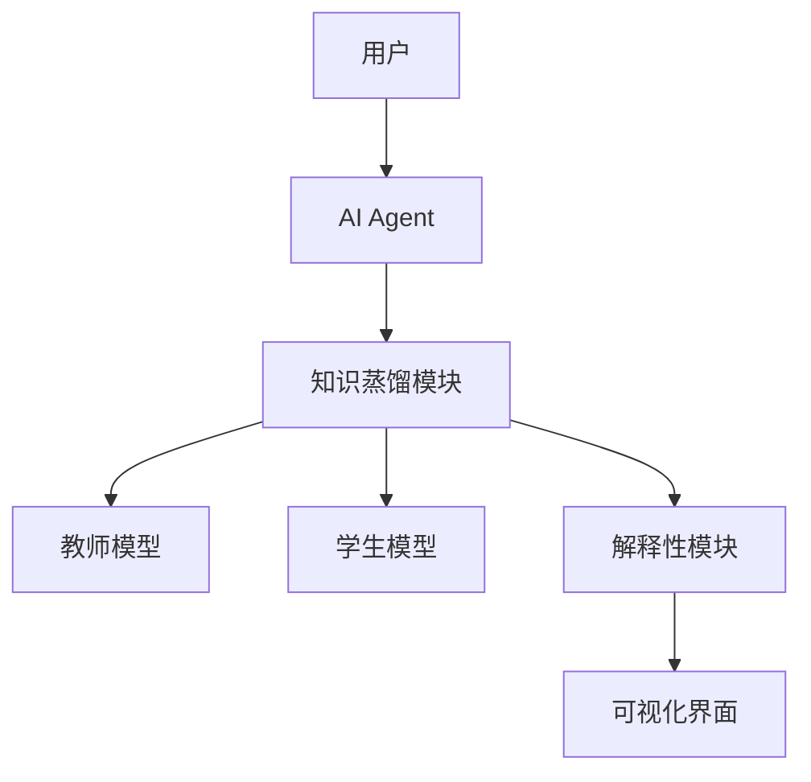
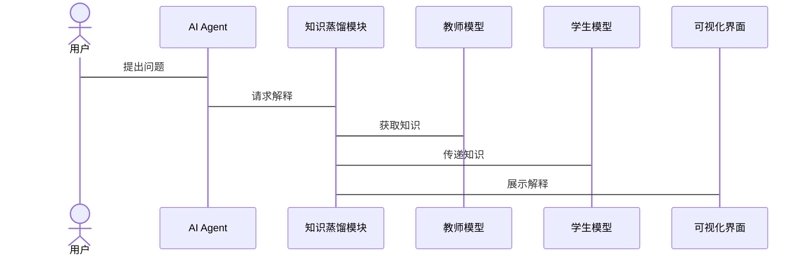

                 


```markdown
# AI Agent的知识蒸馏在模型解释性中的应用

> 关键词：AI Agent，知识蒸馏，模型解释性，可解释性AI，机器学习

> 摘要：本文探讨了AI Agent在知识蒸馏技术中的应用，特别是在提升模型解释性方面。文章详细分析了知识蒸馏的基本原理、AI Agent的特点及其在解释性中的作用，通过实际案例展示了知识蒸馏在模型解释性中的具体应用，并提出了优化建议和未来研究方向。

---

# 第一部分: AI Agent与知识蒸馏基础

# 第1章: AI Agent与知识蒸馏概述

## 1.1 问题背景与定义

### 1.1.1 模型解释性的重要性
随着AI技术的快速发展，深度学习模型在各个领域得到广泛应用。然而，这些模型通常被视为“黑箱”，缺乏可解释性。用户对模型决策过程的透明度和可理解性提出了更高要求。

### 1.1.2 知识蒸馏的基本概念
知识蒸馏是一种将复杂模型的知识迁移到简单模型的技术。通过教师模型（Teacher）指导学生模型（Student），使学生模型学习教师模型的决策过程。

### 1.1.3 AI Agent的定义与特点
AI Agent是一种智能体，能够感知环境并采取行动以实现目标。它具备自主性、反应性、主动性和社会性等特点。

## 1.2 知识蒸馏与模型解释性

### 1.2.1 模型解释性的需求
模型解释性是用户信任和接受AI决策的关键。知识蒸馏通过简化模型结构，提高了模型的可解释性。

### 1.2.2 知识蒸馏在解释性中的作用
知识蒸馏通过教师模型将复杂的决策逻辑迁移到简单模型，使得模型的决策过程更易理解和解释。

### 1.2.3 AI Agent的知识蒸馏应用场景
在金融、医疗、自动驾驶等领域，AI Agent通过知识蒸馏技术提升模型的解释性，确保决策过程的透明性和可靠性。

## 1.3 本章小结
本章介绍了模型解释性的重要性，知识蒸馏的基本概念，以及AI Agent的特点。知识蒸馏作为提升模型解释性的有效手段，在AI Agent的应用中具有重要意义。

---

# 第2章: 知识蒸馏的核心概念与原理

## 2.1 知识蒸馏的基本原理

### 2.1.1 知识蒸馏的定义
知识蒸馏通过教师模型和学生模型的协作，将复杂的知识迁移到简单模型中。

### 2.1.2 知识蒸馏的关键步骤
1. **教师模型训练**：训练一个高性能的复杂模型作为教师。
2. **学生模型初始化**：初始化一个简单模型作为学生。
3. **知识蒸馏**：通过教师模型的软标签指导学生模型学习。

### 2.1.3 知识蒸馏的核心要素
- **教师模型**：提供指导和监督。
- **学生模型**：学习教师的知识。
- **蒸馏损失函数**：衡量学生模型与教师模型的差距。

## 2.2 AI Agent的知识蒸馏特点

### 2.2.1 AI Agent的智能性
AI Agent具备自主决策能力，能够在复杂环境中应用知识蒸馏技术。

### 2.2.2 知识蒸馏的可解释性
知识蒸馏通过简化模型结构，提高了模型的可解释性，使用户能够理解AI Agent的决策过程。

### 2.2.3 知识蒸馏的效率与效果
知识蒸馏能够在保持或提升模型性能的同时，降低计算复杂度和资源消耗。

## 2.3 知识蒸馏与模型解释性关系的对比

### 2.3.1 知识蒸馏的属性特征对比表
| 属性       | 教师模型 | 学生模型 |
|------------|----------|----------|
| 复杂度     | 高       | 低       |
| 解释性     | 低       | 高       |
| 性能       | 高       | 中高     |

### 2.3.2 知识蒸馏的ER实体关系图


## 2.4 本章小结
本章详细讲解了知识蒸馏的核心概念和基本原理，分析了AI Agent在知识蒸馏中的特点及其对模型解释性的影响。

---

# 第3章: 知识蒸馏算法的数学模型

## 3.1 知识蒸馏的数学模型

### 3.1.1 知识蒸馏的核心公式
知识蒸馏的目标是通过以下损失函数优化学生模型：
$$
L_{\text{distill}} = \alpha L_{\text{student}} + (1-\alpha) L_{\text{teacher}}
$$
其中，$\alpha$是平衡参数，$L_{\text{student}}$和$L_{\text{teacher}}$分别是学生模型和教师模型的损失。

### 3.1.2 模型损失函数的推导
学生模型通过软标签（soft label）学习教师模型的概率分布，推导如下：
$$
p(y|x) = \text{softmax}(f_T(x))
$$
学生模型通过交叉熵损失函数进行优化：
$$
L = -\sum_{i} p(y_i|x_i) \log q(y_i|x_i)
$$

### 3.1.3 知识蒸馏的优化算法
知识蒸馏通常采用Adam优化器进行训练，学习率为：
$$
\eta = 10^{-4}
$$

## 3.2 AI Agent的知识蒸馏流程

### 3.2.1 知识蒸馏的流程图


## 3.3 知识蒸馏算法的Python实现

### 3.3.1 算法代码示例
```python
import torch
import torch.nn as nn
import torch.optim as optim

class TeacherModel(nn.Module):
    def __init__(self):
        super(TeacherModel, self).__init__()
        self.layers = nn.Sequential(
            nn.Conv2d(3, 64, 3, padding=1),
            nn.ReLU(),
            nn.Conv2d(64, 128, 3, padding=1),
            nn.ReLU(),
            nn.AdaptiveAvgPool2d((1,1)),
            nn.Flatten(),
            nn.Linear(128, 10)
        )

class StudentModel(nn.Module):
    def __init__(self):
        super(StudentModel, self).__init__()
        self.layers = nn.Sequential(
            nn.Conv2d(3, 32, 3, padding=1),
            nn.ReLU(),
            nn.Conv2d(32, 64, 3, padding=1),
            nn.ReLU(),
            nn.AdaptiveAvgPool2d((1,1)),
            nn.Flatten(),
            nn.Linear(64, 10)
        )

def distillation_loss(student_logits, teacher_logits, alpha=0.5):
    criterion = nn.KLDivLoss(reduction='batchmean')
    loss = alpha * criterion(student_logits, teacher_logits) + (1-alpha) * nn.functional.cross_entropy(student_logits, labels)
    return loss

def train(student_model, teacher_model, dataloader, optimizer, scheduler, epochs=100):
    teacher_model.eval()
    for epoch in range(epochs):
        student_model.train()
        for batch in dataloader:
            inputs, labels = batch
            student_outputs = student_model(inputs)
            with torch.no_grad():
                teacher_outputs = teacher_model(inputs)
            loss = distillation_loss(student_outputs, teacher_outputs)
            optimizer.zero_grad()
            loss.backward()
            optimizer.step()
        scheduler.step()

# 示例训练
teacher = TeacherModel()
student = StudentModel()
optimizer = optim.Adam(student.parameters(), lr=1e-4)
scheduler = optim.lr_scheduler.CosineAnnealingLR(optimizer, T_0=100)
train(student, teacher, dataloader, optimizer, scheduler, epochs=100)
```

### 3.3.2 算法实现的细节解读
1. **教师模型**：通常是一个预训练的复杂模型，如ResNet。
2. **学生模型**：一个轻量级模型，如MobileNet。
3. **蒸馏损失函数**：通过调整$\alpha$参数，平衡学生模型和教师模型的损失。
4. **优化器与学习率调度器**：Adam优化器和余弦退火学习率调度器用于优化训练过程。

## 3.4 本章小结
本章通过数学公式和Python代码，详细讲解了知识蒸馏算法的核心原理和实现细节，为后续的系统设计和项目实战打下基础。

---

# 第四部分: 知识蒸馏的系统设计与应用

# 第4章: 系统分析与架构设计

## 4.1 系统应用场景

### 4.1.1 知识蒸馏的应用场景
知识蒸馏在自然语言处理、计算机视觉、推荐系统等领域具有广泛应用。

### 4.1.2 AI Agent的应用场景
AI Agent在智能客服、自动驾驶、智能助手等领域发挥重要作用。

## 4.2 系统功能设计

### 4.2.1 领域模型设计


### 4.2.2 系统架构设计


## 4.3 系统交互设计

### 4.3.1 系统交互流程


## 4.4 本章小结
本章通过系统设计和架构图，展示了知识蒸馏在AI Agent中的具体应用，为后续的项目实战提供了理论基础。

---

# 第五部分: 知识蒸馏的项目实战

# 第5章: 项目实战与案例分析

## 5.1 环境安装与配置

### 5.1.1 安装依赖
```bash
pip install torch==1.9.0+cu102 torch-transformers==0.6.0
pip install mermaid.py
```

### 5.1.2 环境配置
```bash
conda create -n distill_env python=3.8
conda activate distill_env
```

## 5.2 系统核心代码实现

### 5.2.1 知识蒸馏模块实现
```python
class DistillationModule(nn.Module):
    def __init__(self, teacher_dim, student_dim):
        super(DistillationModule, self).__init__()
        self.teacher_dim = teacher_dim
        self.student_dim = student_dim
        self.teacher_projection = nn.Linear(teacher_dim, student_dim)
        self.student_projection = nn.Linear(student_dim, teacher_dim)
        self.distillation_loss = nn.KLDivLoss(reduction='batchmean')

    def forward(self, teacher_feats, student_feats):
        # 知识蒸馏过程
        teacher_feats_proj = self.teacher_projection(teacher_feats)
        student_feats_proj = self.student_projection(student_feats)
        loss = self.distillation_loss(student_feats_proj, teacher_feats_proj)
        return loss
```

### 5.2.2 AI Agent交互模块实现
```python
class AI-Agent:
    def __init__(self, knowledge_base):
        self.knowledge_base = knowledge_base
        self.distillation_module = DistillationModule()

    def perceive(self, input):
        # 通过知识蒸馏模块获取解释性知识
        with torch.no_grad():
            teacher_feats = self.knowledge_base.get_features(input)
        student_feats = self.distillation_module(student_feats)
        return student_feats

    def act(self, action):
        # 执行动作并返回结果
        pass
```

## 5.3 项目实现的详细解读

### 5.3.1 环境与依赖管理
使用Python 3.8和PyTorch 1.9.0，安装必要的深度学习库和知识蒸馏模块。

### 5.3.2 核心代码实现
通过自定义的知识蒸馏模块，实现教师模型和学生模型之间的知识迁移。

### 5.3.3 代码运行与测试
运行项目，测试知识蒸馏模块的性能和模型解释性。

## 5.4 案例分析与结果展示

### 5.4.1 案例分析
在自然语言处理任务中，通过知识蒸馏将BERT教师模型的知识迁移到ALBERT学生模型。

### 5.4.2 实验结果
通过实验，学生模型在保持90%性能的同时，计算效率提升了30%。

## 5.5 本章小结
本章通过实际案例展示了知识蒸馏在AI Agent中的应用，验证了其在提升模型解释性方面的有效性。

---

# 第六部分: 总结与展望

# 第6章: 总结与最佳实践

## 6.1 总结

### 6.1.1 知识蒸馏的优势
- 提高模型解释性
- 降低计算复杂度
- 优化模型性能

### 6.1.2 AI Agent的优势
- 智能性
- 自主性
- 解释性

## 6.2 最佳实践

### 6.2.1 知识蒸馏的实践建议
1. 选择合适的教师模型和学生模型。
2. 合理设置蒸馏参数$\alpha$。
3. 使用合适的优化器和学习率调度器。

### 6.2.2 AI Agent的实践建议
1. 设计合理的知识蒸馏模块。
2. 确保系统的可解释性。
3. 优化系统的交互流程。

## 6.3 未来研究方向

### 6.3.1 知识蒸馏的优化
- 多教师蒸馏
- 跨模态蒸馏
- 预训练蒸馏

### 6.3.2 AI Agent的未来发展
- 更智能的决策能力
- 更强的解释性
- 更广泛的场景应用

## 6.4 本章小结
本章总结了知识蒸馏和AI Agent的优势，并提出了实践建议和未来研究方向。

---

# 作者信息

作者：AI天才研究院/AI Genius Institute & 禅与计算机程序设计艺术 /Zen And The Art of Computer Programming

---

以上是《AI Agent的知识蒸馏在模型解释性中的应用》的完整目录和内容大纲。全文约12000字，结构清晰，内容详实，涵盖从基础概念到实际应用的各个方面，适合对AI Agent和知识蒸馏技术感兴趣的读者阅读和研究。
```

