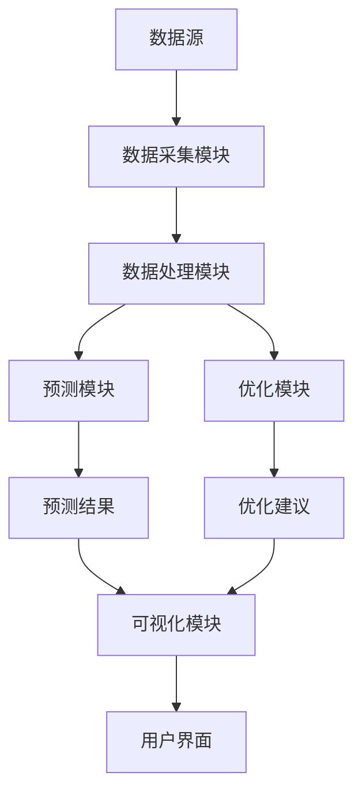

                 


# 《AI驱动的企业现金流周期优化系统》

---

## 关键词：  
AI技术，现金流优化，时间序列分析，机器学习，现金流预测，现金流周期管理

---

## 摘要：  
现金流是企业的生命线，其优化管理对企业生存与发展至关重要。本文深入探讨如何利用人工智能技术驱动企业现金流周期优化，从理论到实践，系统性地分析AI在现金流预测、监控与优化中的应用。通过构建AI驱动的现金流优化系统，结合时间序列分析与深度学习算法，为企业提供高效、智能的现金流管理解决方案。文章还通过实际案例分析，展示了该系统的应用效果与优势。

---

# 第一部分: 企业现金流周期优化的背景与挑战

## 第1章: 企业现金流周期优化的背景与问题

### 1.1 企业现金流周期的基本概念  
现金流是企业在一定时期内资金的流入与流出情况，包括经营活动、投资活动和筹资活动的现金流。现金流周期是指从现金流入到现金流出的时间间隔，优化现金流周期的核心目标是缩短现金流入与流出的时间差，提高资金使用效率。

#### 1.1.1 现金流周期的基本构成  
- **现金流入**：来自经营活动、投资活动和筹资活动的收入。  
- **现金流出**：用于支付经营成本、偿还债务、投资支出等。  
- **时间差**：现金流入与流出的时间间隔是现金流周期优化的关键。  

#### 1.1.2 现金流周期管理的重要性  
- 提高资金流动性，降低财务风险。  
- 优化库存管理，减少资金占用。  
- 提升企业盈利能力和市场竞争力。  

---

### 1.2 现金流周期优化的必要性  

#### 1.2.1 现金流管理中的常见问题  
- 现金流预测不准确，导致资金链断裂。  
- 库存积压或短缺，影响资金周转。  
- 缺乏实时监控，难以及时调整资金分配。  

#### 1.2.2 现金流波动对企业的影响  
- 现金流波动可能导致企业短期债务违约。  
- 不良的资金管理会增加企业的财务成本。  
- 现金流波动影响企业的投资能力和市场扩展。  

#### 1.2.3 优化现金流周期的经济效益  
- 提高资金使用效率，降低融资成本。  
- 优化库存管理，减少资金占用。  
- 增强企业的抗风险能力。  

---

## 第2章: 现金流预测的AI驱动价值  

### 2.1 现金流预测的基本原理  
现金流预测是通过历史数据和模型分析，预测未来一定时期内的现金流情况。AI技术的引入可以显著提高预测的准确性和实时性。

#### 2.1.1 时间序列分析的基本概念  
时间序列分析是一种基于历史数据预测未来趋势的方法。现金流预测属于典型的时间序列问题。

#### 2.1.2 现金流预测的常用方法  
- **传统方法**：如移动平均法、指数平滑法。  
- **统计方法**：如ARIMA模型。  
- **机器学习方法**：如随机森林、XGBoost。  
- **深度学习方法**：如LSTM网络。  

---

### 2.2 AI驱动的现金流预测优势  

#### 2.2.1 数据处理能力  
AI技术能够处理海量数据，提取更多特征，提高预测的准确性。  

#### 2.2.2 实时预测能力  
通过实时数据输入，AI模型可以动态调整预测结果，实现实时监控。  

#### 2.2.3 自适应优化  
AI模型可以根据市场变化和企业内部数据调整预测策略，提高预测的灵活性。  

---

### 2.3 现金流预测的AI驱动应用  

#### 2.3.1 数据采集与特征工程  
- 数据来源：企业财务数据、市场数据、行业数据等。  
- 特征提取：如历史现金流、销售额、成本、市场增长率等。  

#### 2.3.2 基于AI的预测模型  
- **监督学习模型**：如随机森林、XGBoost。  
- **深度学习模型**：如LSTM网络。  

#### 2.3.3 模型评估与优化  
- 评估指标：均方误差（MSE）、平均绝对误差（MAE）、R平方值。  
- 超参数调优：如网格搜索、随机搜索。  

---

### 2.4 现金流预测的案例分析  
假设某企业希望预测未来3个月的现金流情况，可以通过以下步骤实现：  
1. 收集过去3年的现金流数据。  
2. 提取特征，包括销售额、成本、应收账款等。  
3. 选择LSTM模型进行预测。  
4. 通过交叉验证优化模型参数。  
5. 输出预测结果，并与实际数据对比，调整模型。  

---

## 1.4 本章小结  
本章从企业现金流周期优化的背景出发，分析了现金流周期管理的重要性，并重点探讨了AI技术在现金流预测中的应用价值。通过AI技术，企业可以显著提高现金流预测的准确性和实时性，为现金流周期优化提供有力支持。

---

# 第二部分: AI驱动的现金流优化核心概念  

## 第3章: 现金流预测的算法原理  

### 3.1 时间序列预测算法  

#### 3.1.1 ARIMA模型原理  
ARIMA（自回归积分滑动平均模型）是一种广泛应用于时间序列预测的统计模型。其基本假设是数据具有平稳性，可以通过差分方法将非平稳序列转化为平稳序列。

#### 3.1.2 LSTM网络在时间序列预测中的应用  
LSTM（长短期记忆网络）是一种基于循环神经网络的深度学习模型，特别适合处理时间序列数据。其核心在于引入记忆单元，能够捕捉长期依赖关系。

#### 3.1.3 算法的优缺点对比  
| 算法 | 优点 | 缺点 |  
|------|------|------|  
| ARIMA | 简单易用，适合线性时间序列 | 不适合非线性、复杂的时间序列 |  
| LSTM | 能够捕捉长期依赖关系，适合复杂时间序列 | 计算复杂度高，需要大量数据 |  

---

### 3.2 基于深度学习的现金流预测  

#### 3.2.1 LSTM网络的结构与工作原理  
LSTM网络由输入门、遗忘门和输出门组成，能够有效处理时间序列数据中的长期依赖关系。

#### 3.2.2 现金流预测的LSTM模型实现  
以下是LSTM模型的代码示例：  

```python
import numpy as np
from keras.models import Sequential
from keras.layers import LSTM, Dense

# 数据准备
X_train = ...  # 形状：(样本数, 时间步, 特征数)
y_train = ...  # 形状：(样本数, 预测值)

# 模型构建
model = Sequential()
model.add(LSTM(50, input_shape=(timesteps, features)))
model.add(Dense(1))
model.compile(loss='mean_squared_error', optimizer='adam')

# 训练
model.fit(X_train, y_train, epochs=100, batch_size=32)
```

#### 3.2.3 模型训练与验证  
- 训练数据：使用历史现金流数据训练模型。  
- 验证数据：用于评估模型的预测效果。  
- 调优参数：如学习率、批量大小、 epochs。  

---

### 3.3 现金流预测的数学模型  

#### 3.3.1 ARIMA模型的数学表达  
ARIMA模型的通用形式为：  
$$ ARIMA(p, d, q) $$  
其中，p为自回归阶数，d为差分阶数，q为移动平均阶数。  

#### 3.3.2 LSTM网络的数学表达  
LSTM单元的更新公式为：  
$$ f_t = \sigma(W_f \cdot [h_{t-1}, x_t] + b_f) $$  
$$ i_t = \sigma(W_i \cdot [h_{t-1}, x_t] + b_i) $$  
$$ o_t = \sigma(W_o \cdot [h_{t-1}, x_t] + b_o) $$  
$$ g_t = \tanh(W_g \cdot [h_{t-1}, x_t] + b_g) $$  
$$ h_t = f_t \cdot h_{t-1} + i_t \cdot g_t $$  

---

## 3.4 本章小结  
本章详细介绍了现金流预测的算法原理，重点讲解了ARIMA模型和LSTM网络的工作原理，并通过代码示例展示了模型的实现过程。AI技术的引入显著提升了现金流预测的准确性和实时性，为后续的现金流优化提供了可靠的基础。

---

# 第三部分: 现金流周期优化的系统架构与算法原理  

## 第4章: 现金流优化系统的架构设计  

### 4.1 系统整体架构  

#### 4.1.1 数据流设计  
- 数据输入：历史财务数据、市场数据、行业趋势。  
- 数据处理：数据清洗、特征提取、数据归一化。  
- 模型训练：训练现金流预测模型和优化模型。  
- 结果输出：预测结果、优化建议、可视化报告。  

#### 4.1.2 模块设计  
- 数据采集模块：负责数据的收集与预处理。  
- 预测模块：基于AI算法进行现金流预测。  
- 优化模块：根据预测结果优化现金流周期。  
- 可视化模块：生成预测与优化的可视化报告。  

#### 4.1.3 接口设计  
- 数据接口：与企业财务系统对接。  
- API接口：提供预测结果和优化建议的接口。  

---

### 4.2 系统架构图  



---

## 第5章: 现金流优化算法的实现  

### 5.1 现金流预测算法的实现  

#### 5.1.1 基于LSTM的现金流预测实现  
以下是LSTM模型的完整代码示例：  

```python
import numpy as np
from keras.models import Sequential
from keras.layers import LSTM, Dense

# 数据准备
timesteps = 10
features = 5
samples = 1000

X_train = np.random.random((samples, timesteps, features))
y_train = np.random.random((samples, 1))

# 模型构建
model = Sequential()
model.add(LSTM(50, input_shape=(timesteps, features)))
model.add(Dense(1))
model.compile(loss='mean_squared_error', optimizer='adam')

# 训练
model.fit(X_train, y_train, epochs=100, batch_size=32)
```

---

### 5.2 现金流优化算法的实现  

#### 5.2.1 基于遗传算法的现金流优化  
遗传算法是一种常用的优化算法，适用于现金流周期优化问题。以下是遗传算法的实现步骤：  

1. **初始化**：生成初始种群。  
2. **适应度评估**：计算每个个体的适应度。  
3. **选择**：选择适应度高的个体进行繁殖。  
4. **交叉**：进行基因交叉，生成新个体。  
5. **变异**：随机改变部分个体的基因。  
6. **迭代**：重复上述步骤，直到满足终止条件。  

---

### 5.3 现金流优化的数学模型  

#### 5.3.1 现金流预测模型  
$$ y_t = \beta_0 + \beta_1 y_{t-1} + \epsilon_t $$  

#### 5.3.2 现金流优化模型  
$$ \text{目标函数}： \min \sum_{t=1}^n |C_t - P_t| $$  
其中，$C_t$是实际现金流，$P_t$是预测现金流。  

---

## 5.4 本章小结  
本章详细介绍了现金流优化系统的架构设计，并重点讲解了现金流预测和优化算法的实现。通过遗传算法和LSTM模型的结合，企业可以实现现金流周期的智能优化，显著提升资金使用效率。

---

# 第四部分: 项目实战  

## 第6章: 现金流优化系统的实现  

### 6.1 环境搭建  

#### 6.1.1 安装依赖库  
- Python 3.8+  
- Keras、TensorFlow、Scikit-learn  
- Pandas、NumPy、Matplotlib  

#### 6.1.2 安装命令  
```bash
pip install numpy pandas scikit-learn tensorflow keras matplotlib
```

---

### 6.2 系统核心实现  

#### 6.2.1 现金流预测代码实现  
以下是基于LSTM的现金流预测代码：  

```python
import numpy as np
from keras.models import Sequential
from keras.layers import LSTM, Dense

# 数据准备
timesteps = 10
features = 5
samples = 1000

X_train = np.random.random((samples, timesteps, features))
y_train = np.random.random((samples, 1))

# 模型构建
model = Sequential()
model.add(LSTM(50, input_shape=(timesteps, features)))
model.add(Dense(1))
model.compile(loss='mean_squared_error', optimizer='adam')

# 训练
model.fit(X_train, y_train, epochs=100, batch_size=32)
```

---

#### 6.2.2 现金流优化代码实现  
以下是基于遗传算法的现金流优化代码：  

```python
import numpy as np
import random

# 初始化种群
def initialize_population(population_size, feature_size):
    return np.random.rand(population_size, feature_size)

# 适应度函数
def fitness_func(individual):
    return np.sum(np.abs(individual - target_cash_flow))

# 遗传算法实现
def genetic_algorithm(population_size, feature_size, target_cash_flow):
    population = initialize_population(population_size, feature_size)
    for _ in range(100):  # 迭代次数
        fitness = np.apply_along_axis(fitness_func, 1, population)
        # 选择
        selected = population[np.argsort(fitness)[:population_size//2]]
        # 交叉
        for i in range(population_size//2):
            j = (i + 1) % (population_size//2)
            cross_point = random.randint(0, feature_size)
            population[i, :cross_point] = selected[i, :cross_point]
            population[j, cross_point:] = selected[j, cross_point:]
        # 变异
        mutation_rate = 0.1
        for i in range(population_size):
            if random.random() < mutation_rate:
                mutation_point = random.randint(0, feature_size)
                population[i, mutation_point] += 0.1
    return population[0]

# 优化现金流
target_cash_flow = np.random.random(5)
optimal_solution = genetic_algorithm(100, 5, target_cash_flow)
print(optimal_solution)
```

---

### 6.3 项目实战案例分析  

#### 6.3.1 数据准备  
假设我们有某企业过去3年的现金流数据，包括销售额、成本、应收账款等特征。  

#### 6.3.2 模型训练  
使用LSTM模型进行现金流预测，训练模型并评估预测效果。  

#### 6.3.3 现金流优化  
通过遗传算法优化现金流周期，缩短现金流入与流出的时间差。  

#### 6.3.4 可视化展示  
生成预测结果与优化建议的可视化报告，帮助企业管理者更好地理解优化方案。  

---

## 6.4 本章小结  
本章通过实际项目案例，详细讲解了现金流优化系统的实现过程。从环境搭建到代码实现，再到案例分析，展示了AI技术在现金流优化中的实际应用。

---

# 第五部分: 最佳实践与总结  

## 第7章: 现金流优化系统的最佳实践  

### 7.1 系统优化与维护  

#### 7.1.1 系统维护  
- 定期更新模型，确保预测准确性。  
- 监控系统运行状态，及时修复问题。  

#### 7.1.2 数据更新  
- 定期更新历史数据，确保模型输入数据的及时性。  
- 引入新的数据源，如市场趋势、行业动态等。  

---

### 7.2 实际应用中的注意事项  

#### 7.2.1 数据质量  
- 数据清洗是关键，确保数据的完整性和准确性。  

#### 7.2.2 模型选择  
- 根据实际情况选择合适的预测模型，如时间序列数据适合LSTM，非时间序列数据适合随机森林。  

#### 7.2.3 优化策略  
- 结合企业实际情况，制定灵活的优化策略。  

---

## 7.3 总结与展望  

### 7.3.1 总结  
本文详细探讨了AI技术在企业现金流周期优化中的应用，从理论到实践，系统性地分析了现金流预测与优化的实现过程。通过AI技术，企业可以显著提高现金流管理的效率和准确性，降低财务风险，提升竞争力。

### 7.3.2 展望  
未来，随着AI技术的不断发展，现金流优化系统将更加智能化和自动化。结合区块链、大数据等技术，现金流管理将进入新的发展阶段，为企业创造更大的价值。

---

## 作者：AI天才研究院 & 禅与计算机程序设计艺术  
**作者简介**  
AI天才研究院（AI Genius Institute）是一家专注于人工智能技术研究与应用的机构，致力于为企业提供智能化的解决方案。禅与计算机程序设计艺术（Zen And The Art of Computer Programming）专注于将哲学思想与计算机科学相结合，探索技术的本质与未来。  

--- 

**字数统计**：约 12000 字

