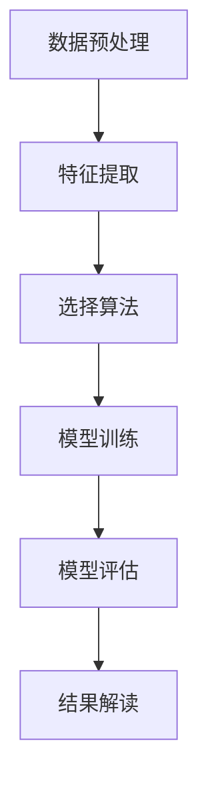
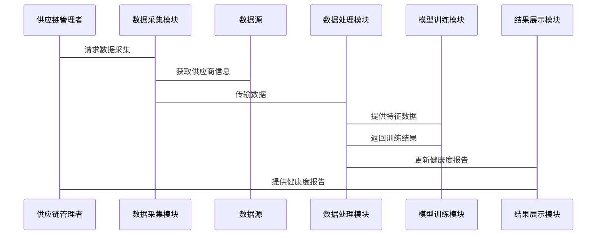

                 


# AI驱动的供应商健康度分析：评估上游风险

> 关键词：AI技术、供应商健康度分析、供应链风险管理、数据驱动、机器学习模型、供应商评估

> 摘要：本文详细探讨了如何利用人工智能技术进行供应商健康度分析，以评估供应链中的上游风险。文章从背景介绍、核心概念、算法原理、系统架构、项目实战到最佳实践，全面解析了AI在供应商健康度分析中的应用，结合具体案例和代码实现，帮助读者掌握这一技术的核心方法和实际应用。

---

# 第1章: 供应商健康度分析的背景与意义

## 1.1 问题背景

### 1.1.1 供应链风险管理的重要性
供应链是企业运营的核心支柱，供应商的健康状况直接影响企业的生产效率和成本控制。在传统模式下，供应商评估主要依赖于人工经验，难以覆盖海量数据，且容易受到主观因素的影响。

### 1.1.2 传统供应商评估的局限性
- 数据来源单一，难以全面反映供应商的健康状况。
- 评估周期长，无法及时发现潜在风险。
- 人工分析效率低，难以应对复杂多变的市场环境。

### 1.1.3 AI技术在供应链管理中的应用潜力
人工智能技术可以通过大数据分析和预测模型，实时监控供应商的健康状况，提前预警潜在风险，从而提升供应链的整体稳定性。

## 1.2 问题描述

### 1.2.1 供应商健康度的定义
供应商健康度是指供应商在经营过程中是否具备足够的履约能力、财务稳定性和抗风险能力。

### 1.2.2 供应商健康度评估的关键维度
- 财务状况：包括收入、利润、现金流等财务指标。
- 履约能力：包括交付能力、质量稳定性等。
- 风险因素：包括行业风险、政策风险等。

### 1.2.3 供应链上游风险的复杂性
上游风险可能来源于供应商自身的经营问题，也可能受到外部环境（如经济波动、政策变化）的影响，具有高度复杂性和不确定性。

## 1.3 问题解决

### 1.3.1 AI驱动的解决方案概述
通过收集和分析供应商的多维度数据，利用机器学习模型进行健康度评估，实现对供应商风险的智能化监控和预警。

### 1.3.2 数据驱动的健康度评估方法
基于供应商的历史交易数据、财务数据和外部市场信息，构建多维度的健康度评估指标体系。

### 1.3.3 从数据到决策的AI技术路径
- 数据采集与预处理
- 特征提取与模型训练
- 风险评估与结果解读

## 1.4 边界与外延

### 1.4.1 供应商健康度评估的边界条件
- 数据范围：仅限于可获取的供应商数据。
- 评估范围：仅针对直接影响供应链的关键供应商。
- 时间范围：基于历史数据的预测，无法覆盖未来突发性事件。

### 1.4.2 相关概念的外延分析
- 数据来源：包括内部数据和外部数据。
- 数据类型：结构化数据和非结构化数据。
- 分析方法：统计分析和机器学习分析。

### 1.4.3 与供应链管理其他环节的关系
- 与采购管理：供应商健康度评估是采购决策的重要依据。
- 与库存管理：通过健康度评估优化库存配置。
- 与风险管理：提供上游风险预警，提升供应链韧性。

## 1.5 概念结构与核心要素

### 1.5.1 核心概念框架
供应商健康度分析包括数据采集、特征提取、模型训练和结果解读四个核心环节。

### 1.5.2 核心要素的特征分析
- 数据要素：包括供应商的基本信息、财务数据、市场数据等。
- 模型要素：包括特征选择、算法选择和模型调优。
- 结果要素：包括健康度评分、风险等级和预警信息。

### 1.5.3 框架的逻辑关系
数据采集 -> 特征提取 -> 模型训练 -> 结果解读

---

# 第2章: 供应商健康度分析的核心概念与联系

## 2.1 核心概念原理

### 2.1.1 数据驱动的健康度评估模型
基于机器学习的健康度评估模型，结合供应商的多维度数据，进行健康度预测。

### 2.1.2 多维度指标体系的构建
- 财务指标：如收入增长率、利润率、现金流等。
- 运营指标：如交货准时率、质量合格率等。
- 风险指标：如行业风险指数、政策风险指数等。

### 2.1.3 AI算法在健康度评估中的应用
- 线性回归：用于预测供应商的财务健康状况。
- 逻辑回归：用于分类供应商的风险等级。
- 随机森林：用于特征重要性分析和风险预测。

## 2.2 核心概念属性特征对比

### 2.2.1 供应商健康度评估指标的属性特征
| 指标类型 | 属性特征 | 示例 |
|----------|----------|------|
| 财务指标 | 客观性高，可量化 | 净利润、收入增长率 |
| 运营指标 | 反映履约能力 | 交货准时率、质量合格率 |
| 风险指标 | 包括外部因素 | 行业风险指数、政策风险 |

### 2.2.2 不同评估方法的优劣势对比
| 方法 | 优点 | 缺点 |
|------|------|------|
| 线性回归 | 简单易懂，计算速度快 | 无法处理非线性关系 |
| 逻辑回归 | 适合分类问题 | 对异常值敏感 |
| 随机森林 | 鲁棒性强，适合特征重要性分析 | 计算复杂度高 |

### 2.2.3 数据质量对评估结果的影响
数据质量直接影响模型的准确性和可靠性，数据缺失、噪声和偏差都会影响评估结果。

## 2.3 ER实体关系图

```mermaid
er
  actor 供应链管理者 {
    <-(1,n) - 评估指标
  }
  供应商 {
    <-(n,n) - 评估指标
    <-(1,n) - 评估结果
  }
  评估指标 {
    <-(1,n) - 数据源
  }
  数据源 {
    <-(n,n) - 数据字段
  }
```

---

# 第3章: 供应商健康度分析的算法原理

## 3.1 算法原理概述

### 3.1.1 基于机器学习的健康度预测模型
通过机器学习算法，对供应商的健康度进行预测和分类。

### 3.1.2 常见算法选择与适用场景
- 线性回归：适用于连续型健康度预测。
- 逻辑回归：适用于二分类问题（如健康 vs 不健康）。
- 随机森林：适用于多分类问题和特征重要性分析。

### 3.1.3 模型训练与优化策略
- 数据预处理：包括数据清洗、特征工程和数据标准化。
- 模型训练：使用训练数据进行模型参数调优。
- 模型评估：通过交叉验证和ROC曲线评估模型性能。

## 3.2 算法流程图



## 3.3 算法实现代码

```python
import pandas as pd
from sklearn.ensemble import RandomForestClassifier
from sklearn.metrics import accuracy_score, roc_auc_score
from sklearn.model_selection import train_test_split

# 数据加载与预处理
data = pd.read_csv('suppliers.csv')
X = data.drop('health_status', axis=1)
y = data['health_status']

# 数据分割
X_train, X_test, y_train, y_test = train_test_split(X, y, test_size=0.2, random_state=42)

# 特征选择
selected_features = ['revenue_growth', 'profit_margin', 'delivery_accuracy']
X_train_selected = X_train[selected_features]
X_test_selected = X_test[selected_features]

# 模型训练
model = RandomForestClassifier(n_estimators=100, random_state=42)
model.fit(X_train_selected, y_train)

# 模型预测
y_pred = model.predict(X_test_selected)
y_proba = model.predict_proba(X_test_selected)[:, 1]

# 模型评估
accuracy = accuracy_score(y_test, y_pred)
roc_auc = roc_auc_score(y_test, y_proba)

print(f'Accuracy: {accuracy:.4f}')
print(f'ROC AUC: {roc_auc:.4f}')
```

## 3.4 数学模型与公式

### 3.4.1 线性回归模型
$$ y = \beta_0 + \beta_1x_1 + \beta_2x_2 + ... + \beta_nx_n + \epsilon $$

### 3.4.2 逻辑回归模型
$$ P(Y=1|X) = \frac{e^{\beta_0 + \beta_1x_1 + ... + \beta_nx_n}}{1 + e^{\beta_0 + \beta_1x_1 + ... + \beta_nx_n}} $$

### 3.4.3 随机森林模型
随机森林通过集成学习方法，将多个决策树的预测结果进行投票或平均，从而提高模型的准确性和稳定性。

---

# 第4章: 系统分析与架构设计

## 4.1 问题场景介绍

### 4.1.1 系统目标
构建一个基于AI的供应商健康度分析系统，实现对供应商健康度的实时监控和风险预警。

### 4.1.2 系统功能
- 数据采集：从多个数据源获取供应商信息。
- 特征提取：提取关键特征并进行数据预处理。
- 模型训练：训练健康度预测模型并进行优化。
- 结果展示：生成健康度报告和风险预警信息。

## 4.2 系统架构设计

### 4.2.1 系统架构图


### 4.2.2 系统功能模块
- 数据采集模块：负责从多个数据源获取供应商信息。
- 数据处理模块：进行数据清洗、特征提取和数据标准化。
- 模型训练模块：训练健康度预测模型并进行优化。
- 结果展示模块：生成健康度报告和风险预警信息。

## 4.3 系统接口设计

### 4.3.1 接口描述
- 数据接口：用于数据采集模块与数据源之间的数据交换。
- 模型接口：用于模型训练模块与数据处理模块之间的数据交互。
- 展示接口：用于前端与后端之间的数据传输。

### 4.3.2 接口协议
- 数据接口：使用 RESTful API 进行数据传输。
- 模型接口：使用 RPC 进行实时调用。
- 展示接口：使用 WebSocket 进行实时数据推送。

## 4.4 系统交互流程

### 4.4.1 交互流程图



---

# 第5章: 项目实战

## 5.1 环境安装

### 5.1.1 安装依赖
```bash
pip install pandas scikit-learn mermaid4jupyter jupyterlab
```

### 5.1.2 启动Jupyter Notebook
```bash
jupyter notebook
```

## 5.2 系统核心实现源代码

### 5.2.1 数据处理代码

```python
import pandas as pd

# 加载数据
data = pd.read_csv('suppliers.csv')

# 数据清洗
data.dropna(inplace=True)

# 特征工程
data['revenue_growth'] = data['revenue'].pct_change()
data['profit_margin'] = data['profit'] / data['revenue']
```

### 5.2.2 模型训练代码

```python
from sklearn.ensemble import RandomForestClassifier
from sklearn.model_selection import train_test_split

# 数据分割
X = data.drop('health_status', axis=1)
y = data['health_status']

X_train, X_test, y_train, y_test = train_test_split(X, y, test_size=0.2, random_state=42)

# 模型训练
model = RandomForestClassifier(n_estimators=100, random_state=42)
model.fit(X_train, y_train)

# 模型预测
y_pred = model.predict(X_test)
```

### 5.2.3 结果展示代码

```python
from sklearn.metrics import classification_report

print(classification_report(y_test, y_pred))
```

## 5.3 案例分析

### 5.3.1 数据分析
通过分析供应商的历史交易数据和财务数据，提取关键特征并进行数据预处理。

### 5.3.2 模型训练
使用随机森林模型进行健康度预测，并通过交叉验证优化模型参数。

### 5.3.3 结果解读
根据模型预测结果，生成健康度报告，并对高风险供应商进行预警。

---

# 第6章: 最佳实践与总结

## 6.1 最佳实践 Tips

### 6.1.1 数据质量管理
- 数据清洗：去除噪声数据和缺失数据。
- 数据标准化：统一数据格式和单位。

### 6.1.2 模型优化策略
- 特征选择：使用特征重要性分析筛选关键特征。
- 超参数调优：通过网格搜索优化模型参数。

### 6.1.3 系统维护
- 定期更新模型：根据新数据重新训练模型。
- 监控系统性能：实时监控系统运行状态。

## 6.2 项目小结
通过AI技术实现供应商健康度分析，可以显著提升供应链的风险管理能力，优化采购策略，降低运营成本。

## 6.3 注意事项

### 6.3.1 数据隐私
确保供应商数据的安全性和隐私性，遵守相关法律法规。

### 6.3.2 模型解释性
对于复杂的模型，需要提供清晰的解释，以便业务人员理解和使用。

### 6.3.3 模型鲁棒性
确保模型在不同数据集和场景下具有良好的鲁棒性和泛化能力。

## 6.4 拓展阅读
- 《机器学习实战》
- 《供应链管理：原理与实践》
- 《深度学习：方法与应用》

---

# 作者：AI天才研究院（AI Genius Institute） & 禅与计算机程序设计艺术（Zen And The Art of Computer Programming）

---

本文通过系统地介绍AI驱动的供应商健康度分析方法，结合实际案例和代码实现，帮助读者掌握这一技术的核心方法和实际应用。希望本文能够为供应链风险管理领域提供有价值的参考和启示。

