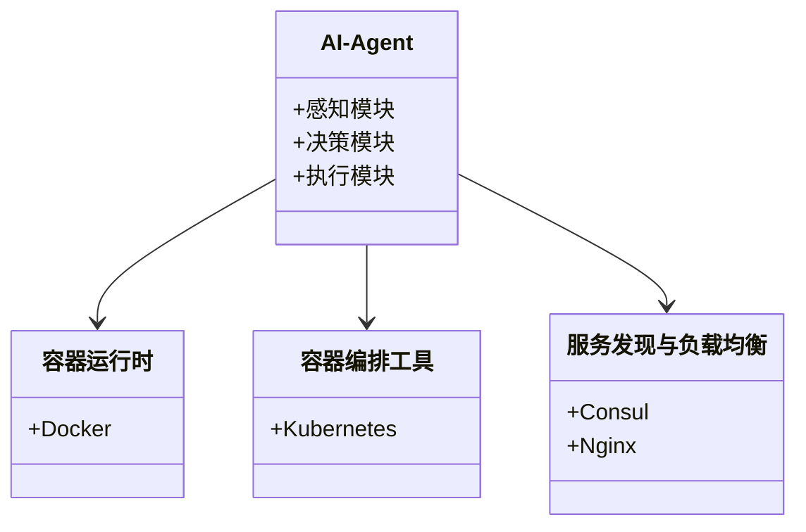

                 


# 企业AI Agent的容器化微服务编排策略

> 关键词：企业AI Agent，容器化，微服务，编排策略，系统架构

> 摘要：随着人工智能技术的快速发展，企业AI Agent在各个行业的应用越来越广泛。为了提高AI Agent的可扩展性和灵活性，容器化微服务编排策略成为了一种重要的实现方式。本文将详细探讨企业AI Agent的容器化微服务编排策略，包括其背景、核心概念、算法原理、系统架构、项目实战以及最佳实践。

---

# 第一部分: 企业AI Agent的容器化微服务编排背景与概念

## 第1章: 企业AI Agent的定义与背景

### 1.1 企业AI Agent的定义与核心概念

#### 1.1.1 企业AI Agent的定义
企业AI Agent（Artificial Intelligence Agent）是一种智能代理系统，能够感知环境、自主决策并执行任务。它通常具备以下核心功能：
- **感知能力**：通过传感器或API获取外部环境数据。
- **决策能力**：基于数据进行分析和推理，生成决策。
- **执行能力**：通过执行器或API完成任务。

企业AI Agent广泛应用于智能客服、自动化运维、智能推荐等领域。

#### 1.1.2 AI Agent的核心功能与特点
AI Agent的核心功能包括：
- **自主性**：能够在没有人工干预的情况下独立运行。
- **反应性**：能够实时感知环境变化并调整行为。
- **社会性**：能够与其他AI Agent或人类进行交互和协作。

AI Agent的特点：
- **模块化**：功能模块化设计，便于扩展和维护。
- **智能化**：具备学习和自适应能力。
- **高效性**：能够在较短时间内完成复杂任务。

#### 1.1.3 企业AI Agent的应用场景
企业AI Agent的应用场景包括：
- **智能客服**：通过自然语言处理技术为用户提供智能咨询服务。
- **自动化运维**：监控系统运行状态，自动修复故障。
- **智能推荐**：基于用户行为数据分析，推荐个性化产品或服务。
- **供应链优化**：通过预测需求，优化供应链管理。

### 1.2 容器化与微服务的背景

#### 1.2.1 容器化技术的发展历程
容器化技术起源于20世纪90年代，经历了从虚拟机到容器的演变。容器技术的优势在于轻量化、启动速度快，适合快速部署和扩展。

#### 1.2.2 微服务架构的兴起
微服务架构是一种将应用分解为小型、独立服务的架构方式。它具备以下优势：
- **可扩展性**：每个服务可以独立扩展。
- **灵活性**：每个服务可以使用不同的技术栈。
- **容错性**：单个服务故障不会导致整个系统崩溃。

#### 1.2.3 容器化与微服务对企业的影响
容器化与微服务的结合为企业带来了以下好处：
- **快速部署**：通过容器化技术，企业可以快速部署新服务。
- **弹性扩展**：根据负载动态调整资源分配。
- **高可用性**：通过容器编排工具实现服务的自动恢复和负载均衡。

### 1.3 企业AI Agent与容器化微服务的结合

#### 1.3.1 AI Agent的分布式特性与微服务的契合
AI Agent通常需要处理大量的数据和请求，具备分布式特性。微服务架构的模块化设计正好契合了AI Agent的分布式需求。

#### 1.3.2 容器化技术在AI Agent中的优势
容器化技术在AI Agent中的优势包括：
- **轻量化**：容器镜像体积小，启动速度快。
- **一致性**：容器环境统一，避免环境依赖问题。
- **可扩展性**：容器化服务可以快速扩缩容。

#### 1.3.3 企业AI Agent容器化微服务化的必要性
企业AI Agent容器化微服务化的必要性体现在以下几个方面：
- **高可用性**：通过容器编排工具实现服务的自动恢复和负载均衡。
- **灵活性**：每个AI Agent服务可以独立部署和扩展。
- **高效性**：容器化技术能够提高资源利用率，降低运营成本。

### 1.4 本章小结
本章主要介绍了企业AI Agent的定义、核心功能、应用场景，以及容器化与微服务的背景。通过分析AI Agent的分布式特性与微服务的契合，进一步阐述了企业AI Agent容器化微服务化的必要性。

---

## 第2章: 企业AI Agent容器化微服务编排的核心概念

### 2.1 企业AI Agent的组成与架构

#### 2.1.1 AI Agent的功能模块划分
AI Agent的功能模块通常包括：
- **感知模块**：负责数据采集和环境感知。
- **决策模块**：负责数据分析和决策制定。
- **执行模块**：负责任务执行和结果反馈。

#### 2.1.2 容器化环境下的AI Agent部署架构
容器化环境下的AI Agent部署架构包括：
- **容器运行时**：如Docker，负责容器的运行和管理。
- **容器编排工具**：如Kubernetes，负责服务的编排和管理。
- **服务发现与负载均衡**：如Consul或Nginx，负责服务的发现和负载均衡。

#### 2.1.3 微服务编排的实现机制
微服务编排的实现机制包括：
- **服务发现**：通过注册中心发现可用服务。
- **负载均衡**：通过负载均衡器分配请求到不同的服务实例。
- **服务容错**：通过熔断机制处理服务故障。

### 2.2 容器化与微服务编排的原理

#### 2.2.1 容器化技术的核心原理
容器化技术的核心原理是通过容器镜像实现环境的隔离和资源的虚拟化。容器运行时负责管理容器的生命周期，包括启动、运行和停止。

#### 2.2.2 微服务编排的实现流程
微服务编排的实现流程包括：
1. **服务注册**：服务实例注册到服务发现中心。
2. **服务发现**：客户端通过服务发现中心找到可用服务。
3. **负载均衡**：客户端将请求分发到不同的服务实例。
4. **服务容错**：当服务实例故障时，自动移除故障实例并重新分配请求。

#### 2.2.3 容器编排工具的作用与选择
容器编排工具的作用包括：
- **自动化部署**：通过编排工具实现服务的自动化部署。
- **动态扩缩容**：根据负载自动调整服务数量。
- **故障恢复**：通过自愈机制恢复故障服务。

容器编排工具的选择可以根据企业的实际需求进行评估，如Kubernetes适合大规模部署，Docker Swarm适合小型团队使用。

### 2.3 企业AI Agent容器化微服务编排的关键技术

#### 2.3.1 容器编排工具的对比分析
以下是常见容器编排工具的对比分析：

| 特性                | Kubernetes         | Docker Swarm       | Apache Mesos      |
|---------------------|--------------------|--------------------|-------------------|
| **扩展性**          | 高                 | 中                 | 高               |
| **复杂性**          | 高                 | 低                 | 中               |
| **生态支持**        | 丰富               | 较少               | 丰富             |

#### 2.3.2 微服务通信机制的实现
微服务通信机制的实现包括：
- **RESTful API**：通过HTTP协议进行通信。
- **RPC**：通过远程过程调用实现通信。
- **消息队列**：通过消息队列实现异步通信。

#### 2.3.3 容器化环境下的服务发现与负载均衡
容器化环境下的服务发现与负载均衡可以通过以下方式实现：
- **服务发现**：使用Consul或Etcd实现服务注册与发现。
- **负载均衡**：使用Nginx或Lb实现请求分发。

### 2.4 本章小结
本章主要介绍了企业AI Agent的组成与架构，容器化与微服务编排的原理，以及容器编排工具的作用与选择。通过对比分析容器编排工具，进一步阐述了企业AI Agent容器化微服务编排的关键技术。

---

## 第3章: 企业AI Agent容器化微服务编排的算法原理

### 3.1 微服务编排算法的核心原理

#### 3.1.1 微服务编排的调度算法
微服务编排的调度算法包括：
- **随机调度**：随机选择一个可用服务实例进行请求分发。
- **轮询调度**：按顺序轮询所有可用服务实例。
- **加权轮询调度**：根据服务实例的权重分配请求。

#### 3.1.2 容器资源分配的优化算法
容器资源分配的优化算法包括：
- **静态分配**：根据预估负载分配资源。
- **动态分配**：根据实时负载动态调整资源分配。
- **弹性分配**：根据需求自动扩缩容器数量。

#### 3.1.3 服务链路的动态调整算法
服务链路的动态调整算法包括：
- **链路追踪**：通过链路追踪技术监控服务调用链路。
- **熔断机制**：当服务链路出现故障时，熔断该链路并路由到其他可用链路。
- **服务降级**：在高负载情况下，降低部分服务的性能需求。

### 3.2 基于容器编排的AI Agent调度算法

#### 3.2.1 基于负载均衡的调度算法
基于负载均衡的调度算法通过实时监控服务实例的负载情况，动态调整请求分发策略。例如，使用加权轮询算法，根据服务实例的权重分配请求。

#### 3.2.2 基于服务发现的动态调度算法
基于服务发现的动态调度算法通过实时发现可用服务实例，动态调整请求分发策略。例如，使用随机调度算法，随机选择一个可用服务实例进行请求分发。

#### 3.2.3 基于容器状态的自适应调度算法
基于容器状态的自适应调度算法通过实时监控容器运行状态，动态调整请求分发策略。例如，当某个容器实例出现故障时，自动移除该实例并重新分配请求到其他可用实例。

### 3.3 企业AI Agent容器化微服务编排的数学模型与公式

#### 3.3.1 负载均衡算法的数学模型
负载均衡算法的数学模型可以表示为：
$$
\text{负载均衡权重} = \frac{\text{服务实例权重}}{\sum \text{所有服务实例权重}}
$$

#### 3.3.2 容器资源分配的优化模型
容器资源分配的优化模型可以表示为：
$$
\min_{x} \sum_{i=1}^{n} c_i x_i
$$
其中，$c_i$ 是服务实例 $i$ 的资源消耗成本，$x_i$ 是服务实例 $i$ 的资源分配量。

### 3.4 本章小结
本章主要介绍了企业AI Agent容器化微服务编排的算法原理，包括微服务编排的调度算法、容器资源分配的优化算法和服务链路的动态调整算法。通过数学模型和公式，进一步阐述了企业AI Agent容器化微服务编排的实现机制。

---

## 第4章: 企业AI Agent容器化微服务编排的系统分析与架构设计

### 4.1 问题场景介绍

#### 4.1.1 问题背景
在企业AI Agent的应用中，常常面临以下问题：
- **高并发请求**：大量用户请求可能导致系统性能下降。
- **服务故障**：单个服务实例故障可能导致整个系统崩溃。
- **资源浪费**：传统虚拟机技术可能导致资源浪费。

#### 4.1.2 问题描述
企业AI Agent需要具备高可用性、弹性和灵活性，以应对复杂的业务场景。传统的单体架构难以满足这些需求，而容器化微服务架构则提供了一种解决方案。

### 4.2 系统功能设计

#### 4.2.1 领域模型设计
以下是企业AI Agent的领域模型设计：



#### 4.2.2 系统架构设计
以下是企业AI Agent的系统架构设计：


#### 4.2.3 系统接口设计
系统接口设计包括：
- **服务发现接口**：用于服务实例的注册与发现。
- **负载均衡接口**：用于请求分发。
- **服务容错接口**：用于处理服务故障。

### 4.3 本章小结
本章主要介绍了企业AI Agent容器化微服务编排的系统分析与架构设计，包括问题场景介绍、系统功能设计和系统架构设计。

---

## 第5章: 企业AI Agent容器化微服务编排的项目实战

### 5.1 环境安装

#### 5.1.1 安装Docker
在Linux系统中安装Docker的命令如下：
```bash
curl -fsSL https://get.docker.com | bash -s docker
```

#### 5.1.2 安装Kubernetes
在Linux系统中安装Kubernetes的命令如下：
```bash
curl -s https://raw.githubusercontent.com/kubernetes/kubernetes.github.io/main/schedul
```

### 5.2 系统核心实现源代码

#### 5.2.1 AI-Agent服务实现
以下是AI-Agent服务的实现代码：

```python
import requests
from flask import Flask

app = Flask(__name__)

@app.route('/')
def home():
    return "AI Agent Service"
```

#### 5.2.2 容器编排实现
以下是容器编排的实现代码：

```python
import kubernetes.client
from kubernetes.client import api_client

api = api_client.ApiClient()
```

### 5.3 代码应用解读与分析

#### 5.3.1 AI-Agent服务解读
AI-Agent服务是一个基于Flask框架的Web服务，通过`/`端点提供服务。

#### 5.3.2 容器编排解读
容器编排通过Kubernetes API实现服务的自动化部署和管理。

### 5.4 实际案例分析

#### 5.4.1 案例背景
假设我们有一个智能客服系统，需要部署多个AI-Agent服务实例。

#### 5.4.2 案例实现
通过Kubernetes部署多个AI-Agent服务实例，并使用Nginx实现负载均衡。

#### 5.4.3 案例分析
通过分析日志，发现服务实例的负载情况，并动态调整资源分配。

### 5.5 本章小结
本章通过实际案例分析，详细介绍了企业AI Agent容器化微服务编排的项目实战，包括环境安装、系统核心实现源代码和代码应用解读与分析。

---

## 第6章: 企业AI Agent容器化微服务编排的最佳实践

### 6.1 最佳实践

#### 6.1.1 容器化技术的选择
根据企业的实际需求选择适合的容器化技术，如Kubernetes适合大规模部署，Docker Swarm适合小型团队使用。

#### 6.1.2 微服务设计的注意事项
微服务设计时需要注意服务的独立性和可扩展性，避免服务之间的强依赖。

#### 6.1.3 容器资源管理
容器资源管理需要注意资源分配的动态调整和自动扩缩。

### 6.2 小结
企业AI Agent容器化微服务编排是一种重要的实现方式，通过容器化技术和微服务架构，可以提高系统的可扩展性和灵活性。

### 6.3 注意事项
在实际应用中，需要注意容器资源的合理分配和系统的高可用性设计。

### 6.4 未来的发展方向
未来的发展方向包括容器编排工具的智能化、微服务通信机制的优化以及AI Agent的自适应能力提升。

### 6.5 拓展阅读
推荐读者阅读《容器化与微服务实战》和《企业AI Agent的设计与实现》。

---

# 作者：AI天才研究院/AI Genius Institute & 禅与计算机程序设计艺术 /Zen And The Art of Computer Programming

---

**本文是基于容器化微服务编排策略的企业AI Agent实现的技术博客，涵盖了从理论到实践的详细内容，旨在为企业AI Agent的开发和部署提供参考和指导。**

