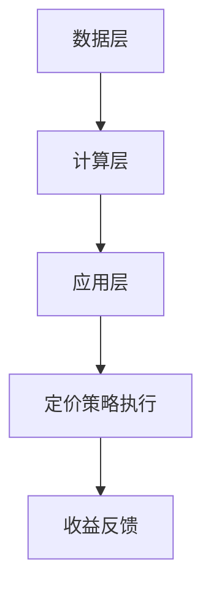
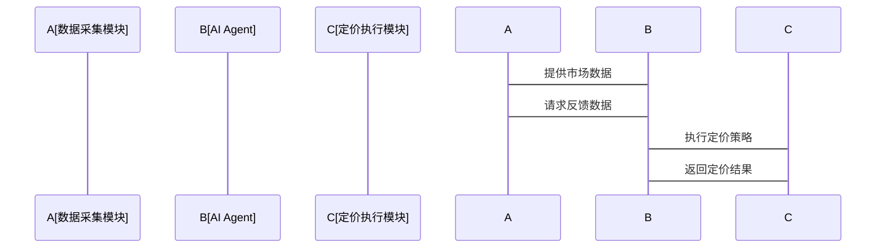

                 


# 企业AI Agent的强化学习在动态定价策略中的应用

> **关键词**：AI Agent, 强化学习, 动态定价策略, 马尔可夫决策过程, Q-learning算法, 策略梯度方法, 动态定价系统

> **摘要**：  
本文探讨了AI Agent如何利用强化学习技术优化企业的动态定价策略。通过分析强化学习的核心原理和动态定价策略的关键要素，本文详细讲解了如何将强化学习算法应用于动态定价场景，构建高效的定价模型，并通过实际案例展示了AI Agent在动态定价中的应用效果。文章还结合数学模型和算法流程图，深入剖析了强化学习在动态定价中的实现细节，为企业应用AI技术优化定价策略提供了理论依据和实践指导。

---

# 第1章: 强化学习与动态定价策略的背景介绍

## 1.1 强化学习的基本概念

### 1.1.1 强化学习的定义  
强化学习（Reinforcement Learning, RL）是一种机器学习范式，通过智能体与环境的交互，学习如何采取行动以最大化累计奖励。其核心在于通过试错（trial-and-error）过程优化决策策略。

### 1.1.2 强化学习的核心要素  
- **状态（State）**：环境中的当前情况，表示智能体所处的环境状态。  
- **动作（Action）**：智能体在某一状态下采取的行动。  
- **奖励（Reward）**：智能体在采取某个动作后，环境给予的反馈，用于评估该动作的好坏。  
- **策略（Policy）**：智能体在某一状态下选择动作的概率分布。  
- **值函数（Value Function）**：衡量某状态下采取某个动作的长期累积收益。

### 1.1.3 强化学习与动态定价的联系  
动态定价是指根据市场环境、客户需求和竞争情况实时调整价格的策略。强化学习能够通过试错和累积奖励，帮助AI Agent找到最优定价策略，从而在复杂多变的市场环境中实现利润最大化。

---

## 1.2 动态定价策略的背景与挑战

### 1.2.1 动态定价的定义  
动态定价是指根据实时市场数据、客户需求和竞争状况，动态调整产品或服务价格的过程。其目的是在不同时间点以最合适的价格吸引顾客，同时最大化企业收益。

### 1.2.2 动态定价的常见应用场景  
- 电商行业的实时价格调整。  
- 酒店和航空业的动态定价策略。  
- 金融市场的实时交易价格优化。  

### 1.2.3 动态定价中的主要挑战  
- **市场环境复杂**：价格受多种因素影响，如需求弹性、竞争对手行为等。  
- **数据稀疏性**：某些场景下，历史数据有限，难以直接训练定价模型。  
- **实时性要求高**：动态定价需要在短时间内做出决策，对算法的计算效率要求较高。  

---

## 1.3 AI Agent在动态定价中的作用

### 1.3.1 AI Agent的定义  
AI Agent（人工智能代理）是一种能够感知环境、自主决策并执行任务的智能实体。在动态定价场景中，AI Agent负责收集市场信息、分析数据并制定最优定价策略。

### 1.3.2 AI Agent在动态定价中的优势  
- **实时决策能力**：AI Agent能够快速响应市场变化，实时调整定价策略。  
- **数据驱动决策**：通过分析历史数据和实时信息，AI Agent能够做出更精准的定价决策。  
- **自我优化能力**：通过强化学习，AI Agent能够不断优化自身的定价策略，适应市场变化。  

### 1.3.3 AI Agent与强化学习的结合  
强化学习为AI Agent提供了优化定价策略的框架。通过与环境的交互，AI Agent能够学习如何在不同状态下采取最优动作，从而实现动态定价目标。

---

## 1.4 本章小结  
本章介绍了强化学习的基本概念、动态定价的背景与挑战，以及AI Agent在动态定价中的作用。通过结合强化学习和AI Agent，企业能够构建高效的动态定价系统，应对复杂多变的市场环境。

---

# 第2章: 强化学习的核心概念与动态定价策略

## 2.1 马尔可夫决策过程（MDP）

### 2.1.1 状态空间的定义  
在动态定价场景中，状态空间可以包括当前时间、市场需求、竞争对手价格、库存水平等因素。

### 2.1.2 动作空间的定义  
动作空间是指AI Agent在某一状态下可以采取的所有可能动作，例如调整价格、保持当前价格或降价促销。

### 2.1.3 奖励函数的设计  
奖励函数用于衡量AI Agent的定价决策是否有效。例如，当定价策略带来收益增加时，给予正奖励；当收益减少时，给予负奖励。

### 2.1.4 策略的定义与分类  
- **策略（Policy）**：定义了AI Agent在某一状态下采取某个动作的概率。  
- **策略分类**：包括基于值函数的策略（如Q-learning）和基于策略梯度的策略（如PG、PPO）。  

---

## 2.2 强化学习算法的分类

### 2.2.1 基于值函数的方法（如Q-learning）
Q-learning是一种经典的强化学习算法，通过更新Q值函数来学习最优策略。

### 2.2.2 基于策略梯度的方法（如PG、PPO）
策略梯度方法通过优化策略的参数，直接最大化累积奖励。

### 2.2.3 基于Actor-Critic架构的方法  
Actor-Critic架构结合了值函数和策略梯度的优势，通过同时学习价值和策略来优化定价策略。

---

## 2.3 动态定价策略的核心要素

### 2.3.1 定价模型的构建  
定价模型需要考虑市场需求、成本、竞争对手行为等因素，构建数学模型描述定价决策与收益之间的关系。

### 2.3.2 定价策略的优化目标  
动态定价的优化目标通常包括最大化收益、提高客户满意度或降低库存风险。

### 2.3.3 定价策略的评估指标  
常用的评估指标包括收益增长率、客户购买率、价格调整频率等。

---

## 2.4 强化学习在动态定价中的应用框架

### 2.4.1 状态-动作-奖励的映射  
AI Agent通过感知市场状态（如需求、竞争价格）采取定价动作（如调整价格），并根据收益获得奖励。

### 2.4.2 动态定价策略的优化过程  
通过强化学习算法，AI Agent不断更新定价策略，以最大化长期累积收益。

### 2.4.3 策略评估与更新机制  
基于实时数据和历史表现，AI Agent定期评估当前策略的有效性，并根据反馈更新定价模型。

---

## 2.5 本章小结  
本章详细介绍了强化学习的核心概念，包括马尔可夫决策过程、强化学习算法的分类以及动态定价策略的核心要素。通过构建强化学习框架，AI Agent能够有效优化定价策略，应对市场变化。

---

# 第3章: 强化学习算法的数学模型与动态定价策略的实现

## 3.1 Q-learning算法的数学模型

### 3.1.1 Q值的更新公式  
$$ Q(s, a) = Q(s, a) + \alpha (r + \gamma \max Q(s', a') - Q(s, a)) $$  
其中，$\alpha$ 是学习率，$\gamma$ 是折扣因子。

### 3.1.2 Q值的衰减策略  
为了防止Q值无限增长，通常采用折扣因子 $\gamma < 1$ 来平衡当前奖励和未来奖励。

---

## 3.2 策略梯度方法的数学模型

### 3.2.1 策略函数的定义  
策略函数 $\pi(a|s)$ 表示在状态 $s$ 下采取动作 $a$ 的概率。  

### 3.2.2 梯度的计算公式  
$$ \nabla J(\theta) = \mathbb{E}[\nabla \log \pi(a|s) Q(s,a)] $$  
其中，$Q(s,a)$ 是值函数，$\theta$ 是策略参数。

---

## 3.3 动态定价策略的实现

### 3.3.1 定价模型的构建  
通过强化学习算法，AI Agent构建定价模型，将市场需求、竞争价格等因素转化为定价决策。

### 3.3.2 算法实现的步骤  
1. 初始化Q值或策略参数。  
2. 与环境交互，感知市场状态。  
3. 根据当前策略采取定价动作。  
4. 根据收益更新Q值或策略参数。  

### 3.3.3 算法实现的代码示例  

```python
import numpy as np

class AI-Agent:
    def __init__(self, state_space, action_space):
        self.state_space = state_space
        self.action_space = action_space
        self.Q = np.zeros((state_space, action_space))
        self.alpha = 0.1
        self.gamma = 0.9

    def get_action(self, state):
        return np.argmax(self.Q[state, :])

    def update_Q(self, state, action, reward, next_state):
        self.Q[state, action] += self.alpha * (reward + self.gamma * np.max(self.Q[next_state, :]) - self.Q[state, action])

# 示例使用
state_space = 10
action_space = 5
agent = AI-Agent(state_space, action_space)
state = 3
action = agent.get_action(state)
reward = 10
next_state = 5
agent.update_Q(state, action, reward, next_state)
```

---

## 3.4 本章小结  
本章通过数学模型和代码示例，详细讲解了Q-learning和策略梯度方法在动态定价中的实现。通过这些算法，AI Agent能够不断优化定价策略，实现动态定价目标。

---

# 第4章: 动态定价系统的系统分析与架构设计

## 4.1 动态定价系统的功能设计

### 4.1.1 系统模块划分  
动态定价系统通常包括数据采集模块、定价模型模块、决策引擎模块和执行模块。

### 4.1.2 系统功能流程  
1. 数据采集：收集市场需求、竞争价格等信息。  
2. 模型计算：AI Agent通过强化学习算法计算最优定价策略。  
3. 决策执行：根据计算结果调整价格。  
4. 反馈优化：根据收益情况优化定价策略。

---

## 4.2 系统架构设计

### 4.2.1 系统架构的层次划分  
- 数据层：存储历史数据和实时数据。  
- 计算层：AI Agent进行强化学习计算。  
- 应用层：定价策略的执行和反馈。  

### 4.2.2 系统架构的Mermaid图  


---

## 4.3 系统接口设计

### 4.3.1 数据接口  
- 数据采集接口：获取市场数据和历史数据。  
- 数据存储接口：存储计算结果和反馈数据。

### 4.3.2 算法接口  
- 强化学习算法接口：与AI Agent进行交互，获取定价策略。  
- 策略更新接口：根据反馈更新定价模型。

---

## 4.4 系统交互流程

### 4.4.1 系统交互的Mermaid序列图  


---

## 4.5 本章小结  
本章从系统设计的角度，详细分析了动态定价系统的功能、架构和接口设计。通过合理的系统架构，AI Agent能够高效地实现动态定价策略。

---

# 第5章: 项目实战——基于强化学习的电商价格优化系统

## 5.1 环境安装与配置

### 5.1.1 系统环境  
- 操作系统：Linux/Windows/MacOS  
- Python版本：3.6+  
- 需要的库：numpy, matplotlib, gym

### 5.1.2 安装依赖  
```bash
pip install numpy matplotlib gym
```

---

## 5.2 系统核心实现

### 5.2.1 定价模型实现  
```python
import gym
from gym import spaces
from gym.utils import seeding

class PricingEnvironment(gym.Env):
    def __init__(self, max_price=100, max_inventory=50):
        self.max_price = max_price
        self.max_inventory = max_inventory
        self.observation_space = spaces.Tuple([spaces.Discrete(100), spaces.Discrete(50)])
        self.action_space = spaces.Discrete(100)
        self.current_inventory = 50
        self.current_price = 50

    def reset(self):
        self.current_inventory = 50
        self.current_price = 50
        return (self.current_inventory, self.current_price)

    def step(self, action):
        # 执行定价动作
        new_price = action
        # 计算需求和收益
        demand = max(0, 100 - (new_price - 40))
        revenue = demand * new_price
        # 更新库存
        self.current_inventory = max(0, self.current_inventory - demand)
        # 计算奖励
        reward = revenue
        # 返回新的状态
        return (self.current_inventory, new_price), reward, False, {}
```

### 5.2.2 强化学习算法实现  
```python
class DRLAgent:
    def __init__(self, env, alpha=0.1, gamma=0.9):
        self.env = env
        self.alpha = alpha
        self.gamma = gamma
        self.Q = np.zeros((env.observation_space.shape[0], env.action_space.shape[0]))

    def get_action(self, state):
        return np.argmax(self.Q[state])

    def update_Q(self, state, action, reward, next_state):
        self.Q[state][action] += self.alpha * (reward + self.gamma * np.max(self.Q[next_state]) - self.Q[state][action])

    def train(self, episodes=1000):
        for episode in range(episodes):
            state = self.env.reset()
            done = False
            while not done:
                action = self.get_action(state)
                next_state, reward, done, _ = self.env.step(action)
                self.update_Q(state, action, reward, next_state)
                state = next_state
```

---

## 5.3 实际案例分析与解读

### 5.3.1 案例背景  
某电商企业希望通过动态定价策略优化其产品价格，提高销售额和客户满意度。

### 5.3.2 算法实现与效果  
通过训练强化学习算法，AI Agent能够根据市场需求和竞争情况，实时调整产品价格。经过多次迭代，AI Agent学会了在不同库存和需求情况下采取最优定价策略。

### 5.3.3 代码实现与分析  
通过上述代码实现的强化学习算法，AI Agent在训练过程中不断优化定价策略，最终实现收益最大化。

---

## 5.4 本章小结  
本章通过实际案例分析，详细讲解了如何利用强化学习算法实现电商价格优化系统。通过代码实现和案例分析，验证了强化学习在动态定价中的有效性和优势。

---

# 第6章: 最佳实践与经验分享

## 6.1 强化学习在动态定价中的最佳实践

### 6.1.1 算法选择  
根据具体场景选择合适的强化学习算法，如Q-learning适用于简单场景，而策略梯度方法适用于复杂场景。

### 6.1.2 数据处理  
确保数据的完整性和准确性，避免数据稀疏性对算法性能的影响。

### 6.1.3 系统优化  
优化算法计算效率，减少延迟，确保实时定价需求。

---

## 6.2 小结与注意事项

### 6.2.1 小结  
本文详细探讨了强化学习在动态定价中的应用，通过理论分析和实际案例，展示了AI Agent在优化定价策略中的巨大潜力。

### 6.2.2 注意事项  
- 数据质量和实时性是影响算法效果的关键因素。  
- 需要根据具体场景调整算法参数，避免过拟合或欠拟合。  
- 强化学习算法的计算效率需要优化，以适应实时定价需求。  

---

## 6.3 拓展阅读

### 6.3.1 推荐书籍  
- 《Reinforcement Learning: Theory and Algorithms》  
- 《Deep Reinforcement Learning》  

### 6.3.2 推荐论文  
- "Deep Q-Networks: Beyond Experience Replay"  
- "Actor-Critic Algorithms"  

---

# 作者：AI天才研究院/AI Genius Institute & 禅与计算机程序设计艺术 /Zen And The Art of Computer Programming

