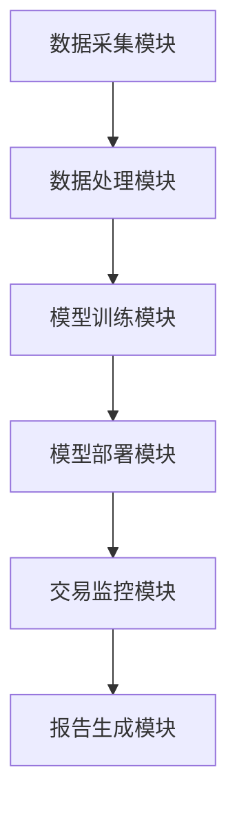
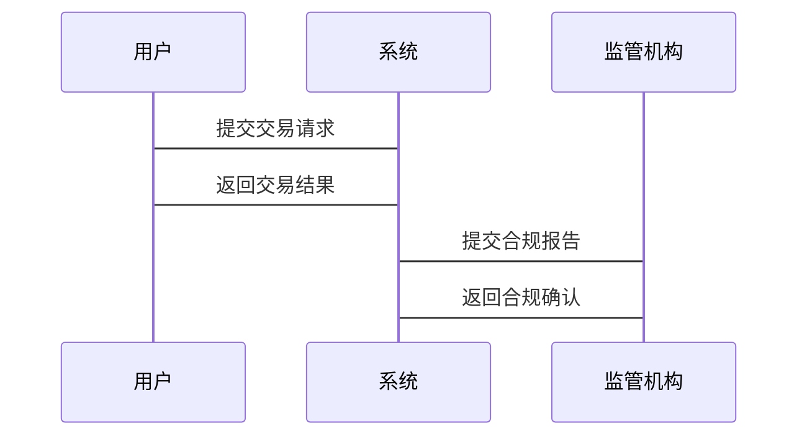

                 


# 在AI应用中遵守金融法规的重要性与方法

> **关键词**：AI应用、金融法规、数据隐私、模型可解释性、合规要求、风险控制  
>
> **摘要**：随着人工智能技术在金融领域的广泛应用，合规性问题变得日益重要。本文从AI在金融领域的应用现状出发，深入分析了AI应用中的金融法规风险与合规要求，探讨了AI技术与金融法规的联系，并详细阐述了AI金融合规系统的架构与实现方法。最后，通过实际案例分析，展示了如何在AI应用中有效遵守金融法规，为金融行业提供了有价值的参考。

---

## 第一部分: AI与金融法规的背景与重要性

### 第1章: AI在金融领域的应用现状与挑战

#### 1.1 AI在金融领域的应用现状

**1.1.1 AI在金融领域的典型应用**

人工智能技术在金融领域的应用广泛，主要包括以下几个方面：

- **智能投顾**：通过机器学习算法为投资者提供个性化的投资建议。
- **风险控制**：利用AI技术进行信用评估、欺诈检测和风险管理。
- **交易自动化**：通过算法交易和高频交易提高交易效率。
- **客户画像与精准营销**：利用大数据和AI技术分析客户行为，进行精准营销。

**1.1.2 AI在金融领域的发展趋势**

随着技术的进步，AI在金融领域的应用将更加智能化和个性化：

- **自动化决策**：AI将更多地应用于自动化的投资决策和交易执行。
- **实时监控**：通过实时数据分析，AI能够快速识别市场风险并采取应对措施。
- **多模态交互**：结合NLP和计算机视觉技术，实现更自然的人机交互。

**1.1.3 AI在金融领域面临的挑战**

AI在金融领域的应用面临以下主要挑战：

- **数据隐私问题**：金融数据涉及用户隐私，如何在AI应用中保护数据隐私是一个重要问题。
- **模型可解释性**：复杂的AI模型在金融决策中的可解释性不足，导致监管机构难以理解其决策过程。
- **监管合规性**：不同国家和地区的金融法规差异较大，如何在不同地区实现合规性是一个复杂的问题。

---

#### 1.2 金融法规的基本概念与重要性

**1.2.1 金融法规的核心概念**

金融法规是规范金融市场的法律和规章制度，主要包括以下几个方面：

- **反洗钱（AML）**：防止非法资金流动，打击洗钱行为。
- **反恐融资（CTF）**：防止恐怖组织通过金融系统融资。
- **数据隐私与保护**：保护个人金融数据不被滥用。
- **金融消费者保护**：保护消费者在金融服务中的权益。

**1.2.2 金融法规的分类与特点**

金融法规可以分为以下几个类别：

- **法律法规**：由立法机构制定的法律。
- **监管规则**：由监管机构制定的细则和标准。
- **行业自律**：金融机构内部制定的自律规范。

**1.2.3 金融法规的重要性与作用**

金融法规在金融体系中起着至关重要的作用：

- **维护市场秩序**：通过规范金融机构的行为，防止市场操纵和欺诈行为。
- **保护消费者权益**：确保金融消费者在金融服务中不受不公正待遇。
- **防范金融风险**：通过监管和合规，降低系统性金融风险。

---

#### 1.3 AI与金融法规的结合必要性

**1.3.1 AI在金融领域的合规需求**

随着AI技术在金融领域的广泛应用，金融机构需要确保其AI应用符合相关法规要求：

- **数据合规性**：AI应用需要处理大量金融数据，必须符合数据隐私和保护的相关法规。
- **模型合规性**：AI模型的决策必须透明、可解释，符合监管机构的要求。
- **交易合规性**：AI驱动的交易必须符合市场规则，避免操纵市场。

**1.3.2 金融法规对AI应用的约束**

金融法规对AI应用的约束主要体现在以下几个方面：

- **数据使用限制**：金融机构在使用AI技术时，必须确保数据的合法性和合规性。
- **模型透明性要求**：监管机构要求金融机构能够解释AI模型的决策过程。
- **交易监控要求**：AI驱动的交易必须接受监管机构的实时监控和审查。

**1.3.3 AI在金融合规中的潜在价值**

AI技术在金融合规中的潜在价值主要体现在以下几个方面：

- **提高合规效率**：通过自动化技术快速识别和处理合规问题。
- **降低合规成本**：AI技术可以减少人工检查和监控的工作量，降低合规成本。
- **增强风险管理**：通过实时数据分析和预测，帮助金融机构更好地识别和管理风险。

---

### 第2章: AI应用中的金融法规风险与合规要求

#### 2.1 金融法规对AI应用的主要要求

**2.1.1 数据隐私与保护要求**

- **数据匿名化技术**：通过数据匿名化技术保护用户隐私。
- **数据加密技术**：使用加密技术保护数据安全。
- **数据访问控制**：通过访问控制机制限制数据的使用范围。

**2.1.2 交易透明性与可追溯性**

- **区块链技术的应用**：通过区块链技术实现交易的透明性和可追溯性。
- **智能合约的合规性**：确保智能合约的执行符合相关法规要求。
- **交易记录的可追溯性**：通过记录交易信息，确保交易的可追溯性。

**2.1.3 风险管理与合规性要求**

- **风险管理模型**：金融机构需要开发符合监管要求的风险管理模型。
- **模型验证与审计**：金融机构需要对AI模型进行定期验证和审计，确保其符合法规要求。
- **风险披露与报告**：金融机构需要定期披露和报告风险管理情况。

#### 2.2 AI应用中的主要风险

**2.2.1 数据滥用与隐私泄露风险**

- **数据滥用**：金融机构在使用AI技术时，可能因为数据滥用导致隐私泄露。
- **数据泄露**：由于数据处理过程中的漏洞，可能导致数据泄露。

**2.2.2 模型偏差与公平性问题**

- **模型偏差**：AI模型可能存在偏差，导致不公平的决策。
- **公平性问题**：AI模型的决策可能对某些群体不公平，导致合规风险。

**2.2.3 交易透明性与可解释性不足**

- **交易不透明**：AI驱动的交易可能缺乏透明性，导致市场操纵。
- **模型不可解释性**：复杂的AI模型可能导致决策过程不透明，增加合规风险。

#### 2.3 合规要求对AI应用的影响

**2.3.1 数据收集与处理的合规性**

- **数据来源合法性**：金融机构需要确保数据来源合法。
- **数据处理合规性**：在处理数据时，必须符合相关法规要求。
- **数据共享与隐私保护的平衡**：在数据共享时，必须平衡数据隐私和保护的要求。

**2.3.2 模型开发与部署的合规性**

- **模型开发合规性**：在开发AI模型时，必须确保模型符合法规要求。
- **模型部署合规性**：在部署AI模型时，必须确保模型的决策过程透明、可解释。

**2.3.3 交易执行与监控的合规性**

- **交易执行合规性**：在执行交易时，必须确保交易符合市场规则。
- **交易监控合规性**：在监控交易时，必须确保监控过程符合法规要求。

---

### 第3章: AI在金融合规中的核心概念与联系

#### 3.1 金融法规的核心概念

**3.1.1 反洗钱（AML）**

- **AML的核心目标**：通过识别和阻止非法资金流动，打击洗钱行为。
- **AML的主要措施**：包括客户身份识别（KYC）、交易监控和报告。

**3.1.2 反恐融资（CTF）**

- **CTF的核心目标**：防止恐怖组织通过金融系统融资。
- **CTF的主要措施**：包括客户背景调查、交易监控和报告。

**3.1.3 数据隐私与保护（GDPR）**

- **GDPR的核心目标**：保护个人数据隐私和权利。
- **GDPR的主要措施**：包括数据收集、存储和处理的合规性要求。

**3.1.4 金融消费者保护**

- **金融消费者保护的核心目标**：保护消费者在金融服务中的权益。
- **金融消费者保护的主要措施**：包括信息披露、风险提示和投诉处理。

#### 3.2 AI技术的核心概念

**3.2.1 机器学习（ML）**

- **ML的核心目标**：通过数据训练模型，实现对数据的自动分析和预测。
- **ML的主要技术**：包括监督学习、无监督学习和强化学习。

**3.2.2 自然语言处理（NLP）**

- **NLP的核心目标**：通过计算机理解人类语言，实现自然语言交互。
- **NLP的主要技术**：包括文本分类、实体识别和情感分析。

**3.2.3 计算机视觉（CV）**

- **CV的核心目标**：通过计算机理解和处理图像，实现视觉识别和分析。
- **CV的主要技术**：包括图像分类、目标检测和图像分割。

**3.2.4 联邦学习（Federated Learning）**

- **Federated Learning的核心目标**：在保护数据隐私的前提下，实现数据共享和模型训练。
- **Federated Learning的主要技术**：包括数据隐私保护和模型同步。

#### 3.3 金融法规与AI技术的联系

**3.3.1 数据共享与隐私保护的平衡**

- **数据共享的必要性**：金融机构需要共享数据以提高模型的准确性。
- **隐私保护的必要性**：在数据共享过程中，必须保护数据隐私。

**3.3.2 模型可解释性与监管要求**

- **模型可解释性的必要性**：监管机构需要理解AI模型的决策过程。
- **模型透明性要求**：金融机构需要确保AI模型的决策过程透明、可解释。

**3.3.3 AI在金融风险控制中的应用**

- **AI在风险控制中的作用**：通过AI技术实现风险预测和管理。
- **AI在风险管理中的优势**：通过实时数据分析，快速识别和处理风险。

---

## 第4章: AI应用中的金融法规合规方法

### 4.1 数据隐私与保护的合规方法

#### 4.1.1 数据匿名化技术

- **数据匿名化技术的实现方法**：通过数据脱敏、数据扰动等技术实现数据匿名化。
- **数据匿名化技术的优势**：保护数据隐私，同时允许数据共享和分析。

#### 4.1.2 数据加密技术

- **数据加密技术的实现方法**：包括对称加密、非对称加密和哈希加密。
- **数据加密技术的优势**：确保数据在传输和存储过程中的安全性。

#### 4.1.3 数据访问控制

- **数据访问控制的实现方法**：包括基于角色的访问控制（RBAC）和基于属性的访问控制（ABAC）。
- **数据访问控制的优势**：确保数据的合法使用，防止数据滥用。

---

### 4.2 模型可解释性与合规要求

#### 4.2.1 解释性模型的选择

- **解释性模型的选择标准**：模型的可解释性、准确性和效率。
- **解释性模型的优势**：通过模型解释性，确保决策过程的透明性。

#### 4.2.2 模型解释性技术

- **模型解释性技术的实现方法**：包括特征重要性分析、SHAP值和LIME解释。
- **模型解释性技术的优势**：帮助监管机构理解AI模型的决策过程。

#### 4.2.3 可解释性对监管的影响

- **可解释性对监管的影响**：通过模型解释性，确保AI模型的决策过程符合法规要求。
- **可解释性对监管的优势**：提高监管效率，降低合规风险。

---

### 4.3 交易透明性与可追溯性的实现

#### 4.3.1 区块链技术的应用

- **区块链技术的应用场景**：通过区块链技术实现交易的透明性和可追溯性。
- **区块链技术的优势**：确保交易的不可篡改性和可追溯性。

#### 4.3.2 智能合约的合规性

- **智能合约的合规性要求**：智能合约的执行必须符合相关法规要求。
- **智能合约的优势**：通过自动化执行，提高交易效率和透明性。

#### 4.3.3 交易记录的可追溯性

- **交易记录的可追溯性实现方法**：通过记录交易信息，实现交易的可追溯性。
- **交易记录的可追溯性优势**：提高交易透明性，降低合规风险。

---

## 第5章: AI金融合规系统的架构与实现

### 5.1 系统架构设计

#### 5.1.1 系统功能模块设计

**5.1.1.1 数据采集模块**

- **功能描述**：负责采集和处理金融数据，确保数据的合规性和准确性。
- **技术实现**：使用数据清洗、数据增强等技术处理数据。

**5.1.1.2 模型训练模块**

- **功能描述**：负责训练AI模型，确保模型的可解释性和准确性。
- **技术实现**：使用监督学习、无监督学习等技术训练模型。

**5.1.1.3 交易监控模块**

- **功能描述**：负责监控交易过程，确保交易的合规性和透明性。
- **技术实现**：使用实时数据分析和预测技术监控交易。

**5.1.1.4 报告生成模块**

- **功能描述**：负责生成合规报告，确保报告的准确性和合规性。
- **技术实现**：使用数据可视化和报告生成技术生成报告。

#### 5.1.2 系统架构设计

**5.1.2.1 系统架构图**



**5.1.2.2 系统交互流程图**



#### 5.1.3 系统接口设计

**5.1.3.1 数据接口**

- **数据输入接口**：负责接收外部数据，确保数据的合规性和准确性。
- **数据输出接口**：负责输出处理后的数据，供其他模块使用。

**5.1.3.2 模型接口**

- **模型输入接口**：负责接收模型输入数据，确保模型输入的合规性和准确性。
- **模型输出接口**：负责输出模型处理结果，供其他模块使用。

---

## 第6章: 项目实战

### 6.1 环境搭建

#### 6.1.1 系统环境

- **操作系统**：Linux/Windows/MacOS
- **编程语言**：Python
- **开发工具**：Jupyter Notebook/PyCharm
- **框架与库**：TensorFlow/PyTorch、Pandas、Scikit-learn、Keras、XGBoost

#### 6.1.2 数据准备

- **数据来源**：金融交易数据、客户行为数据、市场数据等。
- **数据预处理**：包括数据清洗、数据转换、数据增强等。

---

### 6.2 核心实现

#### 6.2.1 数据预处理代码

```python
import pandas as pd
import numpy as np

# 加载数据
data = pd.read_csv('financial_data.csv')

# 数据清洗
data.dropna(inplace=True)
data = data.drop_duplicates()

# 数据转换
data['date'] = pd.to_datetime(data['date'])
data.set_index('date', inplace=True)
```

#### 6.2.2 模型训练代码

```python
from sklearn.ensemble import RandomForestClassifier
from sklearn.metrics import accuracy_score

# 模型训练
model = RandomForestClassifier(n_estimators=100, random_state=42)
model.fit(X_train, y_train)

# 模型评估
y_pred = model.predict(X_test)
print("准确率:", accuracy_score(y_test, y_pred))
```

#### 6.2.3 交易监控代码

```python
import pandas as pd
import numpy as np

# 加载交易数据
transactions = pd.read_csv('transactions.csv')

# 交易监控
def monitor_transaction(transaction):
    # 判断交易金额是否异常
    if transaction['amount'] > 100000:
        return '高风险交易'
    else:
        return '低风险交易'

transactions['risk_level'] = transactions.apply(lambda x: monitor_transaction(x), axis=1)
```

---

### 6.3 案例分析与解读

#### 6.3.1 案例背景

假设我们开发了一个基于机器学习的反洗钱监测系统，用于检测异常交易行为。

#### 6.3.2 案例实现

```python
import pandas as pd
import numpy as np
from sklearn.ensemble import IsolationForest

# 加载交易数据
transactions = pd.read_csv('transactions.csv')

# 模型训练
model = IsolationForest(n_estimators=100, random_state=42)
model.fit(transactions[['amount', 'time_stamp', 'user_id']])

# 预测异常交易
outliers = model.predict(transactions[['amount', 'time_stamp', 'user_id']])
transactions['is_outlier'] = outliers == -1

# 输出异常交易
print(transactions[transactions['is_outlier'] == True])
```

#### 6.3.3 案例分析

通过上述代码，我们可以实现异常交易的检测。系统能够实时监控交易行为，识别出异常交易并进行标记。这有助于金融机构及时发现和处理洗钱行为，确保交易的合规性。

---

## 第7章: 总结与展望

### 7.1 总结

本文从AI在金融领域的应用现状出发，深入分析了AI应用中的金融法规风险与合规要求，探讨了AI技术与金融法规的联系，并详细阐述了AI金融合规系统的架构与实现方法。通过实际案例分析，展示了如何在AI应用中有效遵守金融法规，为金融行业提供了有价值的参考。

### 7.2 展望

随着人工智能技术的不断发展，AI在金融领域的应用将更加广泛和深入。未来，金融机构需要更加重视AI应用中的合规性问题，特别是在数据隐私保护和模型可解释性方面。同时，随着技术的进步，AI在金融合规中的潜力将更加巨大，为金融行业的发展带来更多的机遇和挑战。

---

**作者：AI天才研究院/AI Genius Institute & 禅与计算机程序设计艺术 /Zen And The Art of Computer Programming**

