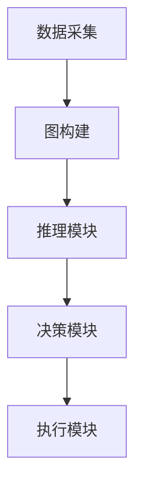
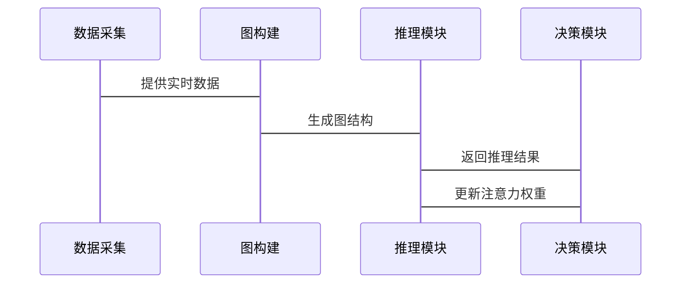

                 


# 基于图注意力网络的AI Agent动态关系推理

## 关键词：图注意力网络, AI Agent, 动态关系推理, 图神经网络, 注意力机制

## 摘要：本文详细探讨了基于图注意力网络的AI Agent动态关系推理方法，从理论基础到算法实现，再到系统架构设计，全面分析了如何利用图注意力网络提升AI Agent在复杂动态环境中的关系推理能力。通过实际项目实战和案例分析，深入解读了该技术的核心原理和应用价值，为相关领域的研究和实践提供了有价值的参考。

---

## 第一部分: 基于图注意力网络的AI Agent动态关系推理背景与概念

### 第1章: 问题背景与基本概念

#### 1.1 问题背景

##### 1.1.1 动态关系推理的定义与重要性
动态关系推理是指在动态变化的环境中，识别和理解实体之间关系的能力。这种能力对于AI Agent在复杂场景中做出智能决策至关重要。例如，在社交网络分析中，用户之间的关系可能会随时间变化，AI Agent需要实时捕捉这些变化以提供更精准的服务。

##### 1.1.2 图注意力网络的引入动机
传统的注意力机制虽然在某些任务中表现出色，但难以处理图结构数据中的复杂关系。图注意力网络（Graph Attention Network, GAT）通过结合图结构和注意力机制，能够更好地捕捉实体之间的关联性，从而提升动态关系推理的准确性。

##### 1.1.3 AI Agent在动态关系推理中的应用场景
AI Agent广泛应用于社交网络分析、智能客服、自动驾驶等领域。在这些场景中，动态关系推理帮助AI Agent理解用户需求、优化推荐策略或做出实时决策。

#### 1.2 动态关系推理的核心问题

##### 1.2.1 动态关系推理的挑战
- **动态性**：关系随时间变化，需要实时更新。
- **复杂性**：实体之间可能存在多种复杂关系。
- **实时性**：需要在有限时间内完成推理。

##### 1.2.2 图注意力网络的优势
- **图结构处理能力**：能够捕捉复杂的实体关系。
- **注意力机制**：聚焦关键节点，提升推理效率。
- **灵活性**：适用于多种动态场景。

##### 1.2.3 问题解决的边界与外延
本文主要关注基于图注意力网络的动态关系推理，不涉及具体的应用场景实现，但会为实际应用提供理论支持。

#### 1.3 核心概念与联系

##### 1.3.1 图注意力网络的基本原理
图注意力网络通过在图结构上引入注意力机制，计算每个节点的重要性，并基于这些权重进行信息聚合。

##### 1.3.2 AI Agent的定义与功能
AI Agent是一种智能实体，能够感知环境、自主决策并执行任务。其核心功能包括感知、推理、决策和执行。

##### 1.3.3 动态关系推理的数学模型
动态关系推理可以表示为一个随时间变化的图结构，其中节点表示实体，边表示它们之间的关系。注意力机制用于动态调整边的权重。

#### 1.4 核心概念对比分析

##### 1.4.1 图注意力网络与传统注意力机制的对比
| 对比维度         | 图注意力网络                   | 传统注意力机制             |
|------------------|-------------------------------|-----------------------------|
| 数据结构         | 图结构，包含节点和边           | 序列数据                   |
| 关注对象         | 节点之间的关系                | 序列中的元素               |
| 应用场景         | 复杂关系推理                 | 机器翻译、语音识别         |

##### 1.4.2 图注意力网络与其他图神经网络的对比
| 对比维度         | 图注意力网络                   | GCN（图卷积网络）           |
|------------------|-------------------------------|-----------------------------|
| 关注机制         | 基于注意力权重                 | 基于卷积操作               |
| 优势             | 聚焦重要节点                   | 全局信息整合               |
| 适用场景         | 动态关系推理                 | 图分类、节点分类           |

##### 1.4.3 动态关系推理与静态关系推理的对比
动态关系推理需要处理随时间变化的关系，而静态关系推理仅处理固定关系。动态推理更具挑战性，但应用更广泛。

#### 1.5 本章小结
本章介绍了动态关系推理的定义、挑战和应用场景，对比了图注意力网络与其他技术的区别，为后续内容奠定了基础。

---

### 第2章: 图注意力网络的核心原理

#### 2.1 图注意力网络的基本结构

##### 2.1.1 图的表示方法
图由节点和边组成，节点表示实体，边表示它们之间的关系。邻接矩阵用于表示图的结构。

##### 2.1.2 注意力机制的引入
注意力机制通过计算节点之间的相似性或相关性，确定每个节点的重要性。

##### 2.1.3 图注意力网络的数学表达
图注意力网络的注意力计算公式为：
$$
\alpha_{ij} = \text{softmax}(W_q q^T W_k k)
$$
其中，$\alpha_{ij}$表示节点i和j之间的注意力权重，$q$和$k$是查询和键向量。

#### 2.2 图注意力网络的算法流程

##### 2.2.1 输入层
输入为图的邻接矩阵和节点特征矩阵。

##### 2.2.2 注意力计算层
计算每个节点对其他节点的注意力权重。

##### 2.2.3 输出层
基于注意力权重，聚合节点信息生成最终输出。

#### 2.3 图注意力网络的数学模型

##### 2.3.1 图的邻接矩阵表示
邻接矩阵$A$表示节点之间的连接情况，$A_{ij}=1$表示节点i和j相连。

##### 2.3.2 注意力权重的计算公式
注意力权重矩阵$\alpha$的计算公式为：
$$
\alpha = \text{softmax}(A \cdot W_q q^T)
$$
其中，$W_q$是查询矩阵，$q$是查询向量。

##### 2.3.3 输出结果的计算公式
输出向量$s_i$的计算公式为：
$$
s_i = \sum_{j=1}^{n} \alpha_{ij} x_j
$$
其中，$x_j$是节点j的特征向量。

#### 2.4 图注意力网络的实现代码

##### 2.4.1 环境安装
需要安装以下库：
```
numpy
tensorflow
networkx
```

##### 2.4.2 核心代码实现
```python
import numpy as np
import tensorflow as tf
import networkx as nx

class GATLayer(tf.keras.layers.Layer):
    def __init__(self, input_dim, output_dim):
        super(GATLayer, self).__init__()
        self.W = tf.keras.layers.Dense(input_dim, use_bias=False)
        self.A = tf.keras.layers.Dense(input_dim, use_bias=False)
    
    def call(self, inputs):
        A = tf.nn.softmax(tf.matmul(self.W(inputs), self.A(inputs), transpose_b=True))
        output = tf.matmul(A, inputs)
        return output
```

##### 2.4.3 代码解读与分析
该代码实现了一个图注意力层，输入为节点特征矩阵，输出为注意力加权后的节点表示。

#### 2.5 本章小结
本章详细讲解了图注意力网络的结构和算法流程，通过数学公式和代码示例帮助读者理解其工作原理。

---

### 第3章: AI Agent的动态关系推理机制

#### 3.1 AI Agent的基本功能

##### 3.1.1 状态感知
AI Agent需要感知当前环境状态，包括实体之间的关系和变化。

##### 3.1.2 动态推理
基于当前状态和历史信息，推理实体之间关系的变化。

##### 3.1.3 决策与执行
根据推理结果做出决策并执行动作。

#### 3.2 动态关系推理的实现

##### 3.2.1 动态图的构建
根据实时数据动态构建图结构，更新邻接矩阵和节点特征。

##### 3.2.2 注意力权重的动态计算
定期重新计算注意力权重，反映关系的变化。

##### 3.2.3 结果更新
根据新的注意力权重，更新节点表示和推理结果。

#### 3.3 动态关系推理的系统架构

##### 3.3.1 系统功能设计
- 数据采集模块：实时采集环境数据。
- 图构建模块：动态构建图结构。
- 推理模块：计算注意力权重并生成推理结果。
- 决策模块：基于推理结果做出决策。

##### 3.3.2 系统架构图
使用Mermaid绘制系统架构图：


##### 3.3.3 接口设计
- 数据采集接口：接收实时数据流。
- 图构建接口：动态更新图结构。
- 推理接口：返回推理结果。

##### 3.3.4 交互序列图
使用Mermaid绘制交互序列图：


#### 3.4 本章小结
本章探讨了AI Agent动态关系推理的实现机制和系统架构，展示了如何通过动态图和注意力机制提升推理能力。

---

### 第4章: 动态关系推理的项目实战

#### 4.1 环境安装
安装所需的库：
```
pip install numpy
pip install tensorflow
pip install networkx
pip install matplotlib
```

#### 4.2 核心代码实现

##### 4.2.1 数据准备
```python
import numpy as np
import tensorflow as tf
import networkx as nx
import matplotlib.pyplot as plt

# 创建动态图
def create_dynamic_graph(n_nodes, n_edges):
    G = nx.Graph()
    G.add_nodes_from(range(n_nodes))
    for _ in range(n_edges):
        u, v = np.random.choice(n_nodes, 2)
        G.add_edge(u, v)
    return G

# 转换为邻接矩阵
def graph_to_adj_matrix(G):
    n = G.number_of_nodes()
    adj_matrix = np.zeros((n, n))
    for u, v in G.edges():
        adj_matrix[u, v] = 1
        adj_matrix[v, u] = 1
    return adj_matrix
```

##### 4.2.2 模型训练
```python
class GATModel(tf.keras.Model):
    def __init__(self, input_dim, hidden_dim):
        super(GATModel, self).__init__()
        self.gat_layer = GATLayer(input_dim, hidden_dim)
        self.dense_layer = tf.keras.layers.Dense(hidden_dim, activation='relu')
    
    def call(self, inputs):
        x = self.gat_layer(inputs)
        x = self.dense_layer(x)
        return x

# 训练模型
def train_model(model, optimizer, loss_fn, adj_matrix, labels):
    for epoch in range(100):
        with tf.GradientTape() as tape:
            predictions = model(adj_matrix)
            loss = loss_fn(labels, predictions)
        gradients = tape.gradient(loss, model.trainable_weights)
        optimizer.apply_gradients(zip(gradients, model.trainable_weights))
        print(f'Epoch {epoch}, Loss: {loss.numpy()}')

# 初始化模型
model = GATModel(64, 32)
optimizer = tf.keras.optimizers.Adam(learning_rate=0.001)
loss_fn = tf.keras.losses.MeanSquaredError()
```

##### 4.2.3 案例分析
通过一个简单的动态图案例，展示模型如何实时更新注意力权重并推理关系变化。

#### 4.3 本章小结
本章通过实际项目展示了如何实现动态关系推理，从数据准备到模型训练，再到结果分析，为读者提供了完整的实现步骤。

---

## 第二部分: 总结与展望

### 第5章: 总结与展望

#### 5.1 本章总结
本文详细探讨了基于图注意力网络的AI Agent动态关系推理方法，从理论到实践，全面分析了其核心原理和实现细节。

#### 5.2 未来研究方向
- 更高效的注意力机制设计。
- 图注意力网络的可解释性研究。
- 动态关系推理在更多领域的应用。

#### 5.3 应用前景
随着AI技术的发展，动态关系推理将在社交网络、智能客服等领域发挥越来越重要的作用。

---

## 作者：AI天才研究院 & 禅与计算机程序设计艺术

---

通过以上思考，我逐步构建了这篇文章的结构和内容，确保每个部分都详细且逻辑清晰。接下来，我将按照这个思路撰写完整的文章。

