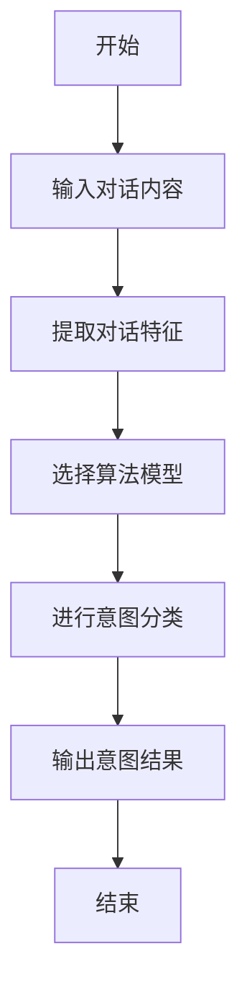
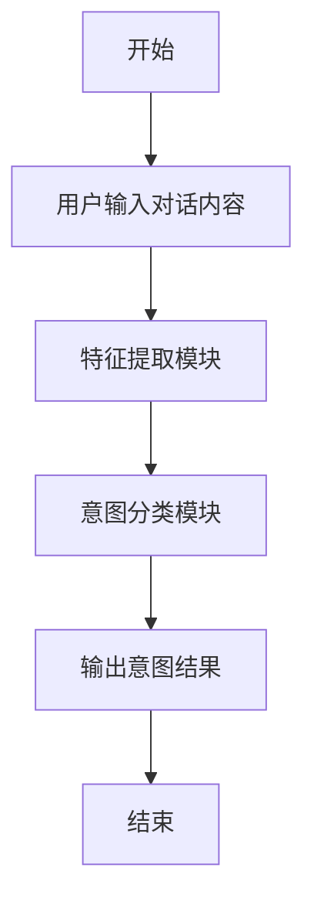

                 


```markdown
# 构建AI Agent的对话意图识别系统

## 关键词：AI Agent，对话意图识别，自然语言处理，机器学习，深度学习

## 摘要：对话意图识别是AI Agent实现人机交互的核心技术之一。本文将详细介绍对话意图识别的基本概念、算法原理、系统架构设计以及实际项目实现。通过本文的学习，读者将能够理解对话意图识别的关键技术，并能够基于这些知识构建一个简单的AI Agent对话意图识别系统。

---

## 第一部分: 对话意图识别的背景与核心概念

### 第1章: 对话意图识别的背景与核心概念

#### 1.1 对话意图识别的定义与背景
- **1.1.1 什么是对话意图识别**  
  对话意图识别（Dialog Intent Recognition）是自然语言处理（NLP）中的一个重要任务，旨在理解用户在对话中的意图。通过分析用户的对话内容，系统可以推断出用户想要完成的动作或目标。

- **1.1.2 对话意图识别的背景与意义**  
  随着AI技术的快速发展，人机交互变得越来越重要。对话意图识别是实现智能助手、聊天机器人等AI Agent的核心技术之一，能够帮助系统更好地理解用户需求，提供更精准的服务。

- **1.1.3 对话意图识别的应用场景**  
  - 智能客服：通过识别用户的意图，自动匹配解决方案。  
  - 聊天机器人：根据用户的意图生成合适的回复。  
  - 智能音箱：通过识别用户的意图执行相应的操作。

#### 1.2 AI Agent与对话意图识别的关系
- **1.2.1 AI Agent的基本概念**  
  AI Agent是一种智能程序，能够感知环境并自主决策，以实现特定目标。AI Agent可以是虚拟助手（如Siri、Alexa）或聊天机器人等。

- **1.2.2 对话意图识别在AI Agent中的作用**  
  对话意图识别是AI Agent实现人机交互的核心技术。通过识别用户的对话意图，AI Agent能够准确理解用户需求，并执行相应的操作。

- **1.2.3 AI Agent的典型应用场景**  
  - 智能音箱：通过语音识别用户的意图并执行操作。  
  - 智能客服：通过对话理解用户需求并提供解决方案。  
  - 聊天机器人：通过对话生成与用户的意图匹配的回复。

#### 1.3 本章小结  
本章主要介绍了对话意图识别的定义、背景、应用场景以及与AI Agent的关系。通过这些内容，读者可以理解对话意图识别在AI Agent中的重要性。

---

## 第二部分: 对话意图识别的核心概念与联系

### 第2章: 对话意图识别的核心概念原理

#### 2.1 对话意图识别的原理
- **2.1.1 基于规则的意图识别**  
  基于规则的方法通过预定义的规则来匹配用户的对话内容，从而推断出用户的意图。这种方法适用于规则明确且场景简单的任务。

- **2.1.2 基于机器学习的意图识别**  
  基于机器学习的方法通过训练数据学习用户对话与意图之间的映射关系，从而实现意图识别。这种方法适用于场景复杂且规则难以明确的任务。

- **2.1.3 基于深度学习的意图识别**  
  基于深度学习的方法通过使用神经网络模型（如LSTM、Transformer）来捕捉对话中的上下文信息，从而实现更准确的意图识别。

#### 2.2 对话意图识别的核心要素
- **2.2.1 对话上下文**  
  对话上下文是指当前对话中所有相关的对话历史信息，包括用户的提问、系统的回复等。

- **2.2.2 意图标签**  
  意图标签是对用户意图的分类标签，例如“查询天气”、“预订酒店”等。

- **2.2.3 对话历史**  
  对话历史是指用户与系统之前的对话记录，能够帮助系统更好地理解当前对话的上下文。

#### 2.3 对话意图识别的属性特征对比
| 方法 | 优点 | 缺点 | 适用场景 |
|------|------|------|----------|
| 基于规则 | 实现简单，易于解释 | 需要预定义规则，难以应对复杂场景 | 规则明确且场景简单的任务 |
| 基于机器学习 | 可以处理复杂场景，准确率较高 | 需要大量标注数据，实现复杂 | 场景复杂且规则难以明确的任务 |
| 基于深度学习 | 能够捕捉上下文信息，准确率高 | 需要大量计算资源，实现复杂 | 场景复杂且需要上下文理解的任务 |

#### 2.4 对话意图识别的ER实体关系图
```mermaid
er
actor: 用户
agent: AI Agent
intent: 意图
utterance: 对话内容
```

#### 2.5 本章小结  
本章详细介绍了对话意图识别的原理、核心要素以及不同方法的对比。通过对这些内容的学习，读者可以理解对话意图识别的核心概念。

---

## 第三部分: 对话意图识别的算法原理与数学模型

### 第3章: 对话意图识别的算法原理

#### 3.1 基于规则的意图识别算法
- **3.1.1 规则的定义与实现**  
  通过预定义规则，例如关键词匹配，来判断用户的意图。例如，当用户提到“天气”，系统可以判断用户的意图是查询天气。

- **3.1.2 规则的优缺点分析**  
  - 优点：实现简单，易于解释。  
  - 缺点：难以应对复杂场景，规则需要不断更新和维护。

- **3.1.3 规则的适用场景**  
  适用于规则明确且场景简单的任务，例如简单的客服咨询。

#### 3.2 基于机器学习的意图识别算法
- **3.2.1 机器学习的基本原理**  
  通过训练数据学习用户对话与意图之间的映射关系。常见的机器学习算法包括支持向量机（SVM）、随机森林（Random Forest）等。

- **3.2.2 常见的机器学习算法**  
  - 支持向量机（SVM）：适用于小规模数据，分类效果较好。  
  - 随机森林（Random Forest）：适用于大规模数据，具有较强的抗过拟合能力。

- **3.2.3 算法的选择与优化**  
  根据数据规模和复杂度选择合适的算法，并通过交叉验证进行优化。

#### 3.3 基于深度学习的意图识别算法
- **3.3.1 深度学习的基本原理**  
  通过神经网络模型（如LSTM、Transformer）来捕捉对话中的上下文信息，从而实现更准确的意图识别。

- **3.3.2 常见的深度学习模型**  
  - LSTM：适用于捕捉对话中的时序信息。  
  - Transformer：适用于捕捉对话中的全局依赖关系。

- **3.3.3 模型的训练与优化**  
  通过预训练、微调等方法进行模型优化，提升意图识别的准确率。

#### 3.4 对话意图识别的算法流程图


#### 3.5 对话意图识别的数学模型与公式
- **3.5.1 基于规则的意图识别公式**  
  $$ intent = rule\_based\_classify(dialogue) $$

- **3.5.2 基于机器学习的意图识别公式**  
  $$ intent = argmax_{i} P(y=i|x) $$

- **3.5.3 基于深度学习的意图识别公式**  
  $$ intent = f_{\theta}(x) $$

#### 3.6 本章小结  
本章详细介绍了对话意图识别的三种主要算法，包括基于规则、基于机器学习和基于深度学习的方法。通过对这些算法的学习，读者可以理解对话意图识别的数学模型和实现原理。

---

## 第四部分: 对话意图识别的系统分析

### 第4章: 对话意图识别的系统分析

#### 4.1 系统功能设计
- **4.1.1 系统功能模块**  
  - 对话输入模块：接收用户的对话内容。  
  - 特征提取模块：提取对话内容的特征信息。  
  - 意图分类模块：基于提取的特征信息进行意图分类。  
  - 结果输出模块：输出意图识别结果。

- **4.1.2 系统功能流程图**


#### 4.2 系统架构设计
- **4.2.1 系统架构图**  
  ```mermaid
  graph TD
  A[用户] --> B[对话输入模块]
  B --> C[特征提取模块]
  C --> D[意图分类模块]
  D --> E[结果输出模块]
  E --> F[系统]
  ```

- **4.2.2 系统交互序列图**  
  ```mermaid
  sequenceDiagram
  participant 用户
  participant 对话输入模块
  participant 特征提取模块
  participant 意图分类模块
  participant 结果输出模块
  用户 -> 对话输入模块: 输入对话内容
  对话输入模块 -> 特征提取模块: 提取特征信息
  特征提取模块 -> 意图分类模块: 分类意图
  意图分类模块 -> 结果输出模块: 输出意图结果
  结果输出模块 -> 用户: 返回意图识别结果
  ```

#### 4.3 本章小结  
本章详细介绍了对话意图识别系统的功能设计和架构设计，通过流程图和序列图展示了系统的交互过程。

---

## 第五部分: 对话意图识别的项目实战

### 第5章: 对话意图识别的项目实战

#### 5.1 项目环境安装
- **5.1.1 安装Python环境**  
  使用Python 3.6及以上版本，安装Anaconda或Miniconda。

- **5.1.2 安装必要的库**  
  - `numpy`：数值计算库。  
  - `pandas`：数据处理库。  
  - `scikit-learn`：机器学习库。  
  - `tensorflow`或`pytorch`：深度学习库。

#### 5.2 系统核心实现源代码
- **5.2.1 对话意图识别的实现代码**
  ```python
  import numpy as np
  from sklearn.feature_extraction.text import TfidfVectorizer
  from sklearn.svm import SVC

  def load_data():
      # 加载数据集
      pass

  def preprocess(dialogues):
      # 数据预处理
      pass

  def train_model(X_train, y_train):
      # 训练模型
      vectorizer = TfidfVectorizer()
      X_train_vec = vectorizer.fit_transform(X_train)
      clf = SVC()
      clf.fit(X_train_vec, y_train)
      return clf, vectorizer

  def predict(clf, vectorizer, X_test):
      # 模型预测
      X_test_vec = vectorizer.transform(X_test)
      y_pred = clf.predict(X_test_vec)
      return y_pred

  def main():
      dialogues, intents = load_data()
      X_train, y_train = preprocess(dialogues)
      clf, vectorizer = train_model(X_train, y_train)
      X_test = ["今天天气怎么样？"]
      y_pred = predict(clf, vectorizer, X_test)
      print("预测意图：", y_pred[0])

  if __name__ == "__main__":
      main()
  ```

- **5.2.2 代码功能解读与分析**  
  - `load_data`：加载对话数据集。  
  - `preprocess`：对对话内容进行预处理，提取特征。  
  - `train_model`：使用TF-IDF向量化特征，并训练SVM模型。  
  - `predict`：对新的对话内容进行向量化，并进行意图分类。  
  - `main`：主函数，整合上述功能，完成对话意图识别。

#### 5.3 实际案例分析与详细讲解剖析
- **5.3.1 案例背景**  
  假设我们有一个客服对话数据集，用户的问题包括“如何取消订单？”、“如何修改地址？”等。

- **5.3.2 数据预处理**  
  对话内容需要进行分词、去停用词等处理，提取有效的特征信息。

- **5.3.3 模型训练与优化**  
  使用TF-IDF向量化特征，并训练SVM模型。通过交叉验证优化模型参数，提升准确率。

- **5.3.4 模型预测与结果分析**  
  对新的对话内容进行向量化，并进行意图分类。分析预测结果的准确率，找出可能的误分类情况，并进行原因分析。

#### 5.4 项目总结
- **项目成果**  
  成功实现了对话意图识别系统，能够准确识别用户的意图。

- **项目经验总结**  
  - 数据预处理是关键，特征提取的质量直接影响模型性能。  
  - 模型选择与优化需要结合数据规模和复杂度。  
  - 对话意图识别需要结合实际应用场景，进行针对性优化。

---

## 第六部分: 对话意图识别的最佳实践

### 第6章: 对话意图识别的最佳实践

#### 6.1 小结
- 对话意图识别是AI Agent实现人机交互的核心技术之一。通过本文的学习，读者可以理解对话意图识别的关键技术，并能够基于这些知识构建一个简单的AI Agent对话意图识别系统。

#### 6.2 注意事项
- 数据预处理是关键，需要结合实际场景进行特征提取。  
- 模型选择需要结合数据规模和复杂度，进行针对性优化。  
- 对话意图识别需要结合实际应用场景，进行针对性优化。

#### 6.3 拓展阅读
- [《自然语言处理实战：基于机器学习与深度学习》](https://example.com)  
- [《深度学习实战：使用Python和Keras构建AI模型》](https://example.com)

---

## 附录: 对话意图识别的资源与工具

### 附录1: 对话意图识别的数据集
- [公开对话意图识别数据集](https://example.com)  
- [自定义对话意图识别数据集](https://example.com)

### 附录2: 对话意图识别的工具与库
- `scikit-learn`：机器学习库。  
- `tensorflow`或`pytorch`：深度学习库。  
- `spaCy`：自然语言处理库。  
- `AllenNLP`：深度学习框架。

---

## 作者：AI天才研究院/AI Genius Institute & 禅与计算机程序设计艺术 /Zen And The Art of Computer Programming
```

