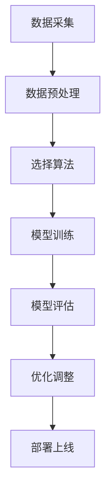
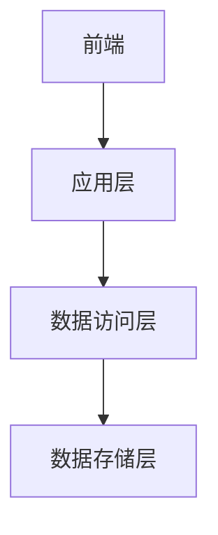
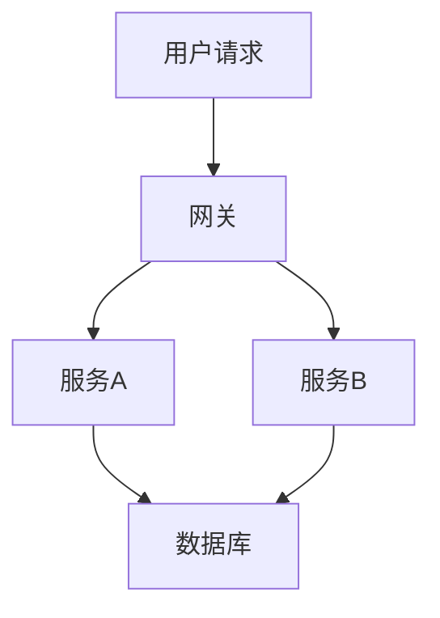
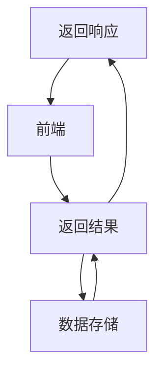
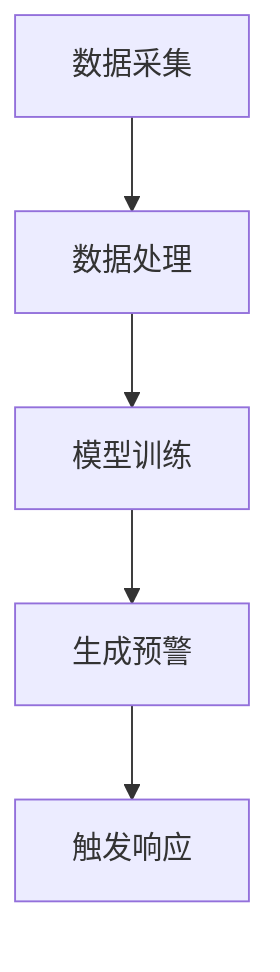

                 


# 构建智能企业风控系统：实时监控与风险预警

> 关键词：智能风控系统、实时监控、风险预警、人工智能、大数据分析、流数据处理

> 摘要：本文详细探讨了构建智能企业风控系统的核心概念、算法原理、系统架构设计及项目实战。通过分析实时监控与风险预警的关键技术，结合实际案例，展示了如何利用人工智能和大数据分析构建高效的智能风控系统，为企业提供实时风险预警和决策支持。

---

## 第1章：企业风控系统背景与挑战

### 1.1 企业风控系统的重要性

企业风控系统是保障企业稳健运营的核心机制，其主要目标是识别、评估和应对各种潜在风险。在现代商业环境中，风险来源多样化，包括市场波动、供应链中断、财务异常、合规风险等。传统的风控系统依赖人工检查和定期报告，存在效率低、响应慢、覆盖不全等问题。

#### 1.1.1 企业风控的核心概念

- **风险识别**：通过数据分析和模型预测，识别潜在风险点。
- **风险评估**：量化风险的影响程度和发生的概率。
- **风险控制**：采取措施降低风险发生的可能性或影响程度。

#### 1.1.2 风险管理对企业运营的影响

- **财务稳健**：通过及时发现和处理风险，避免重大财务损失。
- **合规性**：确保企业运营符合相关法律法规，避免法律风险。
- **竞争力**：高效的风控系统能够提高企业的市场反应速度和决策能力。

#### 1.1.3 智能风控系统的优势

- **实时性**：利用实时数据处理技术，实现风险的即时预警。
- **准确性**：通过机器学习算法，提高风险识别的准确性。
- **自动化**：自动化处理和响应，减少人工干预，提高效率。

### 1.2 当前企业风控系统的现状与挑战

#### 1.2.1 传统风控系统的局限性

- **数据处理延迟**：传统系统通常依赖批量处理，无法实现实时监控。
- **模型单一**：传统模型可能无法适应动态变化的市场环境。
- **集成复杂**：传统系统通常需要与现有业务系统深度集成，成本高且周期长。

#### 1.2.2 数据爆炸与实时性要求

- **数据量大**：企业每天产生的数据量巨大，传统系统难以处理。
- **实时性需求**：现代企业需要实时监控风险，以快速应对市场变化。

#### 1.2.3 系统集成与维护成本

- **高集成成本**：传统风控系统需要与企业现有的多个系统集成，成本高昂。
- **维护复杂**：系统更新和维护需要大量资源，且容易出现兼容性问题。

### 1.3 智能风控系统的必要性

#### 1.3.1 人工智能在风控中的应用

- **机器学习**：用于风险预测和异常检测。
- **自然语言处理**：用于分析非结构化数据，如新闻和社交媒体信息。

#### 1.3.2 实时监控与风险预警的结合

- **实时数据处理**：通过流数据处理技术，实现风险的实时识别。
- **动态调整**：根据实时数据动态调整风险模型，提高准确性。

#### 1.3.3 未来风控系统的趋势

- **智能化**：更加依赖人工智能技术，实现自动化风控。
- **分布式架构**：采用分布式系统架构，提高系统的扩展性和稳定性。

### 1.4 本章小结

本章介绍了企业风控系统的重要性，分析了传统风控系统的局限性，提出了智能风控系统的必要性，并展望了未来的发展趋势。智能风控系统通过实时监控和风险预警，能够帮助企业更快速、准确地应对潜在风险。

---

## 第2章：智能企业风控系统的核心概念

### 2.1 智能风控系统的定义与组成

#### 2.1.1 系统定义

智能企业风控系统是一种基于人工智能和大数据分析的实时监控系统，能够自动识别、评估和预警潜在风险，并提供相应的应对策略。

#### 2.1.2 核心组成部分

- **数据采集模块**：负责采集企业内外部数据，包括财务数据、市场数据、供应链数据等。
- **数据处理模块**：对采集的数据进行清洗、转换和整合，为后续分析提供基础。
- **风险评估模块**：利用机器学习算法对数据进行分析，识别潜在风险。
- **风险预警模块**：根据风险评估结果，生成预警信息，并提出应对策略。
- **响应与反馈模块**：根据预警信息，触发相应的应对措施，并收集反馈信息以优化系统。

### 2.2 智能风控系统的工作原理

#### 2.2.1 数据采集与处理

- **数据源**：企业内部系统（如ERP、CRM）、外部数据源（如市场数据、新闻数据）。
- **数据处理流程**：数据清洗、数据转换、数据集成。

#### 2.2.2 风险评估与预警机制

- **风险评估**：基于机器学习模型，对数据进行分析，评估风险的可能性和影响程度。
- **预警机制**：根据风险评估结果，生成预警信息，并通过多种渠道（如邮件、短信、系统通知）通知相关人员。

#### 2.2.3 响应与反馈

- **应对措施**：根据预警信息，采取相应的措施，如调整供应链策略、优化财务结构等。
- **反馈机制**：收集应对措施的执行结果，优化风险评估模型，提高系统的准确性。

### 2.3 智能风控系统的关键技术

#### 2.3.1 人工智能算法

- **机器学习**：监督学习、无监督学习、强化学习。
- **深度学习**：神经网络、卷积神经网络、循环神经网络。

#### 2.3.2 大数据分析技术

- **大数据处理框架**：Hadoop、Spark。
- **数据可视化**：利用工具如Tableau、Power BI进行数据可视化。

#### 2.3.3 实时计算框架

- **流数据处理**：Flink、Kafka。
- **实时分析**：利用流处理框架进行实时数据分析。

### 2.4 智能风控系统的优势与劣势

#### 2.4.1 优势分析

- **高效率**：通过实时监控，快速识别和应对风险。
- **高准确性**：利用机器学习算法，提高风险识别的准确性。
- **可扩展性**：系统架构灵活，能够适应企业规模的变化。

#### 2.4.2 潜在挑战

- **数据隐私**：数据的安全性和隐私保护是一个重要问题。
- **模型解释性**：复杂的机器学习模型可能难以解释，影响决策的透明性。
- **系统稳定性**：实时监控系统需要高可用性，确保系统的稳定运行。

### 2.5 本章小结

本章详细介绍了智能企业风控系统的核心概念，包括系统的定义、组成、工作原理以及关键技术。通过对比传统风控系统，突出了智能风控系统的优势和挑战。

---

## 第3章：智能风控系统的算法原理

### 3.1 实时监控算法

#### 3.1.1 流数据处理算法

- **流数据处理框架**：Flink、Kafka。
- **时间窗口**：设定固定时间窗口，处理实时数据流。

#### 3.1.2 基于时间序列的异常检测

- **时间序列分析**：利用历史数据，分析时间序列中的异常点。
- **算法实现**：使用ARIMA、LSTM等模型进行时间序列预测。

#### 3.1.3 异常检测的数学模型

- **ARIMA模型**：用于时间序列预测，公式为：$$ARIMA(p, d, q)$$
- **LSTM模型**：用于长序列预测，公式为：$$ LSTM = \text{门控机制} \times \text{遗忘门} $$

### 3.2 风险预警模型

#### 3.2.1 基于机器学习的风险评估

- **监督学习**：使用分类算法（如SVM、随机森林）进行风险分类。
- **无监督学习**：使用聚类算法（如K-means）进行风险分组。

#### 3.2.2 基于深度学习的风险预测

- **神经网络**：用于非结构化数据（如文本、图像）的风险预测。
- **卷积神经网络（CNN）**：用于图像数据的特征提取。

#### 3.2.3 风险预测的数学模型

- **SVM模型**：用于分类，公式为：$$ \text{最大化间隔} \$$
- **LSTM模型**：用于时间序列预测，公式为：$$ LSTM = \text{门控机制} \times \text{遗忘门} $$

### 3.3 算法实现与优化

#### 3.3.1 算法流程图



#### 3.3.2 算法优化策略

- **超参数调优**：通过网格搜索或随机搜索优化模型参数。
- **模型集成**：通过集成学习（如投票、加权）提高模型的准确性和稳定性。

### 3.4 本章小结

本章详细讲解了智能风控系统的算法原理，包括实时监控算法和风险预警模型。通过数学公式和流程图，展示了算法实现的步骤和优化策略。

---

## 第4章：智能风控系统的系统架构设计

### 4.1 系统功能模块划分

#### 4.1.1 数据采集模块

- **功能**：采集企业内外部数据。
- **实现**：通过API接口或数据连接器获取数据。

#### 4.1.2 数据处理模块

- **功能**：对数据进行清洗、转换和整合。
- **实现**：使用数据处理框架（如Spark、Flink）进行处理。

#### 4.1.3 风险评估模块

- **功能**：利用机器学习算法进行风险评估。
- **实现**：使用Python的scikit-learn库进行模型训练。

#### 4.1.4 预警与响应模块

- **功能**：生成预警信息并触发应对措施。
- **实现**：通过消息队列（如Kafka）进行实时通知。

### 4.2 系统架构设计

#### 4.2.1 分层架构设计



#### 4.2.2 微服务架构设计



### 4.3 系统接口设计

#### 4.3.1 数据接口

- **输入接口**：API接口用于接收外部数据。
- **输出接口**：API接口用于返回处理后的数据。

#### 4.3.2 API接口

- **RESTful API**：提供标准的HTTP接口，供其他系统调用。

### 4.4 系统交互流程设计

#### 4.4.1 用户交互流程



#### 4.4.2 后台处理流程



### 4.5 本章小结

本章详细介绍了智能风控系统的系统架构设计，包括功能模块划分、架构设计和接口设计。通过Mermaid图展示了系统的交互流程，帮助读者更好地理解系统的整体架构。

---

## 第5章：智能风控系统的项目实战

### 5.1 项目背景与目标

#### 5.1.1 项目背景

- **行业背景**：当前企业面临的风险多样化，需要实时监控和预警。
- **项目目标**：构建一个智能风控系统，实现对企业风险的实时监控和预警。

### 5.2 项目环境搭建

#### 5.2.1 工具安装

- **操作系统**：Linux或Windows。
- **开发工具**：PyCharm、VS Code。
- **依赖库安装**：Python的numpy、pandas、scikit-learn、tensorflow等。

#### 5.2.2 数据集准备

- **数据来源**：企业内部数据、公开数据集。
- **数据格式**：结构化数据、非结构化数据。

### 5.3 系统核心实现

#### 5.3.1 数据采集与处理

```python
import pandas as pd
import requests

def fetch_data(api_url):
    response = requests.get(api_url)
    data = response.json()
    df = pd.DataFrame(data)
    return df

df = fetch_data('http://example.com/api')
```

#### 5.3.2 模型训练与部署

```python
from sklearn.model import SVC

model = SVC()
model.fit(X_train, y_train)

def predict_risk(X):
    return model.predict(X)
```

#### 5.3.3 风险预警与响应

```python
import kafka.producer

producer = kafka.Producer('risk预警')
producer.send('risk_topic', '高风险预警')
```

### 5.4 实际案例分析

#### 5.4.1 案例背景

- **行业**：金融行业。
- **问题**：识别潜在的财务风险。

#### 5.4.2 数据分析与建模

- **数据清洗**：处理缺失值、异常值。
- **特征工程**：提取关键特征，如收入、支出、现金流等。
- **模型选择**：选择合适的机器学习模型进行风险预测。

#### 5.4.3 系统实现与优化

- **系统实现**：基于微服务架构，实现各个功能模块。
- **系统优化**：通过模型调优和架构优化，提高系统的性能和稳定性。

### 5.5 项目总结与小结

本章通过一个实际案例，详细讲解了智能风控系统的项目实战。从环境搭建到系统实现，再到案例分析，展示了如何将理论应用于实际。

---

## 第6章：智能风控系统的最佳实践与未来展望

### 6.1 最佳实践

#### 6.1.1 技术选型

- **算法选择**：根据具体问题选择合适的算法。
- **工具选型**：选择合适的开发工具和框架。

#### 6.1.2 数据安全与隐私保护

- **数据加密**：对敏感数据进行加密处理。
- **访问控制**：严格控制数据访问权限。

#### 6.1.3 系统维护与优化

- **定期维护**：定期检查系统运行状态，修复漏洞。
- **持续优化**：根据反馈不断优化系统性能和准确性。

### 6.2 未来展望

#### 6.2.1 技术发展

- **AI与大数据的进一步融合**：更智能化的风险预测和监控。
- **边缘计算的应用**：实现更实时、更本地化的风险监控。

#### 6.2.2 行业应用

- **金融行业**：进一步深化智能风控的应用。
- **供应链管理**：利用智能风控优化供应链的稳定性。

### 6.3 本章小结

本章总结了智能风控系统实施中的最佳实践，并展望了未来的发展趋势。通过技术选型和系统维护，可以进一步提升系统的性能和安全性。

---

## 附录：工具安装与数据集

### 附录A：工具安装指南

#### 附录A.1 Python环境搭建

- **安装Python**：从官网下载安装包，安装Python。
- **安装依赖库**：使用pip安装所需的第三方库，如numpy、pandas等。

#### 附录A.2 开发工具安装

- **安装PyCharm**：从官网下载安装包，安装PyCharm。
- **安装VS Code**：从官网下载安装包，安装VS Code。

### 附录B：数据集

#### 附录B.1 公开数据集

- **Kaggle数据集**：提供丰富的公开数据集，可用于实验和研究。
- **UCI机器学习仓库**：提供各种机器学习数据集。

#### 附录B.2 数据集格式

- **结构化数据**：如CSV、Excel格式。
- **非结构化数据**：如文本、图像格式。

---

## 作者：AI天才研究院/AI Genius Institute & 禅与计算机程序设计艺术 /Zen And The Art of Computer Programming

---

以上是《构建智能企业风控系统：实时监控与风险预警》的技术博客文章，涵盖了从背景到实战的各个方面，详细讲解了智能风控系统的构建过程。希望这篇文章能为您提供有价值的信息和启发。

