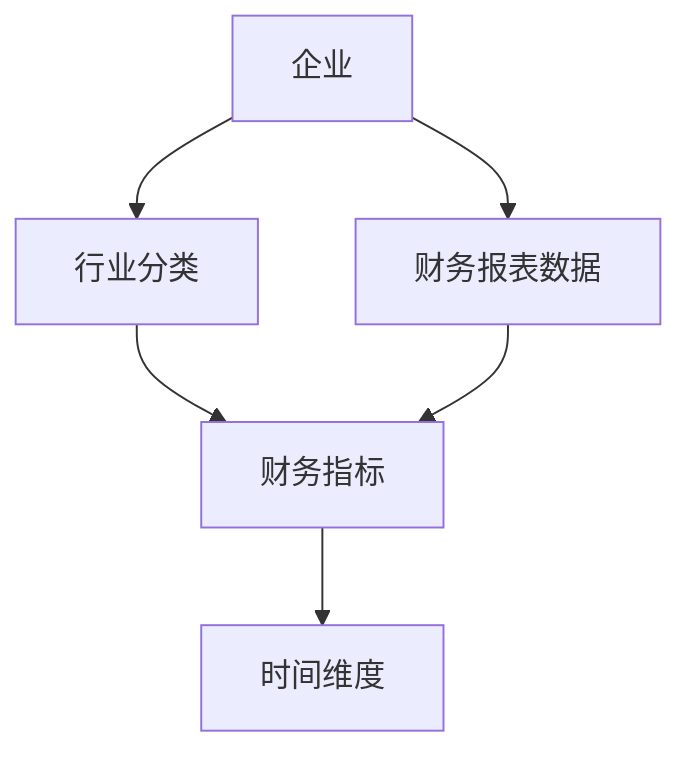
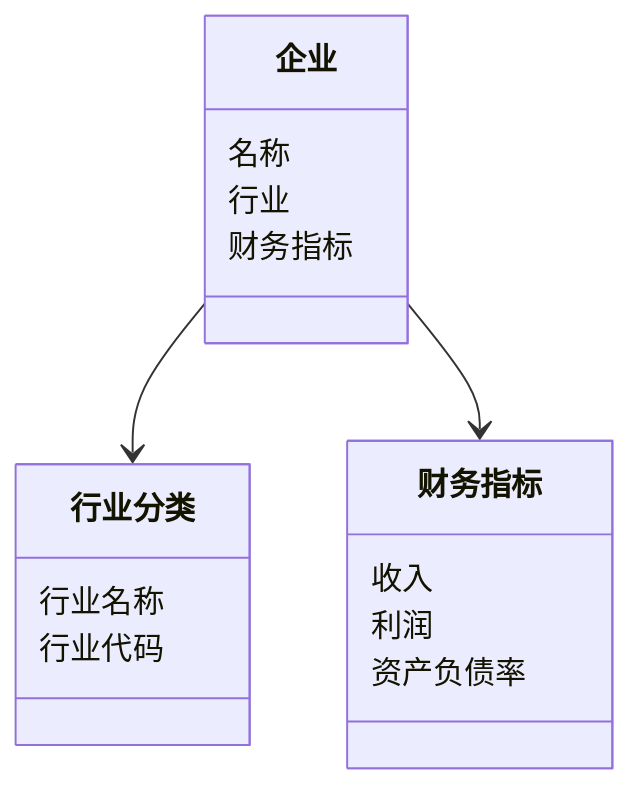
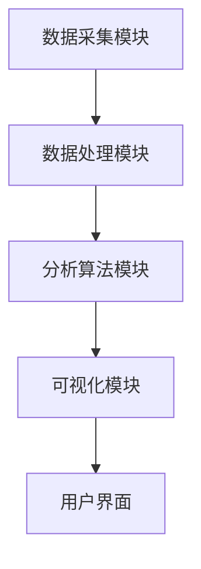
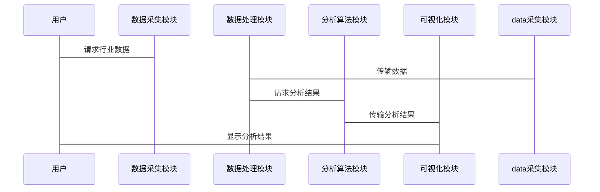

                 


# 设计智能化的企业财务报表同行业动态对比分析系统

> 关键词：智能化、企业财务报表、行业动态对比、大数据分析、算法实现、系统架构

> 摘要：本文详细探讨了设计智能化的企业财务报表同行业动态对比分析系统的背景、核心概念、算法原理、系统架构以及实现方案。通过结合大数据分析和人工智能技术，提出了一种基于聚类分析和深度学习的行业动态对比方法，并通过实际案例展示了系统的实现和应用效果。

---

# 第一章: 背景介绍与核心概念

## 1.1 问题背景

### 1.1.1 企业财务报表分析的重要性
企业在经营过程中，财务报表是反映企业经营状况的核心工具。通过对财务报表的分析，企业可以了解自身的盈利能力和财务健康状况。然而，单个企业的财务数据无法全面反映行业整体动态，因此需要结合同行业其他企业的数据进行对比分析。

### 1.1.2 同行业动态对比分析的必要性
同行业动态对比分析可以帮助企业了解行业发展趋势、竞争对手的经营状况以及自身在行业中的位置。这种分析对于企业的战略制定、风险控制和投资决策具有重要意义。

### 1.1.3 当前企业财务报表分析的痛点与挑战
- 数据来源多样且复杂，难以统一处理和分析。
- 传统分析方法依赖人工经验，缺乏智能化和自动化。
- 行业动态变化快，需要实时或近实时的分析能力。

## 1.2 问题描述

### 1.2.1 财务数据的多样性和复杂性
企业财务数据包括收入、成本、利润、资产负债等多方面的信息，且数据格式和来源多样，增加了数据处理的难度。

### 1.2.2 同行业对比的标准化与可比性问题
不同企业之间的会计政策和业务模式可能存在差异，导致直接对比财务数据的可比性较低。此外，行业动态变化快，需要动态调整对比基准。

### 1.2.3 传统分析方法的局限性
传统财务分析方法依赖人工经验，难以快速处理大量数据，且缺乏智能化的预测和对比能力。

## 1.3 问题解决思路

### 1.3.1 智能化分析的核心思想
通过引入大数据和人工智能技术，实现财务数据的自动化采集、清洗、分析和可视化。利用机器学习算法，建立行业动态对比的模型，提供智能化的分析结果。

### 1.3.2 数据驱动的行业动态对比方法
通过收集和分析行业内多家企业的财务数据，提取关键指标，建立行业基准，实时跟踪行业动态，为企业提供动态的对比分析。

### 1.3.3 技术实现的可行性分析
基于现有技术，可以通过数据挖掘、机器学习和自然语言处理等技术实现财务数据的智能化分析。结合云计算和大数据平台，可以实现高效的数据处理和分析。

## 1.4 系统的边界与外延

### 1.4.1 系统的功能边界
系统主要功能包括数据采集、数据清洗、行业对比分析、结果可视化和报告生成。系统不包括企业的内部财务管理模块。

### 1.4.2 系统的适用范围
适用于需要进行行业动态对比分析的企业，尤其是那些需要快速了解行业趋势和竞争对手动态的企业。

### 1.4.3 系统与外部系统的交互关系
系统需要与企业的财务系统、行业数据源（如行业数据库、新闻网站等）以及其他业务系统进行数据交互。

## 1.5 核心概念与组成要素

### 1.5.1 财务数据的结构化处理
将非结构化的财务数据（如财务报表文本）转化为结构化的数据，便于后续分析。

### 1.5.2 同行业对比的核心指标
包括收入增长率、利润率、资产负债率等关键财务指标。

### 1.5.3 智能化分析的算法框架
基于聚类分析、回归分析和深度学习等算法，构建行业动态对比模型。

## 1.6 本章小结
本章介绍了企业财务报表同行业动态对比分析的背景和必要性，分析了当前存在的痛点和挑战，并提出了智能化分析的核心思想和技术实现的可行性。

---

# 第二章: 智能化企业财务报表分析系统的核心概念

## 2.1 数据采集与预处理

### 2.1.1 数据源的多样性
数据来源包括企业内部财务系统、行业数据库、新闻网站等。

### 2.1.2 数据清洗与标准化
数据清洗包括去除重复数据、处理缺失值和异常值。数据标准化包括将不同单位的财务指标统一化。

### 2.1.3 数据结构化处理方法
将非结构化的财务数据（如财务报表文本）转化为结构化的数据，便于后续分析。

## 2.2 同行业对比的核心算法

### 2.2.1 基于聚类的行业分类
通过聚类算法将企业分为不同的行业类别，便于后续的对比分析。

### 2.2.2 基于回归的行业趋势预测
利用回归算法预测行业趋势，帮助企业制定战略决策。

### 2.2.3 基于深度学习的行业对比分析
通过深度学习模型，自动提取行业动态对比的关键特征，实现智能化的对比分析。

## 2.3 可视化与用户交互

### 2.3.1 数据可视化方法
使用图表（如柱状图、折线图等）直观展示行业动态对比结果。

### 2.3.2 用户交互设计
设计友好的用户界面，方便用户查看和分析行业动态对比结果。

### 2.3.3 可视化结果的可解释性
确保可视化结果具有较高的可解释性，方便用户理解和应用。

## 2.4 系统架构的模块划分

### 2.4.1 数据采集模块
负责从多种数据源采集财务数据。

### 2.4.2 数据处理模块
对采集到的财务数据进行清洗、标准化和结构化处理。

### 2.4.3 分析算法模块
基于聚类、回归和深度学习等算法，实现行业动态对比分析。

### 2.4.4 可视化模块
将分析结果以图表形式展示，方便用户查看和理解。

## 2.5 核心概念的ER实体关系图



---

# 第三章: 数据预处理与特征提取

## 3.1 数据清洗与标准化

### 3.1.1 数据清洗方法
- 去除重复数据
- 处理缺失值
- 去除异常值

### 3.1.2 数据标准化的数学公式
$$ x' = \frac{x - \mu}{\sigma} $$
其中，$\mu$ 是均值，$\sigma$ 是标准差。

## 3.2 特征提取与选择

### 3.2.1 基于主成分分析（PCA）的特征提取
通过主成分分析，提取数据的主要特征，降低数据维度。

### 3.2.2 特征选择的数学公式
$$ \text{特征权重} = \sum_{i=1}^{n} w_i x_i $$
其中，$w_i$ 是特征权重，$x_i$ 是特征值。

## 3.3 数据可视化与验证

### 3.3.1 数据可视化方法
使用散点图、热力图等图表展示数据分布和特征重要性。

### 3.3.2 数据验证方法
通过交叉验证和对比分析，验证数据处理的正确性和有效性。

---

# 第四章: 算法原理与数学模型

## 4.1 聚类分析

### 4.1.1 K-means聚类算法
$$ \text{目标函数} = \sum_{i=1}^{k} \sum_{j=1}^{n_i} (x_j - c_i)^2 $$
其中，$k$ 是聚类数，$n_i$ 是第$i$个聚类中的数据点数，$c_i$ 是第$i$个聚类的中心。

### 4.1.2 聚类算法的实现步骤
1. 初始化聚类中心。
2. 计算每个数据点到聚类中心的距离。
3. 将数据点分配到最近的聚类中心。
4. 更新聚类中心。
5. 重复步骤2-4，直到聚类中心不再变化。

## 4.2 回归分析

### 4.2.1 线性回归模型
$$ y = \beta_0 + \beta_1 x + \epsilon $$
其中，$\beta_0$ 是截距，$\beta_1$ 是回归系数，$\epsilon$ 是误差项。

### 4.2.2 回归模型的实现步骤
1. 收集数据。
2. 计算自变量和因变量的最小二乘回归系数。
3. 验证模型的显著性和拟合优度。
4. 使用模型进行预测。

## 4.3 深度学习

### 4.3.1 神经网络模型
$$ y = f(Wx + b) $$
其中，$W$ 是权重矩阵，$x$ 是输入向量，$b$ 是偏置向量，$f$ 是激活函数。

### 4.3.2 深度学习模型的训练过程
1. 初始化网络参数。
2. 前向传播计算输出。
3. 计算损失函数。
4. 反向传播更新参数。
5. 重复步骤2-4，直到损失函数收敛。

---

# 第五章: 系统分析与架构设计

## 5.1 问题场景介绍

### 5.1.1 系统目标
实现智能化的企业财务报表同行业动态对比分析系统，提供实时的行业动态对比分析结果。

### 5.1.2 项目介绍
通过结合大数据和人工智能技术，设计一个高效、智能的行业动态对比分析系统。

## 5.2 系统功能设计

### 5.2.1 领域模型


### 5.2.2 系统架构设计


### 5.2.3 系统接口设计
系统需要与企业财务系统、行业数据库等外部系统进行接口对接，实现数据的采集和传输。

### 5.2.4 系统交互流程


---

# 第六章: 项目实战与实现

## 6.1 环境安装与配置

### 6.1.1 系统需求
- 操作系统：Windows、Linux、macOS
- Python版本：3.6以上
- 依赖库：Pandas、NumPy、Scikit-learn、TensorFlow、Matplotlib

### 6.1.2 环境配置
安装Python和必要的依赖库：
```bash
pip install pandas numpy scikit-learn tensorflow matplotlib
```

## 6.2 系统核心实现

### 6.2.1 数据采集模块实现
```python
import pandas as pd

def collect_data():
    # 数据源1：企业财务数据
    df1 = pd.read_csv('enterprise_financial_data.csv')
    # 数据源2：行业数据
    df2 = pd.read_csv('industry_data.csv')
    # 合并数据
    merged_data = pd.merge(df1, df2, on='企业ID')
    return merged_data
```

### 6.2.2 数据处理模块实现
```python
def preprocess_data(data):
    # 删除重复数据
    data = data.drop_duplicates()
    # 处理缺失值
    data = data.dropna()
    # 标准化处理
    from sklearn.preprocessing import StandardScaler
    scaler = StandardScaler()
    data_scaled = scaler.fit_transform(data)
    return data_scaled
```

### 6.2.3 分析算法模块实现
```python
from sklearn.cluster import KMeans

def industry_classification(data):
    # 初始化聚类器
    kmeans = KMeans(n_clusters=5, random_state=0)
    # 训练模型
    kmeans.fit(data)
    # 预测聚类结果
    clusters = kmeans.predict(data)
    return clusters
```

### 6.2.4 可视化模块实现
```python
import matplotlib.pyplot as plt

def visualize_clusters(clusters, data):
    plt.scatter(data[:,0], data[:,1], c=clusters, cmap='rainbow')
    plt.xlabel('X')
    plt.ylabel('Y')
    plt.title('Industry Classification')
    plt.show()
```

## 6.3 实际案例分析

### 6.3.1 数据来源
- 企业财务数据：企业收入、利润、资产负债率等。
- 行业数据：行业平均收入、行业平均利润、行业平均资产负债率等。

### 6.3.2 数据处理与分析
```python
# 数据采集
data = collect_data()
# 数据处理
processed_data = preprocess_data(data)
# 行业分类
clusters = industry_classification(processed_data)
# 数据可视化
visualize_clusters(clusters, processed_data)
```

## 6.4 项目小结
通过实际案例分析，验证了系统的可行性和有效性。系统的实现过程包括数据采集、数据处理、算法实现和结果可视化，为企业的行业动态对比分析提供了有力支持。

---

# 第七章: 总结与展望

## 7.1 总结
本文详细探讨了设计智能化的企业财务报表同行业动态对比分析系统的背景、核心概念、算法原理、系统架构以及实现方案。通过结合大数据和人工智能技术，提出了一种基于聚类分析和深度学习的行业动态对比方法，并通过实际案例展示了系统的实现和应用效果。

## 7.2 展望
未来，随着人工智能和大数据技术的不断发展，企业财务报表同行业动态对比分析系统将更加智能化和自动化。可以通过引入更多的行业数据源和更复杂的算法模型，进一步提升系统的分析能力和预测精度。

---

# 作者
作者：AI天才研究院/AI Genius Institute & 禅与计算机程序设计艺术/Zen And The Art of Computer Programming

