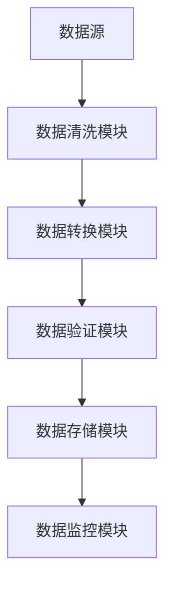
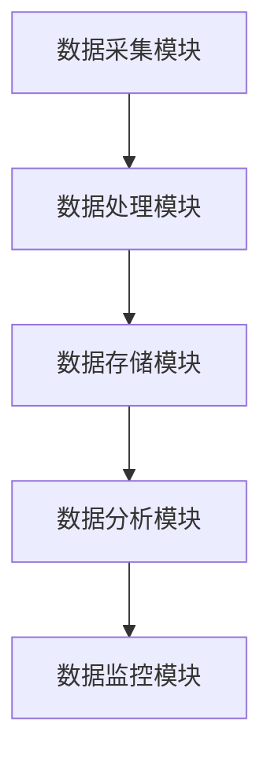
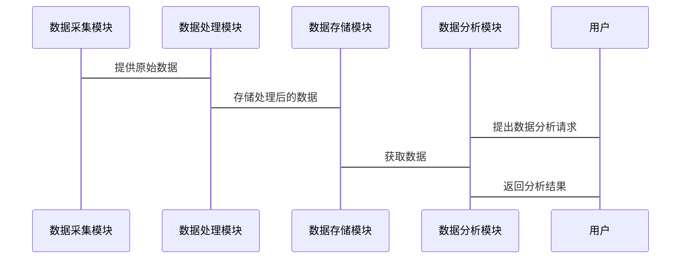

                 


# 《金融数据质量控制系统》

## 关键词：
- 金融数据
- 数据质量
- 质量控制
- 系统架构
- 项目实战

## 摘要：
本文系统地探讨了金融数据质量控制的重要性、核心概念、算法原理、系统架构及实际项目中的应用。通过详细分析数据质量的五个维度，结合具体的金融场景，提出了一套完整的数据质量控制系统架构，并通过实战案例展示了系统的实现过程。本文适合金融数据分析师、软件开发人员及对数据质量管理感兴趣的读者阅读。

---

# 第1章: 金融数据质量控制的背景与重要性

## 1.1 金融数据质量控制的背景
### 1.1.1 金融数据的特点与应用场景
- 数据的高价值性：金融数据涉及资金流动、投资决策，直接影响经济活动。
- 数据的复杂性：金融数据涵盖股票、债券、基金等多种类型，且数据来源多样。
- 数据的实时性：金融市场对数据的实时性要求极高，任何延迟都可能导致重大损失。

### 1.1.2 数据质量问题的普遍性
- 数据缺失：部分字段在数据采集过程中未被正确记录。
- 数据错误：数据录入或传输过程中出现错误。
- 数据不一致：同一数据在不同系统中表示方式不统一。

### 1.1.3 金融行业对数据质量的特殊要求
- 准确性：数据必须反映真实市场情况。
- 完整性：确保所有相关数据都被记录。
- 及时性：数据必须在最短时间内被处理和分析。

## 1.2 金融数据质量控制的必要性
### 1.2.1 数据质量问题对金融业务的影响
- 影响投资决策：错误的数据可能导致错误的投资决策。
- 影响风险管理：数据不准确可能导致风险评估失误。
- 影响合规性：数据质量问题可能导致违反金融监管规定。

### 1.2.2 数据质量问题对风险管理的威胁
- 数据错误可能导致风险评估失误，进而引发重大损失。
- 数据不完整可能导致无法全面识别潜在风险。

### 1.2.3 数据质量控制在金融监管中的作用
- 保障金融市场的公平性：通过数据质量控制，确保所有参与者基于相同的数据做出决策。
- 提高监管效率：高质量的数据有助于监管机构快速发现和处理问题。

## 1.3 数据质量控制的目标与范围
### 1.3.1 数据质量控制的主要目标
- 确保数据的准确性、完整性、一致性和及时性。
- 降低数据错误对金融业务的影响。

### 1.3.2 数据质量控制的范围界定
- 数据采集阶段：确保数据来源可靠。
- 数据处理阶段：清理和转换数据。
- 数据存储阶段：确保数据完整性和一致性。
- 数据分析阶段：使用高质量数据进行分析。

### 1.3.3 数据质量控制的边界与外延
- 数据质量控制的边界：数据进入系统前的质量控制。
- 数据质量控制的外延：数据在系统中的使用和反馈。

## 1.4 本章小结
本章通过分析金融数据的特点和数据质量控制的重要性，明确了数据质量控制的目标和范围。金融数据质量控制是保障金融业务正常运行和风险管理的关键环节。

---

# 第2章: 金融数据质量控制的核心概念与联系

## 2.1 数据质量的核心要素
### 2.1.1 数据完整性
- 定义：数据是否完整，无缺失值。
- 度量标准：缺失值比例。
- 示例：某字段缺失值比例为5%。

### 2.1.2 数据准确性
- 定义：数据是否正确，反映真实情况。
- 度量标准：数据与真实值的偏差。
- 示例：数据与真实值偏差不超过1%。

### 2.1.3 数据一致性
- 定义：数据是否统一，格式和内容一致。
- 度量标准：数据格式统一性。
- 示例：所有日期格式统一为YYYY-MM-DD。

### 2.1.4 数据及时性
- 定义：数据是否及时，反映最新情况。
- 度量标准：数据更新频率。
- 示例：每日数据更新及时率99%。

### 2.1.5 数据规范性
- 定义：数据是否符合规范，格式和内容是否符合要求。
- 度量标准：数据格式是否符合规范。
- 示例：所有字段长度符合预定义规范。

## 2.2 数据质量控制的关键环节
### 2.2.1 数据采集阶段的质量控制
- 数据源的可靠性：确保数据来源可靠。
- 数据清洗：清理缺失值和错误值。

### 2.2.2 数据处理阶段的质量控制
- 数据转换：将数据转换为统一格式。
- 数据增强：补充缺失数据。

### 2.2.3 数据存储阶段的质量控制
- 数据备份：防止数据丢失。
- 数据加密：确保数据安全。

### 2.2.4 数据分析阶段的质量控制
- 数据验证：确保数据准确无误。
- 数据监控：实时监控数据质量。

## 2.3 数据质量控制的核心流程
### 2.3.1 数据清洗
- 删除重复数据。
- 填充缺失值。
- 删除异常值。

### 2.3.2 数据转换
- 数据格式转换。
- 数据标准化。

### 2.3.3 数据验证
- 数据校验：检查数据是否符合预定义规则。
- 数据审核：人工审核数据准确性。

### 2.3.4 数据监控
- 实时监控数据质量。
- 告警机制：当数据质量下降时，及时告警。

## 2.4 核心概念关系图
### 2.4.1 数据质量维度对比表
| 数据质量维度 | 定义 | 度量标准 | 示例 |
|--------------|------|----------|------|
| 完整性       | 数据是否完整 | 缺失值比例 | 某字段缺失值比例为5% |
| 准确性       | 数据是否正确 | 数据与真实值的偏差 | 数据与真实值偏差不超过1% |
| 一致性       | 数据是否统一 | 数据格式统一性 | 所有日期格式统一为YYYY-MM-DD |
| 及时性       | 数据是否及时 | 数据更新频率 | 每日数据更新及时率99% |
| 规范性       | 数据是否符合规范 | 数据格式是否符合规范 | 所有字段长度符合预定义规范 |

### 2.4.2 数据实体关系图（ER图）


## 2.5 本章小结
本章详细介绍了金融数据质量控制的核心概念，包括数据质量的五个维度和关键环节。通过对比表和ER图，展示了这些概念之间的关系和整体架构。

---

# 第3章: 金融数据质量控制的算法原理

## 3.1 数据清洗算法
### 3.1.1 基于规则的清洗算法
- 算法步骤：
  1. 确定数据清洗规则。
  2. 根据规则清洗数据。
  3. 验证清洗结果。
- 示例代码：
  ```python
  import pandas as pd

  # 示例数据
  df = pd.DataFrame({
      'id': [1, 2, 3, 4, 5],
      'name': ['A', 'B', '', 'D', 'E'],
      'age': [25, 30, None, 40, 35]
  })

  # 清洗规则：删除name为空的行
  df_cleaned = df[df['name'] != '']
  print(df_cleaned)
  ```

### 3.1.2 基于统计的清洗算法
- 算法步骤：
  1. 计算数据的统计指标。
  2. 根据统计指标清洗数据。
  3. 验证清洗结果。
- 示例代码：
  ```python
  import pandas as pd

  # 示例数据
  df = pd.DataFrame({
      'id': [1, 2, 3, 4, 5],
      'value': [10, 20, 30, 40, 1000]
  })

  # 统计指标：计算均值和标准差
  mean = df['value'].mean()
  std = df['value'].std()

  # 清洗规则：删除偏离均值超过3个标准差的值
  df_cleaned = df[(df['value'] - mean).abs() <= 3 * std]
  print(df_cleaned)
  ```

### 3.1.3 基于机器学习的清洗算法
- 算法步骤：
  1. 训练异常检测模型。
  2. 使用模型识别异常数据。
  3. 清洗异常数据。
- 示例代码：
  ```python
  from sklearn.ensemble import IsolationForest

  # 示例数据
  import numpy as np
  np.random.seed(42)
  X = np.random.randn(100, 2) * 0.5
  X[-1] = [10, 10]

  # 训练异常检测模型
  model = IsolationForest(random_state=42)
  model.fit(X)

  # 预测异常点
  y_pred = model.predict(X)
  print(y_pred)
  ```

## 3.2 数据质量评估算法
### 3.2.1 数据质量指标计算
- 缺失值比例：计算缺失值占总数据的比例。
- 异常值比例：计算异常值占总数据的比例。
- 数据一致性：计算数据格式是否统一的比例。

### 3.2.2 数据质量评分模型
- 算法步骤：
  1. 计算各项数据质量指标。
  2. 综合各项指标评分。
  3. 输出数据质量评分。

### 3.2.3 数据质量趋势分析
- 算法步骤：
  1. 计算不同时间段的数据质量评分。
  2. 绘制评分趋势图。
  3. 分析评分变化趋势。

## 3.3 数据质量控制的数学模型
### 3.3.1 数据清洗的数学模型
$$
\text{清洗后数据} = \text{原始数据} \setminus \text{不符合规则的数据}
$$

### 3.3.2 数据质量评分模型
$$
\text{数据质量评分} = w_1 \cdot \text{完整性} + w_2 \cdot \text{准确性} + w_3 \cdot \text{一致性} + w_4 \cdot \text{及时性} + w_5 \cdot \text{规范性}
$$
其中，\( w_i \) 是各项指标的权重。

## 3.4 本章小结
本章详细介绍了金融数据质量控制的三种主要算法：基于规则的清洗算法、基于统计的清洗算法和基于机器学习的清洗算法。同时，还介绍了数据质量评估的数学模型和评分方法。

---

# 第4章: 金融数据质量控制的系统架构设计

## 4.1 系统功能模块设计
### 4.1.1 数据采集模块
- 功能：从多种数据源采集金融数据。
- 输入：多种数据源（API、数据库、文件）。
- 输出：清洗后的数据。

### 4.1.2 数据处理模块
- 功能：对数据进行清洗、转换和增强。
- 输入：原始数据。
- 输出：高质量数据。

### 4.1.3 数据存储模块
- 功能：存储和管理数据。
- 输入：处理后的数据。
- 输出：存储的结构化数据。

### 4.1.4 数据分析模块
- 功能：使用高质量数据进行分析。
- 输入：高质量数据。
- 输出：分析结果。

## 4.2 系统架构设计
### 4.2.1 系统架构图


### 4.2.2 系统接口设计
- 数据采集模块接口：提供数据源连接和数据获取接口。
- 数据处理模块接口：提供数据清洗和转换接口。
- 数据存储模块接口：提供数据存取接口。
- 数据分析模块接口：提供数据分析和查询接口。

## 4.3 系统交互设计
### 4.3.1 系统交互流程


## 4.4 本章小结
本章详细介绍了金融数据质量控制系统的系统架构设计，包括功能模块设计、系统架构图和系统交互流程。

---

# 第5章: 金融数据质量控制的项目实战

## 5.1 项目背景与目标
### 5.1.1 项目背景
- 某金融机构需要建立一个数据质量控制系统，确保数据的准确性和完整性。

### 5.1.2 项目目标
- 设计并实现一个金融数据质量控制系统。
- 提供数据清洗、转换、验证和监控功能。

## 5.2 项目环境与工具
### 5.2.1 环境配置
- 操作系统：Windows 10或更高版本，Linux Ubuntu 20.04或更高版本。
- 开发工具：PyCharm或VS Code。
- 依赖管理：使用虚拟环境管理Python包。

### 5.2.2 工具安装
- 安装Python：从官网下载并安装Python 3.9或更高版本。
- 安装依赖包：
  ```bash
  pip install pandas numpy scikit-learn matplotlib
  ```

## 5.3 项目核心实现
### 5.3.1 数据采集模块实现
```python
import pandas as pd

def fetch_data(api_key):
    # 示例API接口
    endpoint = f"https://api.example.com/financial_data?api_key={api_key}"
    data = pd.read_json(endpoint)
    return data
```

### 5.3.2 数据处理模块实现
```python
def clean_data(data):
    # 删除缺失值
    data = data.dropna()
    # 删除异常值
    outliers = detect_outliers(data)
    data = data[~data.index.isin(outliers)]
    return data

def detect_outliers(data):
    # 使用IsolationForest检测异常值
    model = IsolationForest(random_state=42)
    model.fit(data)
    outliers = model.predict(data) == -1
    return data[outliers].index
```

### 5.3.3 数据验证模块实现
```python
def validate_data(data, rules):
    # 根据规则验证数据
    validated_data = data.copy()
    for rule in rules:
        if rule['type'] == 'missing':
            validated_data = validated_data.dropna(subset=[rule['column']])
        elif rule['type'] == 'range':
            validated_data = validated_data[(validated_data[rule['column']] >= rule['min']) &
                                          (validated_data[rule['column']] <= rule['max'])]
    return validated_data
```

### 5.3.4 数据监控模块实现
```python
import pandas as pd
import numpy as np
import matplotlib.pyplot as plt

def monitor_data(data):
    # 计算缺失值比例
    missing_ratio = data.isnull().mean()
    # 计算异常值比例
    model = IsolationForest(random_state=42)
    model.fit(data)
    outlier_ratio = sum(model.predict(data) == -1) / len(data)
    # 绘制质量趋势图
    plt.figure(figsize=(10, 6))
    plt.bar(['Missing Ratio', 'Outlier Ratio'], [missing_ratio, outlier_ratio])
    plt.title('Data Quality Monitor')
    plt.show()
```

## 5.4 项目小结
本章通过一个具体的项目案例，展示了金融数据质量控制系统的实现过程，包括数据采集、处理、验证和监控模块的实现。通过实战案例，读者可以更好地理解理论知识，并能够将这些知识应用到实际工作中。

---

# 第6章: 数据质量控制的最佳实践与注意事项

## 6.1 最佳实践
### 6.1.1 数据源管理
- 确保数据源的可靠性和稳定性。
- 定期检查数据源的质量。

### 6.1.2 数据清洗策略
- 根据业务需求制定清洗策略。
- 确保清洗策略的可解释性。

### 6.1.3 数据存储与备份
- 定期备份数据，防止数据丢失。
- 确保数据存储的安全性。

### 6.1.4 数据监控与维护
- 实时监控数据质量。
- 建立数据质量预警机制。

## 6.2 注意事项
### 6.2.1 数据清洗的过度清洗问题
- 避免过度清洗数据，影响数据的准确性。
- 根据业务需求制定清洗策略。

### 6.2.2 数据安全问题
- 防止数据泄露。
- 确保数据存储的安全性。

### 6.2.3 数据质量管理的持续性
- 数据质量管理是一个持续的过程。
- 需要定期更新数据质量规则。

## 6.3 小结
本章总结了金融数据质量控制的最佳实践和注意事项，强调了数据质量管理的持续性和重要性。

---

# 第7章: 金融数据质量控制的拓展阅读

## 7.1 数据质量管理的前沿技术
### 7.1.1 基于人工智能的 数据质量管理
- 使用机器学习技术进行数据清洗和质量评估。
- 自动识别数据中的异常值和缺失值。

### 7.1.2 数据湖与数据仓库
- 数据湖：存储原始数据，支持多种数据格式。
- 数据仓库：存储处理后的数据，支持高效查询。

## 7.2 数据质量管理的未来趋势
### 7.2.1 自动化数据质量管理
- 使用自动化工具进行数据清洗和质量控制。
- 实时监控数据质量，自动修复问题。

### 7.2.2 数据质量管理的智能化
- 使用人工智能技术进行数据质量管理。
- 数据质量评估的智能化和自动化。

## 7.3 小结
本章介绍了数据质量管理的前沿技术和未来趋势，为读者提供了进一步学习的方向。

---

# 作者：AI天才研究院/AI Genius Institute & 禅与计算机程序设计艺术/Zen And The Art of Computer Programming

---

**说明：**  
本文仅为《金融数据质量控制系统》的部分内容展示，实际书籍内容将更加丰富和详细，涵盖更多实际案例和深入的技术分析。

