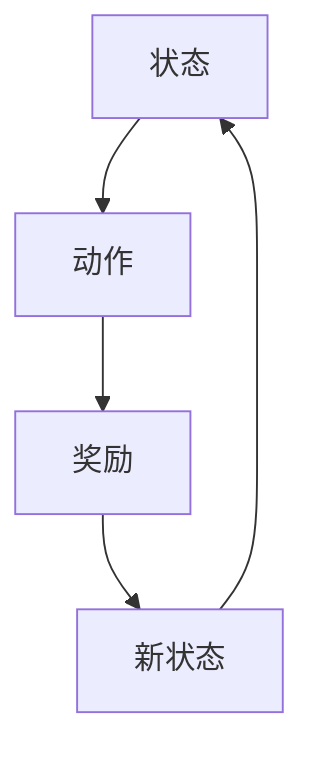
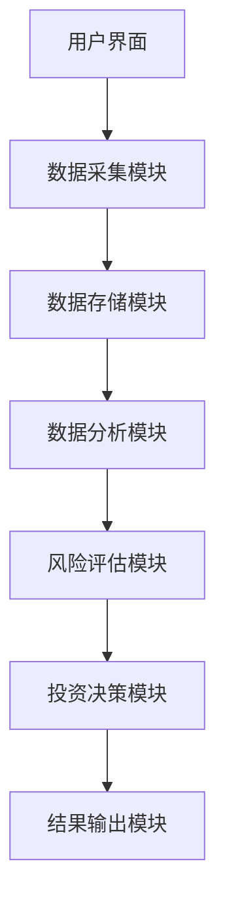

                 


# AI多智能体在价值投资中的并购分析应用

## 关键词：人工智能，多智能体，价值投资，并购分析，算法，系统架构

## 摘要：本文探讨了AI多智能体在价值投资中的并购分析应用，详细介绍了并购分析的背景、多智能体的基本概念及其在金融领域的应用、多智能体的架构与并购分析模型，以及系统架构设计与项目实战。通过实际案例分析，展示了如何利用多智能体技术提升并购分析的效率和准确性，为价值投资者提供了新的思路和工具。

---

# 第1章 并购分析的背景与价值投资

## 1.1 并购分析的基本概念

### 1.1.1 并购的定义与分类
并购（Mergers and Acquisitions，简称M&A）是指一家企业与其他企业合并或收购其资产或股份的行为。并购可以分为两类：合并（Mergers）和收购（Acquisitions）。合并通常指两家或更多企业合并成一家新的公司，而收购则是指一家企业购买另一家企业的全部或部分股权。

### 1.1.2 并购分析的目的与意义
并购分析的目的是评估并购交易的潜在价值和风险，帮助投资者做出明智的决策。通过分析目标公司的财务状况、市场地位、管理团队等因素，投资者可以判断并购是否能够带来长期的收益。

### 1.1.3 价值投资中的并购分析
价值投资是一种投资策略，旨在通过寻找被市场低估的优质股票进行投资。在价值投资中，并购分析尤为重要，因为并购往往会影响公司的财务状况和市场价值。通过分析并购的动机、目标和潜在影响，投资者可以更好地评估公司的价值。

## 1.2 价值投资的核心理念

### 1.2.1 价值投资的基本原则
价值投资的核心原则是寻找具有内在价值的公司，并在市场低估时买入，市场高估时卖出。这种方法强调长期投资和对公司基本面的深入分析。

### 1.2.2 价值投资中的关键因素
价值投资的关键因素包括公司的财务状况、管理团队、行业地位、竞争优势等。投资者需要综合考虑这些因素，才能准确评估公司的价值。

### 1.2.3 并购分析在价值投资中的地位
并购分析在价值投资中具有重要地位。通过分析并购的动机、目标和潜在影响，投资者可以更好地判断公司的未来发展前景，从而做出更明智的投资决策。

## 1.3 AI多智能体的应用价值

### 1.3.1 AI技术在金融领域的应用现状
AI技术在金融领域的应用日益广泛，包括股票预测、风险评估、欺诈检测等。通过AI技术，金融机构可以更高效地处理大量数据，提高决策的准确性。

### 1.3.2 多智能体在并购分析中的优势
多智能体在并购分析中的优势在于其分布式计算能力和协作能力。通过多个智能体的协作，可以更全面地分析目标公司的财务状况、市场地位等信息，提高分析的准确性。

### 1.3.3 未来发展趋势与潜力
随着AI技术的不断发展，多智能体在并购分析中的应用潜力巨大。未来，多智能体将更加智能化和自动化，能够处理更复杂的数据和场景，为价值投资者提供更强大的工具。

## 1.4 本章小结
本章介绍了并购分析的基本概念和价值投资的核心理念，并探讨了AI多智能体在并购分析中的应用价值。通过分析并购分析的重要性，以及AI多智能体的优势，可以为价值投资者提供新的思路和工具。

---

# 第2章 多智能体的基本概念与金融应用

## 2.1 多智能体系统概述

### 2.1.1 多智能体的定义与特点
多智能体是指由多个具有自主决策能力的智能体组成的系统。与单智能体相比，多智能体具有分布式计算、协作能力强、适应性好等特点。

### 2.1.2 多智能体与单智能体的区别
多智能体与单智能体的主要区别在于其分布式计算和协作能力。多智能体可以通过协作完成复杂的任务，而单智能体则需要独立完成任务。

### 2.1.3 多智能体在金融领域的应用
多智能体在金融领域的应用包括股票预测、风险评估、欺诈检测等。通过多个智能体的协作，金融机构可以更高效地处理大量数据，提高决策的准确性。

## 2.2 多智能体在金融分析中的优势

### 2.2.1 分布式计算的优势
分布式计算可以通过多个智能体同时处理大量数据，提高计算效率。在金融分析中，分布式计算可以快速处理大量市场数据，提高分析的效率。

### 2.2.2 多智能体的协作能力
多智能体可以通过协作完成复杂的任务，例如市场分析、风险评估等。通过协作，多个智能体可以综合考虑多个因素，提高分析的准确性。

### 2.2.3 多智能体的自适应性
多智能体具有自适应性，可以根据市场变化自动调整策略。在金融分析中，自适应性可以帮助投资者应对市场的不确定性，提高投资的收益。

## 2.3 多智能体在并购分析中的应用

### 2.3.1 多智能体在并购前评估中的作用
在并购前评估中，多智能体可以通过协作分析目标公司的财务状况、市场地位等因素，帮助投资者判断并购的潜在价值。

### 2.3.2 多智能体在并购后的整合分析
并购后的整合分析需要考虑多个因素，例如公司文化、管理团队等。多智能体可以通过协作分析这些因素，帮助投资者制定整合策略。

### 2.3.3 多智能体在风险评估中的应用
在并购过程中，风险评估是至关重要的。多智能体可以通过协作分析潜在风险，帮助投资者制定风险控制策略。

## 2.4 本章小结
本章详细介绍了多智能体的基本概念及其在金融领域的应用。通过分析多智能体的优势，可以为价值投资者提供新的工具和方法，帮助他们在并购分析中做出更明智的决策。

---

# 第3章 多智能体的架构与并购分析模型

## 3.1 多智能体的架构设计

### 3.1.1 分层架构
分层架构将系统分为多个层次，每个层次负责不同的功能。例如，底层可以负责数据采集，上层负责数据分析和决策。

### 3.1.2 分布式架构
分布式架构将智能体分布在不同的节点上，通过网络进行通信和协作。在金融分析中，分布式架构可以充分利用云计算的能力，提高计算效率。

### 3.1.3 混合架构
混合架构结合了分层和分布式架构的特点，可以在不同的层次上进行协作。这种架构在处理复杂任务时具有较高的灵活性和扩展性。

## 3.2 并购分析的多智能体模型

### 3.2.1 模型的构建与设计
并购分析的多智能体模型需要考虑多个因素，例如财务状况、市场地位、管理团队等。通过构建多个智能体，每个智能体负责分析不同的因素，然后通过协作得出综合结论。

### 3.2.2 模型的输入与输出
模型的输入包括目标公司的财务数据、市场数据等，输出包括并购的潜在价值、风险评估等。通过输入和输出的分析，可以为投资者提供全面的并购分析结果。

### 3.2.3 模型的训练与优化
多智能体模型需要通过大量数据进行训练和优化。通过机器学习算法，可以提高模型的准确性和适应性，使其能够更好地应对市场的变化。

## 3.3 多智能体协作机制

### 3.3.1 任务分配机制
任务分配机制用于将任务分配给不同的智能体。通过合理的任务分配，可以提高系统的效率和准确性。

### 3.3.2 信息共享机制
信息共享机制用于智能体之间的信息交流。通过共享信息，多个智能体可以综合考虑不同的因素，提高分析的准确性。

### 3.3.3 协作决策机制
协作决策机制用于多个智能体共同决策。通过协作决策，可以综合考虑多个因素，得出最优的并购分析结果。

## 3.4 本章小结
本章详细介绍了多智能体的架构设计及其在并购分析中的应用。通过构建多智能体模型和协作机制，可以为价值投资者提供更全面、更准确的并购分析结果。

---

# 第4章 并购分析中的算法原理

## 4.1 并购分析算法的基本原理

### 4.1.1 基于Q-learning的并购分析算法
Q-learning是一种常用的强化学习算法，可以通过智能体与环境的交互来学习最优策略。在并购分析中，Q-learning可以用于制定最优的投资策略。

### 4.1.2 算法流程图
以下是Q-learning算法的流程图：



### 4.1.3 算法实现代码
以下是Q-learning算法的Python实现代码：

```python
import numpy as np

class QLearning:
    def __init__(self, state_space, action_space):
        self.q_table = np.zeros((state_space, action_space))
    
    def choose_action(self, state, epsilon):
        if np.random.random() < epsilon:
            action = np.random.randint(0, action_space)
        else:
            action = np.argmax(self.q_table[state])
        return action
    
    def update_q_table(self, state, action, reward, next_state, learning_rate, gamma):
        self.q_table[state][action] = (1 - learning_rate) * self.q_table[state][action] + learning_rate * (reward + gamma * np.max(self.q_table[next_state]))
```

## 4.2 并购分析的数学模型

### 4.2.1 基于Q-learning的数学模型
以下是Q-learning算法的数学模型：

$$ Q(s, a) = (1 - \alpha) Q(s, a) + \alpha [r + \gamma \max Q(s', a')] $$

其中，\( \alpha \) 是学习率，\( \gamma \) 是折扣因子，\( r \) 是奖励，\( s' \) 是下一个状态。

### 4.2.2 模型的优化与改进
通过调整学习率和折扣因子，可以优化Q-learning算法的性能。例如，可以采用自适应学习率和动态折扣因子，以提高算法的适应性和准确性。

## 4.3 本章小结
本章详细介绍了并购分析中的算法原理，重点讲解了基于Q-learning的算法及其数学模型。通过优化算法参数，可以提高并购分析的准确性和效率。

---

# 第5章 系统架构设计与实现

## 5.1 系统架构设计

### 5.1.1 系统功能设计
并购分析系统的功能包括数据采集、数据分析、风险评估、投资决策等。通过模块化设计，可以提高系统的可扩展性和可维护性。

### 5.1.2 系统架构图
以下是并购分析系统的架构图：



### 5.1.3 系统接口设计
系统接口包括数据接口、算法接口和用户接口。通过标准接口设计，可以提高系统的互操作性和可扩展性。

## 5.2 系统实现

### 5.2.1 数据采集模块
数据采集模块负责从多个数据源采集并购相关的数据，例如财务数据、市场数据等。

### 5.2.2 数据分析模块
数据分析模块负责对采集的数据进行分析，例如计算财务指标、市场分析等。

### 5.2.3 风险评估模块
风险评估模块负责评估并购的风险，例如财务风险、市场风险等。

### 5.2.4 投资决策模块
投资决策模块负责根据分析结果制定投资策略，例如买入、卖出或持有。

## 5.3 本章小结
本章详细介绍了并购分析系统的架构设计与实现。通过模块化设计和标准接口，可以提高系统的效率和可扩展性。

---

# 第6章 项目实战：基于AI多智能体的并购分析系统

## 6.1 项目背景与目标
本项目旨在开发一个基于AI多智能体的并购分析系统，帮助投资者进行并购分析，制定投资策略。

## 6.2 系统核心代码实现

### 6.2.1 数据采集模块
以下是数据采集模块的Python代码：

```python
import requests
import json

def fetch_data(api_key, symbol):
    url = f"https://api.example.com/stock/{symbol}"
    headers = {'Authorization': f'Bearer {api_key}'}
    response = requests.get(url, headers=headers)
    return json.loads(response.text)
```

### 6.2.2 数据分析模块
以下是数据分析模块的Python代码：

```python
import pandas as pd
import numpy as np

def analyze_data(data):
    df = pd.DataFrame(data)
    df['PE'] = df['Price'] / df['Earnings']
    df['PEG'] = df['PE'] / df['Growth']
    return df
```

### 6.2.3 风险评估模块
以下是风险评估模块的Python代码：

```python
def assess_risk(data):
    risk_factors = ['Debt', 'Revenue', 'Profit', 'Market Share']
    risk_score = 0
    for factor in risk_factors:
        if data[factor] < 0.5:
            risk_score += 1
    return risk_score
```

### 6.2.4 投资决策模块
以下是投资决策模块的Python代码：

```python
def make_decision(risk_score, valuation):
    if risk_score < 2 and valuation > 1.5:
        return 'Buy'
    elif risk_score == 2:
        return 'Hold'
    else:
        return 'Sell'
```

## 6.3 案例分析
通过分析实际案例，可以验证系统的有效性。例如，分析某公司并购前后的财务状况和市场表现，评估并购的潜在价值和风险。

## 6.4 项目总结
本项目通过开发基于AI多智能体的并购分析系统，为投资者提供了更高效、更准确的分析工具。通过实际案例分析，验证了系统的有效性和实用性。

---

# 第7章 总结与展望

## 7.1 本章总结
本文详细探讨了AI多智能体在价值投资中的并购分析应用，介绍了并购分析的背景、多智能体的基本概念及其在金融领域的应用、多智能体的架构与并购分析模型，以及系统架构设计与项目实战。

## 7.2 应用中的挑战与建议
尽管AI多智能体在并购分析中具有巨大潜力，但仍然面临一些挑战，例如数据隐私、模型的可解释性等。未来，需要进一步研究和优化，以克服这些挑战。

## 7.3 未来发展趋势与展望
随着AI技术的不断发展，多智能体在并购分析中的应用将更加广泛和深入。未来，多智能体将更加智能化和自动化，能够处理更复杂的数据和场景，为价值投资者提供更强大的工具。

---

# 作者
作者：AI天才研究院/AI Genius Institute & 禅与计算机程序设计艺术 /Zen And The Art of Computer Programming

