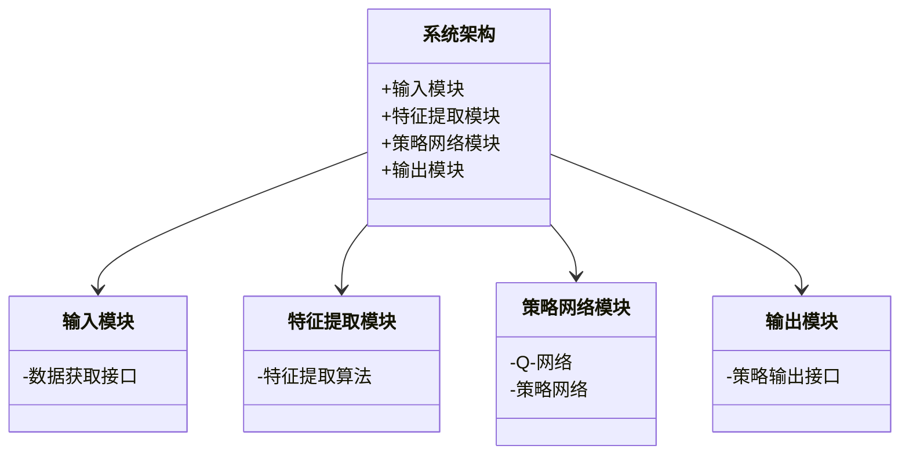
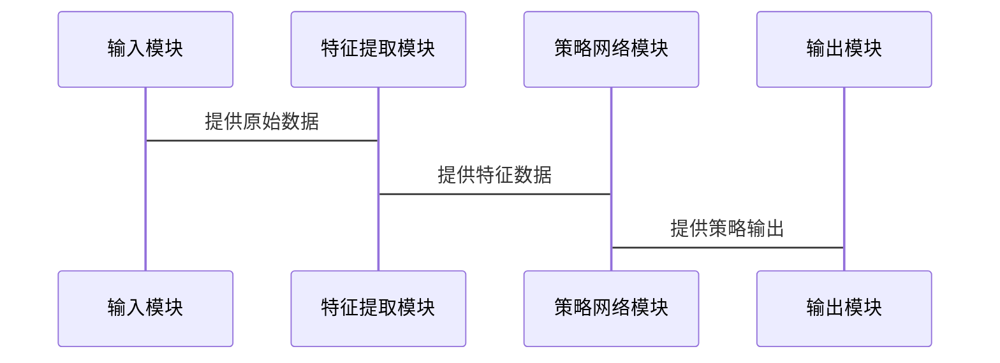

                 


# AI智能体协作：优化价值投资的行业轮动策略

## 关键词
AI智能体协作, 价值投资, 行业轮动, 强化学习, 多智能体系统, 金融投资策略

## 摘要
本文详细探讨了AI智能体协作在优化价值投资行业轮动策略中的应用。通过分析智能体协作的核心机制、算法原理、系统架构及实际案例，展示了如何利用AI技术提升金融投资的效率和准确性。文章从理论到实践，全面介绍了基于强化学习的行业轮动策略，为金融从业者和研究人员提供了有益的参考。

---

# 第一部分: AI智能体协作与价值投资行业轮动概述

## 第1章: AI智能体协作的定义与背景

### 1.1 AI智能体协作的核心概念

#### 1.1.1 AI智能体的基本定义
AI智能体（Artificial Intelligence Agent）是指能够感知环境并采取行动以实现目标的智能实体。它具备以下核心特征：
- **自主性**：能够在没有外部干预的情况下独立运作。
- **反应性**：能够根据环境变化实时调整行为。
- **目标导向性**：所有行为都以实现特定目标为导向。

#### 1.1.2 智能体协作的定义与特点
智能体协作是指多个智能体通过合作完成共同目标的过程。其特点包括：
- **分布式智能**：每个智能体负责特定任务，通过分工合作实现整体目标。
- **信息共享**：智能体之间共享信息，以提高整体决策的准确性。
- **动态平衡**：在协作过程中，智能体能够动态调整自身行为以适应环境变化。

#### 1.1.3 价值投资与行业轮动的基本概念
价值投资是一种以公司基本面分析为基础的投资策略，旨在寻找市场价格低于其内在价值的证券。行业轮动则是指在不同行业之间切换投资组合，以捕捉不同行业的周期性收益机会。

---

### 1.2 AI智能体协作在金融领域的应用

#### 1.2.1 金融领域的智能化需求
金融行业对智能化的需求主要体现在以下几个方面：
- **数据处理**：金融数据具有海量、高频和多维的特点，需要高效的处理能力。
- **决策支持**：通过智能分析提供实时的决策支持。
- **风险控制**：利用智能算法降低投资风险。

#### 1.2.2 AI智能体协作在投资决策中的作用
AI智能体协作能够通过以下方式优化投资决策：
- **信息整合**：多个智能体协同工作，整合多源数据，提供更全面的分析结果。
- **策略优化**：通过智能体协作，优化投资组合和交易策略。
- **风险分散**：智能体协作能够实时监控市场变化，分散投资风险。

#### 1.2.3 行业轮动策略的核心逻辑
行业轮动策略的核心逻辑是通过分析不同行业的周期性变化，选择表现最佳的行业进行投资。AI智能体协作能够通过以下方式优化行业轮动策略：
- **数据驱动**：基于大量历史数据和实时数据，智能体协作能够更准确地预测行业趋势。
- **动态调整**：根据市场变化实时调整行业轮动策略。

---

### 1.3 本章小结
本章介绍了AI智能体协作的基本概念、特点及其在金融领域的应用。重点分析了AI智能体协作在价值投资和行业轮动中的作用，为后续章节的深入分析奠定了基础。

---

# 第二部分: AI智能体协作的机制与算法

## 第2章: 智能体协作的任务分配与优化

### 2.1 智能体协作的任务分配机制

#### 2.1.1 任务分配的基本原理
任务分配是智能体协作的核心环节，其基本原理包括：
- **任务分解**：将整体任务分解为多个子任务，分配给不同的智能体。
- **任务分配策略**：根据智能体的能力和当前状态，选择合适的智能体执行任务。

#### 2.1.2 基于博弈论的任务分配模型
博弈论在任务分配中的应用主要体现在以下几个方面：
- **纳什均衡**：通过纳什均衡理论，确保任务分配的公平性和合理性。
- **竞争与合作**：智能体之间既存在竞争关系，又需要合作完成任务。

#### 2.1.3 分层任务分配策略
分层任务分配策略是一种常见的任务分配方法，其核心思想是将任务按层次分解，不同层次的任务由不同类型的智能体负责。

---

### 2.2 智能体协作的优化方法

#### 2.2.1 基于强化学习的优化算法
强化学习是一种通过试错机制优化智能体行为的算法。其核心要素包括：
- **状态（State）**：智能体所处的环境状态。
- **动作（Action）**：智能体根据当前状态采取的行动。
- **奖励（Reward）**：智能体采取行动后获得的反馈。

#### 2.2.2 分布式优化方法
分布式优化方法是一种通过局部优化实现全局最优的策略。其核心思想是：
- **局部最优**：每个智能体仅优化自身任务。
- **全局最优**：通过智能体之间的协作，实现整体任务的最优解。

#### 2.2.3 跨智能体协作的动态平衡机制
动态平衡机制是指智能体在协作过程中，能够根据环境变化和任务需求，实时调整自身行为以达到最佳协作状态。

---

## 第3章: 基于强化学习的行业轮动策略

### 3.1 强化学习的基本原理

#### 3.1.1 强化学习的定义与特点
强化学习是一种通过试错机制学习策略的算法。其特点包括：
- **目标导向性**：智能体的所有行为都以实现目标为导向。
- **实时反馈**：智能体能够根据环境反馈实时调整行为。

#### 3.1.2 状态、动作与奖励的定义
在行业轮动策略中，状态、动作和奖励的定义如下：
- **状态（State）**：当前市场环境，包括行业指数、市场趋势等。
- **动作（Action）**：智能体根据当前状态采取的行动，如买入、卖出或保持。
- **奖励（Reward）**：智能体采取行动后获得的收益或惩罚。

#### 3.1.3 基于深度学习的强化学习模型
基于深度学习的强化学习模型是一种结合深度学习和强化学习的算法，其核心思想是通过深度神经网络学习策略。

---

### 3.2 行业轮动策略的强化学习实现

#### 3.2.1 行业轮动的特征提取
特征提取是行业轮动策略的关键环节，其核心是选择能够反映行业趋势的特征。常见的特征包括：
- **行业指数**：如沪深300行业指数。
- **市场趋势**：如市场涨跌趋势。
- **行业基本面**：如行业盈利情况。

#### 3.2.2 基于强化学习的策略网络设计
策略网络是强化学习的核心组件，其设计直接影响策略的优劣。常见的策略网络包括：
- **Q-网络**：通过Q值函数评估每个动作的价值。
- **策略网络**：直接输出最优动作。

#### 3.2.3 策略网络的训练与优化
策略网络的训练过程包括以下几个步骤：
1. **数据准备**：收集和整理训练数据。
2. **网络训练**：通过反向传播算法优化网络参数。
3. **策略评估**：评估策略网络的性能。
4. **网络更新**：根据评估结果更新网络参数。

---

## 第4章: 多智能体协作的数学模型与公式

### 4.1 多智能体协作的核心数学模型

#### 4.1.1 基于纳什均衡的协作模型
纳什均衡是一种稳定的博弈状态，在纳什均衡状态下，每个智能体都无法通过单方面改变策略而获得更好的结果。其数学表达如下：
$$
\text{纳什均衡} \iff \forall i, u_i(a_i, a_{-i}) \geq u_i(a_i', a_{-i})
$$
其中，$u_i$表示智能体$i$的效用函数，$a_i$表示智能体$i$的策略，$a_{-i}$表示其他智能体的策略。

#### 4.1.2 分布式优化的数学表达
分布式优化的目标是通过局部优化实现全局最优。其数学表达如下：
$$
\min_{x_i} \sum_{i=1}^n f_i(x_i) \quad \text{subject to} \quad \sum_{i=1}^n x_i = X
$$
其中，$f_i(x_i)$表示智能体$i$的局部目标函数，$X$表示全局目标函数。

#### 4.1.3 跨智能体信息交换的数学公式
智能体之间的信息交换可以通过以下公式实现：
$$
a_i^{(t+1)} = a_i^{(t)} + \sum_{j \neq i} \alpha_{ij} (a_j^{(t)} - a_i^{(t)})
$$
其中，$\alpha_{ij}$表示智能体$j$对智能体$i$的影响权重。

---

### 4.2 强化学习的数学推导

#### 4.2.1 Q-学习算法的数学推导
Q-学习算法是一种经典的强化学习算法，其数学推导如下：
$$
Q(s, a) \leftarrow Q(s, a) + \alpha [r + \gamma \max_{a'} Q(s', a') - Q(s, a)]
$$
其中，$\alpha$表示学习率，$\gamma$表示折扣因子，$s$表示当前状态，$a$表示当前动作，$r$表示奖励，$s'$表示下一状态。

#### 4.2.2 策略梯度方法的数学推导
策略梯度方法是一种基于梯度的强化学习算法，其数学推导如下：
$$
\nabla \theta \leftarrow \mathbb{E}_{s,a} [\nabla \log \pi_\theta(a|s) Q_\theta(s,a)]
$$
其中，$\theta$表示策略参数，$\pi_\theta(a|s)$表示策略网络的输出概率，$Q_\theta(s,a)$表示Q值函数。

---

# 第三部分: 系统分析与架构设计方案

## 第5章: 系统架构设计与实现

### 5.1 问题场景介绍
行业轮动策略的实现需要解决以下问题：
- **数据获取**：如何获取实时的行业数据。
- **特征提取**：如何从海量数据中提取有效的特征。
- **策略优化**：如何通过智能体协作优化行业轮动策略。

### 5.2 系统功能设计

#### 5.2.1 领域模型（ER实体关系图）
以下是系统功能模块的类图：


#### 5.2.2 系统架构设计（架构图）
以下是系统架构图：


#### 5.2.3 系统接口设计
以下是系统接口设计：


---

## 第6章: 项目实战与案例分析

### 6.1 环境安装与配置
以下是环境安装与配置步骤：
1. **安装Python**：建议使用Python 3.8及以上版本。
2. **安装依赖库**：安装以下依赖库：
   ```bash
   pip install numpy pandas tensorflow scikit-learn matplotlib
   ```
3. **数据获取**：从数据源获取行业数据，例如沪深300行业指数。

### 6.2 核心实现代码

#### 6.2.1 特征提取代码
以下是特征提取代码：
```python
import numpy as np
import pandas as pd

# 数据加载
data = pd.read_csv('industry_index.csv')

# 特征提取
def extract_features(data):
    features = data[['行业指数', '市场趋势', '行业盈利']]
    return features.values

features = extract_features(data)
```

#### 6.2.2 策略网络实现代码
以下是策略网络实现代码：
```python
import tensorflow as tf
from tensorflow.keras import layers

# 定义Q-网络
def q_network(input_shape, action_size):
    model = tf.keras.Sequential()
    model.add(layers.Dense(64, activation='relu', input_shape=input_shape))
    model.add(layers.Dense(action_size))
    return model

# 定义策略网络
def policy_network(input_shape):
    model = tf.keras.Sequential()
    model.add(layers.Dense(64, activation='relu', input_shape=input_shape))
    model.add(layers.Dense(1, activation='sigmoid'))
    return model
```

#### 6.2.3 训练与优化代码
以下是训练与优化代码：
```python
# 训练过程
def train(q_model, policy_model, optimizer):
    for episode in range(num_episodes):
        state = get_current_state()
        action = policy_model.predict(state)
        next_state = get_next_state(action)
        reward = calculate_reward(action, next_state)
        q_model.fit(state, reward, epochs=1, verbose=0)
```

### 6.3 案例分析与详细解读
以下是实际案例分析：
假设我们有三个行业指数：金融、科技和消费。通过智能体协作，我们能够实时调整投资策略，捕捉行业轮动机会。例如，在市场波动较大时，智能体协作能够及时调整投资比例，降低投资风险。

---

## 第7章: 总结与展望

### 7.1 本章总结
本文详细探讨了AI智能体协作在优化价值投资行业轮动策略中的应用。通过分析智能体协作的核心机制、算法原理、系统架构及实际案例，展示了如何利用AI技术提升金融投资的效率和准确性。

### 7.2 最佳实践 tips
1. 在实际应用中，建议结合具体市场环境调整智能体协作策略。
2. 在系统设计中，需要注意数据隐私和安全问题。
3. 在算法实现中，建议结合实际情况选择合适的优化算法。

### 7.3 展望
未来的研究方向包括：
- **多智能体协作的优化算法**：探索更高效的多智能体协作算法。
- **行业轮动策略的动态调整**：研究如何实时调整行业轮动策略以适应市场变化。
- **智能体协作的可解释性**：提高智能体协作的可解释性，便于实际应用。

---

# 作者：AI天才研究院/AI Genius Institute & 禅与计算机程序设计艺术 /Zen And The Art of Computer Programming

