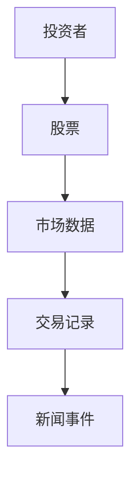
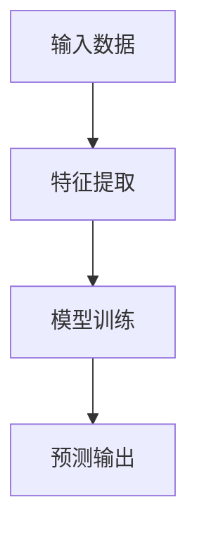
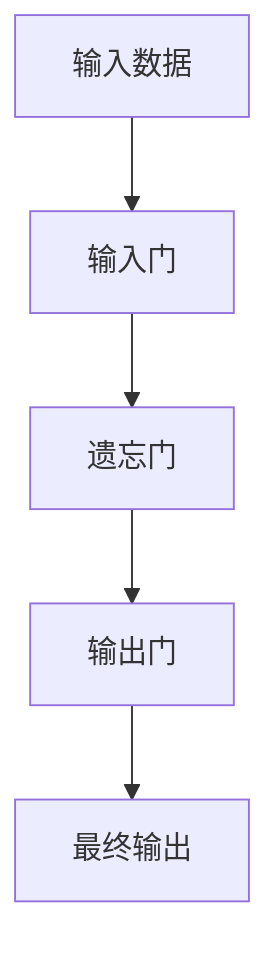
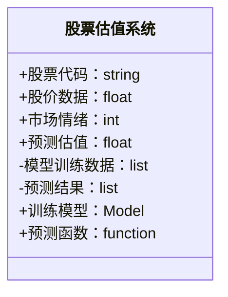
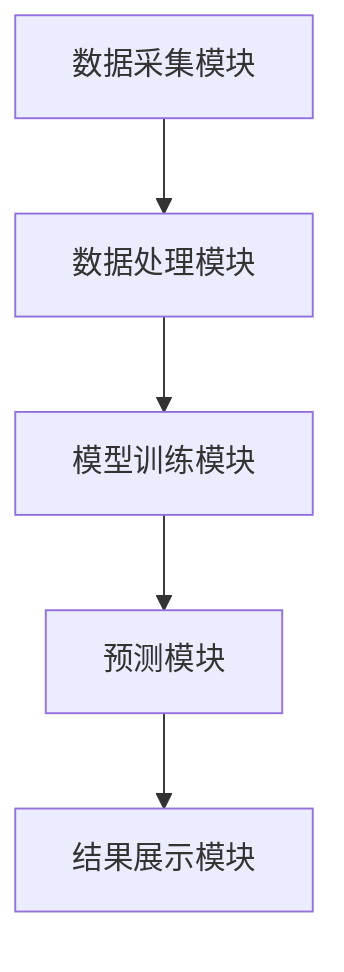
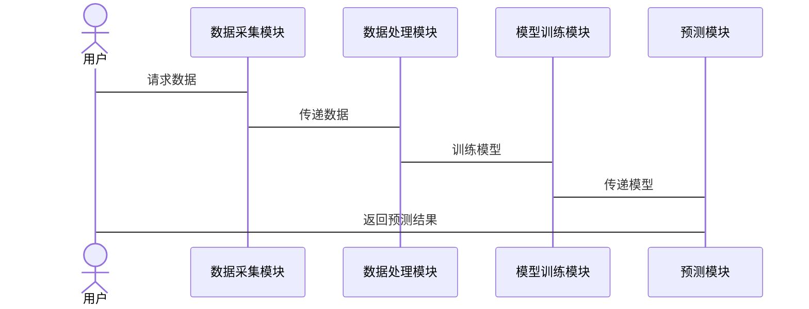

                 


# 人工智能在股市估值分析中的应用前景

> 关键词：人工智能，股市估值，机器学习，深度学习，金融数据，股票预测

> 摘要：本文探讨了人工智能在股市估值分析中的应用前景，从背景、技术原理到系统设计和实战案例进行了详细分析，揭示了AI技术在金融领域的巨大潜力。

---

## 第一章：背景介绍

### 1.1 问题背景

#### 1.1.1 股市估值分析的定义与重要性
股市估值分析是通过对公司基本面、市场情绪和技术指标的综合分析，预测股票的合理价格范围。其核心在于发现市场中的价值洼地，帮助投资者做出明智的投资决策。股市估值分析的重要性在于它能够为投资者提供决策依据，减少投资风险。

#### 1.1.2 传统股市估值方法的局限性
传统估值方法主要依赖财务指标（如市盈率、市净率）和简单的历史数据分析，存在以下局限性：
- 数据维度有限：难以捕捉市场情绪、新闻事件等非结构化信息。
- 计算复杂：手动分析耗时耗力，难以应对高频交易的需求。
- 预测精度低：受人为情绪和市场波动影响，预测结果不够准确。

#### 1.1.3 人工智能技术的兴起与应用潜力
人工智能技术的兴起为股市估值分析带来了新的可能性：
- 数据处理能力：AI能够处理海量的结构化和非结构化数据，发现隐藏的模式。
- 高速计算能力：AI可以实时分析市场数据，满足高频交易的需求。
- 自适应学习能力：AI能够不断优化模型，提高预测精度。

### 1.2 人工智能技术的核心概念

#### 1.2.1 人工智能的基本定义与分类
人工智能（AI）是模拟人类智能的计算机系统，主要分为弱人工智能和强人工智能。弱人工智能专注于特定任务（如图像识别、语音识别），而强人工智能具备通用问题解决能力。

#### 1.2.2 机器学习与深度学习的简介
- 机器学习：通过数据训练模型，使模型具备预测能力。
- 深度学习：一种机器学习方法，通过多层神经网络模拟人类大脑的处理方式。

#### 1.2.3 自然语言处理与图像识别在金融领域的应用
- 自然语言处理（NLP）：分析新闻、财报等文本数据，提取市场情绪。
- 图像识别：分析市场图表中的模式，辅助技术分析。

### 1.3 人工智能在股市估值中的演进历程

#### 1.3.1 从简单统计分析到复杂模型的演变
早期的股市分析主要依赖简单的统计方法，随着AI技术的发展，逐渐引入机器学习和深度学习模型。

#### 1.3.2 人工智能技术在金融领域的应用现状
当前，AI在金融领域的应用已涵盖股票预测、风险评估、量化交易等多个方面。

#### 1.3.3 未来发展趋势与潜在突破点
未来，AI在股市估值中的应用将更加智能化和个性化，可能实现实时动态估值和多市场联动预测。

### 1.4 本章小结

#### 1.4.1 股市估值分析的核心问题
如何利用多维度数据，建立高精度的股票估值模型。

#### 1.4.2 人工智能技术在其中的角色定位
作为数据处理和模型训练的工具，帮助提升估值的准确性和效率。

#### 1.4.3 未来研究方向的初步展望
探索更高效的算法和数据融合方法，提升模型的泛化能力和预测精度。

---

## 第二章：核心概念与技术联系

### 2.1 人工智能技术原理

#### 2.1.1 机器学习算法的数学基础
- 线性回归：$y = \beta x + \epsilon$
- 支持向量机（SVM）：寻找最优超平面，最大化类别间隔。

#### 2.1.2 深度学习模型的结构特点
- 多层感知机（MLP）：通过多层非线性变换，学习复杂的特征表示。
- 长短期记忆网络（LSTM）：适用于时间序列数据，捕捉长期依赖关系。

#### 2.1.3 自然语言处理与图像识别的金融应用
- NLP：分析新闻标题和财报，提取市场情绪。
- 图像识别：分析K线图，识别技术形态。

### 2.2 金融数据特征分析

#### 2.2.1 股价数据的时间序列特性
- 时间序列数据的依赖性：股票价格受历史数据影响。
- 非线性关系：市场行为复杂，难以用简单模型描述。

#### 2.2.2 市场情绪与新闻事件的影响
- 新闻事件可能引发市场波动，影响股票估值。
- 市场情绪可以通过社交媒体数据进行分析。

#### 2.2.3 多维数据的融合与处理
- 结构化数据：财务报表、交易数据。
- 非结构化数据：新闻、社交媒体、市场评论。

### 2.3 人工智能与金融数据的关系

#### 2.3.1 数据驱动的特征提取
- 通过AI技术提取股票价格、交易量、市场情绪等特征。

#### 2.3.2 模型训练与预测的逻辑
- 利用历史数据训练模型，预测未来股票价格。
- 模型输出作为估值参考。

#### 2.3.3 人机结合的优势与局限性
- 优势：结合人类的市场分析经验和AI的高效计算能力。
- 局限性：AI模型可能无法完全捕捉市场波动。

### 2.4 人工智能在股市估值中的实体关系分析

#### 2.4.1 ER实体关系图


### 2.5 本章小结

#### 2.5.1 核心概念的系统性总结
人工智能通过处理多维数据，提升股市估值的准确性和效率。

#### 2.5.2 技术原理的简要回顾
从机器学习算法到深度学习模型，AI技术为股市估值提供了强大的工具。

#### 2.5.3 数据与模型的交互关系
数据驱动特征提取，模型进行预测，两者相互依赖，共同提升估值精度。

---

## 第三章：算法原理与数学模型

### 3.1 机器学习算法

#### 3.1.1 线性回归模型
- 普通最小二乘法：$\hat{y} = \beta x + \beta_0$
- 逻辑回归：$P(y=1|x) = \frac{1}{1 + e^{-\beta x}}$

#### 3.1.2 支持向量机（SVM）
- 线性SVM：寻找最优超平面。
- 核函数：将数据映射到高维空间，处理非线性分类问题。

#### 3.1.3 随机森林与集成学习
- 随机森林：通过投票或平均，提高模型的泛化能力。
- 增益：集成学习能够有效降低模型过拟合的风险。

### 3.2 深度学习算法

#### 3.2.1 多层感知机（MLP）
- 网络结构：输入层→隐藏层→输出层。
- 激活函数：ReLU、sigmoid、tanh。

#### 3.2.2 长短期记忆网络（LSTM）
- 细胞状态：$c_t = g(f_{gate} \cdot c_{t-1} + i_{gate} \cdot x_t)$
- 输出：$h_t = o_{gate} \cdot c_t$

#### 3.2.3 图神经网络（GNN）
- 节点表示：通过聚合邻居信息，生成节点表示。
- 图卷积操作：在图结构上进行卷积操作。

### 3.3 算法原理的流程图

#### 3.3.1 线性回归模型流程图


#### 3.3.2 LSTM模型流程图


### 3.4 数学公式的详细推导

#### 3.4.1 线性回归的损失函数
$$ L = \frac{1}{2m} \sum_{i=1}^{m} (y_i - \hat{y}_i)^2 $$

#### 3.4.2 SVM的对偶形式
$$ \min_{\alpha} \frac{1}{2} \sum_{i=1}^{n} \alpha_i^2 y_i y_j x_i x_j + \sum_{i=1}^{n} \alpha_i y_i b_i + C \sum_{i=1}^{n} \alpha_i (1 - y_i) $$

#### 3.4.3 LSTM的遗忘门公式
$$ f_{gate} = \sigma(W_f x_t + U_f h_{t-1} + b_f) $$

### 3.5 本章小结

#### 3.5.1 算法原理的系统性总结
从线性回归到深度学习，AI算法为股市估值提供了多种选择。

#### 3.5.2 数学公式的简要回顾
通过公式推导，理解算法的工作原理。

#### 3.5.3 算法流程的直观展示
流程图帮助理解算法的执行过程。

---

## 第四章：系统分析与架构设计

### 4.1 系统分析

#### 4.1.1 问题场景介绍
- 数据源：股票价格、交易量、新闻数据。
- 业务目标：构建AI估值系统，辅助投资决策。

#### 4.1.2 需求分析
- 实时数据采集：获取最新的市场数据。
- 高精度预测：提供准确的股票估值。

### 4.2 项目介绍

#### 4.2.1 项目名称
AI Stock Valuation System（人工智能股票估值系统）。

#### 4.2.2 项目目标
构建一个基于AI的股票估值系统，提供实时估值服务。

### 4.3 系统功能设计

#### 4.3.1 领域模型


#### 4.3.2 系统架构设计


#### 4.3.3 系统接口设计
- 数据接口：从数据库获取历史数据。
- 预测接口：接收股票代码，返回预测估值。

#### 4.3.4 系统交互流程


### 4.4 本章小结

#### 4.4.1 系统分析的要点
从需求分析到系统设计，构建一个完整的AI估值系统。

#### 4.4.2 系统架构的设计思路
模块化设计，确保系统的可扩展性和可维护性。

#### 4.4.3 系统交互的直观展示
序列图帮助理解系统各模块之间的协作关系。

---

## 第五章：项目实战

### 5.1 环境安装

#### 5.1.1 安装Python
```bash
python --version
```

#### 5.1.2 安装依赖库
```bash
pip install numpy pandas scikit-learn tensorflow keras matplotlib
```

### 5.2 核心代码实现

#### 5.2.1 数据采集模块
```python
import pandas as pd
import requests

def get_stock_data(symbol):
    url = f"https://api.example.com/stock/{symbol}"
    response = requests.get(url)
    data = response.json()
    df = pd.DataFrame(data['data'])
    return df
```

#### 5.2.2 数据处理模块
```python
from sklearn.preprocessing import MinMaxScaler

def preprocess_data(df):
    scaler = MinMaxScaler()
    scaled_data = scaler.fit_transform(df['close'].values.reshape(-1,1))
    return scaled_data
```

#### 5.2.3 模型训练模块
```python
from keras.models import Sequential
from keras.layers import LSTM, Dense

def build_model(input_shape):
    model = Sequential()
    model.add(LSTM(50, input_shape=input_shape))
    model.add(Dense(1))
    model.compile(loss='mean_squared_error', optimizer='adam')
    return model
```

#### 5.2.4 预测模块
```python
def predict_stock(model, input_data):
    prediction = model.predict(input_data)
    return prediction
```

### 5.3 案例分析

#### 5.3.1 数据采集
```python
df = get_stock_data('AAPL')
print(df.head())
```

#### 5.3.2 数据处理
```python
scaled_data = preprocess_data(df)
print(scaled_data.shape)
```

#### 5.3.3 模型训练
```python
model = build_model((None, 1))
model.fit(X_train, y_train, epochs=100, batch_size=32)
```

#### 5.3.4 结果展示
```python
import matplotlib.pyplot as plt

plt.plot(y_test, label='Actual')
plt.plot(predicted, label='Predicted')
plt.legend()
plt.show()
```

### 5.4 项目小结

#### 5.4.1 项目实现的详细步骤
从数据采集到模型训练，完整展示了AI估值系统的实现过程。

#### 5.4.2 代码实现的关键点
数据预处理、模型构建和训练是项目的核心部分。

#### 5.4.3 案例分析的启示
通过实际案例，验证了AI在股市估值中的应用潜力。

---

## 第六章：未来展望

### 6.1 人工智能技术的未来发展

#### 6.1.1 AI技术的创新与突破
- 更高效的算法：如图神经网络、强化学习。
- 更强大的计算能力：如量子计算、边缘计算。

#### 6.1.2 在金融领域的潜在应用
- 实时动态估值：根据市场变化，实时调整估值模型。
- 多市场联动预测：分析全球市场数据，预测跨国资产的价格变动。

### 6.2 人工智能在股市估值中的潜在问题

#### 6.2.1 数据质量与完整性
- 数据缺失：如何处理不完整的市场数据。
- 数据偏差：如何避免模型训练中的数据偏差。

#### 6.2.2 模型的可解释性
- 黑箱问题：如何提高模型的可解释性，增强投资者信心。

#### 6.2.3 市场的不可预测性
- 黑天鹅事件：如何应对突发事件对模型的影响。

### 6.3 人工智能与人类智慧的结合

#### 6.3.1 人机协同的优势
- 结合人类的市场经验与AI的计算能力，提升估值的准确性和可靠性。

#### 6.3.2 未来投资策略
- 结合AI预测与传统技术分析，制定更加科学的投资策略。

### 6.4 本章小结

#### 6.4.1 人工智能技术的未来发展
AI技术将继续在股市估值中发挥重要作用，推动金融行业的智能化转型。

#### 6.4.2 潜在问题与解决方案
通过技术创新和制度完善，解决AI应用中的数据质量和模型解释性问题。

#### 6.4.3 人机结合的未来方向
人机协同将成为未来股市估值的主要模式，提升投资决策的科学性和效率。

---

## 附录：工具与资源

### 附录A：数据源推荐

- [Yahoo Finance](https://finance.yahoo.com/)
- [Quandl](https://www.quandl.com/)
- [Alpha Vantage](https://www.alphavantage.co/)

### 附录B：开发工具

- [Jupyter Notebook](https://jupyter.org/)
- [PyCharm](https://www.jetbrains.com/pycharm/)
- [TensorFlow](https://www.tensorflow.org/)

### 附录C：参考文献

- 刘军, 等. 《人工智能在金融中的应用》. 清华大学出版社, 2020.
- Goodfellow, I., Bengio, Y., & Courville, A. (2016). *Deep Learning*. MIT Press.

---

## 作者：AI天才研究院/AI Genius Institute & 禅与计算机程序设计艺术 /Zen And The Art of Computer Programming

---

**本文总结**：人工智能技术正在深刻改变股市估值分析的方式，通过数据驱动和算法优化，AI能够帮助投资者做出更明智的决策。然而，AI的应用也面临诸多挑战，需要技术与人类智慧的结合，才能充分发挥其潜力。

