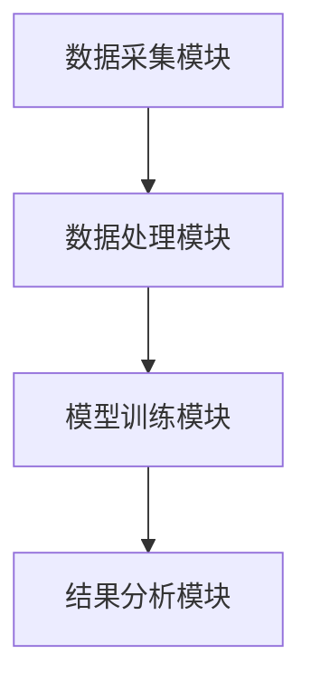
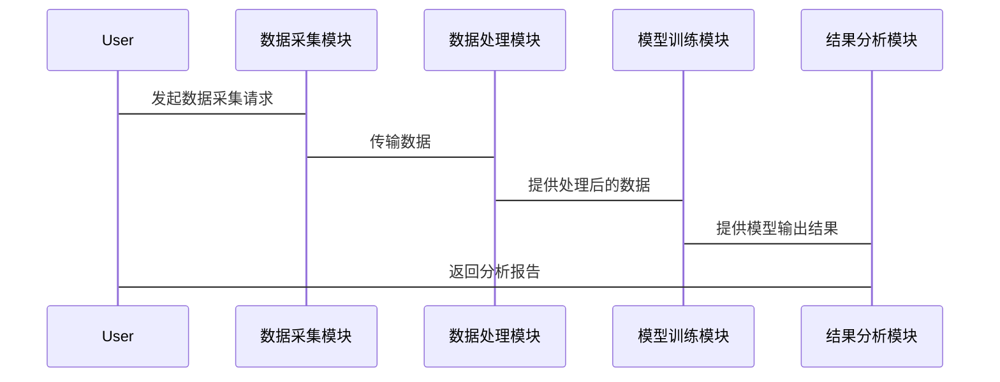

                 


# 基于图卷积网络的AI Agent社交网络分析

> 关键词：图卷积网络，AI Agent，社交网络分析，深度学习，图神经网络

> 摘要：本文将详细介绍基于图卷积网络（Graph Convolutional Network, GCN）的AI Agent在社交网络分析中的应用。通过分析社交网络的结构和AI Agent的行为模式，结合图卷积网络的强大能力，本文将探讨如何利用GCN对社交网络进行深入分析，揭示AI Agent在社交网络中的潜在影响力和行为模式。文章内容涵盖GCN的核心概念、AI Agent社交网络分析的系统设计、项目实战以及高级应用，旨在为读者提供全面的技术解读和实践指导。

---

# 第1章: 社交网络与AI Agent概述

## 1.1 社交网络的基本概念

### 1.1.1 社交网络的定义与特点

社交网络是一种由节点（通常表示为用户或实体）和边（表示节点之间的关系或连接）组成的图结构。社交网络的特点包括：

- **节点**：代表社交网络中的个体（如用户、组织）或实体。
- **边**：表示节点之间的关系，如“关注”、“朋友”、“互动”等。
- **无向图与有向图**：社交网络可以是无向图（如朋友关系）或有向图（如单向关注）。
- **权重**：边可以有权重，表示关系的强度或频率。

### 1.1.2 社交网络中的节点与边

在社交网络中，节点和边是图的基本组成单位。例如：

- **节点**：用户A、用户B、用户C。
- **边**：用户A关注用户B，用户B与用户C互动频繁。

### 1.1.3 社交网络的度量指标

常用的社交网络度量指标包括：

- **度数**：节点的度数表示其连接的边数，反映节点的活跃程度。
- **中心性**：衡量节点在网络中的重要性，如pagerank算法。
- **社区发现**：将社交网络划分为若干个社区，分析节点的归属和社区结构。

## 1.2 AI Agent的基本概念

### 1.2.1 AI Agent的定义与特点

AI Agent（人工智能代理）是一种能够感知环境、自主决策并执行任务的智能实体。其特点包括：

- **自主性**：无需外部干预，自主完成任务。
- **反应性**：能够实时感知环境并做出反应。
- **学习能力**：通过数据和经验不断优化自身的决策能力。

### 1.2.2 AI Agent在社交网络中的行为模式

AI Agent在社交网络中的行为模式可以是：

- **信息传播**：AI Agent可以发布内容、转发信息，影响网络舆论。
- **社交互动**：通过评论、点赞、私信等方式与用户互动。
- **数据采集**：实时采集社交网络中的数据，进行分析和决策。

### 1.2.3 AI Agent在社交网络中的应用

AI Agent在社交网络中的典型应用包括：

- **社交媒体管理**：AI Agent可以管理多个社交媒体账号，发布内容、回复评论。
- **舆情监控**：实时监控网络舆论，识别情感倾向和热点话题。
- **用户画像**：基于社交网络数据，构建用户的详细画像，用于精准营销。

## 1.3 图卷积网络的基本概念

### 1.3.1 图卷积网络的定义

图卷积网络（Graph Convolutional Network, GCN）是一种用于处理图结构数据的深度学习模型。它通过在图的节点间传播信息，提取节点的特征表示。

### 1.3.2 图卷积网络的核心思想

GCN的核心思想是将图的结构信息与节点特征相结合，通过多层传播，逐步聚合邻居节点的信息，最终得到每个节点的高层次特征表示。

### 1.3.3 图卷积网络与传统CNN的区别

| 特性             | 图卷积网络（GCN）             | 传统卷积网络（CNN）           |
|------------------|------------------------------|-----------------------------|
| 输入数据         | 图结构数据（节点和边）        | 矩阵数据（如图像）           |
| 结构             | 图的节点间关系                | 矩阵的局部结构                |
| 操作             | 图卷积操作（聚合邻居信息）    | 卷积操作（滑动窗口）          |
| 应用场景         | 社交网络分析、推荐系统        | 图像识别、自然语言处理       |

---

## 1.4 本章小结

本章介绍了社交网络和AI Agent的基本概念，并对比了图卷积网络与传统卷积网络的区别。通过理解这些基础概念，我们可以更好地理解后续基于GCN的AI Agent社交网络分析方法。

---

# 第2章: 基于图卷积网络的AI Agent社交网络分析背景

## 2.1 社交网络分析的挑战

### 2.1.1 社交网络数据的复杂性

社交网络数据具有以下特点：

- **高维度**：节点和边的数量庞大。
- **非结构化**：数据通常以文本、图像等形式存在。
- **动态性**：社交网络中的关系和信息不断变化。

### 2.1.2 社交网络分析的难点

社交网络分析的难点包括：

- **数据稀疏性**：许多节点之间的连接较少。
- **噪声干扰**：社交网络中的数据可能包含噪声。
- **实时性要求**：需要快速响应和分析。

### 2.1.3 图卷积网络在社交网络分析中的优势

GCN在社交网络分析中的优势：

- **图结构的天然适应性**：GCN能够直接处理图结构数据。
- **节点特征的聚合能力**：GCN可以通过传播邻居信息，提取节点的高层次特征。
- **实时性**：GCN可以快速处理动态变化的图结构数据。

## 2.2 AI Agent在社交网络分析中的应用背景

### 2.2.1 AI Agent在社交网络中的角色

AI Agent在社交网络中的角色可以是：

- **内容生成者**：发布文章、视频等内容。
- **数据采集者**：实时采集社交网络中的数据。
- **社交互动者**：与用户进行评论、点赞等互动。

### 2.2.2 AI Agent在社交网络分析中的价值

AI Agent在社交网络分析中的价值：

- **数据采集**：AI Agent可以实时采集社交网络中的数据，为分析提供基础。
- **行为分析**：通过分析AI Agent的行为模式，可以揭示用户的行为特征。
- **决策支持**：基于分析结果，AI Agent可以优化自身的决策策略。

### 2.2.3 图卷积网络在AI Agent社交网络分析中的作用

GCN在AI Agent社交网络分析中的作用：

- **特征提取**：通过GCN提取节点的高层次特征。
- **关系建模**：利用GCN建模节点之间的关系。
- **行为预测**：基于GCN进行AI Agent行为的预测。

## 2.3 本章小结

本章分析了社交网络分析的挑战，探讨了AI Agent在社交网络分析中的角色和价值，并重点介绍了图卷积网络在其中的作用。

---

# 第3章: 图卷积网络的核心概念与原理

## 3.1 图卷积网络的核心概念

### 3.1.1 图的表示方法

图的表示方法：

- **邻接矩阵**：表示节点之间的连接关系。
- **边列表**：表示节点之间的边。
- **节点特征向量**：表示节点的初始特征。

### 3.1.2 图卷积操作的定义

图卷积操作的定义：

$$
Z^{(l+1)} = A \cdot X^{(l)} W^{(l)} + b^{(l)}
$$

其中，$Z^{(l+1)}$ 是第 $l+1$ 层的输出特征，$A$ 是邻接矩阵，$X^{(l)}$ 是第 $l$ 层的输入特征，$W^{(l)}$ 是权重矩阵，$b^{(l)}$ 是偏置项。

### 3.1.3 图卷积网络的传播机制

GCN的传播机制：

1. **输入特征**：输入节点的初始特征。
2. **邻接传播**：将节点特征传播给其邻居节点。
3. **聚合特征**：聚合邻居节点的特征，得到节点的高层次特征。

---

## 3.2 图卷积网络的数学模型

### 3.2.1 图卷积操作的数学公式

图卷积操作的数学公式：

$$
Z^{(l+1)} = \sigma(A X^{(l)} W^{(l)} + b^{(l)})
$$

其中，$\sigma$ 是激活函数。

### 3.2.2 图卷积网络的层间关系

GCN的层间关系：

$$
X^{(l+1)} = \sigma(A X^{(l)} W^{(l)} + b^{(l)})
$$

### 3.2.3 图卷积网络的训练过程

GCN的训练过程：

1. **输入数据**：输入图的邻接矩阵和节点特征。
2. **前向传播**：通过多层GCN层提取节点特征。
3. **损失计算**：计算预测值与真实值的损失。
4. **反向传播**：通过梯度下降优化模型参数。

---

## 3.3 图卷积网络的核心算法

### 3.3.1 基于谱图理论的图卷积算法

基于谱图理论的图卷积算法：

1. **计算拉普拉斯矩阵**：$L = I - D^{-1} A$，其中$I$是单位矩阵，$D$是度数矩阵。
2. **特征分解**：计算$L$的特征向量和特征值。
3. **图卷积操作**：将特征向量投影到新的特征空间。

### 3.3.2 基于空间域的图卷积算法

基于空间域的图卷积算法：

1. **邻域聚合**：聚合每个节点的邻居特征。
2. **特征传播**：将聚合的特征传播到整个图中。
3. **特征更新**：更新节点的特征表示。

### 3.3.3 图卷积网络的优化方法

GCN的优化方法：

1. **Dropout**：防止过拟合。
2. **批量归一化**：加速训练过程。
3. **注意力机制**：引入注意力机制，提高模型的表达能力。

## 3.4 本章小结

本章详细介绍了图卷积网络的核心概念和数学模型，并通过具体公式和算法流程图，阐述了GCN的工作原理和优化方法。

---

# 第4章: AI Agent社交网络分析的核心概念与联系

## 4.1 AI Agent在社交网络中的行为模式

### 4.1.1 AI Agent的社交行为特征

AI Agent的社交行为特征：

- **主动性**：AI Agent可以主动发起互动。
- **一致性**：AI Agent的行为模式具有一定的规律性。
- **响应性**：AI Agent能够实时响应用户的输入。

### 4.1.2 AI Agent的社交网络结构

AI Agent的社交网络结构：

- **中心节点**：AI Agent作为中心节点，连接多个用户。
- **社区结构**：AI Agent可以属于某个特定的社区。

### 4.1.3 AI Agent的社交影响力

AI Agent的社交影响力：

- **信息传播能力**：AI Agent可以通过发布内容影响网络舆论。
- **社交互动能力**：AI Agent可以通过评论、点赞等方式增强影响力。

## 4.2 图卷积网络在AI Agent社交网络分析中的应用

### 4.2.1 基于GCN的AI Agent行为预测

基于GCN的AI Agent行为预测：

1. **数据准备**：收集AI Agent和相关用户的社交网络数据。
2. **图构建**：构建社交网络的图结构。
3. **特征提取**：通过GCN提取节点的特征表示。
4. **行为预测**：基于提取的特征进行AI Agent行为的预测。

### 4.2.2 基于GCN的AI Agent影响力分析

基于GCN的AI Agent影响力分析：

1. **数据准备**：收集AI Agent和相关用户的社交网络数据。
2. **图构建**：构建社交网络的图结构。
3. **特征提取**：通过GCN提取节点的特征表示。
4. **影响力分析**：基于提取的特征分析AI Agent的影响力。

## 4.3 本章小结

本章探讨了AI Agent在社交网络中的行为模式，并分析了GCN在AI Agent社交网络分析中的应用。

---

# 第5章: 基于图卷积网络的AI Agent社交网络分析系统设计

## 5.1 系统功能设计

### 5.1.1 数据采集模块

数据采集模块：

- **功能描述**：实时采集社交网络中的数据。
- **实现方式**：使用API接口或网络爬虫。

### 5.1.2 数据处理模块

数据处理模块：

- **功能描述**：对采集的数据进行清洗和预处理。
- **实现方式**：使用数据处理工具或脚本。

### 5.1.3 模型训练模块

模型训练模块：

- **功能描述**：基于GCN训练AI Agent社交网络分析模型。
- **实现方式**：使用深度学习框架（如TensorFlow、PyTorch）。

### 5.1.4 结果分析模块

结果分析模块：

- **功能描述**：分析模型的输出结果，生成报告。
- **实现方式**：使用数据分析工具或可视化工具。

## 5.2 系统架构设计

### 5.2.1 系统架构图



### 5.2.2 系统交互流程图



---

## 5.3 本章小结

本章详细设计了基于GCN的AI Agent社交网络分析系统的功能模块和架构，并通过图表展示了系统的交互流程。

---

# 第6章: 项目实战与实现

## 6.1 环境安装

### 6.1.1 安装Python环境

```bash
python --version
pip install --upgrade pip
```

### 6.1.2 安装深度学习框架

```bash
pip install tensorflow-gcn
pip install numpy
pip install matplotlib
```

---

## 6.2 系统核心实现源代码

### 6.2.1 数据处理代码

```python
import numpy as np
import tensorflow as tf
from tensorflow.keras import layers

# 数据处理代码
def process_data(data):
    # 数据清洗和预处理
    pass

# 模型定义代码
class GCN(tf.keras.Model):
    def __init__(self, input_dim, hidden_dim, output_dim):
        super(GCN, self).__init__()
        self.gcn_layer = GCLayer(input_dim, hidden_dim)
        self.dropout = layers.Dropout(0.5)
        self.dense = layers.Dense(output_dim, activation='softmax')

    def call(self, inputs):
        x = self.gcn_layer(inputs)
        x = self.dropout(x)
        x = self.dense(x)
        return x

# 训练代码
def train_model(model, data):
    optimizer = tf.keras.optimizers.Adam(lr=0.001)
    loss_fn = tf.keras.losses.SparseCategoricalCrossentropy()
    model.compile(optimizer=optimizer, loss=loss_fn, metrics=['accuracy'])
    model.fit(data, epochs=10, batch_size=32)
```

---

## 6.3 代码应用解读与分析

### 6.3.1 数据处理解读

数据处理代码的作用是对采集到的数据进行清洗和预处理，确保数据的质量和一致性。

### 6.3.2 模型训练解读

模型训练代码的作用是基于GCN训练AI Agent社交网络分析模型，优化模型参数，提高模型的预测能力。

### 6.3.3 结果分析解读

结果分析代码的作用是对模型的输出结果进行分析，生成分析报告，帮助用户理解模型的预测结果。

---

## 6.4 项目小结

本章通过实际项目案例，详细介绍了基于GCN的AI Agent社交网络分析系统的环境安装、代码实现和结果分析。

---

# 第7章: 高级应用与未来展望

## 7.1 高级应用

### 7.1.1 基于GCN的情感分析

基于GCN的情感分析：

- **数据准备**：收集带有情感标签的社交网络数据。
- **模型训练**：基于GCN训练情感分析模型。
- **结果分析**：分析模型的情感预测结果。

### 7.1.2 基于GCN的推荐系统

基于GCN的推荐系统：

- **数据准备**：收集用户的社交网络数据和兴趣偏好。
- **模型训练**：基于GCN训练推荐模型。
- **结果分析**：分析模型的推荐效果。

---

## 7.2 未来展望

未来的研究方向：

- **更复杂的图结构**：研究更复杂的图结构对GCN的影响。
- **更高效的学习算法**：开发更高效的GCN学习算法。
- **跨模态的社交网络分析**：结合文本、图像等多种模态的数据进行社交网络分析。

---

# 作者：AI天才研究院/AI Genius Institute & 禅与计算机程序设计艺术 /Zen And The Art of Computer Programming

